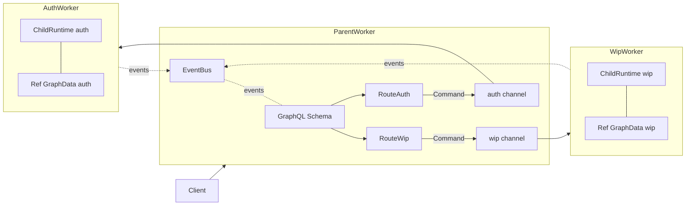

# semio/rs ref-graph refactor (no clone, no N+1)

Refactor the entity layer in [semio/rs/lib.rs](semio/rs/lib.rs) so every GraphQL type is a thin handle around an in-memory reference, and so by-id traversal across the kit is O(1) (no resolver-internal scans). One Graph still lives entirely in one worker; only commands and events flow over RPC between parent and children.

## 1. Entity split: `XData` (state) + `X(Arc<RwLock<XData>>)` (handle)

Apply uniformly to every entity in `lib.rs` between lines 360 and 1623 (Connector, Representation, Type, Piece, Side, Connection, Design, Kit, Change, Transaction, Draft, Checkpoint, Alternative, Graph, Session, Conflict).

```rust
pub type Ref<T> = Arc<async_lock::RwLock<T>>;
pub type WeakRef<T> = Weak<async_lock::RwLock<T>>;

pub struct PieceData {
    pub id: Id,
    pub owner: WeakRef<DesignData>,
    pub name: Option<String>,
    pub pose: Option<Position>,
    pub blueprint: Option<BlueprintRef>,
    pub parent_connection: Option<WeakRef<ConnectionData>>,
    pub parent_piece:      Option<WeakRef<PieceData>>,
    pub child_pieces:      Vec<WeakRef<PieceData>>,
    pub child_connections: Vec<WeakRef<ConnectionData>>,
    pub props: Vec<Prop>,
    pub attributes: Vec<Attribute>,
}

#[derive(Clone)]
pub struct Piece(pub Ref<PieceData>);

#[Object(name = "Piece")]
impl Piece {
    async fn id(&self)              -> Id          { self.0.read().await.id.clone() }
    async fn owner(&self)           -> Option<Design>     { self.0.read().await.owner.upgrade().map(Design) }
    async fn parent_connection(&self) -> Option<Connection> {
        self.0.read().await.parent_connection.as_ref().and_then(|w| w.upgrade()).map(Connection)
    }
    async fn child_pieces(&self) -> Vec<Piece> {
        self.0.read().await.child_pieces.iter().filter_map(|w| w.upgrade()).map(Piece).collect()
    }
    // ...
}
```

Rules:

- The handle (`Piece`, `Design`, ...) is `Clone` and only carries an `Arc` — cloning is O(1) refcount bump, never a deep clone.
- The `#[Object] impl` only acquires `read().await`; mutators (`pub async fn set_pose`, etc.) acquire `write().await` from the main impl block on `Piece`.
- Scalars (`String`, `Option<Position>`) are still cloned out of the lock — these are leaf values, not entities.
- Owner / parent / sibling refs are stored as `WeakRef<...>`; child collections are `Vec<WeakRef<...>>` (the parent collection holds the strong `Vec<Ref<...>>` to keep them alive).

## 2. Strong vs Weak ownership

- `KitData` strongly holds `Vec<Ref<DesignData>>` and `Vec<Ref<TypeData>>`.
- `DesignData` strongly holds `Vec<Ref<PieceData>>` and `Vec<Ref<ConnectionData>>`.
- `TypeData` strongly holds `Vec<Ref<ConnectorData>>` and `Vec<Ref<RepresentationData>>`.
- `GraphData` strongly holds the live `Ref<KitData>` for `the_kit` plus `Vec<Ref<DraftData>>`, `Vec<Ref<CheckpointData>>`, `Vec<Ref<AlternativeData>>`.
- Every back-pointer (`piece.owner -> design`, `design.owner -> kit`, `change.owner -> transaction|draft|checkpoint`) is `WeakRef`. Upgrade failure surfaces as `None` in the resolver.

## 3. O(1) by-id indexes (the N+1 fix)

Add HashMap indexes alongside the strong vectors so resolver-driven id lookups never linear-scan and so cross-aggregate refs (`Piece.blueprint -> Type|Design`) resolve in one hop:

- `KitData.types_by_id:    HashMap<Id, Ref<TypeData>>`
- `KitData.designs_by_id:  HashMap<Id, Ref<DesignData>>`
- `DesignData.pieces_by_id:      HashMap<Id, Ref<PieceData>>`
- `DesignData.connections_by_id: HashMap<Id, Ref<ConnectionData>>`
- `TypeData.connectors_by_id:    HashMap<Id, Ref<ConnectorData>>`
- `TypeData.representations_by_id: HashMap<Id, Ref<RepresentationData>>`
- `GraphData.drafts_by_id`, `checkpoints_by_id`, `alternatives_by_id`, `releases_by_id`.

Insert helpers (`KitData::insert_design`, `DesignData::insert_piece`, ...) update both the `Vec` and the `HashMap` together — single source of truth, no drift.

`Piece.blueprint` resolution becomes:

```rust
async fn blueprint(&self) -> Option<Blueprint> {
    let p = self.0.read().await;
    let kit = p.owner.upgrade()?.read().await.owner.upgrade()?; // Design -> Kit
    let kit = kit.read().await;
    match &p.blueprint {
        Some(BlueprintRef::Type(id))   => kit.types_by_id.get(id).cloned().map(Type).map(Blueprint::Type),
        Some(BlueprintRef::Design(id)) => kit.designs_by_id.get(id).cloned().map(Design).map(Blueprint::Design),
        None => None,
    }
}
```

This is O(1) per piece -> O(N) overall when iterating `design.pieces` -> N lookups. No scanning, no DataLoader needed.

## 4. Worker topology stays "one Graph per worker"



- A `Graph` (and everything it transitively owns) lives entirely inside one worker. Coordination (commands in, events out) crosses worker boundaries.
- On native, the parent currently shares the same Arc (single process, single memory). To match the "one graph per worker" rule strictly, [`worker::ParentRuntime`](semio/rs/lib.rs) keeps **only** the `wip` and `auth` `ChildPort` (sender) — it no longer holds `wip_graph: Arc<RwLock<Graph>>` / `auth_graph: Arc<RwLock<Graph>>`. Reads of `Query.wip` / `Query.authoritative` are dispatched as `Command::ReadGraph { request_id, scope: Wip|Auth }`; the child runtime resolves the request against its in-process Graph and returns a `KitEvent::GraphSnapshot { request_id, graph: Ref<GraphData> }` (native) or a serialized snapshot (wasm). Resolvers `await` the matching response by `request_id`.
- For wasm parity, the same `Command::ReadGraph` flows over `postMessage`; the wasm child serializes its Graph subtree (skeleton: just the_kit DTO) and sends back. Native specializes the read path to pass the `Ref<GraphData>` directly inside the response, so reads remain zero-copy on the hot path.
- The single emit point ([`event::EventBus::emit_event`](semio/rs/lib.rs)) is unchanged. Each child still calls it with the parent's `Arc<EventBus>` (passed at spawn time) — same memory on native, RPC-bridged on wasm later.

## 5. Resolver wrappers + Union/Interface

- All `#[derive(Union)]` and `#[derive(Interface)]` enums switch to wrapping handles, e.g.

```rust
#[derive(Clone, Union)]
#[graphql(name = "Blueprint")]
pub enum Blueprint { Type(Type), Design(Design) }

#[derive(Clone, Interface)]
#[graphql(
    name = "Operation",
    field(name = "id", ty = "Id"),
    field(name = "hash", ty = "String"),
    field(name = "owner", ty = "Change"),
    field(name = "diff", ty = "Diff"),
)]
pub enum OperationIface {
    CreatedFixedPiece(CreatedFixedPiece),
    FixedPiece(FixedPiece),
    DraggedPiece(DraggedPiece),
    RenamedKit(RenamedKit),
    ChangedDescription(ChangedDescription),
}
```

- `OperationKind` (transport enum) carries handle variants too, so subscriptions emit handles into resolvers without any deep clone.
- Operation entities (`CreatedFixedPiece`, ...) become `CreatedFixedPiece(Ref<CreatedFixedPieceData>)` with `piece: Ref<PieceData>` inside, so the subscription delivers a live handle that resolves the actual piece in the graph.

## 6. Single-source mutation path stays in `GraphData`

`GraphData::apply_create_fixed_piece` (in [vcs region](semio/rs/lib.rs)) becomes:

```rust
pub async fn apply_create_fixed_piece(
    self_ref: &Ref<Self>, draft_id: Id, transaction_id: Id, design_id: Id,
    blueprint_id: Id, pose: Position, name: Option<String>, description: Option<String>,
) -> Result<Ref<PieceData>, SemioError> {
    let mut g = self_ref.write().await;
    let design = g.the_kit.read().await.ensure_design(&design_id).await; // returns Ref<DesignData>
    let piece_data = PieceData::new_fixed(Arc::downgrade(&design), blueprint_id.clone(), pose).await;
    let piece_ref = Arc::new(RwLock::new(piece_data));
    design.write().await.insert_piece(piece_ref.clone()).await;
    g.ensure_draft(&draft_id, &transaction_id).await;
    Ok(piece_ref)
}
```

The emitted `KitEvent::CreatedFixedPiece(op)` carries `op.piece = Piece(piece_ref)`. The subscriber receives a live handle; later kit edits to that piece are visible without re-fetching.

## 7. Tests (extend existing in-file `mod tests`, no new files)

- `parses_target_schema` — unchanged.
- `single_emit_event_in_codebase` — unchanged.
- `create_fixed_piece_end_to_end` — unchanged behavior, but adds `assert!(Arc::strong_count(&piece_ref) >= 2)` after the mutation to prove the runtime and the schema both hold the same `Ref<PieceData>` (no clone of state).
- `wip_and_authoritative_are_isolated` — unchanged.
- New `no_n_plus_one_blueprint_lookup` — instrument `KitData::types_by_id` reads with an `AtomicUsize` counter, query `{ wip { theKit { designs { pieces { blueprint { ... on Type { id } } } } } } }` against a graph populated with N pieces sharing one Type, assert the counter equals exactly N (one O(1) lookup per piece, no scan, no repeated walk).
- New `live_handle_reflects_mutation` — subscribe to `createdFixedPiece`, fire mutation, after the event arrives mutate `piece.set_name("renamed")` directly on the `Ref<PieceData>` from the runtime, then re-resolve `piece { name }` from the subscription handle, assert the new name.

## 8. Out of scope (kept for follow-ups)

- Wasm postMessage serialization for `Command::ReadGraph` (only the native fast path is wired here; wasm gets a TODO with the channel skeleton in place).
- Lock granularity tuning (single big `RwLock<GraphData>` may serialize writes; per-design locking is a follow-up).
- Migrating `Operation`/`Diff` payloads to handle form for the stub ops (`FixedPiece`, `RenamedKit`, ...). Only `CreatedFixedPiece` is fully ref-based; the other op stubs keep their `Default` payloads until they're wired end-to-end.
- DataLoader: explicitly skipped; refs + `*_by_id` HashMap indexes already make every traversal O(1) per step.
