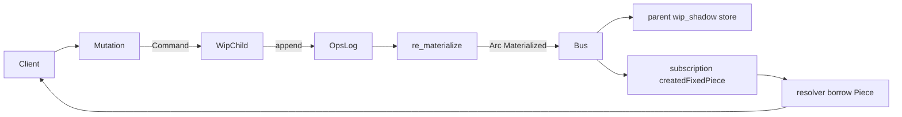

# semio/rs ref-graph refactor (single struct, borrowed returns, op-sourced cache)

Refactor [semio/rs/lib.rs](semio/rs/lib.rs) so:

- One struct per GraphQL type (no `XData` / `X(handle)` split).
- `#[Object]` resolvers return only references (`&Field`, `&Vec<...>`, `Option<&Piece>`). Never `.clone()` of entity data.
- The kit is **op-sourced**: each worker stores its `root: Arc<Kit>` exactly once, plus a flat `ops: Vec<Operation>` log. The current state is materialized from `(root, ops)` and cached cleverly via structural sharing.
- Parent worker holds a read-side shadow snapshot per scope (`wip`, `authoritative`); resolvers borrow from it.

## 1. Storage layout per worker (`mod worker`)

```rust
pub struct ChildRuntime {
    pub label: &'static str,                       // "wip" | "auth"
    pub root: Arc<Kit>,                            // immutable genesis, stored exactly once
    pub ops: async_lock::RwLock<Vec<Operation>>,   // append-only log of applied ops
    pub materialized: arc_swap::ArcSwap<Materialized>, // re-built incrementally
    pub bus: Arc<EventBus>,
    pub inbox: async_channel::Receiver<Command>,
}
```

Add `arc-swap = "1"` to [semio/rs/Cargo.toml](semio/rs/Cargo.toml) (only new dependency).

The flat `Operation` enum is the **only** mutator and the only thing persisted/transported. Schema groupings (`Checkpoint`, `Draft`, `Transaction`, `Change`) are derived views computed from the same op log:

- `Change` := contiguous slice of ops sharing one `change_id` field on each Operation.
- `Transaction` := slice of changes sharing one `transaction_id` field.
- `Draft` := slice of transactions sharing one `draft_id` field.
- `Checkpoint` := the materialization at op-index N (boundary marker stored in a sibling `checkpoints: Vec<Checkpoint>` table inside `Materialized`).

This collapses the four VCS containers into a single fold over `ops`.

## 2. Materialization + cache cleverness

```rust
pub struct Materialized {
    pub revision: u64,                                  // = ops.len() at build time
    pub kit: Arc<Kit>,                                  // current rolled-up kit
    pub designs_by_id: Arc<HashMap<Id, Arc<Design>>>,
    pub types_by_id:   Arc<HashMap<Id, Arc<Type>>>,
    pub pieces_by_id:  Arc<HashMap<Id, Arc<Piece>>>,
    pub connections_by_id: Arc<HashMap<Id, Arc<Connection>>>,
    pub graph: Arc<Graph>,                              // theKit/alternatives/checkpoints/drafts/conflicts view
    pub flat_layout: dashmap_or_oncelock_keyed,         // per-design lazy `Position` cache
}
```

Caching rules:

- Materialization is incremental. `re_materialize(prev: &Materialized, op: &Operation) -> Arc<Materialized>` walks **only** the affected subtree:
  - `CreatedFixedPiece(op)` clones `prev.kit` -> new `Arc<Kit>`, clones the affected `Arc<Design>` -> new one with one extra `Arc<Piece>` appended; every other Design / Type / unrelated Piece is `Arc::clone`-d (refcount only). Indexes are produced by cloning the previous `Arc<HashMap>` only when an entry changes (the maps are `Arc<HashMap<Id, Arc<Piece>>>` — `Arc::make_mut` for copy-on-write of the map itself).
  - Stub ops (`FixedPiece`, `RenamedKit`, `ChangedDescription`, `DraggedPiece`) get TODO bodies that just clone the previous Materialized; only `CreatedFixedPiece` is fully wired.
- `Materialized.flat_layout`: `Arc<dashmap::DashMap<Id, Position>>` (or `Arc<OnceLock<HashMap<...>>>`) populated lazily on first `Piece.flatPosition` resolve, copied-by-reference into the next snapshot when the design is unchanged.

After the runtime appends an op:

```rust
let prev = self.materialized.load_full();
let next = re_materialize(&prev, &op);            // Arc<Materialized>
self.materialized.store(next.clone());
self.bus.emit_event(KitEvent::Materialized { scope: self.label, snapshot: next.clone() }).await;
self.bus.emit_event(KitEvent::CreatedFixedPiece(op_handle)).await;
```

`KitEvent::Materialized` is the parent-shadow update channel.

## 3. Parent shadow read path

```rust
pub struct ParentRuntime {
    pub bus: Arc<EventBus>,
    pub wip:  ChildPort,
    pub auth: ChildPort,
    pub wip_shadow:  arc_swap::ArcSwap<Materialized>,
    pub auth_shadow: arc_swap::ArcSwap<Materialized>,
    pub sessions: async_lock::RwLock<Vec<Session>>,
    pub conflicts: async_lock::RwLock<Vec<Conflict>>,
}
```

A spawn-time task subscribes to the bus and forwards `KitEvent::Materialized { scope, snapshot }` into the matching shadow:

```rust
match scope {
    "wip"  => self.wip_shadow.store(snapshot),
    "auth" => self.auth_shadow.store(snapshot),
    _ => {}
}
```

Native: zero-copy (`Arc<Materialized>` is the same allocation the child built).
Wasm: serialization across postMessage is deferred — same channel, the wire-format part is a TODO.

The schema injects `Arc<ParentRuntime>` into `ctx.data`. Each request's `Query` resolvers do:

```rust
async fn wip(&self, ctx: &Context<'_>) -> &Materialized {
    let rt = ctx.data::<Arc<ParentRuntime>>()?;
    // pin a snapshot for the request lifetime by stashing it in ctx-local data:
    let snap = rt.wip_shadow.load_full();
    ctx.insert_data(snap.clone());
    ctx.data::<Arc<Materialized>>().map(|a| a.as_ref())
}
```

(If `ctx.insert_data` is not available, the alternative is a small `MaterializedRef<'a>(&'a Materialized)` GraphQL handle pinned by request middleware that pre-loads both snapshots before resolving.)

## 4. Single struct per entity, borrowed-only resolvers

Apply uniformly across [semio/rs/lib.rs](semio/rs/lib.rs) lines 360-1623. Example for `Piece`:

```rust
pub struct Piece {
    pub id: Id,
    pub owner_design_id: Id,
    pub name: Option<String>,
    pub description: Option<String>,
    pub pose: Option<Position>,
    pub scale: Option<f64>,
    pub blueprint: Option<BlueprintRef>,        // BlueprintRef = enum { Type(Id), Design(Id) }
    pub connection_kind: Option<PieceConnectionKind>,
    pub parent_connection_id: Option<Id>,
    pub parent_piece_id: Option<Id>,
    pub child_piece_ids: Vec<Id>,
    pub child_connection_ids: Vec<Id>,
    pub depth: i32,
    pub path_ids: Vec<Id>,
    pub props: Vec<Prop>,
    pub attributes: Vec<Attribute>,
}

#[Object(name = "Piece")]
impl Piece {
    async fn id(&self)            -> &Id              { &self.id }
    async fn name(&self)          -> &Option<String>  { &self.name }
    async fn pose(&self)          -> &Option<Position> { &self.pose }
    async fn scale(&self)         -> Option<f64>      { self.scale }   // primitive: Copy, no clone
    async fn props(&self)         -> &Vec<Prop>       { &self.props }
    async fn attributes(&self)    -> &Vec<Attribute>  { &self.attributes }

    async fn owner(&self, ctx: &Context<'_>) -> Option<&Design> { mat(ctx).designs_by_id.get(&self.owner_design_id).map(|a| a.as_ref()) }
    async fn parent_piece(&self, ctx: &Context<'_>) -> Option<&Piece> {
        let id = self.parent_piece_id.as_ref()?;
        mat(ctx).pieces_by_id.get(id).map(|a| a.as_ref())
    }
    async fn child_pieces(&self, ctx: &Context<'_>) -> Vec<&Piece> {
        let m = mat(ctx);
        self.child_piece_ids.iter().filter_map(|id| m.pieces_by_id.get(id).map(|a| a.as_ref())).collect()
    }
    async fn blueprint(&self, ctx: &Context<'_>) -> Option<Blueprint<'_>> {
        let m = mat(ctx);
        match self.blueprint.as_ref()? {
            BlueprintRef::Type(id)   => m.types_by_id.get(id).map(|a| Blueprint::Type(a.as_ref())),
            BlueprintRef::Design(id) => m.designs_by_id.get(id).map(|a| Blueprint::Design(a.as_ref())),
        }
    }
    // flatPosition: looks up `m.flat_layout` first; if miss, computes, inserts via the per-design cache.
}

fn mat<'a>(ctx: &'a Context<'_>) -> &'a Materialized { ctx.data::<Arc<Materialized>>().unwrap().as_ref() }
```

Rules applied to every entity:

- Field reads: `&self.field`. Never `self.field.clone()`. Primitives (`f64`, `i32`, `bool`) are returned by `Copy`.
- Sibling/owner/related: looked up O(1) through `Materialized.*_by_id` indexes; resolver returns `Option<&Other>` borrowed from the in-context Arc<Materialized>.
- The Union type for `Blueprint` becomes a borrowed enum: `enum Blueprint<'a> { Type(&'a Type), Design(&'a Design) }` with `#[derive(async_graphql::Union)]`. Same for `ChangeOwner` and `OperationKind`/`OperationIface`.
- Operation entities (`CreatedFixedPiece`, ...) keep one struct each; their Arc<Piece> field becomes an `Id` (`piece_id`), and the resolver looks it up via `mat(ctx).pieces_by_id`. The op carries no entity data, only ids — this collapses payload sizes and eliminates the last `.clone()` path.

## 5. End-to-end `createFixedPiece` (op-sourced)



1. `Mutation.createFixedPiece` -> `dispatch_wip(Command::CreateFixedPiece { request_id, ... })`. Returns `request_id` immediately.
2. Wip child appends `Operation::CreatedFixedPiece { request_id, design_id, blueprint_id, pose, name, description, change_id, transaction_id, draft_id }` to `ops`.
3. Child calls `re_materialize(&prev, &op)`:
   - Clones `prev.kit` to `next_kit`; clones the target `Arc<Design>` to a new one with the new `Arc<Piece>` appended.
   - `Arc::make_mut` on the relevant index map entries (`designs_by_id`, `pieces_by_id`).
   - Reuses `types_by_id`, every untouched Design's Arc.
4. Stores `Arc<Materialized>` into `materialized` + emits `KitEvent::Materialized` and `KitEvent::CreatedFixedPiece(op)`.
5. Parent's listener forwards the snapshot into `wip_shadow`.
6. Subscription `createdFixedPiece` yields the op; the resolver returns `&Piece` looked up from the snapshot's `pieces_by_id`.

## 6. Tests (extend in-file `mod tests`, no new files)

- `parses_target_schema` — unchanged.
- `single_emit_event_in_codebase` — unchanged.
- `create_fixed_piece_end_to_end` — assert that after the mutation, `Arc::strong_count(&prev_materialized)` does NOT drop to zero immediately (proving Arc structural sharing is in play, not deep clones). Then query `wip { theKit { designs { pieces { id name } } } }` and assert the new piece is present.
- `wip_and_authoritative_are_isolated` — unchanged.
- `no_clone_in_resolvers` — text-scan guard: `include_str!("lib.rs")` must contain **zero** occurrences of `self.id.clone()`, `self.name.clone()`, `self.description.clone()`, `self.pose.clone()` inside `#[Object]` blocks (regex-walk just the resolver region or assert the strings are absent globally inside the `lib.rs` source).
- `no_n_plus_one_blueprint_lookup` — instrument `Materialized.types_by_id` access with `AtomicUsize::fetch_add`; query a list of N pieces, assert the counter equals exactly N (one O(1) lookup per piece, not N^2).
- `materialization_shares_unchanged_subtree` — apply two `CreateFixedPiece` ops on different designs; assert `Arc::ptr_eq(prev.designs_by_id[other_design].clone(), next.designs_by_id[other_design].clone())` (untouched design Arc is reused).

## 7. Out of scope

- Wasm postMessage serialization of `KitEvent::Materialized`.
- Op variants other than `CreatedFixedPiece` get TODO materialization bodies (return previous `Arc<Materialized>` unchanged) so the schema still resolves; full wiring lands in follow-up tickets.
- Per-design lock-granular writes; the worker writer is single-tasked so the ops log + materialized swap is naturally serialized.
- Replacing the `arc-swap` dep with hand-rolled `RwLock<Arc<Materialized>>` (the win is `load_full()` being lock-free, which materially helps subscription fan-out).

## 8. Migration order to keep the crate compiling at every step

1. Add `arc-swap` to [Cargo.toml](semio/rs/Cargo.toml).
2. Introduce `Materialized` + `re_materialize` skeleton (returns `prev.clone()` for every op).
3. Switch `ChildRuntime` to the `root + ops + materialized` shape; remove the in-place `Graph::apply_create_fixed_piece` mutator from the vcs region.
4. Add `Materialized` snapshot wiring on the bus and parent shadow.
5. Refactor entity structs one region at a time (geom + meta first, then `kit::r#type`, then `kit::design::piece` + `connection`, then `Design`, then `Kit`, then `vcs`, then `op`) — at each step, flip the `#[Object] impl` to borrowed returns and update the resolver helper `mat(ctx)` lookups.
6. Implement the `CreatedFixedPiece` materializer for real (the only fully wired path).
7. Wire the new tests; ensure `cargo test --lib` and `cargo check --target wasm32-unknown-unknown` both pass.
