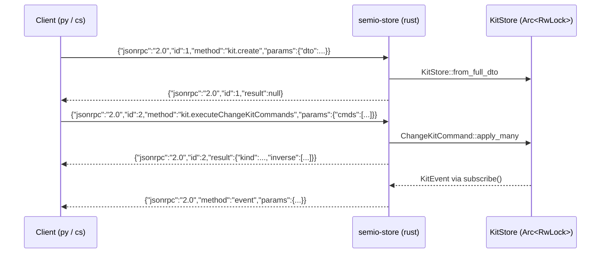

## 1. New bundle `semio/store` (rust binary)

New Cargo member `[semio/store](semio/store/)` — crate-type bin, path-depends on `semio-rs`. Mirrors `KitStoreHandle` (the wasm surface in [semio/rs/lib.rs](semio/rs/lib.rs) at lines 18372–18796) over NDJSON JSON-RPC on stdio. One kit per process (per the chosen process model); no session-id in the wire protocol.

Files:

- `[semio/store/Cargo.toml](semio/store/Cargo.toml)` — `[[bin]] name = "semio-store" path = "bin.rs"`; deps: `semio = { path = "../rs" }`, `serde`, `serde_json`, `thiserror`, `tracing` + `tracing-subscriber` (stderr only — stdout is reserved for RPC frames).
- `[semio/store/bin.rs](semio/store/bin.rs)` — executable. Single-threaded RPC loop + a dedicated event-forwarding thread that drains `KitStore::subscribe()` ([lib.rs:10857](semio/rs/lib.rs)) and writes JSON-RPC notifications.
- `[semio/store/package.json](semio/store/package.json)` — Nx project (`bundleKind: bundle`, build script `cargo build --release -p semio-store`).
- `[semio/store/AGENTS.md](semio/store/AGENTS.md)` — spec header + `Mechanisms` describing transport + method catalog.
- `[semio/store/README.md](semio/store/README.md)` — invocation (`semio-store` reads line-delimited JSON on stdin, writes on stdout, logs on stderr).
- `[semio/store/tests/rpc.rs](semio/store/tests/rpc.rs)` — integration test that spawns the bin and round-trips a kit.

Add `"semio/store"` to workspace members in `[Cargo.toml](Cargo.toml)` (currently only lists `semio/rs`).

### 1.1 Transport

NDJSON: one JSON-RPC 2.0 object per line (`\n`), UTF-8, no headers. Requests use `id`, notifications omit `id`. Server-side events are notifications on method `event`.



### 1.2 Method catalog (matches `KitStoreHandle` 1:1)

- Static (no-store, from free wasm fns at [lib.rs:18268+](semio/rs/lib.rs)): `semio.generateId`, `semio.round`, `semio.normalizeName`, `kit.fromJson`, `kit.toJson`, `kit.validate`, `kit.equals`, `design.flatten`.
- Lifecycle: `kit.create` (params: `KitFullDto`), `kit.snapshot`, `kit.theKitDto`, `server.shutdown`.
- Store commands (the main JSON-RPC surface — each forwards straight to the matching `KitStoreHandle` method): `kit.execute` (`KitStoreCommand` → `KitStoreCommandResult`, [lib.rs:11349](semio/rs/lib.rs)), `kit.executeChangeKitCommands` (→ `{kind, inverse}`), `kit.executeReadKitCommands`, `kit.materializeAt`, `kit.vcsState`, `kit.getField` / `kit.setField` / `kit.addChild` / `kit.removeChild`.
- Design helpers (one method per `KitStoreHandle` fn, [lib.rs:18555–18669](semio/rs/lib.rs)): `design.clusterPieces`, `design.dragPieces`, `design.movePieces`, `design.fixPieces`, `design.flattenDesign`, `design.expandDesign`, `design.deleteConnection`, `design.changePieceType`, `design.pasteDesignSelection`, `design.createHangingPieces`, `design.createConnectedPiece`, `design.createFixedPiece`.
- VCS: `vcs.undo`, `vcs.redo`, `vcs.canUndo`, `vcs.canRedo`, `vcs.beginTx`, `vcs.commitTx`, `vcs.abortTx`.
- Queries: `query.pieces`, `query.piecesMetadata`, `query.connections`, `query.designs`, `query.types`, `query.authors`, `query.kitMetadata`.
- Events: `events.subscribe` / `events.unsubscribe` (no-op, server always streams `event` notifications once a kit exists).

All params/results are the existing serde types from `semio-rs` (`KitStoreCommand`, `ChangeKitCommand`, `ReadKitCommand`, `KitFullDto`, `KitDiff`, `KitEvent`, …) — no new wire schema is invented. Errors become JSON-RPC errors (`-32000` for `SemioError`, `-32602` for invalid params, `-32601` for unknown method).

### 1.3 `bin.rs` skeleton

```rust
fn main() -> anyhow::Result<()> {
    let store: OnceLock<KitStoreRef> = OnceLock::new();
    let (tx, rx) = std::sync::mpsc::channel::<String>();

    // Writer thread: owns stdout, serializes RPC responses + event notifications.
    std::thread::spawn(move || writer_loop(rx, std::io::stdout().lock()));

    // Reader thread: line-by-line dispatch.
    let stdin = std::io::stdin();
    for line in stdin.lock().lines() { dispatch(line?, &store, &tx)?; }
    Ok(())
}
```

`kit.create` installs the `KitStoreRef`, then spawns an event-forwarder thread that calls `KitStore::subscribe()` and pushes every `KitEvent` into `tx` as `{"jsonrpc":"2.0","method":"event","params":<serialized>}`.

## 2. Replace native kit/diff code in `semio/py`

Full replacement per the chosen migration scope. Everything that today hand-implements the kit graph is deleted and re-routed through the sidecar.

Delete from [semio/py/main.py](semio/py/main.py):

- `getKitDiffDict` [line 9945](semio/py/main.py), `applyKitDiffDict` [10255](semio/py/main.py), `inverseKitDiffDict` [10635](semio/py/main.py) and every `applyKitDiffDict(...)` / `inverseKitDiffDict(...)` / `getKitDiffDict(...)` call site.
- `class Change` [10778](semio/py/main.py), `KitChange` [10931](semio/py/main.py), `getKitChange` [11446](semio/py/main.py).
- `class KitData` [13335](semio/py/main.py).
- `_KitGraphTxn`, `KitGraphChange`, and the undo/redo scaffolding on `Kit` [~4758](semio/py/main.py).
- `class SyncKit` [14703](semio/py/main.py) and `.apply(self, diff: dict)` [14713](semio/py/main.py).
- Local implementations of `import_folder_kit` / `export_folder_kit` / `import_file_kit` / `export_file_kit` SQLite/JSON bodies ([13984+](semio/py/main.py), [13999+](semio/py/main.py), [14014+](semio/py/main.py)) — keep the function names as thin wrappers that call the sidecar's `kit.execute` + `kit.snapshot` (the rust `io` module already owns SQLite/ZIP/JSON; the sidecar gets additional methods `io.importFromFolder`, `io.exportToFolder`, `io.importFromFile`, `io.exportToFile`, `io.importFromRemote`).
- `edit_temporary_kit` / `edit_file_kit` / `edit_folder_kit` / `edit_archive_kit` bodies — reimplemented as: open sidecar → `kit.create` with loaded DTO → `kit.executeChangeKitCommands` → `kit.snapshot` → persist.
- `benchmark_main` — keep but rewire.

Add a new file `[semio/py/store.py](semio/py/store.py)`:

```python
class StoreClient:
    def __init__(self, binary: str | None = None): ...   # locates `semio-store` (env SEMIO_STORE_BIN, else bundled)
    def __enter__(self) -> "StoreClient": ...
    def call(self, method: str, params: dict | list | None = None) -> Any: ...
    def on_event(self, handler: Callable[[dict], None]) -> None: ...
    def close(self) -> None: ...

class Kit:
    """Thin pydantic-typed facade over StoreClient — exposes snapshot(), execute(), execute_change_commands(), vcs_state(), undo(), redo(), flatten_design(), etc."""
```

Reuse the same newline-delimited JSON pattern `coda/desktop/main.ts` uses for its Python sidecar (see [coda/desktop/main.ts:86-94](coda/desktop/main.ts)) and the request/response correlation pattern used in [coda/assistant/main.py:1391+](coda/assistant/main.py).

Update [semio/py/pyproject.toml](semio/py/pyproject.toml): drop `networkx` (graph logic moves to rust); keep `pydantic`, `fastapi` (for `Annotated` types), `sqlalchemy` stays if the GraphQL glue still needs it, otherwise drop. Add nothing — stdio uses stdlib `subprocess`.

## 3. Replace native kit/diff code in `semio/net`

Delete from [semio/net/Semio/Semio.cs](semio/net/Semio/Semio.cs):

- `public static class KitSqlite` [13290](semio/net/Semio/Semio.cs) through the helpers at `14704-14816`.
- `public class TransportKit` [14832](semio/net/Semio/Semio.cs), `public interface ISyncKit` [14863](semio/net/Semio/Semio.cs), `DevKit` [14882](semio/net/Semio/Semio.cs), `LocalKit` [14934](semio/net/Semio/Semio.cs), `FileKit` [14984](semio/net/Semio/Semio.cs), `FolderKit` [15015](semio/net/Semio/Semio.cs), `ArchiveKit` [15117](semio/net/Semio/Semio.cs).
- `public static class SemioDiff` [15277](semio/net/Semio/Semio.cs) (every method — `GetKitChange`, `GetKitDiff`, `InverseKitDiff`, `ApplyKitDiff`, `ValidateKitDiff`).
- `Kit.ApplyDiff` [7435](semio/net/Semio/Semio.cs) and every `*Diff.Apply*` method attached to DTO classes (these now live on the rust side).

Keep (they are reused as wire payloads): all the DTO/record types — `Kit`, `Type`, `Design`, `KitDiff`, `KitChange`, `ChangeKitCommand` (add this enum, mirror of rust — serialized via Newtonsoft's `TypeNameHandling = None` with `[JsonConverter]` discriminator matching serde's default internally-tagged enum shape). The `ShouldSerialize*` pattern on DTOs stays.

Add under a new folder `semio/net/Semio/Store/`:

- `[StoreClient.cs](semio/net/Semio/Store/StoreClient.cs)` — `System.Diagnostics.Process` with `RedirectStandardInput`/`Output`/`Error`, `StreamReader.ReadLineAsync` loop, `TaskCompletionSource<JToken>` keyed by request id. Implements `IDisposable`/`IAsyncDisposable`.
- `[KitStore.cs](semio/net/Semio/Store/KitStore.cs)` — C# facade matching the sidecar surface (`Snapshot()`, `Execute(KitStoreCommand)`, `ExecuteChangeKitCommands(IReadOnlyList<ChangeKitCommand>)`, `VcsState()`, `Undo()`/`Redo()`, `FlattenDesign(...)`, etc).
- `[Events.cs](semio/net/Semio/Store/Events.cs)` — `IObservable<KitEvent>` wrapping the notification channel.

Rewire `Semio.Rhino` / `Semio.Grasshopper` to instantiate `KitStore` through `StoreClient` — their `ProjectReference` to `Semio.csproj` ([semio/3dm/Semio.Rhino/Semio.Rhino.csproj](semio/3dm/Semio.Rhino/Semio.Rhino.csproj), [semio/gh/Semio.Grasshopper/Semio.Grasshopper.csproj](semio/gh/Semio.Grasshopper/Semio.Grasshopper.csproj)) needs no change. Ship the `semio-store` binary alongside the NuGet package (`<Content Include="runtimes/**/semio-store*" CopyToOutputDirectory="PreserveNewest" />`) — resolved from `bin/` at runtime, env override `SEMIO_STORE_BIN`.

## 4. Workspace wiring

- Root [Cargo.toml](Cargo.toml): add `"semio/store"` to `workspace.members`.
- Root [package.json](package.json) / Nx: the new `[semio/store/package.json](semio/store/package.json)` is autodiscovered.
- [semio/rs/Cargo.toml](semio/rs/Cargo.toml): no change — already exports everything as `rlib`.
- `.gitignore`: ensure `semio/store/target` is ignored (covered by top-level).

## 5. Tests

- `[semio/store/tests/rpc.rs](semio/store/tests/rpc.rs)` — spawn bin, test: `kit.create` + `kit.snapshot` roundtrip, `kit.executeChangeKitCommands` add/remove, `vcs.undo`/`redo`, event notification emitted on mutation.
- `[semio/py/store_test.py](semio/py/store_test.py)` — pytest using `StoreClient` against the real sidecar: create, mutate, snapshot, event callback.
- `[semio/net/Semio.Tests/StoreClientTests.cs](semio/net/Semio.Tests/StoreClientTests.cs)` — same three scenarios via xUnit.
- Existing py/net tests that test removed functions get deleted; rewrite the meaningful cases against the client.

## 6. Rollout notes

- Rust side is additive until step 2/3 touch py/net; everything compiles after step 1 alone.
- Step 2 and 3 are independent and can merge separately; each bundle breaks ABI for its own consumers once its `*Kit` / `SyncKit` classes are deleted.
- The sidecar binary is per-process; callers are responsible for keeping it alive for the duration of their kit session.

## Out of scope

- Multi-kit handles in one process (chose single-kit-per-process).
- LSP-style Content-Length framing (chose NDJSON).
- Rewriting `semio/js` / wasm consumers — they keep using `KitStoreHandle` directly.
- `semio/graphql`, `semio/sketchpad`, and the other bundles.
- Publishing the sidecar as a standalone crate on crates.io.
