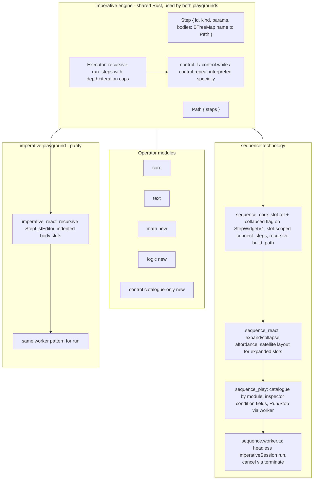

# Sequence Control-Flow & Extension Modules

## Current state (confirmed by code reading)

- `imperative/engine/lib.rs` models `Step { id, kind, params }` and `Path { steps: Vec<Step> }` as an explicitly flat, edge-less list (`imperative/engine/lib.rs:10-22`). `Executor::run` (`imperative/engine/lib.rs:66-95`) is a single `for step in &path.steps` loop with no branching/looping/recursion.
- `sequence/core/lib.rs` enforces a strict single chain: `connect_steps` rejects a second outgoing edge (`sequence/core/lib.rs:202-204`) and rejects cycles via the shared `would_create_cycle` (also used by `flow`, `trinity`, `puzzle`). `build_path()` (`sequence/core/lib.rs:260-300`) linearizes that single chain into a flat `imperative_engine::Path` — there is no representation of a step having more than one "next".
- Only two operator modules exist: `imperative/module/core` (`log.print`, `state.set`, `state.increment`, `wait.delay`) and `imperative/module/text` (`text.concat`, `text.uppercase`, `text.length`), composed in `imperative_module_registry()`/`imperative_catalogue_json()` (`imperative/engine/lib.rs:166-190`) and merged client-side by `ImperativeExtensionHost` (`imperative/core/index.ts`).
- `session.run()` executes synchronously on the main thread today (`sequence/core/lib.rs:445-447`, called from `sequence/react/index.tsx:375-381`). Flow already proves the pattern of moving heavy WASM work into a worker: `flow/worker.ts` + `flow/worker-client.ts` load a second WASM instance and message-pass `evaluate()` results back — but flow keeps rendering/pointer handling on the main thread and only offloads `evaluate()`, never a runaway loop scenario.
- The DAG crate's `Cluster` node kind (`mathematical/graph/port/directed/dag/lib.rs:564-567`) is a *collapsed placeholder with an explode-to-flatten affordance*, not an inline nested viewport — `flow/core/lib.rs:2701-2857` shows collapse embeds a `Widget::Cluster{ tree, flow }` and explode restores original nodes back onto the *same top-level canvas*; nothing in the repo renders a live nested sub-canvas inside a node's bounding box. Per your choice, sequence will get its own lighter-weight **expand/collapse slot** mechanism modeled on this collapse/explode idea, scoped to sequence only (no shared DAG/cycle-code changes).
- A second, independent playground `imperative/react` + `imperative/play` (port 6076) already exists as a flat HTML step-list editor with no nesting support at all — it needs the same recursive model for parity since it shares the same engine.

## Target architecture

## 1. Recursive control-flow engine (`imperative/engine/lib.rs`)

- Extend `Step` with `#[serde(default)] pub bodies: BTreeMap<String, Path>` (empty for leaf operators — fully backward compatible, no migration needed since this is greenfield).
- Rewrite `Executor::run` to recurse: a private `run_steps(steps, scope, effects, depth)` that, per step, special-cases three kinds before falling through to `registry.dispatch`:
  - `control.if` — params `{ key: string }`; reads a boolean from `scope`, recurses into `bodies["then"]` or `bodies["else"]`.
  - `control.while` — params `{ key: string }`; loops while `scope[key]` is truthy, recursing into `bodies["body"]` each iteration, merging scope after every pass.
  - `control.repeat` — params `{ count: number }`; runs `bodies["body"]` `count` times, injecting a per-iteration `index` key into scope.
  - Guard rails: hard nesting-depth cap (e.g. 64) and a generous hard iteration ceiling per loop (e.g. 200,000) that appends a warning `EffectLogEntry` and stops if exceeded — defense-in-depth underneath the worker isolation from section 4 (a stray infinite loop still shouldn't peg a worker forever).
- Extend `compile_to_text` to recursively pretty-print nested blocks with indentation, e.g. `if (counter) {\n  ...\n} else {\n  ...\n}`, `while (hasMore) { ... }`, `repeat (5) { ... }`.
- Add `imperative/module/control` (catalogue-only crate: no `Operation` impls, just `catalogue_json()` describing `control.if`/`control.while`/`control.repeat` so they show up in the palette like any other module) and `imperative/module/math`, `imperative/module/logic` (real `Operation` impls, registered normally).
- Update `imperative_module_registry()`/`imperative_catalogue_json()` (`imperative/engine/lib.rs:166-190`) to compose all five modules; add `imperative/module/math`, `imperative/module/logic`, `imperative/module/control` to root `Cargo.toml` workspace members.

## 2. New operator modules

Both new modules follow the `imperative/module/core` pattern (`imperative/module/core/lib.rs:108-163`) — flat scope reads/writes via string keys, **not** flow's schema-wrapped channels — because `control.if`/`control.while` need to read a plain boolean scope key directly.

- `**imperative/module/math**`: `math.add`, `math.subtract`, `math.multiply`, `math.divide`, `math.modulo`, `math.power`, `math.min`, `math.max`, `math.round`, `math.floor`, `math.ceil`. Each reads `a`/`b` (or `value`) plus a destination `into` key (mirrors `state.set`'s key-write convention) and writes `{ into: result }` to scope.
- `**imperative/module/logic**`: `logic.compare` (`left`, `right`, `operator`: `eq`/`neq`/`gt`/`gte`/`lt`/`lte`, `into`), `logic.and`, `logic.or`, `logic.not` (all reading boolean scope keys, writing a boolean `into` key). These are what a preceding step writes so a later `control.if`/`control.while` can read the same `key`.
- `**imperative/module/control**`: catalogue-only entries for `control.if`, `control.while`, `control.repeat` (no runtime dispatch — `Executor` intercepts these kinds before `registry.dispatch`).
- Update `imperative/core/index.ts`: extend `IMPERATIVE_INSTALLED_MODULE_IDS` to `["core", "text", "math", "logic", "control"]`, add corresponding catalogue sections to `ImperativeExtensionHost`, mirroring the existing `TEXT_MODULE_CATALOGUE_SECTION` pattern.

## 3. Sequence canvas: slot-based nested visual editing

- `StepWidgetV1` (`sequence/core/lib.rs`) gains `slot: Option<SlotRef>` (`{ owner: String, name: String }` — which control step + which body this step belongs to) and `collapsed: bool` (only meaningful when `bodies` are non-empty, i.e. the step kind is one of the control kinds).
- `connect_steps`/`add_step`/`remove_step` become slot-aware: a chain only connects steps that share the same slot scope (both root, or both in the same `(owner, name)` slot); `remove_step` on a control step cascades to remove all of its slot descendants.
- `build_path()` becomes recursive: walk the root chain as today, and for each control step encountered, additionally walk each of its slots' single-outgoing sub-chains (same algorithm, scoped by `slot`) to build the nested `imperative_engine::Path` values attached as `bodies["then"]`/`bodies["else"]`/`bodies["body"]`.
- New WASM export `setStepCollapsed(stepId, collapsed)`. When collapsed, slot-member nodes are omitted from the DAG fixture built in `build_dag_fixture`/`step_to_dag_node` (hidden, not deleted) and the control step's node shows a small badge (e.g. "▸ 3 steps"); when expanded, the `reorganize` auto-layout is extended to fan out each slot's chain near/below its owning step (like a flowchart), and a distinct dashed "slot" edge style connects the control step to each slot's first node.
- `sequence/react/index.tsx` gets a click affordance on control-step nodes to toggle collapse/expand (calling `setStepCollapsed`), and drag-and-drop is extended so dropping a catalogue item near/onto an expanded control step's slot area assigns it to that slot instead of the root chain.

## 4. Off-main-thread execution

- New `sequence/play/sequence.worker.ts` (mirrors `flow/worker.ts`): loads the lightweight headless `imperative_core` WASM (not the heavier `sequence_core`/DagHost bundle — no canvas needed for execution), receives `{ documentJson }`, calls `run()`, and posts back the `RunResult` (final scope + effect log). Supports a `terminate` message path — the main thread simply calls `Worker.terminate()` and spawns a fresh worker for the next run, which reliably kills a runaway loop since worker threads (unlike main-thread JS) can be hard-killed.
- `sequence/play/index.ts`: `SequencePlayController`'s run command posts the compiled `{ path, seed }` from `build_path()`/current scope to the worker instead of calling `session.run()` synchronously; add a `stop` command wired to a toolbar/Compiled-Script-window "Stop" action that terminates+respawns the worker and appends a "Stopped by user" effect log entry.
- Canvas rendering (`session.render_frame`, pointer/selection handling) is unaffected and stays on the main thread exactly as today — only `run()` moves.

## 5. `imperative` playground parity (port 6076)

- Refactor `imperative/react/index.tsx`'s flat `<ul>` of `document.path.steps` into a recursive `StepListEditor({ steps, pathRef, depth })` that renders `bodies` as indented, collapsible nested lists under `control.if`/`control.while`/`control.repeat` steps, reusing the same session API extended with path-scoped `addStep(kind, pathRef, index)`/`removeStep(pathRef, index)`/`setStepParamsJson(pathRef, index, json)` where `pathRef` addresses either the root or a `(stepId, slotName)` chain.
- Route its `run()` call through the same `sequence.worker.ts`-style worker pattern (a shared `imperative.worker.ts`, or the same file reused by both playgrounds) so both playgrounds get UI-thread isolation consistently.

## 6. Tests & verification

- Rust: extend `imperative/engine/lib.rs` tests (`executor_runs_steps_in_order`, `compile_to_text_emits_one_line_per_step`) with nested-body cases for `control.if`/`control.while`/`control.repeat`, plus new unit tests in `imperative/module/math`, `imperative/module/logic`, `imperative/module/control`. Extend `sequence/core/lib.rs`'s existing `connect_steps_rejects_fan_out` test area with slot-scoped connect/build_path/collapse tests.
- TypeScript: extend `imperative/core/index.ts` and `sequence/play/index.ts` Vitest suites for the new catalogue sections, worker message contracts, and recursive tree building.
- Run `cargo test` across all touched crates, `bun nx run` test targets for touched TS packages, and browser-verify both dev servers (`sequence` play, `imperative` play at port 6076) for: dragging math/logic/control items from the catalogue, building an if/while/repeat with nested bodies, collapsing/expanding a control step, running with an intentionally long loop and confirming the UI stays responsive with a working Stop button.
- Open a new ticket via the repo MCP for this work, closing it with a summary of all created/changed files once verified.

