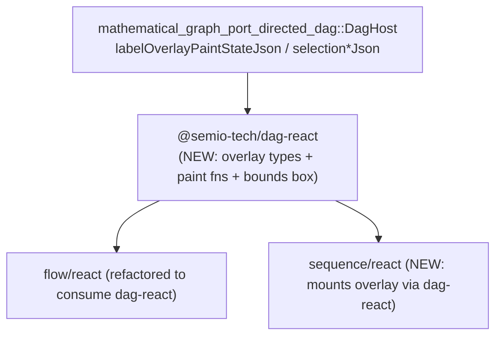

# Sequence DAG Abstraction: Labels, Selection, Triangle Ports, Sharp Edges

## Root cause of "no labels / no selection"

The shared `DagHost` (`mathematical/graph/port/directed/dag/lib.rs`) intentionally skips painting node/port text on the GPU canvas whenever a label exists — see `node_caption_delegated_to_js_overlay` (`lib.rs:3602-3604`) and the skip in `paint_node_visual` (`lib.rs:3799-3817`). Text is meant to be painted by a **second 2D canvas** driven by `label_overlay_paint_state_json()` (`lib.rs:3302-3321`).

`flow/react/index.tsx` implements this overlay (`paintFlowLabelOverlays`, a second `<canvas>` at `z-40`, plus a selection-bounds box and marquee), but this logic is **duplicated inline in flow** — it was never abstracted into `@semio-tech/dag-react` (`mathematical/graph/port/directed/dag/react/index.tsx`), which today only exports LOD/fixture-edit helpers plus a bare-bones `DagCanvas`. `sequence/react/index.tsx` only imports the LOD helpers, has no second canvas, and `SequenceSession` (WASM) never exposes `labelOverlayPaintStateJson()` or the selection/marquee JSON exports that `FlowSession` forwards from the same generic `DagHost` methods. That is why the canvas is blank of text and selection looks inert even though the underlying engine selection state is likely updating.

This is exactly the "properly abstracted... like flow" ask: pull the generic overlay code out of `flow/react/index.tsx` into `@semio-tech/dag-react`, and have both `flow` and `sequence` consume it.

## Phase 1 — Extract shared overlay primitives into `@semio-tech/dag-react`

In [mathematical/graph/port/directed/dag/react/index.tsx](mathematical/graph/port/directed/dag/react/index.tsx), add (moved/generalized from `flow/react/index.tsx`, renaming `Flow*` to `Dag*`):

- Types: `DagLabelOverlayRow`, `DagLabelOverlayPaintState`, `DagPreselectSnapshot`, `DagSelectionUnionBoundsScreen`.
- Parsers: `parseDagNodeIdArray`, `parseDagPreselectJson`, `parseDagSelectionUnionBoundsScreen`, `parseDagSelectionPreviewPoints`, `dagSelectionUnionBoundsEqual`.
- Pure geometry: `dagWorldToScreen`, `dagClampLabelFontPx`, `dagClampPortLabelFontPx`.
- Chrome: `dagElementInteractionChrome`, `dagOverlayLabelFill` (ported from `flow/react/index.tsx:2163-2197`, generalized to take a `dimmedIds` param instead of hardcoding flow's `previewOffIds`).
- Paint: `paintDagLabelOverlays(session, canvas, width, height, dpr, interaction)` (ported from `flow/react/index.tsx:2448-2515`), where `session` matches a minimal `DagOverlaySession` interface (`labelOverlayPaintStateJson()`) and `interaction` carries `hoveredId`, `selectedIds`, `preselect`, `dimmedIds`.
- `computeDagMarqueeOverlay(points, crossing, method)` — pure function extracted from `syncMarqueeOverlay` (`flow/react/index.tsx:3202-3216`).
- `DagSelectionBoundsBox` — a minimal generic component rendering just the bordered rect (extracted from the bordered `
` in `FlowSelectionBoundsOverlay`, `flow/react/index.tsx:2698-2706`), without the alignment buttons (those stay flow-specific).

Refactor `flow/react/index.tsx` to import and use all of the above instead of its inline copies; `FlowSelectionBoundsOverlay` becomes a thin wrapper that renders `DagSelectionBoundsBox` plus its own alignment button chrome. Keep flow-only bits in flow: `previewOffWidgetIds` dimming, `FlowParamOverlay`/`FlowVariableOverlay`/`FlowStepperOverlay`, align-button layout/hit-testing.

## Phase 2 — WASM parity + selection persistence in `sequence/core`

In [sequence/core/lib.rs](sequence/core/lib.rs), mirror how `FlowSession` forwards to `self.dag.*` (`flow/core/lib.rs:2368-2399`, `2689`) by adding to `SequenceSession` (near the existing `selectedNodeIds`/`setSelection` at `lib.rs:818-828`):

- `labelOverlayPaintStateJson()` → `self.state.borrow().host.dag.label_overlay_paint_state_json()`
- `hoveredNodeId()` → `host.dag.hovered_node_id()`
- `preselectNodeIdsJson()` → `{ ids, removedIds }` from `host.dag.preselect_widget_ids()`/`preselect_removed_widget_ids()`
- `selectionPreviewPointsJson()`, `selectionPreviewCrossing()` → `host.dag.selection_preview_points_json()`/`selection_preview_crossing()`
- `selectionUnionBoundsScreenJson()` → `host.dag.selection_union_bounds_screen_json()`
- `setSelectionOptions(method, mode)` → `host.dag.set_selection_options(...)` (parity with flow init, `flow/core/lib.rs:2166`)

Fix selection loss on every fixture edit: `rebuild_dag()` (`sequence/core/lib.rs:469-473`) currently does `self.dag = DagHost::from_fixture_without_layout(...)`, discarding selection. Capture `let selected = self.dag.selected_node_ids();` before replacing, and call `self.dag.set_selection(&selected)` after, so selection survives step add/remove/collapse toggles.

## Phase 3 — Wire `SequenceCanvas` to the shared overlay

In [sequence/react/index.tsx](sequence/react/index.tsx):

- Add a second `<canvas>` (text overlay, `pointer-events-none absolute inset-0 z-40`) inside the existing canvas container, mirroring flow's stacked-canvas structure (`flow/react/index.tsx:4437-4441`).
- In the render loop (`renderFrame`, currently `sequence/react/index.tsx:270-279`), after `session.renderFrame()`, call the new `paintDagLabelOverlays` from `@semio-tech/dag-react` with hover/selection/preselect state read from the new WASM exports.
- Track selection bounds via a `syncSelectionBoundsOverlay`-equivalent calling `selectionUnionBoundsScreenJson()` and render `DagSelectionBoundsBox` when non-empty (no alignment buttons needed for sequence).
- Call `setSelectionOptions("rectangle", "default")` once on session init for parity.

## Phase 4 — Triangle port shape for execution channels

In [mathematical/graph/port/directed/dag/lib.rs](mathematical/graph/port/directed/dag/lib.rs):

- Add `PortShape` enum (`Semicircle` default | `Triangle`) with `#[serde(default)]` on `IoPortSpec` (struct at `lib.rs:217-236`); update `IoPortSpec::named`/`simple`/`Default` (`lib.rs:242-261`) to default to `Semicircle`.
- In [mathematical/graph/lib.rs](mathematical/graph/lib.rs), add `handle_exterior_cap_triangle_fill_path`, `_stroke_path`, `_peak` mirroring the semicircle API at `lib.rs:107-188` (triangle pointing in the `outward` direction, same radius convention).
- On `DagHost`, add `handle_port_shape: HashMap<HandleId, PortShape>`, populated alongside `handle_key_map` inserts in `rebuild_engine_with_layout` (`dag/lib.rs:2461` and `2474`), sourced from `port.shape`.
- Branch by shape in the two paint sites: the handle loop in `paint_scene` (`dag/lib.rs:3989-4011`) and `paint_node_handles_for_spec` (~`dag/lib.rs:3063-3090`), and in the wire-endpoint peak lookup (`wire_bezier_between`/`handle_exterior_cap_peak`call site in`mathematical/graph/lib.rs`) so edges attach at the triangle tip.
- In [sequence/core/lib.rs](sequence/core/lib.rs) `step_to_dag_node` (`lib.rs:518-521`), set `shape: PortShape::Triangle` on the `prev`/`next` `IoPortSpec`s. Leave `flow/core/lib.rs` port construction (`flow/core/lib.rs:623-641`) on the default `Semicircle`.

## Phase 5 — Sharp S/Z edge routing for execution edges

- Add `EdgeRouteStyle` enum (`Bezier` default | `SharpSz`), `#[serde(default)]` on `DagFixtureEdge` (struct at `dag/lib.rs:1687-1693`).
- In `mathematical/graph/lib.rs`, add `compute_edge_sharp_sz_path(source_point, target_point, source_outward, target_outward) -> BezPath` producing an orthogonal S/Z polyline between the two cap peaks (mirrors `compute_edge_bezier_outward`, `lib.rs:190-209`, but emits straight segments instead of curve controls).
- Generalize edge geometry: change `DagBoardEngine::edge_curve` (`mathematical/graph/lib.rs` ~1454-1467) to return an `EdgeGeometry` enum (`Bezier(CubicBez)` | `Path(BezPath)`) selected via a new `edge_route_style: HashMap<EdgeId, EdgeRouteStyle>` populated during edge creation in `rebuild_engine_with_layout` (`dag/lib.rs:2493-2507`, sourced from `edge.route_style`).
- Update the edge paint loop (`dag/lib.rs:3979-3985`) and pending-edge preview (`3986-3987`) to stroke either curve variant, and update hit-testing (`distance_point_to_cubic_bezier` in `mathematical/graph/lib.rs` ~1990) with a matching polyline-distance path for the `Path` variant.
- In `sequence/core/lib.rs` `build_dag_fixture` (`lib.rs:491-496`), set `route_style: EdgeRouteStyle::SharpSz` on execution edges. Leave `flow/core/lib.rs` synapse edges (`flow/core/lib.rs:2511-2517`) on default `Bezier`.

## Phase 6 — Tests, verification, ticket

- Extend existing Rust test modules in `mathematical/graph/lib.rs`, `mathematical/graph/port/directed/dag/lib.rs`, and `sequence/core/lib.rs` (triangle cap geometry, sharp-S/Z path geometry, selection-survives-rebuild) — no new test files per repo rules.
- Extend existing Vitest files for `dag-react` and `flow/react`/`sequence/react` to cover the moved overlay functions and new overlay wiring.
- Run `cargo test` for touched crates and `bun nx test` for touched packages.
- Browser-verify: sequence playground shows node/port labels, a visible selection highlight + bounds box, triangle-shaped execution ports, and sharp S/Z-shaped execution edges; flow playground is visually unchanged (bezier curves, semicircle ports) as a regression check.
- Work inside the existing `IMPERATIVE-AND-SEQUENCE-TECHNOLOGIES` ticket (reopen via `ticket_reopen` since it already covers sequence work) and close it with a summary listing all touched files.

Extract label overlay, selection-bounds, and marquee primitives from flow/react into @semio-tech/dag-react; refactor flow/react to consume themAdd labelOverlayPaintStateJson/hoveredNodeId/preselectNodeIdsJson/selectionPreview\*/selectionUnionBoundsScreenJson/setSelectionOptions to SequenceSession; fix rebuild_dag to preserve selectionMount text-overlay canvas + selection bounds box in sequence/react using the new dag-react primitivesAdd PortShape enum + triangle cap geometry in mathematical/graph crate; thread through DagHost paint/peak lookup; tag sequence prev/next ports as TriangleAdd EdgeRouteStyle enum + sharp S/Z path geometry; generalize edge_curve/paint/hit-test; tag sequence edges as SharpSzExtend Rust/Vitest tests, run cargo test + bun nx test, browser-verify sequence and flow, reopen/close ticket
