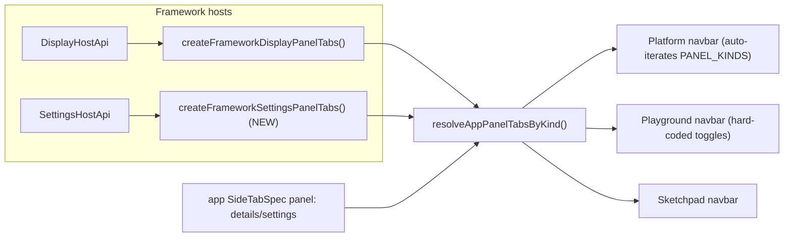

# Settings Panel Host Parity (Options == Settings)

## Decision summary (from clarifications)

- Do NOT add a new `options` panel kind. `options` and `settings` are the same; keep `settings`.
- Give `settings` the SAME mechanism as `display`: a framework-provided host + framework panel tabs + navbar toggle, instead of being app-driven only.
- The toggle sits right after `details` — already true since `RIGHT_PANEL_KINDS = ["details", "settings", "chat"]`, so no reordering.
- Migrate app/chrome-level options (mode, expertise, compact — NOT window/layout, which stay in `display`) into the settings panel.
- Scope: everything — platform shell, playground shell, and the `./semio` sketchpad navbar.

## How the display mechanism works today (the template to mirror)

- `display` host: `DisplayHostApi`/`DisplayHostContext`/`useDisplayHost` + `createFrameworkDisplayPanelTabs(getHost, bus)` build `windows`/`layout` trees in [framework/product/platform/renderer/react/index.tsx](framework/product/platform/renderer/react/index.tsx) (~L934-1313).
- Auto-surfacing: `resolveAppPanelTabsByKind` merges `createFrameworkDisplayPanelTabs` into `result.display` when the app has window kinds (~~L3505-3508). The platform navbar auto-iterates `PANEL_KINDS` (~~L4239-4292), so any kind with tabs gets a toggle automatically.
- Plumbing: `onDisplayHostReady` flows `ShellModeCanvas -> PlatformView`, then `<DisplayHostContext.Provider>` wraps the shell (~L1371, L3492, L4344).
- Playground shell does NOT auto-iterate; it hard-codes navbar toggles and switches `activeLeftPanelKind: "workbench" | "display"` in [framework/product/playground/renderer/react/index.tsx](framework/product/playground/renderer/react/index.tsx) (~L1073-1143).

## Implementation

### 1. i18n: settings panel tab namespace — [ui/react/index.tsx](ui/react/index.tsx)

- Mirror the existing `display: { tab: { windows, layout }, ... }` block (~~L1166-1174 schema, ~L1738-1746 en) with a `settings: { tab: { general, mode, expertise } }` namespace (en + de), for the framework settings panel tab labels. `panelToggle.settings` label already exists (~~L1725).

### 2. Framework settings host — [framework/product/platform/renderer/react/index.tsx](framework/product/platform/renderer/react/index.tsx)

- Add, mirroring the display host region:
  - `SettingsHostApi` interface (active mode + mode list, expertise value + options, compact flag, with setters), `SettingsHostContext`, `useSettingsHost`.
  - Tree definitions + `buildSettingsTree(...)` rendering the migrated controls as declarative `UiControlNode` rows (Select for mode/expertise, Toggle for compact).
  - `createFrameworkSettingsPanelTabs(getHost, bus): SidePanelTabConfig[]` (e.g. a single `framework.settings.general` tab, extensible).
  - `PANEL_KIND_ICON.settings` already exists (`settings-2`); no change.
- Auto-merge into `resolveAppPanelTabsByKind`: add `result.settings = mergeConfigEntries(result.settings, createFrameworkSettingsPanelTabs(getSettingsHost, bus))` (parallel to the display merge at ~L3505-3508) so every platform app gets the toggle.
- Plumb `onSettingsHostReady` through `ShellModeCanvas` and `PlatformView` and wrap the shell in `<SettingsHostContext.Provider>` (parallel to display at ~L1371, L4344, L4399).

### 3. Migrate chrome options into the settings host — same file

- Source the settings host from existing state: `activeModeId`/`setActiveModeId` (~L4046), `uiCompact`/`setUiCompact` (footer `settings.compact` ~L4298), and expertise.
- Remove the now-duplicated footer `settings.compact` toggle (~L4296-4311) and fold mode/expertise into the settings panel. Keep the navbar mode `Select` only if multi-mode nav is still desired; default is to move it into settings for a single source.

### 4. Playground shell navbar — [framework/product/playground/renderer/react/index.tsx](framework/product/playground/renderer/react/index.tsx)

- Add right-side kind switching mirroring the left side: `activeRightPanelKind: "details" | "settings"`, `settingsTabs = createFrameworkSettingsPanelTabs(() => settingsHost, shell.bus)`, `settingsIcon`, and `rightSidePanelTabs = activeRightPanelKind === "settings" ? settingsTabs : shell.detailsTabs`.
- Add a `ui.panelToggle.settings` `Toggle` in the hard-coded navbar group immediately after the `details` toggle (~L1131-1137), and wrap with `<SettingsHostContext.Provider>` + pass `onSettingsHostReady`.
- Expose `settingsHost` from the playground shell hook alongside `detailsTabs`/`footerItems` (~L933-1040).

### 5. Sketchpad navbar (`./semio`) — [semio/client/lib/sketchpad/js/index.ts](semio/client/lib/sketchpad/js/index.ts)

- Add `{ panel: "settings", ... }` to `sketchpadKitPanelTabs`/`sketchpadHomePanelTabs` (~~L14917-14930) so the settings toggle appears, and add the `semio.sketchpad.navbar.panelToggle.settings` label in both translation blocks (~~L510, L5559). The shared `ui.panelToggle.* -> semio.sketchpad.navbar.panelToggle.*` resolver (~L10242) already routes it.

### 6. App-level options migration

- Ensure app option controls register under `panel: "settings"` SideTabSpec so they land in the new panel. `puzzle/3d/play` already has a settings tab ([puzzle/3d/play/index.ts](puzzle/3d/play/index.ts) ~L1945-1946). Audit other framework apps (cad, puzzle2d/5d, presentation play) and move any option-style controls currently in toolbar/footer/details into `panel: "settings"`.

### 7. Tests — extend existing files only

- Extend the navbar/panel-toggle test blocks in [ui/react/index.tsx](ui/react/index.tsx) (~~L20041-20071) and [framework/product/platform/renderer/react/index.tsx](framework/product/platform/renderer/react/index.tsx) (~~L4593-4684) to assert the `ui.panelToggle.settings` toggle renders and the framework settings tabs build. Add a `settings windows tree`-style describe mirroring `display windows tree` (~L2970).

### 8. Repo workflow + validation

- Read `repo://goals`, then `ticket_open` (or `ticket_reopen` if one matches) before editing; keep any temp logs under the ticket folder.
- Validate with the repo build + unit tests via `nx`/`launch.json` tasks, and confirm runtime navbar behavior (toggle opens the settings panel) before `ticket_close`.

## Assumptions (flag if wrong)

- Migrated chrome options = mode, expertise, compact. Window/layout stay in `display`.
- Single framework `settings` tab (`general`) holding the migrated controls, extensible later; apps still add their own `panel: "settings"` tabs.
- Including the `./semio` sketchpad is intended (per "everything").

