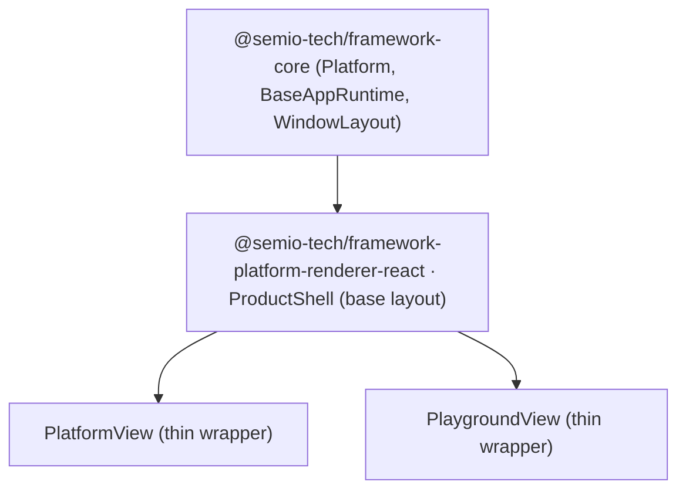

## Goal

Every product (`platform`, `playground`) shares ONE base layout: `navbar` (top), `canvas` with windows (middle), `footer` (bottom), and left/right side panels floating over the canvas. Today this is achieved by duplicated shell code in both product renderers. Consolidate into a single shared shell.

## Current state (verified)

- The base layout itself is already correct in `Layout` ([ui/react/index.tsx](ui/react/index.tsx) ~~line 11522): navbar / canvas / footer+toolbar, and `SidePanel` is `position: absolute` (~~line 19407) so left/right panels already float over the canvas. No panel-behavior change needed.
- Duplication lives in the two product renderers, both ~rebuilding the same shell against `Layout`:
  - [framework/product/platform/renderer/react/index.tsx](framework/product/platform/renderer/react/index.tsx): `PlatformView`, `ShellModeCanvas`, `findDefaultActiveWindowKindId`, `convertFrameworkLayoutToShellLayout`, navbar/toolbar/footer/side-panel wiring, `UISearch`/`UIFind`, panel toggles.
  - [framework/product/playground/renderer/react/index.tsx](framework/product/playground/renderer/react/index.tsx): `PlaygroundView` + its own copies of `ShellModeCanvas`, `findDefaultActiveWindowKindId`, layout conversion, `windowKindsToGolden`, `declareToolsToViewTools`, toolbar, navbar items, side-panel wiring.
- Package graph (real tree is `framework/core` + `framework/product/{platform,playground}`):
  - `@semio-tech/framework-playground-renderer-react` already depends on `@semio-tech/framework-platform-renderer-react` (package.json line 18).

So the shared shell's natural home is `@semio-tech/framework-platform-renderer-react` (already a dependency of playground; reuse an existing package rather than create a new one).

## Target structure

## Approach

1. In [framework/product/platform/renderer/react/index.tsx](framework/product/platform/renderer/react/index.tsx), factor the layout shell out of `PlatformView` into a reusable, product-neutral `ProductShell` component (new `//#region 🪨ProductShell`). `ProductShell` owns: `Layout` composition (navbar+canvas+footer+floating left/right `SidePanel`+toolbar overlay+mobilePanel), `ShellModeCanvas`, panel-visibility state/sizes, panel toggle group, `UISearch`/`UIFind` (Ctrl+P / Ctrl+F), and the shared helpers (`findDefaultActiveWindowKindId`, `convertFrameworkLayoutToShellLayout`).
2. Make `ProductShell` operate on `@semio-tech/framework-core` base types (`Platform`, resolved app fields) and accept the product-specific bits as props/slots:
  - resolved window-kind view defs (`UIWindowKindDefinition[]`) + active-window handling,
  - left/right side-panel tab configs (so platform keeps details/options/chat kinds; playground stays tree-only with no JSON fallback),
  - resolved toolbar/footer/navbar item arrays,
  - navigation props (back/forward/up/uri) and search/find items.
3. Rewrite `PlatformView` as a thin wrapper that computes its panel kinds (workbench/details/options/chat) + resolved data and renders `ProductShell`. Keep its existing exported props/behavior.
4. Refactor [framework/product/playground/renderer/react/index.tsx](framework/product/playground/renderer/react/index.tsx): import `ProductShell` (and already-shared helpers like `windowKindsToGolden`, `UiToolbar`, `registerSurfaceBinding`, `UiRenderer`) from `@semio-tech/framework-platform-renderer-react`; delete the duplicated `ShellModeCanvas`, layout-conversion, `findDefaultActiveWindowKindId`, toolbar, navbar, and side-panel plumbing; reduce `PlaygroundView` to a thin wrapper that injects playground-only concerns (tree-only side panels, window engagement overlays, puzzle play surface hosts, the playground `UiNode` renderer for tree/section/field nodes) into `ProductShell`.
5. Verify and update consumers of `PlatformView`/`PlaygroundView` (compose desktop client, puzzle play mains) for prop compatibility.
6. Validate: typecheck both renderer packages, run their vitest suites, and confirm runtime in a dev server (navbar/canvas/footer render, windows in canvas, left/right panels float, for both a platform app and a playground app) with console-log confirmation.

## Notes / conventions

- Follow repo rules: open a ticket first; add code into the existing files using `//#region` blocks; do not create new files/packages outside the ticket folder; no legacy/back-compat shims; use `kind` not `type` for any new naming.
- No change to panel positioning/styling — panels stay `absolute` floating overlays as today.

[{"id": "ticket", "content": "Open a repo ticket for consolidating the shared product base-layout shell (associate with the appropriate goal)."}, {"id": "extract-shell", "content": "In @semio-tech/framework-platform-renderer-react, extract ProductShell (base layout: navbar/canvas/footer + floating left/right panels + toggles + search/find) from PlatformView, operating on @semio-tech/framework-core base types with product-specific bits as props/slots."}, {"id": "platform-wrapper", "content": "Rewrite PlatformView as a thin wrapper over ProductShell, preserving its exported props and panel kinds (workbench/details/options/chat)."}, {"id": "playground-consume", "content": "Refactor the playground renderer to import ProductShell + shared helpers from @semio-tech/framework-platform-renderer-react; delete duplicated shell code; reduce PlaygroundView to inject playground-only concerns (tree panels, engagement, puzzle hosts, playground UiNode renderer)."}, {"id": "consumers", "content": "Update/verify consumers of PlatformView/PlaygroundView (compose desktop client, puzzle play mains) for prop compatibility."}, {"id": "validate", "content": "Typecheck both renderer packages, run vitest suites, and confirm runtime in a dev server for both a platform and a playground app (navbar/canvas/footer, windows in canvas, floating left/right panels)."}]