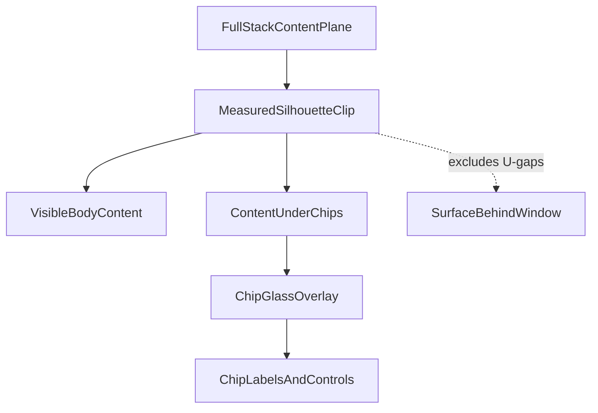

# Flow Window Content Through Glass Chips

## Architecture

Use the existing measured silhouette as both the border source and the content clip. The content plane spans the full chrome stack; chips and controls remain glass overlays above it; silhouette gaps contain neither content nor glass and remain pointer-through cutouts.

### 1. Ticket and baseline

- When execution starts, inspect the repo MCP again, read `repo://goals`, and open or reopen a dedicated ticket under `R26-02/RUNNING-SKETCHPAD`; no existing ticket specifically covers silhouette-clipped content flow.
- Store research, runtime captures, logs, and the final summary in that ticket. The repo MCP was unavailable during planning, so this workflow must occur before code changes.
- Capture current React and wgpu behavior for one text window, one 3D window, and representative panel/pane/introduction/menu surfaces.

### 2. Make the React silhouette reusable as a content clip

- In [the React UI package](/Users/ueli/Documents/semio/🧰️framework/🔨️modules/🖱️ui/📦️packages/🟦️typescript/🎯️targets/⚛️react/📦️index.tsx), derive a CSS/SVG fill clip from the same `windowSilhouetteOutline(metrics)` used by `windowSilhouettePath(metrics)`. Keep one geometry source for border, visual clipping, and hit-testing.
- Extend `WindowChromeSilhouetteBorder`'s measurement lifecycle into shared silhouette state/CSS variables so resize, chip-width changes, top/bottom chips, RTL, and nested silhouettes update both border and clip atomically.
- Preserve the existing inset convention: the stroke remains inset while the filled content clip reaches the intended silhouette edge without exposing rectangular seams.

### 3. Recompose shared WindowChrome into content and chrome planes

- Refactor `WindowChrome` in [the React UI package](/Users/ueli/Documents/semio/🧰️framework/🔨️modules/🖱️ui/📦️packages/🟦️typescript/🎯️targets/⚛️react/📦️index.tsx) so its body/content plane spans the complete stack instead of starting after the cap row. Preserve current external sizing for intrinsic surfaces while top and bottom chrome become overlays.
- Apply the silhouette fill clip to that content plane. Content—including text, canvases, and nested scene hosts—must continue geometrically beneath every title/control/footer chip but be absent from all U-gap polygons.
- Keep chip and control cells above content with `ui-glass`; keep names, controls, focus, drag, and accessibility semantics above the glass. Prevent duplicate glass layers while retaining each surface level's existing tint.
- Make the cap/footer rows pointer-transparent except for actual chips and controls. Because the content clip excludes gaps, gap clicks must still reach the surface behind the window.
- Apply this centrally to all selected consumers: dock windows, panels, panes, introductions, and menus. Update a consumer only where it overrides the shared layout.

### 4. Bring ModeDock and window content into the shared model

- Update [Canvas ModeDock chrome](/Users/ueli/Documents/semio/🧰️framework/🔨️modules/🖱️ui/🧱️elements/🎨️Canvas/🟦️component.tsx) so `mode-dock-stack-body` is the full-stack clipped content plane rather than grid/flex row 2 beneath `ModeDockTabBar`; retain multi-tab active geometry, drag/drop targets, resizing, maximize, and mobile tab scrolling.
- Adjust [Window](/Users/ueli/Documents/semio/🧰️framework/🔨️modules/🖱️ui/🧱️elements/🪟️Window/🟦️component.tsx) only as needed so `window-body`, `PaneHost`, text scrollers, and edgeless 3D/canvas hosts size to the new full content plane without adding rectangular backgrounds or overflow clips.
- In [UI styling](/Users/ueli/Documents/semio/🧰️framework/🔨️modules/🖱️ui/🎨️styling/📦️packages/🟦️typescript/🎨️ui.css), retain the hard no-paint contract for `[data-window-silhouette-gap]`, add full-stack content/chrome-plane rules, and ensure scrollbars, hover strokes, focus indicators, and glass filters remain clipped to the silhouette.

### 5. Implement native wgpu parity

- In [native dock rendering](/Users/ueli/Documents/semio/🧰️framework/🛍️products/💻️os/🔨️modules/📺️renderer/🧑️‍🎨️engine/🧱️elements/Dock/🧊️component.rs), stop treating `body_y = cap_y + tab_h` as the content origin. Render text/2D/3D content against the full silhouette bounds so camera projection and content coordinates continue beneath tabs and controls.
- Replace the full-width cap glass region with separate tab-chip and controls glass regions. The measured gap receives no glass and no content.
- Add a silhouette-shaped GPU clip/mask in [the wgpu draw pipeline](/Users/ueli/Documents/semio/🧰️framework/🔨️modules/🖱️ui/📦️packages/🦀️rust/🎯️targets/🧊️wgpu/🦀️draw.rs), driven by the same `WindowSilhouette` geometry, so one render pass can cover the whole window while rejecting gaps and outside pixels. Keep `push_window_silhouette_border` as the independent final stroke.
- Preserve scene scissoring, nested window isolation, glass foreground ordering, active/hover borders, and multi-window performance; do not rerender a 3D scene once per silhouette rectangle.

### 6. Regression coverage and runtime verification

- Extend existing tests in the React package and current Canvas/Window test regions; do not create separate test files. Cover top and bottom chips, multiple chip spans, no-controls cases, RTL, resize updates, nested silhouettes, and points inside gaps being excluded from both clip and hit area.
- Add native tests alongside existing dock/draw tests proving content bounds include the cap, glass regions exclude the gap, and the mask rejects gap pixels without duplicating scene rendering.
- Run the registered UI typecheck/test tasks and native renderer checks. Then confirm runtime behavior with temporary `[DEBUG] ` instrumentation and captures for text, 3D, panel, pane, introduction, and menu surfaces in light and dark themes.
- Acceptance: content is spatially continuous beneath chip glass and visibly tinted there; no content, tint, or rectangular fill appears in any cutout; resize/drag/tab changes update the clip without a one-frame rectangle; controls and accessibility remain functional.
- Remove temporary debug instrumentation, write the ticket summary with touched files and verification evidence, and close the ticket through repo MCP.