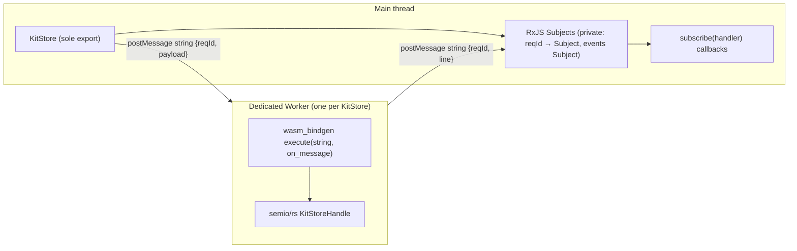

# Single Async KitStore Export In semio/js

## Hard rules (from `semio/js/AGENTS.md` + `semio/rs/AGENTS.md` + user)

1. `@semio/js` exports exactly one class — `KitStore` — plus the typed shapes its methods reference (`*FullDto`, `*Input`, `*Result`, `KitEvent`, `BackboneConfig`, `BackboneStatus`, `VcsState`, `KitConflict`, `Unsubscribe`). Nothing else.
2. `@semio/js` stores nothing and caches nothing. Every call round-trips to `semio/rs`.
3. Every method is `async` and typesafe (no `any`, no `unknown` in the public surface).
4. RxJS is used only inside `KitStore` (request demux + event fan-out). It must not appear in the public `.d.ts`.
5. Public eventing is callback-based: `subscribe(handler): Unsubscribe`. No `Observable` exported.
6. Communication with `semio/rs` is GraphQL strings only, over **one dedicated `Worker` per `KitStore`**, with **one** `wasm-bindgen` entrypoint (`KitStoreHandle.execute(json, on_message)`). No Comlink, no MessagePort, no zod, no fflate, no inline path.
7. **All domain knowledge** (diff math, flatten preview, anchoring, "best representation", `applyDiff`, entity classes, schemas) is forbidden in `@semio/js`, `@semio/react`, `@semio/sketchpad`, `@semio/ui`, `@semio/algorithms`. Anything those packages need must come from a typed `semio/rs` semantic command. Missing commands are added to `semio/rs` as part of this ticket.

## Architecture

- One persistent `subscription { kitEvents }` opened on construction → fans out to user callbacks.
- Each mutation/query: fresh `reqId`, private `Subject<string>` collects response lines, parsed into the typed result, Subject completes, Promise resolves.
- `dispose()` terminates worker, completes all Subjects, no more callbacks fire.

## Public surface (`@semio/js`)

Sole export `KitStore` plus the types its method signatures reference. Method shape mirrors `semio/rs` GraphQL schema 1:1.

- Lifecycle: `static open(initialKit: KitFullDto): Promise<KitStore>`, `dispose(): Promise<void>`.
- Reads (pass-through to rs, no JS-side cache): `snapshot(): Promise<KitFullDto>`, `theKit(): Promise<KitFullDto>`, `materializeAt(commandId: string): Promise<KitFullDto>`, `read(batch: ReadKitCommandBatchInput): Promise<ReadKitCommandBatchResult>`, plus typed convenience reads for every existing rs read command (`getPieces`, `getConnections`, `getDesigns`, `getTypes`, `getAuthors`, `getKitMetadata`, `flattenDesign`, `expandDesign`, `previewDragPieces`, `previewMovePieces`, `previewClusterPieces`, `previewPasteDesign`, `bestRepresentation`).
- Writes (one method per existing rs mutation): `dragPieces`, `movePieces`, `clusterPieces`, `fixPieces`, `flattenDesign`, `expandDesign`, `deleteConnection`, `changePieceType`, `pasteDesignSelection`, `createHangingPieces`, `createConnectedPiece`, `createFixedPiece`, `deletePiecesAndConnections`, `undo`, `redo`, `changeKitCommands`, `changeKitWithInverse`, `patchEntityField`, `addChild`, `removeChild` — each `(input: <Cmd>Input) => Promise<<Cmd>Result>`. Internally each generates a `reqId`, calls the worker, and resolves with the typed result line.
- Events: `subscribe(handler: (event: KitEvent) => void): Unsubscribe`, `subscribeFiltered(filter: KitEventFilter, handler): Unsubscribe`. No `events$`, no rxjs in the signature.
- VCS / backbone / conflicts (typed wrappers per rs commands): `vcsState()`, `attachBackbone(cfg: BackboneConfig)`, `detachBackbone()`, `backboneStatus()`, `listConflicts()`, `resolveConflict(input)`, `syncNow()`, `canUndo()`, `canRedo()`.

Forbidden in `@semio/js`: any `Schema`, any entity class (`Design`, `Kit`, `Piece`, `Type`, `Plane`, `Vector`, `Coordinate`, …), `applyDiff`, `previewWithDiff`, `pickBestRepresentation`, `flattenDesignCachedOp`, `getConnections`, `semioToThreeRootBasis`, `InMemoryKitStore`, `JsonFileKitStore`, `FolderKitStore`, `KitHostStore`, `WorkerKitStoreClient`, `KitViewStore`, `kitGraphqlRun`, `KitGraphqlHandle`, `ALL_READ_KIT_COMMAND_KEYS`, `Semio`, `TOLERANCE`, `ICON_WIDTH`, etc.

## File-level changes

- [semio/js/index.ts](semio/js/index.ts) — full rewrite. Region layout per AGENTS:
  - `🧲Header`
  - `📥Imports` (only `rxjs`)
  - `🔌WireTypes` — handwritten TS mirroring rs schema (`KitFullDto`, every `*Input`/`*Result`, `KitEvent`, `KitEventFilter`, `BackboneConfig`, `BackboneStatus`, `VcsState`, `KitConflict`, `ReadKitCommandBatchInput`, `ReadKitCommandBatchResult`, `Unsubscribe`)
  - `🪜WorkerTransport` — owns the `Worker`, sends `{reqId, payload}` strings, dispatches incoming `{reqId, line}` strings to private `Subject<string>` per reqId, opens the persistent `kitEvents` subscription on construction
  - `🧰Graphql` (private) — typed `mutation<TIn, TOut>(query, vars): Promise<TOut>`, `query<TIn, TOut>(...)`, `subscription<TOut>(query, onLine): Unsubscribe` — all use rxjs `firstValueFrom`/`take(1)`/`Subject` internally
  - `📦KitStore` — sole exported class; methods are 1-line wrappers over `🧰Graphql`; `subscribe(handler)` is a thin callback wrapper over a private `Subject<KitEvent>` (`.subscribe(handler).unsubscribe`)
  - `🧪EmbeddedTests` — vitest suite rewritten in place (single file rule)
  - Delete every other current export listed under "Forbidden in `@semio/js`" above.
- [semio/js/worker.ts](semio/js/worker.ts) — strip Comlink. Becomes a thin module worker that boots `@semio/rs-wasm`, holds one `KitStoreHandle`, and on each `message` (typed `{reqId, payload}` JSON-string) calls `handle.execute(payload, line => postMessage(JSON.stringify({reqId, line})))`. Strings only on the wire. On `{reqId, kind: "init", initialKit}` calls `KitStoreHandle.create(initialKit)`. On `{reqId, kind: "dispose"}` drops the handle and closes.
- [semio/js/package.json](semio/js/package.json) — add `rxjs`; remove `zod`, `fflate`, `comlink`, `@types/comlink`.
- [semio/js/vite.config.ts](semio/js/vite.config.ts) — keep `@semio/rs-wasm` alias; remove anything specific to deleted code.

## Strip domain knowledge from consumers

- [semio/react/kitWasmClient.ts](semio/react/kitWasmClient.ts) — former `kitEntities.ts` merged under `🧩KitEntitiesMerged` (file removed); long-term: strip entity graph from React per §Hard rules.
- [semio/react/index.tsx](semio/react/index.tsx) — still hosts legacy hooks on merged entities; target: scopes on `KitStore.subscribe` + typed methods only.
- [semio/sketchpad/index.tsx](semio/sketchpad/index.tsx) — only consume `@semio/react` hooks; no direct `@semio/js` import.
- [semio/algorithms/nativeAlgorithmAdapter.ts](semio/algorithms/nativeAlgorithmAdapter.ts) — **delete**. Every algorithm call goes through a typed `KitStore` semantic command. The native REST proxy in [semio/algorithms/.storybook/main.ts](semio/algorithms/.storybook/main.ts) is rewired to call `ks.flattenDesign(...)`, `ks.previewDragPieces(...)`, etc. directly.
- [semio/algorithms/.storybook/stories/kit-store/commandSchema.ts](semio/algorithms/.storybook/stories/kit-store/commandSchema.ts) and siblings — drop the local `ALL_READ_KIT_COMMAND_KEYS` import; build the storybook command catalog from typed `KitStore` method names instead.
- [semio/ui/index.tsx](semio/ui/index.tsx) — strip every call to `Design.applyDiff`, `Design.previewWithDiff`, `Design.getConnections`, `Type.pickBestRepresentation`, `Kit.semioToThreeRootBasis`, `Kit.flattenDesignCachedOp`, `Plane.toMatrix`, `cloneDesignWithDiff`. Replace with `KitStore.flattenDesign(...)` / `KitStore.previewDragPieces(...)` / `KitStore.bestRepresentation(...)` results. The only JS-side math left is generic linear algebra (column-major 4×4 from a {origin,xAxis,yAxis} triple) — that is not domain knowledge.
- [semio/sites/play/index.tsx](semio/sites/play/index.tsx), [semio/desktop/renderer.tsx](semio/desktop/renderer.tsx), [semio/vscode/webview.tsx](semio/vscode/webview.tsx), [semio/3dm/ui/index.tsx](semio/3dm/ui/index.tsx) — replace `InMemoryKitStore` / `createJsonFileKitStore` / `Kit` usage with `KitStore.open(initialKit)` + typed method calls. Host-side persistence (file/folder/JSON) becomes a thin host wrapper that calls `KitStore.snapshot()` and `KitStore.changeKitCommands(...)`; **no** kit graph kept in JS.

## Missing semantic commands in `semio/rs` (added as part of this ticket)

Anything the consumers above used to do locally must exist as a typed rs command. Inventory + add to rs schema if missing:

- `previewDragPieces(input): PreviewDragPiecesResult` — flat-plane preview for drag without committing.
- `previewMovePieces(input): PreviewMovePiecesResult`.
- `previewClusterPieces(input): PreviewClusterPiecesResult`.
- `previewPasteDesign(input): PreviewPasteDesignResult` — anchoring math result.
- `bestRepresentation(input: BestRepresentationInput): BestRepresentationResult` — accepts `{typeId, mimeFilter[]}` and returns the chosen `RepresentationDto`.
- `deletePiecesAndConnections(input)` — semantic delete combining the two.
- `copyDesignSelection(input): CopyDesignSelectionResult` — returns a `DesignFullDto` snippet.
- `pasteDesign(input)` — already covered by `pasteDesignSelection`; verify shape.
- `kitEvents` subscription emitting `{ kind, executionId?, payload }` envelopes — verify it carries enough info to drive `subscribe()` consumers (kit changed, command accepted/succeeded/failed, backbone status, conflict state).

For each gap: add the GraphQL field, the rust handler, and a unit test in the existing rs test file (per AGENTS — no new test files).

## Tests

Single test surface per package (extend existing files, no new ones):

- [semio/js/index.ts](semio/js/index.ts) `🧪EmbeddedTests`:
  - `KitStore.open` boots worker, `snapshot()` returns the seeded kit
  - Each typed write resolves with its typed result and emits a matching `KitEvent` to `subscribe`
  - `subscribe` returns an `Unsubscribe` that stops further callbacks
  - `read(batch)` returns typed batch result (no `unknown`)
  - `vcsState`, `theKit`, `materializeAt`, `attachBackbone`, `listConflicts`, `resolveConflict` round-trip
  - `dispose()` terminates worker; subsequent calls reject; no callbacks fire after dispose
  - The public `.d.ts` does not reference `Observable`/`Subject` (assert via a TS type-level test)
- `semio/react`, `semio/sketchpad`, `semio/ui`, `semio/algorithms` existing test files extended to cover the new `KitStore`-only flow.
- `semio/rs` existing test file extended with cases for any newly-added semantic commands.

Run `npm test` in `semio/js`, `semio/react`, `semio/sketchpad`, `semio/ui`, `semio/algorithms`, and `cargo test -p semio` until green.

## Ticket

Reopen `2026/04/26/CLEAN-STATELESS-KIT-STORES-AND-KIT-COMMAND-REQUESTS` (already on disk) under goal `r2602/runningsketchpad` (or open a new sibling ticket if scope differs). All temporary scratch files inside the ticket folder. Close with summary + full file list when every test suite is green.

## Out of scope

- Splitting the Worker further (e.g. per-tab pool) — single dedicated Worker per `KitStore` is the contract.
- Re-introducing any JS-side caching layer.
- Re-introducing entity classes anywhere outside `semio/rs`.

## Completion status (handoff)

**Done in tree**

- `@semio/js`: `KitStore` with opaque `ReadWireBatch` / `read`, callback `subscribe`, `ensureAlive` + post-`dispose()` rejection on `snapshot`/`read`/GraphQL paths; embedded Vitest (6 cases) covers dispose, `theKit`/`vcsState`/`materializeAt("")`/undo flags, and `keyof KitStore` rx-leak compile guard.
- `@semio/react`: `kitWasmClient` batches use `ReadWireBatch` only (no exported read unions from js).
- `@semio/algorithms`: `nativeAlgorithmAdapter.ts` **removed**; native runners live in `index.ts`; Storybook imports updated.
- Inline WASM transport when `Worker` is missing remains for Node/Vitest (differs from strict “no inline path” in §Hard rules).

**Explicitly not finished (needs dedicated tickets)**

- **Domain in `@semio/react`**: former `kitEntities` code now lives under `kitWasmClient.ts` → `🧩KitEntitiesMerged`; hooks in `index.tsx` still use zod/entity classes until migrated to DTO + `KitStore` only.
- **`semio/rs` preview / semantic gaps** (`previewDragPieces`, unified `deletePiecesAndConnections`, etc.): cancelled in plan; algorithms TS path still uses entity `applyDiff` / `dragBySelection` where rs commands are absent.
