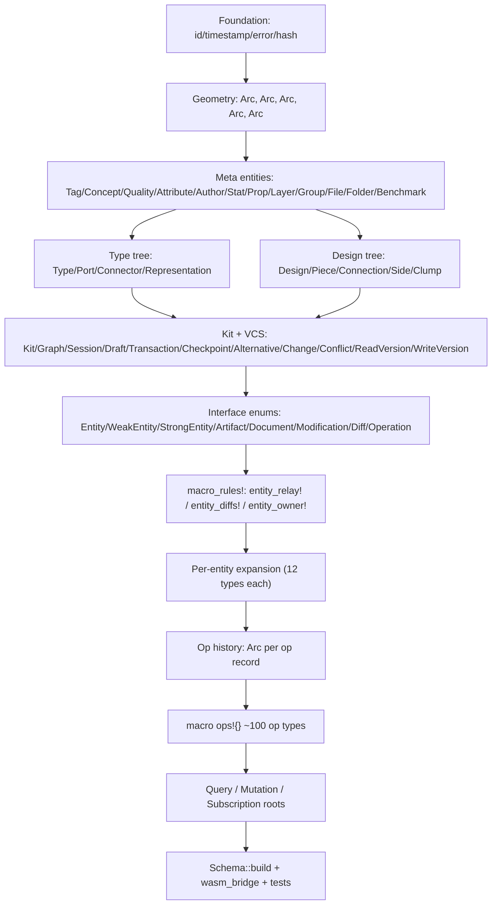

# Single-file Static SDL

## Goal

- One file: [compose/rs/lib.rs](compose/rs/lib.rs).
- Zero dynamic schema code. Drop `mod gql_target;` and delete [compose/rs/gql_target.rs](compose/rs/gql_target.rs).
- Use only `async_graphql::{Object, Interface, Union, SimpleObject, Enum, Scalar, InputObject, Subscription, Schema, MergedObject, MergedSubscription}` — every type known at `cargo build`.
- Generated SDL byte-for-byte covers `target.schema.graphql` (689 types, 100 unions, 11 interfaces, 17 inputs, 95 ops, ~95 subscription fields).
- Every operation runs real before/modification/after logic (no stubs).

## Layout inside `lib.rs`

Region tree (one `lib.rs`):

- `🆔 id`, `⏱️ timestamp`, `🚨 error`, `🪪 hash` — keep.
- `📐 geom` — lift `Vector/Point/Coordinate/Offset/Plane/Position/Place/Location` from `SimpleObject` to `Arc`-shared `RwLock` structs with `#[Object]` (gain `id`, `hash`, `entityOwner`, `ownedEntities`).
- `🏷️ meta` — same lift for 12 meta entities.
- `🏠 type-tree`, `🏘 design-tree`, `📦 kit`, `🌿 vcs` — keep entities; add missing `Conflict/ReadVersion/WriteVersion` Arc structs.
- `🪪 interfaces` — `EntityIface`, `WeakEntityIface`, `StrongEntityIface`, `ArtifactIface`, `DocumentIface`, `ModificationIface`, `DiffIface`, `OperationIface`, plus `OwnerEntity`, `OwnedEntity`, `ChangeOwned`, `DiffOwner`, `DiffsOwner`, `Input` as `#[derive(Union)] enum { … }` with `Arc<…>` variants.
- `🪢 relay-macros` — three `macro_rules!` at module scope:
  - `entity_relay!(X)` → `XEdge`, `XConnection { edges, pageInfo, hash, totalCount }` (`#[derive(SimpleObject)]`).
  - `entity_diffs!(X, fields = [name, description, …])` → `XModification { name: Option<String>, removeName: Option<bool>, … }` + `XModificationEdge`/`Connection` + `XDiff { before: Arc<X>, modification: Arc<XModification>, after: Arc<X> }` + `XDiffEdge/Connection` + `XDiffs { removed: Vec<Arc<X>>, diffs: Vec<Arc<XDiff>>, added: Vec<Arc<X>> }` + `XDiffsEdge/Connection`.
  - `entity_owner!(X, owner = [Kit, Type, …], owned = [Tag, Concept, …])` → `XOwner` / `XOwned` / `XModificationOwner` / `XModificationOwned` / `XDiffsOwner` / `XDiffsOwned` unions.
- `📐 geom-relay`, `🏷️ meta-relay`, `🏠 type-relay`, `🏘 design-relay`, `📦 kit-relay`, `🌿 vcs-relay` — invoke the three macros once per entity (60 entity families × 12 types ≈ 720 generated types).
- `🪡 op-history` — per-`Graph` ordered `Vec<Arc<OperationIface>>`. Each op stored carries `Arc<Snapshot>` of `before`/`after` (cheap: shared `Arc` to whatever was mutated, plus a small `Modification` value).
- `⚙️ ops` — single declarative `ops! { … }` macro that, for each operation row `(StructName, mutate_fn, modification_fields, owner_unions)`, expands to:
  - `pub struct StructName { id, hash, owner: Arc<Change>, modification: Arc<XModification>, before: Arc<X>, after: Arc<X>, input: Arc<XInput> }`
  - `#[Object(name="StructName")] impl StructName { … }` (id, hash, owner, before, modification, after, input).
  - `XEdge`/`XConnection`/`XModificationEdge`/`Connection`/`XDiffEdge`/`Connection`/`XDiffsEdge`/`Connection`.
  - registration in `OperationIface`, `OperationOwner`, `Input`.
  - 100 op rows: `RenamedKit, ChangedDescription, CreatedTag, CreatedTags, RenamedTag, UpdatedTagDescription, UpdatedTagIcon, AddedAttributeToTag, AddedAttributesToTag, RemovedAttributeFromTag, RemovedAttributesFromTag, DeletedTag, DeletedTags`, mirrored for `Concept`, `Port`, `Quality`, `Type`; connector ops; design ops; piece ops (`AddedFixedPieceToDesign`, `AddedChildPieceWithParentConnectionToDesign`, `DraggedPieceInDesign`, `DraggedPiecesInDesign`, `MovedPieceInDesign`, `MovedPiecesInDesign`, `FixedPieceInDesign`, `FixedPiecesInDesign`, `ChangedPieceToTypeInDesign`, `ChangedPiecesToTypeInDesign`, `RenamedPieceInDesign`, `UpdatedPieceDescriptionInDesign`, `DeletedPieceInDesign`, `DeletedPiecesInDesign`, `DeletedPiecesAndConnectionsInDesign`, `FlattenedDesign`).
- `🌐 query` — `Query { session, wip, authoritative, conflicts, node, entity, pieceInDesign, alternativePieceKind }` static `#[Object]`.
- `✏️ mutation` — `Mutation` as one `#[Object]` impl with one `async fn` per op (~100 fields). Each fn:
  1. snapshots the target entity into `Arc<X>` (before),
  2. mutates the live `Arc`/`RwLock` graph,
  3. snapshots the new state (after),
  4. builds the `XModification` and the matching `OperationIface` variant,
  5. appends to op history, emits via `EventBus`,
  6. returns `Id`.
- `📡 subscription` — `Subscription` static `#[Subscription]` impl with one stream per op field (`commandSucceeded`, `operationSucceeded`, `operationFailed`, `error`, plus 90 typed channels). Streams are filtered views over `EventBus` broadcast.
- `🌐 gql` — thin module exposing `pub type AppSchema = Schema<Query, Mutation, Subscription>` and `build_schema_for(rt)` calling `Schema::build(...)`. `sdl()` returns `schema.sdl()` (true compile-time SDL).
- `🔌 wasm_bridge` — point at the new `AppSchema`; same `KitStoreHandle` API.

## Key code anchors

- Replace [compose/rs/lib.rs L3520-L3556](compose/rs/lib.rs) (current `pub mod gql` proxying to `gql_target`) with a `Schema::build(Query, Mutation, Subscription)` builder.
- Drop the `dynamic-schema` feature from [compose/rs/Cargo.toml](compose/rs/Cargo.toml); delete `gql_target.rs`.
- Existing pointer infrastructure (`Connector.port: Weak<Port>`, `Design.piece_weak_by_external_id`, `Kit.design_weak_by_id`, `Kit.type_weak_by_id`, `Type.connector_weak_by_id`/`port_weak_by_id`/`representation_weak_by_id`) carries over — every static resolver upgrades these weaks; no `_by_id` linear scans inside `#[Object]`.

## Validation

- New test `target_sdl_byte_match`: `assert_eq!(Schema::build(...).sdl(), include_str!("../graphql/target.schema.graphql"))` (after normalizing trailing whitespace).
- Existing tests adapt: `parses_target_schema` becomes `static_sdl_contains_keys`; `create_fixed_piece_end_to_end` and `wip_and_authoritative_are_isolated` keep working through the new mutation root.
- Add per-entity unit tests for one mutation per op family (Tag, Concept, Port, Quality, Type, Connector, Design, Piece, Kit) verifying before/after snapshots are distinct `Arc`s with the expected fields.
- `cargo test -p compose` (native) and `cargo check -p compose --target wasm32-unknown-unknown --no-default-features` must pass.

## Risk and size

- Final `lib.rs` lands at roughly **35 000–45 000 lines**, almost entirely macro-generated (the three relay macros + the `ops!` macro keep authored lines below ~10 000).
- async-graphql `Schema::build` compile time will rise (large enums for `OperationIface`, `OperationOwner`, `OwnerEntity`); kept tractable by `Arc<…>` enum payloads.
- Phasing inside the single file is enforced by Rust's top-down resolution: foundation → entities → interfaces → relay macros → expansions → ops → roots → schema build. Out-of-order edits fail to compile, which is the type-safety win the user asked for.

## Out of scope

- `compose/js`, `compose/react`, hosts.
- Backbone storage migration (existing dev-json + sqlite paths keep working).
- Removing or renaming `target.schema.graphql` itself.
