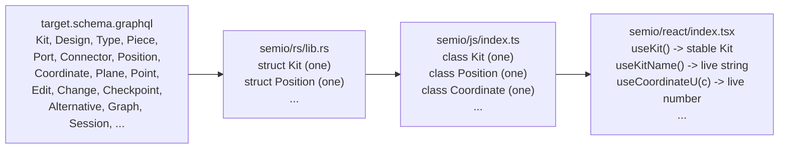
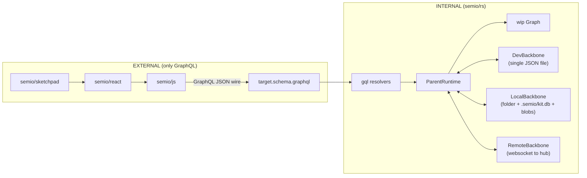
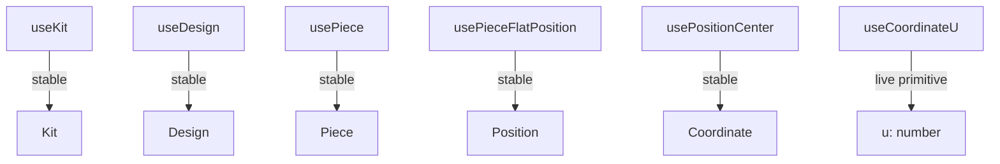

# Single-Source Entity Layers

## Layering contract

`semio/sketchpad` -> `semio/react` -> `semio/js` -> GraphQL -> `semio/rs`

Each entity in [semio/graphql/target.schema.graphql](semio/graphql/target.schema.graphql) appears **exactly once** per layer:




Cardinality rules (user verbatim):

- One class per **weak** entity (`Position`, `Plane`, `Point`, `Vector`, `Coordinate`, `Offset`, `Location`, `Attribute`).
- One class per **strong** entity (only `class Kit`, no `KitDto`/`KitStore`/`KitSnapshot`/`KitBundle`/`KitGraph`/etc.).
- One hook per strong-entity field, plus the entity-ref hook (`useKit`, `useDesign`, ...).
- Non-primitive field hooks return a **stable** instance (never re-renders); primitive field hooks subscribe to live updates.
- Owned strong-entity collection hooks (`useDesigns`, `useTypes`, `usePieces`, `useEdits`, ...) update only when membership (ids) changes, not when individual children change.

## Entity inventory (one class per layer)

The schema partitions every named type into one of seven families. **Every** concrete type in every family must have exactly one canonical Rust struct + one JS class + (where applicable) one React ref-hook.

### Strong entities, primary (uuidv7 id) - 28

`Place`, `Family`, `Folder`, `File`, `Author`, `Prop`, `Benchmark`, `Quality`, `Tag`, `Concept`, `Stat`, `Port`, `Connector`, `Representation`, `Type`, `Layer`, `Group`, `Piece`, `Connection`, `Design`, `Kit`.

VCS: `Edit`, `Change`, `Checkpoint`, `Alternative`, `TheKit`, `Graph`, `Session`, `Conflict`.

### Strong entities, operations (uuidv7 id) - 95

Concrete subtypes of `interface Operation` (each is a `StrongEntity`, has uuidv7 id). Examples per artifact family:

- **Kit**: `RenamedKit`, `ChangedDescription`.
- **Quality**: `CreatedQuality`, `CreatedQualities`, `RenamedQuality`, `UpdatedQualityDescription`, `UpdatedQualityIcon`, `AddedAttributeToQuality`, `AddedAttributesToQuality`, `RemovedAttributeFromQuality`, `RemovedAttributesFromQuality`, `DeletedQuality`, `DeletedQualities`.
- **Tag**, **Concept**, **Port**, **Type**, **Connector**, **Design**, **Piece**: parallel families (rename / describe / icon / attribute add+remove / delete singular+plural / type-specific operations).
- **Piece-graph**: `CreatedFixedPiece`, `AddedChildPieceWithParentConnection`, `AddedChildPiecesWithParentConnections`, `AddedHangingChildPieceWithParentConnection`, `AddedHangingChildPiecesWithParentConnections`, `ChangedPieceToType`, `ChangedPiecesToType`, `DraggedPiece`, `DraggedPieces`, `FixedPiece`, `FixedPieces`, `MovedPiece`, `MovedPieces`, `DeletedPiece`, `DeletedPieces`, `DeletedPiecesAndConnections`, `FlattenedDesign`.

Total exact count: **95** (verified `rg "^type \w+ implements Operation"`).

### Weak entities, primary (hash id) - 8

`Vector`, `Point`, `Coordinate`, `Offset`, `Plane`, `Position`, `Location`, `Attribute`.

### Weak entities, change algebra (hash id)

- `interface Diff` + **30 concrete** subtypes: `KitDiff`, `DesignDiff`, `TypeDiff`, `PieceDiff`, `ConnectionDiff`, `PortDiff`, `ConnectorDiff`, `RepresentationDiff`, `QualityDiff`, `TagDiff`, `ConceptDiff`, `StatDiff`, `PropDiff`, `BenchmarkDiff`, `AttributeDiff`, `AuthorDiff`, `FileDiff`, `FolderDiff`, `FamilyDiff`, `PlaceDiff`, `LayerDiff`, `GroupDiff`, `VectorDiff`, `PointDiff`, `CoordinateDiff`, `OffsetDiff`, `PlaneDiff`, `PositionDiff`, `LocationDiff`, `RepresentationDiff`.
- `interface Modification` + **30 concrete** subtypes (`KitModification`, ..., `LocationModification`).
- `type Modifications` (concrete wrapper) + **30 per-entity wrappers** (`KitModifications`, ..., `LocationModifications`).
- `interface Input` + **61 concrete** subtypes (one per operation that takes arguments: `RenamedKitInput`, `CreatedTagInput`, `CreatedTagsInput`, `RenamedTagInput`, `UpdatedTagDescriptionInput`, ...).
- `interface Event` (timestamped weak entity, used internally by Rust event bus; JS exposes only its concrete bus-event subclasses through the live-query subscription).

### Connections (relay shells) - 1 per entity

For every entity above there is a `<Entity>Edge` and `<Entity>Connection` (relay shape). These are **not** entity classes; they are the wire shape `useIdStableList` consumes. They appear once per entity in Rust (`gql_relay::*Connection`), and **never** in JS / React (collapsed into the id-list-stable hook).

### Totals per layer

- **Rust** structs (or enum variants): 28 + 95 + 8 + 30 + 30 + 30 + 61 = **282 canonical types**, one per concrete schema type. Today many already exist; remaining gaps will be added or unified during Phase A.
- **JS** classes: same **282** classes (one per concrete schema type) plus the 5 base classes (`Operation`, `Diff`, `Modification`, `Input`, `Event`). All in [semio/js/index.ts](semio/js/index.ts).
- **React** ref hooks: one per *strong* entity = 28 + 95 = **123** ref hooks (`useKit`, `useDesign`, ..., `useRenamedKit`, `useCreatedFixedPiece`, ...). Weak entities have **no** ref hooks - they are reached via accessors on their parent strong-entity instance per K3.
- **React** field hooks (K1..K11): roughly **~1,200**. One per field per entity. The base interface fields (`hash`, `owner`, `id`, `owns`) generate a hook on the base class only; concrete subclasses add hooks only for their additional fields.

Each layer mechanically iterates this inventory; the patterns below are the ones each entry follows.

## External API boundary - GraphQL only, no general JSON serde



**Hard invariants** the rest of the plan must enforce:

1. **Only one external surface**: the wire format described by [target.schema.graphql](semio/graphql/target.schema.graphql). Every read/write between layers crosses this surface. No JSON-RPC, no out-of-band kit-DTO blobs, no parallel HTTP routes.
2. **Only one persistent serializer**: `DevBackbone` reads/writes a single JSON file. `LocalBackbone` uses a folder layout (`.semio/kit.db` SQLite + file blobs - **not** JSON). `RemoteBackbone` uses a WebSocket frame protocol (binary or compact text - **not** JSON-DTO snapshots). All three are **internal** to `semio/rs` and never appear in `semio/js` / `semio/react` / `semio/sketchpad`.
3. **Backbone attach goes through GraphQL**: a new `Mutation.session.backbone.attach(uri: String!)` (or analogous root) replaces the today-internal `Command::BackboneAttach`. The URI scheme dispatches the backend kind (`dev:///path/to.json`, `local:///path/to/folder`, `remote://wss://hub.semio.tech/...`).
4. **No general-purpose JSON helpers in `semio/js` public surface**: `JsonValue` / `JsonObject` / `parseJsonValue` / `KitGraphqlResponseEnvelope` become **private** wire helpers (file-local types not re-exported). The public API is class methods returning typed values. **293** current `JsonValue`/`JsonObject` references in [semio/js/index.ts](semio/js/index.ts) collapse to a small private wire layer.
5. **`Kit.open(uri)` interprets `uri` as a real URI**: today (line 795) it parses `uri` as a JSON kit-DTO string. After this plan, `uri` is a backbone URI (`dev:///...`, `local:///...`, `remote://...`) and the WASM `KitStoreHandle.create(uri)` boots an empty graph + dispatches an internal `BackboneAttach` command keyed by URI scheme. There is **no** browser-side JSON-DTO upload path.
6. **Remove `Mutation.hydrateKitStoreBundleJson`** ([target.schema.graphql] - currently outside the schema but exposed in [lib.rs](semio/rs/lib.rs#L10111)). The only way to populate a kit is via the backbone attach + change pipeline.

## Phase A - Rust unification ([semio/rs/lib.rs](semio/rs/lib.rs))

Goal: one struct per entity in `semio/rs`; live-query subscription emits per-entity, per-field ticks.

- **Weak entity collapse**: today each weak entity has a `Copy DTO` (e.g. `geom::Position` line 615) **and** an Arc graph node (`geom::entity::PositionNode` line 773). Collapse to one `pub struct Position` per weak entity (Arc-bearing, with `RwLock` fields, both `Object` and `InputObject` impl on the canonical type). Same for `Vector`, `Point`, `Coordinate`, `Offset`, `Plane`, `Location`, `Attribute`.
  ```rust
  // canonical, one per weak entity
  #[derive(InputObject)]
  #[graphql(name = "PositionInput")]
  pub struct PositionInput { pub center: CoordinateInput, pub plane: PlaneInput }

  pub struct Position {
      pub id: Id, // hash-derived
      pub center: Arc<Coordinate>,
      pub plane:  Arc<Plane>,
  }
  #[Object(name = "Position")]
  impl Position {
      async fn id(&self) -> Id { self.id.clone() }
      async fn hash(&self) -> String { self.compute_hash().await }
      async fn center(&self) -> Arc<Coordinate> { self.center.clone() }
      async fn plane(&self) -> Arc<Plane> { self.plane.clone() }
  }
  ```
- **Bundle / snapshot fold**: remove standalone `KitStoreBundleFile` (line 8170), `GraphSnapshotDto` (line 8183), `AlternativeVersionDto` (line 8218), `KitGraphWorkspace` (line 7486), `DesignHandle` (line 7990). The replacement is **not** a generic `to_json/from_json` on entities - it is **DevBackbone-only** serialization. The `serde_json` plumbing now lives entirely inside `kit_backbone::DevBackbone` (the canonical home). Other backbones do not call into JSON.

  ```rust
  // semio/rs/lib.rs - only DevBackbone touches JSON
  pub mod kit_backbone {
      pub struct DevBackbone {
          path: PathBuf,
          /* ... */
      }
      impl DevBackbone {
          /// Single JSON file: read once at attach, write atomic on commit.
          pub async fn read(&self) -> Result<DevBundle, SemioError> { /* serde_json::from_reader */ }
          pub async fn write(&self, bundle: &DevBundle) -> Result<(), SemioError> { /* atomic temp+rename */ }
      }

      pub struct LocalBackbone {
          root: PathBuf,
          db: rusqlite::Connection,         // .semio/kit.db
          blob_dir: PathBuf,                // .semio/blobs/
      }
      impl LocalBackbone {
          // No JSON. Reads/writes go through SQL + opaque blob bytes.
          pub async fn read_kit(&self) -> Result<Arc<Kit>, SemioError> { /* SQL queries */ }
          pub async fn append_op(&mut self, op: &KitOperation) -> Result<(), SemioError> { /* INSERT */ }
      }

      pub struct RemoteBackbone {
          ws: tokio_tungstenite::WebSocketStream<...>,
          /* ... */
      }
      impl RemoteBackbone {
          // No JSON DTOs. Frame protocol is binary CBOR or compact MessagePack
          // chosen here (internal); the rest of the system never sees frames.
          pub async fn pull(&mut self) -> Result<Arc<Kit>, SemioError> { /* recv frames */ }
          pub async fn propose(&mut self, op: &KitOperation) -> Result<(), SemioError> { /* send frame */ }
      }
  }
  ```

- **Backbone kind enum** (replace today's `BackboneStoreKind { DevJson, LocalDotSemio }` at [lib.rs L7496](semio/rs/lib.rs#L7496)):

  ```rust
  pub enum BackboneKind {
      Dev,    // dev:///path.json  - single JSON file (the only JSON path)
      Local,  // local:///path     - folder with .semio/kit.db + blobs
      Remote, // remote://wss://... - websocket to hub
  }
  impl BackboneKind {
      pub fn from_uri(uri: &str) -> Result<(Self, &str), SemioError> { /* match scheme */ }
  }
  ```

- **Drop `Mutation.hydrateKitStoreBundleJson`** ([lib.rs L10111](semio/rs/lib.rs#L10111)) and `ParentRuntime::spawn_wip_overlay_from_kit_dto(serde_json::Value)` ([lib.rs L9070](semio/rs/lib.rs#L9070)). They are the JSON-DTO entry path the user wants gone.

- **Add `Mutation.session.backbone.attach(uri: String!)` resolver** so the only way to hydrate a kit is the GraphQL surface; the resolver dispatches `BackboneKind::from_uri(uri)?` to the right internal backbone. Schema delta in [target.schema.graphql L8269](semio/graphql/target.schema.graphql#L8269):

  ```graphql
  type SessionCommandInput {
    start: ID!
    end: ID!
    login(username: String!, passwordHash: String!, hubUrl: String): ID!
    logout: ID!
    backbone: BackboneCommandInput!   # NEW
    theKit: VersionCommandInput
    alternative(id: ID!): AlternativeCommandInput
    startAlternative(name: String): ID!
  }
  type BackboneCommandInput {
    attach(uri: String!): ID!
    detach(uri: String!): ID!
    status: BackboneStatus!
    setActiveCheckpoint(id: ID!): ID!
    syncNow: ID!
  }
  ```

- **Confine `serde_json::Value` to two callsites**:
  1. The GraphQL request decoder in `gql.rs` and `wasm_bridge.rs` (`Request::variables` parsing - unavoidable wire JSON).
  2. The `DevBackbone` reader/writer (single JSON file, the canonical bundle format).

  Every other current `serde_json::Value` use (`payload_json`, `bundle.to_json`, etc.) becomes typed Rust structs that the GraphQL `#[Object]` derive emits to the wire. No bare `serde_json::Value` flows between modules.
- **Subscription per-field invalidation**: in `gql::Subscription` (line 10120-10238) the current implementation re-emits the full subtree on every `EventBus` tick. Replace with selection-aware filtering:
  ```rust
  impl EventBus {
      // each event carries the set of canonical paths it invalidates,
      // e.g. RenamedKit -> ["wip:theKit:kit:name", "authoritative:theKit:kit:name"]
      pub fn subscribe_paths(&self, watched: &[String]) -> Receiver<Event> { /* ... */ }
  }

  #[Subscription]
  impl Subscription {
      async fn wip(&self, ctx: &Context<'_>) -> Result<GraphStream> {
          let look = ctx.look_ahead();
          let watched = collect_canonical_paths("wip", &look);
          let mut rx = ctx.data::<Arc<EventBus>>()?.subscribe_paths(&watched);
          // initial yield + re-yield on every matching event
      }
  }
  ```
  - Path strings are derived deterministically from the selection set; e.g. selecting `wip { theKit { kit { name } } }` yields `["wip:theKit:kit:name"]`.
  - Per-collection subscriptions use the **id-list** path (`...:designs`), not the per-design fields, so adding/removing a design re-emits while a design rename does not (matching the K7 contract).
- **Per-entity events**: emit one variant per kit operation (`Event::RenamedKit`, `Event::CreatedDesign`, `Event::DeletedDesign`, `Event::RenamedDesign`, ...). Each variant has a `fn touched_paths(&self, runtime_root: &Path) -> Vec<String>` returning the canonical path strings.
- **Verify** every entity in the schema has exactly one canonical struct in `semio/rs/lib.rs` (rg the schema entity list against `pub struct` declarations).

## Phase B - JS class layer ([semio/js/index.ts](semio/js/index.ts))

Goal: one `export class` per schema entity; thin GraphQL wrapper, no client-side caching, no DTO twins.

- **Drop `*Entity` suffix**: rename `FileEntity` -> `File`, `FolderEntity` -> `Folder`, `LayerEntity` -> `Layer`, `GroupEntity` -> `Group`, `StatEntity` -> `Stat`, `PropEntity` -> `Prop`. The DOM `File` global is namespaced by `import` boundaries (no global pollution because we're an ES module).
- **Promote weak interfaces to classes**: `Position`, `Plane`, `Point`, `Vector`, `Coordinate`, `Offset`, `Location`, `Attribute`, `Side`, `Place`, `Camera`, `Benchmark` are currently `export interface` (lines 2666-2734). Replace with `export class`. Each instance carries its **parent and role** so the GraphQL path threads through:
  ```ts
  export class Coordinate {
    constructor(public readonly parent: Position, public readonly role: "center") {}
    private path(field: string): string { return `${this.parent.path("center")} { ${field} }`; }

    async readU(): Promise<number> {
      const f = await this.parent.parent.kit.readKitInner(this.parent.parent.path(this.path("u")));
      return Number(extractNested(f, ["center", "u"]) ?? 0);
    }
    subscribeU(cb: (u: number) => void): Unsubscribe {
      return this.parent.parent.kit.bus.subscribePath([...this.parent.canonicalPath, "center", "u"], () => {
        void this.readU().then(cb);
      });
    }
    async readV(): Promise<number> { /* ... */ }
    subscribeV(cb: (v: number) => void): Unsubscribe { /* ... */ }
  }

  export class Position {
    private _center: Coordinate | null = null;
    private _plane:  Plane      | null = null;
    constructor(public readonly parent: Piece, public readonly role: "flatPosition" | "position") {}
    get canonicalPath(): readonly string[] { return [...this.parent.canonicalPath, this.role]; }
    center(): Coordinate { return (this._center ??= new Coordinate(this, "center")); }
    plane():  Plane      { return (this._plane  ??= new Plane(this, "plane")); }
  }
  ```
- **Add missing primary strong entity classes** (the user-cited gap): `Edit`, `Change`, `Checkpoint`, `Alternative`, `TheKit`, `Graph`, `Session`, `Conflict`, `Place`, `Family`, `Benchmark`. Each has the standard K1..K11 surface:
  ```ts
  // VCS strong entities - one class each, K1..K11 fields
  export class Edit       extends Entity { /* sequenceNumber: K1 number, startedAt: K1 ts, finished: K1 bool, forwards: K7, backwards: K7, ... */ }
  export class Change     extends Entity { /* startedAt: K1, savedAt: K2, saved: K1 bool, edits: K7, description: K1, origin: K1 */ }
  export class Checkpoint extends Entity {
    private readonly _edits = new Map<string, Edit>();
    edit(id: string): Edit { let e = this._edits.get(id); if (!e) { e = new Edit(this.kit, id); this._edits.set(id, e); } return e; }
    async readMessage(): Promise<string> { /* K1 */ }
    async readTimestamp(): Promise<string | null> { /* K2 */ }
    async readAuthors(): Promise<readonly Author[]> { /* K7 */ }
    async readParent(): Promise<Checkpoint | null> { /* K6 */ }
    async readAncestors(): Promise<readonly Checkpoint[]> { /* K9 */ }
    async readChanges(): Promise<readonly Change[]> { /* K9 */ }
    async readEdits(): Promise<readonly Edit[]> { /* K7 */ }
    async readKit(): Promise<Kit | null> { /* K6 - the materialized kit at this checkpoint */ }
  }
  export class Alternative extends Entity { /* name: K1, kit: K5, savedChanges/unsavedChanges: K7, checkpoint: K7 */ }
  export class TheKit      extends Entity { /* same Version surface as Alternative minus name */ }
  export class Graph       extends Entity { /* initialKit: K5, theKit: K5 (Version), alternatives: K7, checkpoints: K7, releases: K7, alternative(id): K10, checkpoint(id): K10, release(id): K10 */ }
  export class Session     extends Entity { /* startedAt: K2, alternatives: K7, alternative(id): K10, theKit: K5 */ }
  export class Conflict    extends Entity { /* authoritativeChange: K6, wipChange: K6, reasons: K1 string[] */ }
  ```
- **Change-algebra base classes + concrete subclasses** (the new families the user called out: `Operation`, `Modification`, `Diff`, plus `Input` and `Event`):
  ```ts
  // base classes — common fields once (id/hash/owner/owns)
  export abstract class Operation    extends Entity { /* scope: K11, input: K6 (Input), modification: K3 (Modification) */ }
  export abstract class Diff         extends Entity { /* WeakEntity base */ }
  export abstract class Modification extends Entity { /* before: K11, diff: K3 (Diff), after: K11 */ }
  export class          Modifications extends Entity { /* removed/added: K7 (Entity refs), modifications: K7 (Modification) */ }
  export abstract class Input        extends Entity { /* WeakEntity base; concrete subtypes add the operation arguments as K1 fields */ }
  export abstract class Event        extends Entity { /* timestamp: K1, involves: K7 (Entity) */ }

  // 95 concrete Operation subclasses, one per schema type
  export class RenamedKit                    extends Operation { async readKit():    Promise<Kit>    { /* K3 output field */ } async readInput(): Promise<RenamedKitInput> { /* K3 */ } }
  export class ChangedDescription            extends Operation { async readEntity(): Promise<EntityRef> { /* K11 output */ } }
  export class CreatedQuality                extends Operation { async readQuality(): Promise<Quality> { /* K3 */ } }
  export class CreatedQualities              extends Operation { async readQualities(): Promise<readonly Quality[]> { /* K7 */ } }
  export class RenamedQuality                extends Operation { /* ... */ }
  export class UpdatedQualityDescription     extends Operation { /* ... */ }
  export class UpdatedQualityIcon            extends Operation { /* ... */ }
  export class AddedAttributeToQuality       extends Operation { /* ... */ }
  export class AddedAttributesToQuality      extends Operation { /* ... */ }
  export class RemovedAttributeFromQuality   extends Operation { /* ... */ }
  export class RemovedAttributesFromQuality  extends Operation { /* ... */ }
  export class DeletedQuality                extends Operation { /* ... */ }
  export class DeletedQualities              extends Operation { /* ... */ }
  // ... same 11-shape family for Tag, Concept, Port, Connector, Type, Design, Piece (~80 more)
  // Piece-graph specials:
  export class CreatedFixedPiece                          extends Operation { async readPiece(): Promise<Piece> {} }
  export class AddedChildPieceWithParentConnection        extends Operation { async readPiece(): Promise<Piece> {} async readParentConnection(): Promise<Connection> {} }
  export class AddedChildPiecesWithParentConnections      extends Operation { /* ... */ }
  export class AddedHangingChildPieceWithParentConnection extends Operation { /* ... */ }
  export class AddedHangingChildPiecesWithParentConnections extends Operation { /* ... */ }
  export class ChangedPieceToType   extends Operation { /* ... */ }
  export class ChangedPiecesToType  extends Operation { /* ... */ }
  export class DraggedPiece         extends Operation { /* ... */ }
  export class DraggedPieces        extends Operation { /* ... */ }
  export class FixedPiece           extends Operation { /* ... */ }
  export class FixedPieces          extends Operation { /* ... */ }
  export class MovedPiece           extends Operation { /* ... */ }
  export class MovedPieces          extends Operation { /* ... */ }
  export class DeletedPiece         extends Operation { /* ... */ }
  export class DeletedPieces        extends Operation { /* ... */ }
  export class DeletedPiecesAndConnections extends Operation { /* ... */ }
  export class FlattenedDesign      extends Operation { /* ... */ }

  // 30 concrete Diff subclasses, one per entity diff
  export class KitDiff      extends Diff { async readName(): Promise<string> {/*K1*/} async readDescription(): Promise<string> {/*K1*/} async readRemoveDescription(): Promise<boolean> {/*K1*/} /* ... */ }
  export class DesignDiff   extends Diff { /* ... */ }
  export class TypeDiff     extends Diff { /* ... */ }
  export class PieceDiff    extends Diff { /* ... */ }
  export class ConnectionDiff extends Diff { /* ... */ }
  export class PortDiff     extends Diff { /* ... */ }
  export class ConnectorDiff extends Diff { /* ... */ }
  export class RepresentationDiff extends Diff { /* ... */ }
  // ... QualityDiff, TagDiff, ConceptDiff, StatDiff, PropDiff, BenchmarkDiff, AttributeDiff, AuthorDiff, FileDiff, FolderDiff, FamilyDiff, PlaceDiff, LayerDiff, GroupDiff, VectorDiff, PointDiff, CoordinateDiff, OffsetDiff, PlaneDiff, PositionDiff, LocationDiff

  // 30 concrete Modification subclasses
  export class KitModification      extends Modification { /* before: Kit, diff: KitDiff, after: Kit (all K3 narrowed via class type) */ }
  export class PositionModification extends Modification { /* ... */ }
  export class CoordinateModification extends Modification { /* ... */ }
  // ... one per entity

  // 30 Modifications wrapper subclasses (the *plural* one with removed/added/modifications)
  export class KitModifications      extends Modifications {}
  export class PositionModifications extends Modifications {}
  // ... one per entity

  // 61 concrete Input subclasses
  export class RenamedKitInput               extends Input { async readName(): Promise<string> {} }
  export class CreatedTagInput               extends Input { async readName(): Promise<string> {} async readDescription(): Promise<string | null> {} async readIcon(): Promise<string | null> {} async readOrder(): Promise<number | null> {} }
  export class CreatedTagsInput              extends Input { /* ... */ }
  export class RenamedTagInput               extends Input { async readNewName(): Promise<string> {} }
  export class UpdatedTagDescriptionInput    extends Input { /* ... */ }
  // ... 56 more Input subclasses
  ```
  These 250+ subclasses are mechanical: each is 5-30 lines (constructor inherited from base; per-field `read*` + `subscribe*` methods that re-use the K1..K11 patterns). Co-located in [semio/js/index.ts](semio/js/index.ts) under one `//#region 🧬OperationVariants`, `//#region 🧬DiffVariants`, `//#region 🧬ModificationVariants`, `//#region 🧬InputVariants` sections. No new files (workspace rule).
- `**EntityRef` discriminated union** (used by K11 `Operation.scope`, `Modification.before/after`, `Edit.owner`, `Conflict.authoritativeChange/wipChange`, etc.) covers **all 282 canonical types** as separate variants - the `__typename` from the GraphQL response selects which JS instance to return from the kit-owned cache.
- **Stable instance cache**: every parent caches its child instances by id (strong) or by role (weak). `kit.design(id)`, `position.center()`, `checkpoint.edit(id)` all return the same JS reference for the same logical position. This is the JS-side guarantee the React layer relies on for "non-primitive returns stable instance".
- **Id-list-stable arrays** (K7/K8/K9): `read<Collection>` returns a frozen array whose reference equality is preserved until the id-list changes (membership-only update rule):
  ```ts
  function readIdListStable<T>(
    cache: { ids: readonly string[]; arr: readonly T[] },
    nextIds: readonly string[],
    construct: (id: string) => T,
  ): readonly T[] {
    if (sameStringSeq(nextIds, cache.ids)) return cache.arr;
    cache.ids = nextIds;
    cache.arr = Object.freeze(nextIds.map(construct));
    return cache.arr;
  }
  ```
- Drop the legacy `KIT_*_FIELD_SPECS` / `defineFields` / `defineOperations` indirection (lines 426-550) - the canonical class methods are the only API. Drop the `@ts-nocheck` at line 6 once classes typecheck.

- **Purge general JSON helpers from public API** (currently 293 `JsonValue`/`JsonObject` references in [semio/js/index.ts](semio/js/index.ts)):

  ```ts
  // BEFORE - public, exported
  export type JsonValue  = string | number | boolean | null | readonly JsonValue[] | JsonObject;
  export type JsonObject = { readonly [k: string]: JsonValue };
  export class GqlTransport { /* ... uses JsonValue throughout ... */ }
  export class EventBus { emit(ev: JsonValue): void { /* ... */ } }

  // AFTER - private wire helpers only
  type WireJson = unknown;                           // only for the bytes-on-wire boundary
  type WireResponse<T> = { data?: T; errors?: { message: string }[] };
  // GqlTransport, EventBus, parseJsonValue, kitGraphqlData, gqlDataSessionWipKitStore all
  // become NON-EXPORTED file-local helpers. The public API is class methods returning typed values.
  ```

  - Every `read*` method on every entity class returns the **typed** value (`Promise<string>`, `Promise<readonly Design[]>`, `Promise<Position>`, etc.). `JsonValue`/`JsonObject` never appear in any public type signature.
  - `Kit.runGraphql(body)` (today line 687) is removed; nobody outside `semio/js` runs raw GraphQL. The 95 operations are reached through `kit.<operation>(args)` methods.

- **Rework `Kit.open(uri)`** (today line 795 misuses `uri` as a JSON kit-DTO string):

  ```ts
  /**
   * @emoji 🚪 Open a kit by backbone URI:
   *   - dev:///path/to/file.json   -> DevBackbone (browser: must be a fetchable URL; native: filesystem path)
   *   - local:///path/to/folder    -> LocalBackbone (native only - browser rejects with NotSupported)
   *   - remote://wss://hub.semio.tech/...  -> RemoteBackbone (websocket)
   */
  static async open(uri: string, opts?: KitOpenOptions): Promise<Kit> {
    const handle = await KitStoreHandle.create(uri); // WASM bridge: parses scheme, dispatches BackboneAttach internally
    const kit = new Kit(opts?.timeoutMs ?? 60_000, handle);
    await kit.warmGraphqlRead();                     // first wip { theKit { kit { id } } } query
    void kit.startSubscriptionLoop();
    return kit;
  }
  ```

  No JSON DTO ingestion path. The only browser-supported scheme is `dev://` (fetched URL); `local://` and `remote://` are native-only and the WASM bridge returns `NotSupported` for those.

- **Subscription wire decoder stays private**: the JSON parsing of GraphQL responses inside `Kit.startSubscriptionLoop` and `gqlRun` is internal and not exported. Listener callbacks receive typed instances or scalars, never `JsonValue`.

- **Add backbone command methods on `Kit`** (the GraphQL surface from Phase A):

  ```ts
  export class Kit {
    async attachBackbone(uri: string): Promise<SetResult> {
      return this.gqlMutation(`mutation { session { backbone { attach(uri: ${jsonStr(uri)}) } } }`);
    }
    async detachBackbone(uri: string): Promise<SetResult> { /* ... */ }
    async backboneSyncNow():           Promise<SetResult> { /* ... */ }
    async backboneStatus():            Promise<BackboneStatus> { /* typed return, not JsonValue */ }
  }
  ```

## Phase C - React hooks ([semio/react/index.tsx](semio/react/index.tsx))

Goal: one ref hook per entity (stable, never updates) + one hook per field per entity.

- **Strong-entity ref hooks** via React context. One per primary strong entity:
  `useKit`, `useDesign`, `useType`, `usePiece`, `useConnection`, `usePort`, `useConnector`, `useRepresentation`, `useTag`, `useConcept`, `useQuality`, `useAuthor`, `useFile`, `useFolder`, `useLayer`, `useGroup`, `useStat`, `useProp`, `usePlace`, `useFamily`, `useBenchmark`, `useEdit`, `useChange`, `useCheckpoint`, `useAlternative`, `useTheKit`, `useGraph`, `useSession`, `useConflict`.
  Plus one per concrete operation strong entity (95 hooks):
  `useRenamedKit`, `useChangedDescription`, `useCreatedQuality`, `useCreatedQualities`, `useRenamedQuality`, `useUpdatedQualityDescription`, `useUpdatedQualityIcon`, `useAddedAttributeToQuality`, `useAddedAttributesToQuality`, `useRemovedAttributeFromQuality`, `useRemovedAttributesFromQuality`, `useDeletedQuality`, `useDeletedQualities`, `useCreatedTag`, `useCreatedTags`, `useRenamedTag`, ..., `useCreatedFixedPiece`, `useAddedChildPieceWithParentConnection`, `useAddedHangingChildPieceWithParentConnection`, `useChangedPieceToType`, `useDraggedPiece`, `useDraggedPieces`, `useFixedPiece`, `useFixedPieces`, `useMovedPiece`, `useMovedPieces`, `useDeletedPiece`, `useDeletedPieces`, `useDeletedPiecesAndConnections`, `useFlattenedDesign`, etc. (one per concrete `Operation` subclass).
  Each memoizes on `[kit, id]`:
  ```tsx
  export function useDesign(): Design {
    const kit = useKit();
    const ctx = React.useContext(DesignContext);
    if (ctx == null) throw new Error("useDesign requires <DesignScope>");
    return React.useMemo(() => kit.design(ctx.designId), [kit, ctx.designId]);
  }

  // Mechanical for every concrete Operation:
  export function useCreatedFixedPiece(): CreatedFixedPiece {
    const kit = useKit();
    const ctx = React.useContext(CreatedFixedPieceContext);
    if (ctx == null) throw new Error("useCreatedFixedPiece requires <CreatedFixedPieceScope>");
    return React.useMemo(() => kit.createdFixedPiece(ctx.id), [kit, ctx.id]);
  }
  ```
- **Today's `useKit` returns a wrapper** `{ kit, readPoint, setReadPoint }` (line 363-394). Rewrite: `useKit()` returns the bare `Kit` instance (never updates). Read-point lives on a separate `useReadPoint()`/`useSetReadPoint()` pair so `useKit` cannot re-render.
- **Today's `useType` is duplicated** at line 431 and line 902. Collapse to one definition (the line 902 fuller one).
- **Field hooks** (one per `K1`..`K11` per entity per field):
  ```tsx
  // K1 (primitive scalar)
  export function useKitName():            FieldReadState<string>  { /* ... */ }
  export function useDesignDescription():  FieldReadState<string>  { /* ... */ }
  export function useCoordinateU(c: Coordinate): FieldReadState<number> {
    return useFieldRead(c, x => x.readU(), x => x.subscribeU.bind(x));
  }
  export function usePointX(p: Point):     FieldReadState<number>  { /* ... */ }
  export function useEditFinished():       FieldReadState<boolean> { /* ... */ }
  export function useCheckpointMessage():  FieldReadState<string>  { /* ... */ }

  // K2 (optional primitive scalar)
  export function useCheckpointTimestamp(): FieldReadState<string | null> { /* ... */ }

  // K3 (single non-primitive weak child, stable)
  export function usePieceFlatPosition():  Position    { const p = usePiece(); return React.useMemo(() => p!.flatPosition(), [p]); }
  export function usePositionCenter(p: Position): Coordinate { return React.useMemo(() => p.center(), [p]); }
  export function usePositionPlane(p: Position):  Plane      { return React.useMemo(() => p.plane(),  [p]); }
  export function usePlaneOrigin(pl: Plane):      Point      { return React.useMemo(() => pl.origin(),[pl]); }

  // K4 (optional single non-primitive)
  export function usePiecePosition(): Position | null | undefined { /* one-shot resolve, then stable */ }

  // K5 (single strong reference, stable instance from kit cache)
  export function useDesignCreatedBy(): Author | null | undefined { /* ... */ }
  export function useConnectorPort():    Port   | null | undefined { /* ... */ }

  // K7 (owned strong collection, membership-only-update)
  export function useDesigns():            FieldReadState<readonly Design[]>     { const k = useKit();    return useIdStableList(k, k => k.readDesigns(),     k => k.subscribeDesigns.bind(k)); }
  export function useTypes():              FieldReadState<readonly Type[]>       { /* ... */ }
  export function useDesignPieces():       FieldReadState<readonly Piece[]>      { const d = useDesign(); return useIdStableList(d, d => d.readPieces(),     d => d.subscribePieces.bind(d)); }
  export function useDesignConnections():  FieldReadState<readonly Connection[]> { /* ... */ }
  export function useTypePorts():          FieldReadState<readonly Port[]>       { /* ... */ }
  export function useTypeConnectors():     FieldReadState<readonly Connector[]>  { /* ... */ }
  export function useCheckpointEdits():    FieldReadState<readonly Edit[]>       { /* ... */ }
  export function useEditForwards():       FieldReadState<readonly Operation[]>  { /* ... */ }
  export function useGraphAlternatives():  FieldReadState<readonly Alternative[]>{ /* ... */ }

  // K8 (owned weak collection, membership-only-update)
  export function useKitAttributes():      FieldReadState<readonly Attribute[]>  { /* ... */ }
  export function usePieceAttributes():    FieldReadState<readonly Attribute[]>  { /* ... */ }

  // K9 (computed list of strong entities)
  export function useCheckpointAncestors(): FieldReadState<readonly Checkpoint[]> { /* ... */ }
  export function useCheckpointChanges():   FieldReadState<readonly Change[]>     { /* ... */ }

  // K11 (union / interface field)
  export function useEditOwner():               FieldReadState<EntityRef>      { /* ... */ }
  export function useOperationScope(op: Operation):       FieldReadState<EntityRef> { /* ... */ }
  export function useModificationBefore(m: Modification): FieldReadState<EntityRef> { /* ... */ }
  export function useModificationAfter(m: Modification):  FieldReadState<EntityRef> { /* ... */ }
  export function useChangeOwner():             FieldReadState<EntityRef>      { /* Alternative | Checkpoint */ }

  // VCS strong-entity field hooks (the family the user explicitly called out)
  export function useEditSequenceNumber(): FieldReadState<number>  { /* K1 */ }
  export function useEditStartedAt():      FieldReadState<string>  { /* K1 */ }
  export function useEditFinishedAt():     FieldReadState<string | null> { /* K2 */ }
  export function useEditFinished():       FieldReadState<boolean> { /* K1 */ }
  export function useEditDescription():    FieldReadState<string>  { /* K1 */ }
  export function useEditOrigin():         FieldReadState<string>  { /* K1 */ }
  export function useEditForwards():       FieldReadState<readonly Operation[]>  { /* K7 */ }
  export function useEditBackwards():      FieldReadState<readonly Operation[]>  { /* K7 */ }

  export function useChangeStartedAt():    FieldReadState<string>          { /* K1 */ }
  export function useChangeSavedAt():      FieldReadState<string | null>   { /* K2 */ }
  export function useChangeSaved():        FieldReadState<boolean>         { /* K1 */ }
  export function useChangeDescription():  FieldReadState<string>          { /* K1 */ }
  export function useChangeOrigin():       FieldReadState<string>          { /* K1 */ }
  export function useChangeEdits():        FieldReadState<readonly Edit[]> { /* K7 */ }

  export function useCheckpointMessage():    FieldReadState<string>                { /* K1 */ }
  export function useCheckpointTimestamp():  FieldReadState<string | null>         { /* K2 */ }
  export function useCheckpointAuthors():    FieldReadState<readonly Author[]>     { /* K7 */ }
  export function useCheckpointParent():     FieldReadState<Checkpoint | null>     { /* K6 */ }
  export function useCheckpointAncestors():  FieldReadState<readonly Checkpoint[]> { /* K9 */ }
  export function useCheckpointChanges():    FieldReadState<readonly Change[]>     { /* K9 */ }
  export function useCheckpointEdits():      FieldReadState<readonly Edit[]>       { /* K7 */ }
  export function useCheckpointInitial():    Kit | null | undefined                { /* K6 stable */ }
  export function useCheckpointKit():        Kit | null | undefined                { /* K6 stable */ }

  export function useAlternativeName():           FieldReadState<string>           { /* K1 */ }
  export function useAlternativeKit():            Kit                              { /* K3 stable */ }
  export function useAlternativeSavedChanges():   FieldReadState<readonly Change[]>{ /* K7 */ }
  export function useAlternativeUnsavedChanges(): FieldReadState<readonly Change[]>{ /* K7 */ }
  export function useAlternativeCheckpoint():     FieldReadState<readonly Checkpoint[]>{ /* K7 */ }

  export function useGraphInitialKit():     Kit | null | undefined                { /* K6 stable */ }
  export function useGraphTheKit():         TheKit | Alternative                   { /* K3 stable Version */ }
  export function useGraphAlternatives():   FieldReadState<readonly Alternative[]> { /* K7 */ }
  export function useGraphCheckpoints():    FieldReadState<readonly Checkpoint[]>  { /* K7 */ }
  export function useGraphReleases():       FieldReadState<readonly Checkpoint[]>  { /* K7 */ }

  export function useSessionStartedAt():    FieldReadState<string | null>          { /* K2 */ }
  export function useSessionAlternatives(): FieldReadState<readonly Alternative[]> { /* K7 */ }
  export function useSessionTheKit():       TheKit | Alternative                   { /* K3 stable */ }

  export function useConflictAuthoritativeChange(): Change | null | undefined      { /* K6 */ }
  export function useConflictWipChange():           Change | null | undefined      { /* K6 */ }
  export function useConflictReasons():             FieldReadState<readonly string[]> { /* K1 string[] */ }

  // Operation interface field hooks (apply to all 95 concrete subclasses through the base)
  export function useOperationInput(op: Operation):        Input                 { /* K3 stable */ }
  export function useOperationModification(op: Operation): Modification          { /* K3 stable */ }

  // Diff base + per-concrete-subclass field hooks (one per Diff field, ~30 subclasses)
  export function useKitDiffName(d: KitDiff):                       FieldReadState<string>  { /* K1 */ }
  export function useKitDiffDescription(d: KitDiff):                FieldReadState<string>  { /* K1 */ }
  export function useKitDiffRemoveDescription(d: KitDiff):          FieldReadState<boolean> { /* K1 */ }
  // ... full coverage of every Diff variant's per-field hooks (mechanical from schema)

  // Modification base + per-concrete-subclass field hooks (~30 subclasses)
  export function useKitModificationBefore(m: KitModification):     FieldReadState<EntityRef> { /* K11 narrowed: Kit */ }
  export function useKitModificationDiff(m: KitModification):       KitDiff                   { /* K3 stable */ }
  export function useKitModificationAfter(m: KitModification):      FieldReadState<EntityRef> { /* K11 narrowed: Kit */ }
  // ... full coverage for PositionModification, CoordinateModification, etc.

  // Modifications wrapper (per-entity, ~30 subclasses)
  export function useKitModificationsRemoved(ms: KitModifications):       FieldReadState<readonly EntityRef[]> { /* K7 over Entity */ }
  export function useKitModificationsModifications(ms: KitModifications): FieldReadState<readonly KitModification[]> { /* K7 */ }
  export function useKitModificationsAdded(ms: KitModifications):         FieldReadState<readonly EntityRef[]> { /* K7 */ }

  // Input variant field hooks (~61 subclasses, one per concrete Input)
  export function useRenamedKitInputName(i: RenamedKitInput):     FieldReadState<string> { /* K1 */ }
  export function useCreatedTagInputName(i: CreatedTagInput):     FieldReadState<string> { /* K1 */ }
  export function useCreatedTagInputDescription(i: CreatedTagInput): FieldReadState<string | null> { /* K2 */ }
  // ... mechanical from schema for every Input
  ```
- **Weak entity hooks** take the weak instance as the first argument (`useCoordinateU(c)`, `usePositionCenter(p)`). No `<PositionScope>` context - weak entities are addressed by the path threaded through the JS class instance, which the hook captures via the argument. Same shape for `Diff`/`Modification`/`Modifications`/`Input`/`Event` weak families: hooks take the instance as first argument since the path is threaded through the JS instance.

- **Backbone-attach hooks** mirror the new GraphQL surface, never expose JSON:

  ```tsx
  export function useAttachBackbone():  readonly [(uri: string) => Promise<SetResult>, OperationStatus] {
    const kit = useKit();
    return bindKitOp((uri: string) => kit.attachBackbone(uri));
  }
  export function useDetachBackbone():  readonly [(uri: string) => Promise<SetResult>, OperationStatus] { /* ... */ }
  export function useBackboneSyncNow(): readonly [() => Promise<SetResult>, OperationStatus] { /* ... */ }
  export function useBackboneStatus():  FieldReadState<BackboneStatus>  { /* K1 typed, no JsonValue */ }
  ```

  No `useHydrateKitStoreBundleJson` / `useKitStoreBundleJson` - those go away with the mutation.
- **Owned-collection re-render rule**: `useDesigns` only re-renders when a `Design` is added or removed (the id-list path tick). A `useDesignName` change re-renders only the components that mounted *that* hook; sibling components mounted on the parent collection do not re-render. This is enforced by `subscribePath` matching only the canonical leaf path of the changed event, so K7/K8/K9 hooks never receive sibling-field events.




## Field-kind catalog

Every entity field in [target.schema.graphql](semio/graphql/target.schema.graphql) falls into exactly one of these eleven kinds. The contract for each kind is identical across all entities; the examples below are the canonical pattern that must be reused without variation.

### K1 - Required primitive scalar

Schema ([target.schema.graphql L7560](semio/graphql/target.schema.graphql#L7560)):

```graphql
type Kit implements Artifact {
  name: String! # data
}
```

Rust ([lib.rs L3321](semio/rs/lib.rs#L3321)):

```rust
pub struct Kit { pub name: RwLock<String>, /* ... */ }

#[Object(name = "Kit", complex)]
impl Kit {
    pub async fn name(&self) -> String { self.name.read().await.clone() }
}
```

JS:

```ts
export class Kit {
  async readName(): Promise<string> {
    const f = await this.readKitInner("name");
    return String(f?.["name"] ?? "");
  }
  subscribeName(cb: (next: string) => void): Unsubscribe {
    return this.bus.subscribePath(["wip", "theKit", "kit", "name"], () => {
      void this.readName().then(cb);
    });
  }
}
```

React:

```tsx
export function useKitName(): FieldReadState<string> {
  const kit = useKit();
  return useFieldRead(kit, k => k.readName(), k => k.subscribeName.bind(k));
}
```

### K2 - Optional primitive scalar

Schema ([target.schema.graphql L7886](semio/graphql/target.schema.graphql#L7886)):

```graphql
type Checkpoint {
  timestamp: Timestamp # data
}
```

Same shape as K1 but `Promise<string | null>` / `FieldReadState<string | null>`.

```ts
export class Checkpoint {
  async readTimestamp(): Promise<string | null> {
    const f = await this.kit.readCheckpointInner(this.id, "timestamp");
    const t = f?.["timestamp"];
    return t == null ? null : String(t);
  }
}
```

```tsx
export function useCheckpointTimestamp(): FieldReadState<string | null> { /* ... */ }
```

### K3 - Single non-primitive weak field

Schema ([target.schema.graphql L5830](semio/graphql/target.schema.graphql#L5830)):

```graphql
type Piece implements Artifact {
  flatPosition: Position! # computed
}
```

Rust:

```rust
#[Object(name = "Piece", complex)]
impl Piece {
    #[graphql(name = "flatPosition")]
    pub async fn flat_position(&self) -> Arc<crate::geom::Position> {
        self.flat_position.read().await.clone()
    }
}
```

JS - **synchronous** stable accessor (caches the child instance by role):

```ts
export class Piece {
  private _flatPosition: Position | null = null;
  flatPosition(): Position {
    return (this._flatPosition ??= new Position(this, "flatPosition"));
  }
}
```

React - returns the stable instance, **never re-renders**:

```tsx
export function usePieceFlatPosition(): Position {
  const piece = usePiece();
  return React.useMemo(() => piece!.flatPosition(), [piece]);
}
```

### K4 - Optional single non-primitive weak field

Schema ([target.schema.graphql L5830](semio/graphql/target.schema.graphql#L5830)):

```graphql
type Piece implements Artifact {
  position: Position # data (optional - hanging pieces have no fixed position)
}
```

JS - same stable cache, but the accessor returns `null` when the field is missing on the server. Resolution is **eager** (one selection-set probe at construction or lazy on first call); afterwards the cached `null` or instance is reused.

```ts
export class Piece {
  private _position: Position | null | undefined = undefined;
  async position(): Promise<Position | null> {
    if (this._position !== undefined) return this._position;
    const f = await this.kit.readKitInner(this.path("position { id }"));
    this._position = f == null ? null : new Position(this, "position");
    return this._position;
  }
}
```

React (still stable, but resolves once):

```tsx
export function usePiecePosition(): Position | null | undefined {
  const piece = usePiece();
  const [pos, setPos] = React.useState<Position | null | undefined>(undefined);
  React.useEffect(() => { void piece!.position().then(setPos); }, [piece]);
  return pos;
}
```

### K5 - Single strong-entity reference

Schema ([target.schema.graphql L96](semio/graphql/target.schema.graphql#L96)):

```graphql
interface Artifact {
  createdBy: Author # computed
}
```

JS - resolves the id then returns the **shared `Author` instance** owned by `Kit` (so the same `kit.author(id)` is returned everywhere):

```ts
export class Kit {
  async readDesignCreatedBy(designId: string): Promise<Author | null> {
    const f = await this.readKitInner(`design(id: ${jsonStr(designId)}) { createdBy { id } }`);
    const aid = String((f?.["design"] as JsonObject | undefined)?.["createdBy"]?.["id"] ?? "");
    return aid === "" ? null : this.author(aid);
  }
}
```

React:

```tsx
export function useDesignCreatedBy(): Author | null | undefined {
  const kit = useKit();
  const design = useDesign();
  const [a, setA] = React.useState<Author | null | undefined>(undefined);
  React.useEffect(() => {
    if (!design) return;
    void kit.readDesignCreatedBy(design.id).then(setA);
  }, [kit, design]);
  return a;
}
```

The returned `Author` is reference-stable across renders because `kit.author(id)` always returns the same JS instance.

### K6 - Optional strong-entity reference

Schema ([target.schema.graphql L4453](semio/graphql/target.schema.graphql#L4453)):

```graphql
type Connector implements Artifact {
  port: Port # data (optional)
}
```

Same as K5 but the read returns `null` when the server resolves the id to `null`.

### K7 - Owned strong-entity collection (Connection-shaped, the `**useDesigns` rule**)

Schema ([target.schema.graphql L7581](semio/graphql/target.schema.graphql#L7581)):

```graphql
type Kit {
  designs: DesignConnection! # computed
  design(id: ID!): Design   # computed
}
```

This is the user-cited canonical case. The hook **must update on add/remove only**, never on per-Design field changes.

Rust subscription gating ([lib.rs L10120](semio/rs/lib.rs#L10120)) - emit an id-list re-yield only on `Event::CreatedDesign` / `Event::DeletedDesign`:

```rust
#[Subscription]
impl Subscription {
    async fn wip(&self, ctx: &Context<'_>) -> Result<GraphStream> {
        let bus = ctx.data::<Arc<EventBus>>()?.clone();
        let touched = collect_touched_paths(ctx.look_ahead());
        let mut rx = bus.subscribe_paths(&touched);
        // re-emit only when an event whose path matches `touched` fires
    }
}
```

JS - parent caches the **children by id** plus the **last id-list reference**, returning the same array if the id set is unchanged:

```ts
export class Kit {
  private readonly _designs = new Map<string, Design>();
  private _designIdList: readonly string[] = [];
  private _designsArray: readonly Design[] = [];

  design(id: string): Design {
    let d = this._designs.get(id);
    if (!d) { d = new Design(this, id); this._designs.set(id, d); }
    return d;
  }

  async readDesigns(): Promise<readonly Design[]> {
    const f = await this.readKitInner("designs { edges { node { id } } }");
    const ids = parseIds(f, "designs");
    if (sameStringSeq(ids, this._designIdList)) return this._designsArray;
    this._designIdList = ids;
    this._designsArray = Object.freeze(ids.map(id => this.design(id)));
    for (const stale of [...this._designs.keys()]) if (!ids.includes(stale)) this._designs.delete(stale);
    return this._designsArray;
  }

  subscribeDesigns(cb: (next: readonly Design[]) => void): Unsubscribe {
    return this.bus.subscribePath(["wip", "theKit", "kit", "designs"], () => {
      void this.readDesigns().then(cb);
    });
  }
}
```

React:

```tsx
export function useDesigns(): FieldReadState<readonly Design[]> {
  const kit = useKit();
  return useFieldRead(kit, k => k.readDesigns(), k => k.subscribeDesigns.bind(k));
}
```

Membership-only-update guarantee: `readDesigns` returns the **identical** frozen array reference until the id list changes, so `useDesigns` only causes a re-render on add/remove. A `Design.name` change emits on its own `subscribePath(["wip","theKit","kit","designs","<id>","name"])` channel, never on the `designs` channel.

### K8 - Owned weak-entity collection

Schema ([target.schema.graphql L7600](semio/graphql/target.schema.graphql#L7600)):

```graphql
type Kit {
  attributes: AttributeConnection!
  attribute(id: ID!): Attribute
}
```

Identical to K7 but children are **weak** entities (`Attribute`). Identity is the hash, not a uuid; otherwise the exact same id-list-stability pattern.

```ts
export class Kit {
  async readAttributes(): Promise<readonly Attribute[]> {
    const f = await this.readKitInner("attributes { edges { node { id } } }");
    const hashes = parseIds(f, "attributes");
    if (sameStringSeq(hashes, this._attrIdList)) return this._attrArray;
    this._attrIdList = hashes;
    this._attrArray = Object.freeze(hashes.map(h => this.attribute(h)));
    return this._attrArray;
  }
}
```

```tsx
export function useKitAttributes(): FieldReadState<readonly Attribute[]> { /* ... */ }
```

### K9 - Computed list of strong entities (non-Connection)

Schema ([target.schema.graphql L7890](semio/graphql/target.schema.graphql#L7890)):

```graphql
type Checkpoint {
  ancestors: [Checkpoint!]! # computed
  changes: [Change!]!       # data
}
```

Same as K7 but the GraphQL selection drops `edges { node { id } }` and uses the bare list shape:

```ts
async readAncestors(): Promise<readonly Checkpoint[]> {
  const f = await this.readCheckpointInner("ancestors { id }");
  const ids = (f?.["ancestors"] as JsonObject[] | undefined)?.map(n => String(n.id)) ?? [];
  if (sameStringSeq(ids, this._ancestorIdList)) return this._ancestorArray;
  // ... id-stability cache as in K7
}
```

```tsx
export function useCheckpointAncestors(): FieldReadState<readonly Checkpoint[]> { /* ... */ }
```

### K10 - Indexed singular accessor

Schema ([target.schema.graphql L7580](semio/graphql/target.schema.graphql#L7580)):

```graphql
type Kit {
  design(id: ID!): Design
}
```

This is a **lookup** on the entity, not a hook. JS already handles this via `kit.design(id)`. React exposes the lookup through context (`<DesignScope designId="...">` -> `useDesign()`). The **existence** of the design is a separate id-list field hook (K7's `useDesigns`).

```tsx
export function DesignScope(props: { designId: string; children: ReactNode }) {
  return <DesignContext.Provider value={{ designId: props.designId }}>{props.children}</DesignContext.Provider>;
}
export function useDesign(): Design {
  const kit = useKit();
  const ctx = React.useContext(DesignContext);
  if (ctx == null) throw new Error("useDesign requires <DesignScope>");
  return React.useMemo(() => kit.design(ctx.designId), [kit, ctx.designId]);
}
```

### K11 - Union / interface field (Operation.scope, Modification.before, Edit.owner)

Schema ([target.schema.graphql L286](semio/graphql/target.schema.graphql#L286)):

```graphql
interface Operation {
  scope: Entity! # union over the full entity tree
}
```

JS - read returns a **discriminated union** of strong/weak class instances; the parent `Kit` resolves each variant to its cached instance:

```ts
export type EntityRef =
  | { kind: "Kit"; ref: Kit } | { kind: "Design"; ref: Design }
  | { kind: "Type"; ref: Type } | { kind: "Piece"; ref: Piece }
  /* ... full union ... */;

export class Edit {
  async readOwner(): Promise<EntityRef> {
    const f = await this.kit.readEditInner(this.id, "owner { __typename ... on Alternative { id } ... on Checkpoint { id } }");
    return resolveEntityRef(this.kit, f?.["owner"]);
  }
}
```

React:

```tsx
export function useEditOwner(): FieldReadState<EntityRef> { /* ... */ }
```

The discriminator allows the consumer to narrow to a concrete entity class; each ref is reference-stable through the kit-owned instance cache.

## Operations (mutations) - one method per `*OperationInput` leaf

Schema ([target.schema.graphql L8213](semio/graphql/target.schema.graphql#L8213)):

```graphql
type KitOperationInput {
  rename(newName: String!): ID!
  createTag(name: String!, description: String, icon: String, order: Int): ID!
}
```

JS:

```ts
export class Kit {
  async rename(newName: string): Promise<SetResult> {
    const cid = await this.ensureChangeId();
    return this.mutateScoped(cid, `rename(newName: ${jsonStr(newName)})`);
  }
}
```

React:

```tsx
export function useRenameKit() {
  const kit = useKit();
  return bindKitOp((newName: string) => kit.rename(newName));
}
// returns: readonly [(newName: string) => Promise<SetResult>, OperationStatus]
```

## Generic React primitives (defined once, reused for every K-kind)

```tsx
// K1, K2: primitive scalar field
function useFieldRead<E, T>(
  entity: E | null,
  read: (e: E) => Promise<T>,
  subscribe: (e: E) => (cb: (t: T) => void) => Unsubscribe,
): FieldReadState<T> { /* useState + useEffect + cleanup */ }

// K3, K4: stable non-primitive child
function useStableChild<E, C>(entity: E | null, accessor: (e: E) => C): C | null {
  return React.useMemo(() => (entity ? accessor(entity) : null), [entity]);
}

// K7, K8, K9: id-list-stable owned collection
function useIdStableList<E, C>(
  entity: E | null,
  read: (e: E) => Promise<readonly C[]>,
  subscribe: (e: E) => (cb: (cs: readonly C[]) => void) => Unsubscribe,
): FieldReadState<readonly C[]> { /* same as useFieldRead, but the underlying `read` already guarantees ref-equality on no-membership-change */ }
```

Every concrete hook (`useKitName`, `useDesigns`, `useTypePorts`, `useCheckpointAncestors`, `useCoordinateU`, ...) is a one-liner over these three primitives.

## Phase D - Verification

- `cargo check -p semio-rs` (lib.rs builds wasm32 + native).
- `bunx tsc --noEmit` in `semio/js` and `semio/react` (no `@ts-nocheck`).
- Smoke graphql validate the example doc `subscription { wip { alternative(id: $alt) { kit { design(id: $des) { piece(id: $piece) { flatPosition { center { u } } } } } } } }` against the live schema (already exists from prior ticket; re-run).
- Mount one `useCoordinateU` in the sketchpad runtime path; verify console log emits primitive value updates only when `u` changes (`[DEBUG]` prefix).
- Existing test files in [semio/js](semio/js/index.ts), [semio/react](semio/react/index.tsx), and [semio/rs](semio/rs/lib.rs) are extended in place to cover the new shape.

## Delegation

Seven independent generalists. Phase A* run in parallel; Phase B* run in parallel after A is stable; Phase C runs after B's exports are typed; I drive Phase D and the ticket lifecycle.

- **Generalist 1 - Rust primary** (Phase A1): `semio/rs/lib.rs` weak-entity collapse (`Position`/`Coordinate`/`Plane`/`Point`/`Vector`/`Offset`/`Location`/`Attribute`), per-field subscription gating.
- **Generalist 2 - Rust VCS** (Phase A2): `semio/rs/lib.rs` canonicalize Edit/Change/Checkpoint/Alternative/TheKit/Graph/Session/Conflict (remove twins, ensure single source).
- **Generalist 3 - Rust change algebra** (Phase A3): `semio/rs/lib.rs` one canonical struct per concrete Operation (95), Diff (30), Modification (30), Modifications (30), Input (61); each gets its own `#[Object]` impl emitting the schema fields.
- **Generalist 4 - Rust backbones + JSON purge** (Phase A4): `semio/rs/lib.rs` rename `BackboneStoreKind` -> `BackboneKind {Dev,Local,Remote}`, implement DevBackbone (only JSON site), LocalBackbone (SQLite + blobs), RemoteBackbone (websocket); add `Mutation.session.backbone.*` to schema + resolvers; delete `KitStoreBundleFile`/`hydrateKitStoreBundleJson`/`spawn_wip_overlay_from_kit_dto`; confine `serde_json::Value` to GraphQL decoder + DevBackbone.
- **Generalist 5 - JS primary + JSON purge** (Phase B1): `semio/js/index.ts` weak-as-class, `*Entity`-suffix purge, instance cache, EntityRef union, primary strong + VCS classes; rework `Kit.open(uri)` to backbone URI; make `JsonValue`/`JsonObject`/`GqlTransport`/`EventBus` private file-locals; add `attachBackbone`/`detachBackbone`/`backboneSyncNow`/`backboneStatus` methods.
- **Generalist 6 - JS change algebra** (Phase B2): `semio/js/index.ts` `//#region 🧬OperationVariants`, `🧬DiffVariants`, `🧬ModificationVariants`, `🧬InputVariants` (95 + 30 + 30 + 30 + 61 mechanical subclasses) under abstract bases.
- **Generalist 7 - React** (Phase C): `semio/react/index.tsx` rewrite of `useKit`, all 123 ref hooks (28 primary + 95 operation), all field hooks for primary + VCS + change-algebra families per K1..K11, stable owned-collection rule, `useAttachBackbone`/`useDetachBackbone`/`useBackboneSyncNow`/`useBackboneStatus`.

I drive Phase D and the ticket lifecycle (`ticket_open` under goal `r2602/runningsketchpad`, `ticket_close` with the file list).