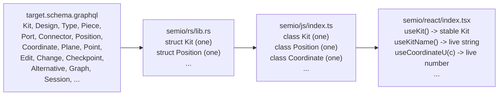
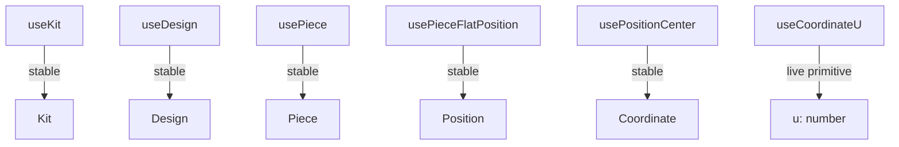

# Single-Source Entity Layers

## Layering contract

`semio/sketchpad` -> `semio/react` -> `semio/js` -> GraphQL -> `semio/rs`

Each entity in [semio/graphql/target.schema.graphql](semio/graphql/target.schema.graphql) appears **exactly once** per layer:

Cardinality rules (user verbatim):

- One class per **weak** entity (`Position`, `Plane`, `Point`, `Vector`, `Coordinate`, `Offset`, `Location`, `Attribute`).
- One class per **strong** entity (only `class Kit`, no `KitDto`/`KitStore`/`KitSnapshot`/`KitBundle`/`KitGraph`/etc.).
- One hook per strong-entity field, plus the entity-ref hook (`useKit`, `useDesign`, ...).
- Non-primitive field hooks return a **stable** instance (never re-renders); primitive field hooks subscribe to live updates.
- Owned strong-entity collection hooks (`useDesigns`, `useTypes`, `usePieces`, `useEdits`, ...) update only when membership (ids) changes, not when individual children change.

## Phase A - Rust unification ([semio/rs/lib.rs](semio/rs/lib.rs))

Goal: one struct per entity in `semio/rs`; live-query subscription emits per-entity, per-field ticks.

- **Weak entity collapse**: today each weak entity has a `Copy DTO` (e.g. `geom::Position` line 615) **and** an Arc graph node (`geom::entity::PositionNode` line 773). Collapse to one `pub struct Position` per weak entity (Arc-bearing, with `RwLock` fields, both `Object` and `InputObject` impl on the canonical type or via a derive macro that emits the input shape). Same for `Vector`, `Point`, `Coordinate`, `Offset`, `Plane`, `Location`, `Attribute`.
- **Bundle / snapshot fold**: remove standalone `KitStoreBundleFile` (line 8170), `GraphSnapshotDto` (line 8183), `AlternativeVersionDto` (line 8218), `KitGraphWorkspace` (line 7486), `DesignHandle` (line 7990). Replace with `impl Kit { pub fn to_bundle_json() }` / `pub fn hydrate_from_bundle_json()` and `impl Graph { ... }` free serde helpers on the canonical structs. The `Mutation.hydrateKitStoreBundleJson` resolver in `gql.rs` calls the canonical method.
- **Subscription per-field invalidation**: in `gql::Subscription` (line 10120-10238) the current implementation re-emits the full subtree on every `EventBus` tick. Replace `bus.subscribe()` with selection-aware filtering by extending `EventBus` with `subscribe_path(path: &[&str])` so a subscription to `wip { theKit { kit { name } } }` only re-emits when the `Event::RenamedKit` (or any kit-name-touching) event fires. Use `async_graphql`'s `ResolverContext::look_ahead()` (or selection set inspection in the subscription resolver) to compute the set of touched fields and gate yields on bus event kinds.
- **Verify** every entity in the schema has exactly one canonical struct in `semio/rs/lib.rs` (rg the schema entity list against `pub struct` declarations).

## Phase B - JS class layer ([semio/js/index.ts](semio/js/index.ts))

Goal: one `export class` per schema entity; thin GraphQL wrapper, no client-side caching, no DTO twins.

- **Drop `*Entity` suffix**: rename `FileEntity` -> `File`, `FolderEntity` -> `Folder`, `LayerEntity` -> `Layer`, `GroupEntity` -> `Group`, `StatEntity` -> `Stat`, `PropEntity` -> `Prop`. The DOM `File` global is namespaced by `import` boundaries (no global pollution because we're an ES module).
- **Promote weak interfaces to classes**: `Position`, `Plane`, `Point`, `Vector`, `Coordinate`, `Offset`, `Location`, `Attribute`, `Side`, `Place`, `Camera`, `Benchmark` are currently `export interface` (lines 2666-2734). Replace with `export class`. Each instance carries its parent path (e.g. `Coordinate(parent: Position, role: "center")`) so the GraphQL selection threads through.
- **Add missing strong entity classes**: `Edit`, `Change`, `Checkpoint`, `Alternative`, `Graph`, `Session`, `Conflict`, `Place`, `Family`, `Benchmark` (most do not exist yet as JS classes; only schema-side).
- **Stable instance cache**: `Kit` already keys child entities by id. Extend this so every parent caches its child instances by id (strong entities) or by role (weak entities), so `kit.design(id)` and `position.center` always return the same JS object reference for the same logical position. This is the JS-side "no update for non-primitives" guarantee that the React layer relies on.
- **Per-field methods**: each class exposes `async read<Field>(): Promise<Primitive>` for primitive fields (re-fetches via `kit.readKitInner` with the threaded path) and a synchronous accessor for non-primitive fields that returns the cached child instance. Drop the legacy `KIT_*_FIELD_SPECS` / `defineFields` / `defineOperations` indirection (lines 426-550) - the canonical class methods are the only API.
- Drop the `@ts-nocheck` at line 6 once classes typecheck.

## Phase C - React hooks ([semio/react/index.tsx](semio/react/index.tsx))

Goal: one ref hook per entity (stable, never updates) + one hook per field per entity.

- **Strong-entity ref hooks** via React context: `useKit`, `useDesign`, `useType`, `usePiece`, `useConnection`, `usePort`, `useConnector`, `useRepresentation`, `useTag`, `useConcept`, `useQuality`, `useAuthor`, `useFile`, `useFolder`, `useLayer`, `useGroup`, `useStat`, `useProp`, `usePlace`, `useFamily`, `useBenchmark`, `useEdit`, `useChange`, `useCheckpoint`, `useAlternative`, `useGraph`, `useSession`, `useConflict`. Each memoizes via `React.useMemo([kit, id])` so the returned instance is stable across renders. Provide one `*Scope`/`*ContextProvider` per entity for nesting.
- **Today's `useKit` returns a wrapper** `{ kit, readPoint, setReadPoint }` (line 363-394). Rewrite: `useKit()` returns the bare `Kit` instance (never updates). Read-point lives on a separate `useReadPoint()`/`useSetReadPoint()` pair.
- **Today's `useType` is duplicated** at line 431 and line 902. Collapse to one definition (the line 902 fuller one).
- **Field hooks**:
  - Primitive (`string`, `number`, `boolean`, `Timestamp`, `Color`, `ID`): `FieldReadState<T>`-shaped hook subscribing to the entity's per-field stream (`useKitName`, `useDesignDescription`, `useCoordinateU`, `useCoordinateV`, `usePointX`, ...). One hook per primitive field listed in the schema.
  - Non-primitive single child: returns the stable child instance (e.g. `usePieceFlatPosition(): Position`, `usePositionCenter(pos): Coordinate`). Implementation just calls the parent class accessor; no React state.
  - Owned strong-entity collection (`useKitDesigns(): readonly Design[]`, `useKitTypes`, `useDesignPieces`, `useDesignConnections`, `useTypePorts`, `useTypeConnectors`, `useCheckpointEdits`, `useEditChanges`, ...): subscribes to the **id list** only; returns stable instances; reference identity changes only when the id-list changes.
- **Weak entity hooks**: take the weak instance as the first argument (`useCoordinateU(c: Coordinate)`, `usePositionCenter(p: Position)`). No `<PositionScope>` context - weak entities are addressed by the path threaded through the JS class instance, which the hook captures via the argument.

## Phase D - Verification

- `cargo check -p semio-rs` (lib.rs builds wasm32 + native).
- `bunx tsc --noEmit` in `semio/js` and `semio/react` (no `@ts-nocheck`).
- Smoke graphql validate the example doc `subscription { wip { alternative(id: $alt) { kit { design(id: $des) { piece(id: $piece) { flatPosition { center { u } } } } } } } }` against the live schema (already exists from prior ticket; re-run).
- Mount one `useCoordinateU` in the sketchpad runtime path; verify console log emits primitive value updates only when `u` changes (`[DEBUG]` prefix).
- Existing test files in [semio/js](semio/js/index.ts), [semio/react](semio/react/index.tsx), and [semio/rs](semio/rs/lib.rs) are extended in place to cover the new shape.

## Delegation

Three independent generalists in parallel after I land the schema-confirmation pass; rendezvous on shared exports:

- **Generalist 1 - Rust** (Phase A): `semio/rs/lib.rs` weak-entity collapse, bundle fold, per-field subscription gating.
- **Generalist 2 - JS** (Phase B): `semio/js/index.ts` weak-as-class, `*Entity`-suffix purge, missing strong classes, instance cache.
- **Generalist 3 - React** (Phase C): `semio/react/index.tsx` rewrite of `useKit`, full per-entity / per-field hook expansion, stable owned-collection rule.

I drive Phase D and the ticket lifecycle (`ticket_open` under goal `r2602/runningsketchpad`, `ticket_close` with the file list).