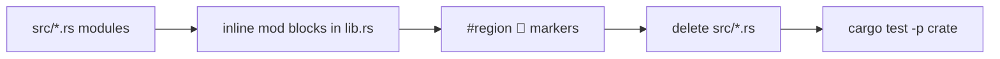

# Exhaustive Single-File Consolidation

## Intent

Fold every consolidatable multi-file unit into one physical source file per package, matching the existing single-file style in `[mathematical/fuzzy/rs/lib.rs](mathematical/fuzzy/rs/lib.rs)`, `[vcs/rs/lib.rs](vcs/rs/lib.rs)`, and `[lowpoly/core/rs/lib.rs](lowpoly/core/rs/lib.rs)`. **No intentional behavior or public-API path changes** — only physical layout + section consistency.

Goal: `🎯aioptimizedrepo🎯singlefilerepo` (open a new ticket; past consolidation tickets are closed).

## In scope (must consolidate)

### Wave A — Rust `#[path = "src/..."]` crates (primary)


| Crate                                                      | Files | ~Lines | Target                                                                |
| ---------------------------------------------------------- | ----- | ------ | --------------------------------------------------------------------- |
| `[mathematical/number/rs](mathematical/number/rs)`         | 8     | 3.4k   | `lib.rs`                                                              |
| `[mathematical/polynomial/rs](mathematical/polynomial/rs)` | 7     | 2.4k   | `lib.rs`                                                              |
| `[mathematical/cas/rs](mathematical/cas/rs)`               | 21    | 6.3k   | `lib.rs`                                                              |
| `[mathematical/entropy/rs](mathematical/entropy/rs)`       | 28    | 10.3k  | `lib.rs`                                                              |
| `[mathematical/wfc/rs](mathematical/wfc/rs)`               | 32    | 8.8k   | `lib.rs`                                                              |
| `[kernel/3d/brep/rs](kernel/3d/brep/rs)`                   | 14    | 7.1k   | `lib.rs` (native modules + existing brepkit wrapper stay in one file) |


Order: **number → polynomial → cas → entropy → wfc → brep** (leaves first; each crate verified before the next).

### Wave B — Small TS logic siblings (secondary)

- `[animate/present/renderer/react/markdown.ts](animate/present/renderer/react/markdown.ts)` → `[index.tsx](animate/present/renderer/react/index.tsx)`
- `[ui/styling/js/theme.ts](ui/styling/js/theme.ts)` → `[index.ts](ui/styling/js/index.ts)`

## Explicit exclusions (not consolidatable / already single-file)

- `build.rs`, `benches/*.rs`, Cargo `[[bin]]` files (e.g. wgpu `bin.rs`)
- Generated artifacts (`ui/styling/rs/generated.rs`, `OUT_DIR` includes, `mathematical/graph/manifest/generated`, wgpu `#[path]` to `program/registry/generated/hosts.rs`)
- Electron/Vite/Forge/Tailwind/PostCSS/Vitest config files
- Worker entry points that bundlers require as separate files (e.g. `kit-store.worker.ts`)
- Doc/MDX trees (`sketchpad/js/page/**`)
- Crates already single-file (`fuzzy`, `vcs`, `lowpoly`, wgpu `lib.rs` ~28k with inline mods)

## Technique (per crate, behavior-preserving)

1. For each `src/foo.rs` currently loaded via `#[path]`, **inline as the same module** inside `lib.rs`:

```rust
// #region 🔖Foo
pub mod foo {
    // exact former file body (adjust only crate-relative paths if needed)
}
// #endregion 🔖Foo
```

1. Preserve visibility (`pub mod` / `pub(crate) mod` / private `mod`) and existing `pub use` reexports so paths like `mathematical_wfc::ids::NodeId` keep working.
2. Prefer MCP `[file_integrate](project-0-semio-repo)` at named region boundaries; put any temp logs/helpers only under the ticket folder.
3. Delete emptied `src/*.rs` (and empty `src/` dirs). Do not leave dual copies.
4. Normalize region markers while touching files: `// #region 🔖Name` / `// #endregion 🔖Name` (emoji + spaced `#region`), matching fuzzy/vcs — **cosmetic only**.
5. Keep module docstrings and item emoji docstrings; do not rewrite algorithms, signatures, or test assertions except where paths/imports must adjust for inlining.
6. **BREP strategy change:** stop the open ticket’s “additive `src/*.rs` forever” layout; all further native kernel work goes into the single `[kernel/3d/brep/rs/lib.rs](kernel/3d/brep/rs/lib.rs)`. Functional Flip plan is unchanged — only file layout.




## Consistency pass (same ticket, still no behavior change)

While consolidating each crate:

- One physical `lib.rs` entry; no leftover dead `#[path]` lines
- Tests remain inline (`#[cfg(test)]` in the same file / inside the same inline mods) — no new test files
- Align obvious marker inconsistencies only in files being edited (no drive-by renames across untouched crates)
- Do not mix technologies; do not change consumer call sites unless a broken import forces a path fix (prefer preserving module paths so consumers need zero edits)

## Verification (mandatory; do not claim green without running)

After **each** crate:

- `cargo test -p <crate_name>` (and wasm check where that crate already has a wasm gate)
- For WFC: existing AC-3/AC-4 and solver tests in-tree
- For BREP: existing native-module + wrapper tests still compile/pass
- After Wave B: existing vitest/nx test targets for those packages
- Final: `cargo test -p mathematical_number -p mathematical_polynomial -p mathematical_cas -p mathematical_entropy -p mathematical_wfc -p kernel_3d_brep` (use actual package names from each `Cargo.toml`)

Ticket folder holds per-crate logs (`wave-a-number-test.txt`, etc.). Close ticket with summary + full touched-path list.

## Out of scope for this ticket

- Feature work on WFC (AC-4 trail integration, watched-support) or BREP Flip
- API redesign, renames that change public paths, dependency swaps
- Whole-repo cosmetic reformatting of already-single-file crates
- Editing `AGENTS.md`

