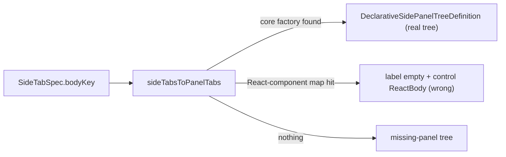

# Single Side Panel Tree Mechanism

## Problem

All side panels are supposed to be trees registered once and rendered centrally. Two registration paths still coexist, and the second one makes a "wrongly styled" panel (e.g. settings) possible:

- Clean/central path — [framework/product/platform/core/index.ts](framework/product/platform/core/index.ts) lines 1813-1841: `registerSidePanelBody(bodyKey, (ctx) => UiTreeNode)` populates the core `sidePanelBodyByKey`, runs `assertSidePanelTreeBody` (must be `type:"tree"` with >=1 section), and is read via `getSidePanelBodyFactory`. Every real app and the settings App tab use this.
- Divergent escape hatch — [framework/product/platform/renderer/react/index.tsx](framework/product/platform/renderer/react/index.tsx):
  - a second `sidePanelBodyByKey = new Map<string, React.ComponentType>()` (line 3991)
  - a second `registerSidePanelBody(bodyKey, Component)` (lines 4016-4019) that accepts arbitrary React with no tree assertion
  - the fallback branch in `sideTabsToPanelTabs` (lines 4169-4185) that wraps such a component as `{ id: "...legacy.body", label: "", control: <ReactBody /> }` — a tree with one empty-label item whose control is free-form React, i.e. the wrongly-styled panel.

Goal: delete the divergent branch so the only legal registration is the declarative tree builder and the only render path is `getSidePanelBodyFactory` -> `DeclarativeSidePanelTreeDefinition` -> `Tree`.

## Changes

### 1. Remove the renderer-level React registry — [framework/product/platform/renderer/react/index.tsx](framework/product/platform/renderer/react/index.tsx)
- Delete the local `const sidePanelBodyByKey = new Map<string, React.ComponentType<unknown>>()` (line 3991) and the local `registerSidePanelBody` (lines 4016-4019).
- Re-export the single clean symbol from core instead, alongside the existing `getSidePanelBodyFactory` import (line 70): add `registerSidePanelBody` (and `unregisterSidePanelBody`) to the `@semio-tech/framework-platform-core` import + re-export, so importing `registerSidePanelBody` from the renderer package yields the declarative, tree-asserting function.

### 2. Collapse `sideTabsToPanelTabs` to one path — same file, lines 4156-4194
- Drop the `const ReactBody = sidePanelBodyByKey.get(tab.bodyKey)` fallback block (lines 4169-4185).
- Keep: declarative factory found -> `DeclarativeSidePanelTreeDefinition`; otherwise the existing missing-panel tree (`Missing panel ${tab.bodyKey}`). This is the single central converter; the playground renderer already delegates to it via `sideTabsToPlaygroundPanelTabs` ([framework/product/playground/renderer/react/index.tsx](framework/product/playground/renderer/react/index.tsx) line 976).

### 3. Fix the renderer's own tests that used the React path — same file
- Update the in-file vitest registrations that pass React components to declarative tree builders:
  - lines 5265-5266: `registerSidePanelBody("test.platform.panel.workbench", () => 
)` etc.
  - lines 5568-5569: same pattern.
- Replace each with `(ctx) => ({ type: "tree", sections: [{ id: "...", items: [{ id: "...", label: "..." }] }] })` so they exercise the central mechanism. Assert the rendered panel is a real tree (tab strip + tree rows), not a raw mounted component.

### 4. Confirm settings stays a clean tree (verification, no behavior change expected)
- The settings App tab already merges product settings via core `getSidePanelBodyFactory` + `uiTreeNodeToTreePanelConfig` ([framework/product/platform/renderer/react/index.tsx](framework/product/platform/renderer/react/index.tsx) lines 1703-1739) and falls back to the framework base tree if the product body is missing or not `type:"tree"`. After step 1-2 there is no other way to inject settings content, so a wrongly-styled settings panel becomes impossible.

## Tests + verification
- Extend existing in-file vitest blocks only (no new files): assert `registerSidePanelBody` rejects a non-tree body (throws via `assertSidePanelTreeBody`), and that `sideTabsToPanelTabs` produces either a declarative tree definition or the missing-panel tree (never a free-form control body).
- Run the framework platform renderer + playground renderer test suites via existing nx targets.
- Runtime check via existing `launch.json` entries (puzzle 2d/3d, presentation): open left/right panels and the settings panel; confirm every tab shows the tab strip and renders real tree rows. Confirm with console logs per repo rules before closing.

## Repo process
- Per repo rules: read `repo://goals`, then reopen the closely-related ticket `26/06/29/ENFORCE-PANEL-TAB-TREE-SECTION` style work or open a new ticket if none matches; keep temp artifacts in the ticket folder; structure edits with existing `#region`s; extend existing tests; close the ticket with a summary of touched files.

## Notes / defaults
- Clean break (greenfield): the React-component side-panel registration is deleted outright, no compatibility shim. Grep confirms only the renderer's own tests used it; all apps use the core declarative `registerSidePanelBody`.
- No `ui/react` primitive changes needed — `SidePanelTabConfig.tree` is already required and the tab strip already always renders.