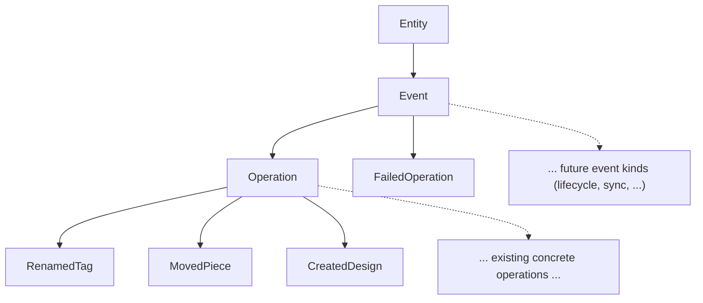

# Single Subscription Endpoint

## Why

With the async command/operation architecture in place, dynamic per-event subscription fields add no expressive power: a single feed plus inline fragments is strictly more flexible than dozens of named fields. The flat block at L5979-6097 of [compose/graphql/target.schema.graphql](compose/graphql/target.schema.graphql) is replaced wholesale.

`Event` is introduced as a **top-level general-purpose** interface — not "the parent of operations". It captures any happening on the system feed: applied operations, failed operations, session/draft/transaction lifecycle ticks, sync notifications, and any future event kind. `Operation` becomes one family of `Event` (the kind that produces a `Modification`); `FailedOperation` is a sibling family (no modification, just a message). New event kinds can be added later by implementing `Event` directly without going through `Operation`.

Events do **not** have a single `scope: Entity!`. A general event commonly involves multiple entities (e.g. an `AddedConnector` involves the connector itself plus the two pieces and the design; a `MovedPieces` involves N pieces plus the design). The `scope: Entity!` field on `Operation` and on every concrete `Renamed*` / `Created*` / `Moved*` / etc. type is **renamed and pluralized** to `involved: [Entity!]!` and lifted onto `Event`.

`FailedOperation` cannot implement `Operation` because `Operation`'s `modification: Modification!` (with required `before`/`after`) does not exist for a failure — so the split into a generic `Event` parent is the natural shape.

## Type Document (after change)



`Event` carries only the fields common to every emission: `id`, `hash`, `owner`, `owns`, `involved: [Entity!]!`. `Operation` adds `modification: Modification!`. `FailedOperation` adds `message: String!`. Anything operation-specific lives on `Operation`, never on `Event`.

## Schema Changes — [compose/graphql/target.schema.graphql](compose/graphql/target.schema.graphql)

### 1. Add top-level `interface Event` next to `interface Operation` (around L956)

`Event` is deliberately generic — no operation-specific fields. It is the abstract parent of every happening on the system feed. `involved` is plural because a single event commonly touches multiple entities.

```graphql
interface Event implements Entity {
 id: ID! # data // uuidv7
 hash: String! # cached
 owner: Entity # reference // any owning entity (Change for an Operation, Session/Draft/Transaction for a lifecycle event, ...)
 owns: EntityConnection # reference
 involved: [Entity!]! # reference // all entities this event touches
}

type EventEdge implements EntityEdge {
 cursor: String! # computed
 node: Event! # reference
}

type EventConnection implements EntityConnection {
 edges: [EventEdge!]! # computed
 pageInfo: PageInfo! # computed
 hash: String! # cached
}
```

### 2. Re-base `interface Operation` to implement `Event` (replace L956-964)

`scope` is dropped (replaced by `Event.involved`); `Operation` only adds `modification`.

```graphql
interface Operation implements Event & Entity {
 # Entity
 id: ID! # data // uuidv7
 hash: String! # cached
 owner: Entity # reference // Change
 owns: EntityConnection # reference
 # Event
 involved: [Entity!]! # reference
 # Operation
 modification: Modification! # computed
}
```

### 3. Bulk rewrite all 95 concrete operation types: `scope: Entity!` → `involved: [Entity!]!`

Every `Renamed*` / `Created*` / `Updated*` / `Added*` / `Removed*` / `Moved*` / `Dragged*` / `Fixed*` / `Changed*` / `Deleted*` / `Flattened*` operation type currently has a line like:

```graphql
  scope: Entity! # reference // Tag | Attribute
```

These must all become:

```graphql
  involved: [Entity!]! # reference // Tag | Attribute
```

Trailing `# reference // …` comment listing the involved entity kinds is preserved verbatim (the comment now correctly describes plural members). The transform is a deterministic line-by-line regex `^(\s*)scope: Entity! # reference (//.*)?$` → `$1involved: [Entity!]! # reference $2`. Implemented as a small CommonJS script in the ticket folder (`.repo/🎫️/26/05/10/GRAPHQL-TARGET-MUTATION-CLEANUP/scope_to_involved.cjs`) following the same pattern as the existing `unionize.cjs` / `strip_specific_owner_fields.cjs`.

Affected count: 96 lines total (1 on `interface Operation` already replaced in step 2 + 95 concrete operation types). All 96 should end up reading `involved: [Entity!]!`.

### 4. Add `FailedOperation` (+ edge/connection) implementing `Event` only — in `#region SubscriptionPayloads` (L5764-5774)

```graphql
type FailedOperation implements Event & Entity {
 # Entity
 id: ID! # data // uuidv7
 hash: String! # cached
 owner: Entity # reference // Change
 owns: EntityConnection # reference
 # Event
 involved: [Entity!]! # reference
 # FailedOperation
 message: String! # data // failure reason
}

type FailedOperationEdge implements EntityEdge {
 cursor: String! # computed
 node: FailedOperation! # reference
}

type FailedOperationConnection implements EntityConnection {
 edges: [FailedOperationEdge!]! # computed
 pageInfo: PageInfo! # computed
 hash: String! # cached
}
```

### 5. Replace the entire `type Subscription` block (L5979-6097)

```graphql
type Subscription {
 # 📡️ Single async feed of every event on the system — applied operations, failed operations, and any future lifecycle/sync events.
 # Clients discriminate concrete events (RenamedTag, MovedPiece, FailedOperation, ...) via inline fragments.
 event: Event!
}
```

No other fields. No `commandSucceeded`, `operationSucceeded`, `operationFailed`, `error`, or per-entity event fields.

### 6. Retire orphaned payload types

`Command` (L5766-5768) and `Error` (L5770-5772) only fed the deleted Subscription fields. Delete both, and rename `#region SubscriptionPayloads` → `#region EventPayloads` so only `FailedOperation` (and any future event-only payload) lives there.

## Out of Scope

- The four missing concrete operation types (`StartedSession`, `EndedSession`, `RenamedDesign`, `UpdatedDesignDescription`) noted in earlier work — separate cleanup.
- Resolver / backend wiring. Schema-only change.

## Verification

- `node -e "require('graphql').parse(require('fs').readFileSync('compose/graphql/target.schema.graphql','utf8'))"` → parse OK
- `node -e "require('graphql').buildSchema(require('fs').readFileSync('compose/graphql/target.schema.graphql','utf8'))"` → build OK
- `rg -n "commandSucceeded|operationSucceeded|operationFailed|^\s*error: Error" compose/graphql/target.schema.graphql` → no matches
- `rg -n "^\s*(renamedKit|createdTag|addedConnector|movedPiece|deletedDesign)" compose/graphql/target.schema.graphql` → no Subscription field matches
- `rg -n "^type (Command|Error) " compose/graphql/target.schema.graphql` → no matches
- `rg -n "interface Event\b|type Event(Edge|Connection)\b|FailedOperation" compose/graphql/target.schema.graphql` → new definitions only
- `rg -n "implements Event" compose/graphql/target.schema.graphql` → at least `Operation` and `FailedOperation`
- `rg -nc "^\s*scope: Entity!" compose/graphql/target.schema.graphql` → 0 matches
- `rg -nc "^\s*involved: \[Entity!\]!" compose/graphql/target.schema.graphql` → 97 matches (1 Event + 1 Operation + 95 concrete operations + 1 FailedOperation = 98; allow ±1 if `Operation` interface omits the redundant redeclaration). Acceptable: between 96 and 98.

## Ticket Update

Append to `.repo/🎫️/26/05/10/GRAPHQL-TARGET-MUTATION-CLEANUP/ticket.md`:

- Problem: flat per-event Subscription duplicates the Operation interface; `FailedOperation` cannot implement `Operation` (no `modification`/`after`); events are a general concept, not just operations; a single event commonly involves multiple entities so `scope: Entity!` is the wrong shape.
- Change: introduce top-level general-purpose `Event` interface (+ edge/connection) with `involved: [Entity!]!`; rewrite all 96 `scope: Entity!` lines (Operation interface + 95 concrete operations) to `involved: [Entity!]!` via `scope_to_involved.cjs`; `Operation` becomes one specialization of `Event`; add `FailedOperation` as a sibling specialization; collapse Subscription to a single `event: Event!`; remove orphaned `Command` / `Error`.
- Verification: parse + build commands above, plus the rg sweeps (zero `scope: Entity!`, ~97 `involved: [Entity!]!`).
