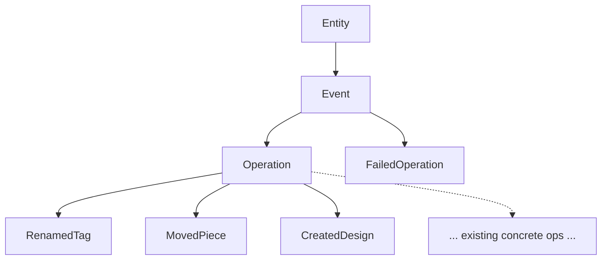

# Single Subscription Endpoint

## Why

With the async command/operation architecture in place, dynamic per-event subscription fields add no expressive power: a single feed plus inline fragments is strictly more flexible than dozens of named fields. `FailedOperation` cannot implement `Operation` because `Operation`'s `modification: Modification!` (with required `before`/`after`) does not exist for a failure. So both successes and failures sit under a new root-level `Event` interface, and `Subscription` emits that. The flat block at L5979-6097 of [semio/graphql/target.schema.graphql](semio/graphql/target.schema.graphql) is replaced wholesale.

## Type Hierarchy (after change)



`Event` carries the fields common to every emission: `id`, `hash`, `owner`, `owns`, `scope`. `Operation` adds `modification: Modification!`. `FailedOperation` adds `message: String!`.

## Schema Changes — [semio/graphql/target.schema.graphql](semio/graphql/target.schema.graphql)

### 1. Add `interface Event` next to `interface Operation` (around L956)

```graphql
interface Event implements Entity {
  id: ID! # data // uuidv7
  hash: String! # cached
  owner: Entity # reference // Change
  owns: EntityConnection # reference
  scope: Entity! # reference // Entity | Quality | Attribute | Tag | Concept | Port | Type | Connector | Design | Piece | Connection | Kit
}

type EventEdge implements EntityEdge {
  cursor: String! # computed
  node: Event! # reference
}

type EventConnection implements EntityConnection {
  edges: [EventEdge!]! # computed
  pageInfo: PageInfo! # computed
  hash: String! # cached
}
```

### 2. Re-base `interface Operation` to implement `Event` (replace L956-964)

`scope` moves up to `Event`; `Operation` only adds `modification`. All concrete `Renamed*` / `Created*` / `Moved*` / etc. types already redeclare both `scope` and `modification` inline, so they remain structurally unchanged — they just transitively gain `Event` membership.

```graphql
interface Operation implements Event & Entity {
  # Entity
  id: ID! # data // uuidv7
  hash: String! # cached
  owner: Entity # reference // Change
  owns: EntityConnection # reference
  # Event
  scope: Entity! # reference
  # Operation
  modification: Modification! # computed
}
```

### 3. Add `FailedOperation` (+ edge/connection) implementing `Event` only — in `#region SubscriptionPayloads` (L5764-5774)

```graphql
type FailedOperation implements Event & Entity {
  # Entity
  id: ID! # data // uuidv7
  hash: String! # cached
  owner: Entity # reference // Change
  owns: EntityConnection # reference
  # Event
  scope: Entity! # reference
  # FailedOperation
  message: String! # data // failure reason
}

type FailedOperationEdge implements EntityEdge {
  cursor: String! # computed
  node: FailedOperation! # reference
}

type FailedOperationConnection implements EntityConnection {
  edges: [FailedOperationEdge!]! # computed
  pageInfo: PageInfo! # computed
  hash: String! # cached
}
```

### 4. Replace the entire `type Subscription` block (L5979-6097)

```graphql
type Subscription {
  # 📡 Single async feed of every event (successes + failures).
  # Clients discriminate concrete events (RenamedTag, MovedPiece, FailedOperation, ...) via inline fragments.
  event: Event!
}
```

No other fields. No `commandSucceeded`, `operationSucceeded`, `operationFailed`, `error`, or per-entity event fields.

### 5. Retire orphaned payload types

`Command` (L5766-5768) and `Error` (L5770-5772) only fed the deleted Subscription fields. Delete both, and rename `#region SubscriptionPayloads` → `#region EventPayloads` so only `FailedOperation` (and any future event-only payload) lives there.

## Out of Scope

- The four missing concrete operation types (`StartedSession`, `EndedSession`, `RenamedDesign`, `UpdatedDesignDescription`) noted in earlier work — separate cleanup.
- Resolver / backend wiring. Schema-only change.

## Verification

- `node -e "require('graphql').parse(require('fs').readFileSync('semio/graphql/target.schema.graphql','utf8'))"` → parse OK
- `node -e "require('graphql').buildSchema(require('fs').readFileSync('semio/graphql/target.schema.graphql','utf8'))"` → build OK
- `rg -n "commandSucceeded|operationSucceeded|operationFailed|^\s*error: Error" semio/graphql/target.schema.graphql` → no matches
- `rg -n "^\s*(renamedKit|createdTag|addedConnector|movedPiece|deletedDesign)" semio/graphql/target.schema.graphql` → no Subscription field matches
- `rg -n "^type (Command|Error) " semio/graphql/target.schema.graphql` → no matches
- `rg -n "interface Event\b|type Event(Edge|Connection)\b|FailedOperation" semio/graphql/target.schema.graphql` → new definitions only
- `rg -n "implements Event" semio/graphql/target.schema.graphql` → at least `Operation` and `FailedOperation`

## Ticket Update

Append to `.repo/🎫/26/05/10/GRAPHQL-TARGET-MUTATION-CLEANUP/ticket.md`:

- Problem: flat per-event Subscription duplicates the Operation interface; `FailedOperation` cannot implement `Operation` (no `modification`/`after`).
- Change: introduce root `Event` interface (+ edge/connection); `Operation` implements `Event`; add `FailedOperation` implementing `Event` only; collapse Subscription to `event: Event!`; remove orphaned `Command` / `Error`.
- Verification: parse + build commands above, plus the rg sweeps.

