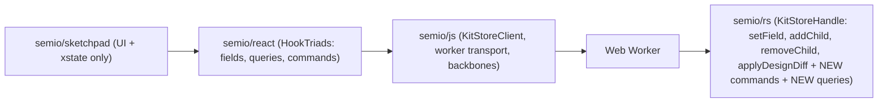

## 1. Target pipeline



After this ticket: every kit read, derived read, and mutation goes to Rust. `semio/js` is pure transport + DTOs + backbones. `semio/sketchpad` owns zero kit hooks.

## 2. Phase A: Rust RPC surface ([semio/rs/src/lib.rs](semio/rs/src/lib.rs))

### 2.1 New command RPCs on `KitStoreHandle` (~line 11905 `impl KitStoreHandle`)

Each returns `js_sys::Promise` settled with `js_settle_set` (SetResult shape). Each is implemented on the existing internal `KitStoreRef` using already-present `KitStore`/`DesignStore` methods or new methods added in the `kit` module.

- `clusterPieces(design_guid, piece_guids: Vec<String>, cluster_name: String)` -> builds clustered child design + external connections (port of [semio/js/index.ts](semio/js/index.ts) line 7667 `createClusteredDesign` + 7708 `replaceClusterWithDesign`) and applies as one `DesignDiff`.
- `expandDesign(design_guid, piece_guid)` -> replaces a design-piece with its referenced design contents (port of line 7813 `expandDesignPieces` restricted to one target piece).
- `flattenDesign(design_guid)` -> already present (`flatten_design_async` line 11624); add RPC alias `flattenDesign` on the handle for naming parity.
- `dragPieces(design_guid, piece_guids, offset_u, offset_v)` -> port of line 8209 `dragPiecesInDesign`.
- `movePieces(design_guid, piece_guids, target_plane)` -> port of the `movePiecesInDesign` sibling in [semio/js/index.ts](semio/js/index.ts).
- `fixPieces(design_guid, piece_guids)` -> port of `fixPiecesInDesign`.
- `pasteDesignSelection(design_guid, selection_json, target_plane)` -> port of the paste helper used by `commands.pasteDesignSelection`.
- `createHangingPieces(design_guid, type_guids, plane)` -> creates detached pieces at a plane.
- `createConnectedPiece(design_guid, parent_piece_guid, parent_port_guid, child_type_guid, child_port_guid)` -> single new piece + connection.
- `createFixedPiece(design_guid, type_guid, plane)` -> new fixed piece.
- `changePieceType(design_guid, piece_guid, new_type_guid)` -> swap type, recompute connections.
- `deletePiece(design_guid, piece_guid)` / `deleteConnection(design_guid, connection_guid)` -> convenience wrappers over `remove_child`.

All command bodies live in a new `kit::commands` module; `KitStoreHandle` just parses args + dispatches. Reuse `DesignChange`/`DesignDiff` primitives at line 3758 and `apply_design_diff_rpc` (line 6679).

### 2.2 New query RPCs on `KitStoreHandle`

Each returns `js_sys::Promise<serde_wasm_bindgen value>` of the result DTO. No mutation.

- `getPiecesMetadata(design_guid)` -> Map<guid, PiecePlacementMetadata>. Port of [semio/js/index.ts](semio/js/index.ts) line 11271 `piecesMetadataFor`.
- `getPieceMetadata(design_guid, piece_guid)`
- `getFlatPiecePlane(design_guid, piece_guid)` / `getFlatPieceCenter(design_guid, piece_guid)`
- `isConnectedPiece(design_guid, piece_guid)` / `getPieceDepth(design_guid, piece_guid)`
- `getFixedPieceId(design_guid, piece_guid)` / `getParentPieceId(design_guid, piece_guid)`
- `getPieceParentConnection(design_guid, piece_guid)`
- `getIncludedDesigns(design_guid)` -> list of child designs included in a design (for expand).
- `getReplacableTypes(kit_guid, piece_guids, selected_variants)` -> port of line 8265 `findReplaceableTypesInDesignsForPiecesInDesign`.
- `getReplacableDesigns(kit_guid, piece)` -> analogous.
- `getExplodeableDesignNodes(kit_guid, design_guid)` -> port of sketchpad's current logic at [semio/sketchpad/index.tsx](semio/sketchpad/index.tsx) line 7845.
- `getPieces(design_guid)` / `getConnections(design_guid)` / `getTypes(kit_guid)` / `getDesigns(kit_guid)` / `getAuthors(kit_guid)` / `getKit(guid)` -> collection queries so React can expose list hooks without full snapshot.

### 2.3 Rust internals

- Add `kit::queries` module with pure functions on `&KitStore` guard; RPC wrappers acquire read lock then call them.
- Add `kit::commands` module building `DesignDiff` values from inputs, then delegating to existing `apply_design_diff_rpc`.
- Extend `SetError` variants for domain errors (`ClusterEmpty`, `PieceNotDraggable`, `TypeIncompatible`, etc.); encode as strings on the JS side.
- Add cargo tests colocated in `#[cfg(test)] mod tests` in [semio/rs/src/lib.rs](semio/rs/src/lib.rs) for each new command and query (mirror the existing `io_json` / `flatten_map_empty_design` style).

## 3. Phase B: Worker transport ([semio/js/index.ts](semio/js/index.ts))

### 3.1 Extend `KitStoreApi` + `KitStoreClient`

Current `KitStoreClient` (line 20055 area) has `setField`, `addChild`, `removeChild`, `applyDesignDiff`. Add one method per new Rust RPC (commands + queries), each:

```ts
async clusterPieces(designGuid: string, pieceGuids: string[], clusterName: string): Promise<SetResult> {
  const raw = await withTimeout(this.api.clusterPieces(designGuid, pieceGuids, clusterName), this.timeoutMs, "timeout");
  return normalizeSet(raw);
}
async getPiecesMetadata(designGuid: string): Promise<OperationResult<Map<string, PiecePlacementMetadata>>> { ... }
```

Worker entry ([semio/js/worker.ts](semio/js/worker.ts)) proxies each call to the `KitStoreHandle` method over Comlink.

### 3.2 Delete JS domain helpers

Remove from [semio/js/index.ts](semio/js/index.ts): `createClusteredDesign` (7667), `replaceClusterWithDesign` (7708), `expandDesignPieces` (7813), `dragPiecesInDesign` (8209), `movePiecesInDesign`, `fixPiecesInDesign`, `findReplaceableTypesInDesignsForPiecesInDesign` (8265), `piecesMetadata` / `piecesMetadataCached` (20328/20334), `KitImpl.piecesMetadataFor` (11271), `applyDesignDiffCore` (12778). Keep only thin DTO types and transport.

Update existing `semio/js` tests that call these helpers: either delete the test if it was testing pure helper behavior (now covered by Rust tests), or rewrite to drive the helper via `KitStoreClient`.

## 4. Phase C: React surface ([semio/react/index.tsx](semio/react/index.tsx))

### 4.1 Derived query hooks (HookTriad-shaped, read-only)

One hook per query RPC above, each resolving with a `SchemaHookTriad<T>` where status carries loading/error and set is a no-op (readonly):

- `usePiecesMetadataMap(designGuid?)`, `usePieceMetadata(designGuid?, pieceGuid?)`
- `useFlatPiecePlane`, `useFlatPieceCenter`, `useIsConnectedPiece`, `usePieceDepth`, `useFixedPieceId`, `useParentPieceId`, `usePieceParentConnection`
- `useIncludedDesigns(designGuid?)`, `useReplacableTypes(pieceGuids, selectedVariants?)`, `useReplacableDesigns(piece)`, `useExplodeableDesignNodes(designGuid)`
- Collection hooks: `usePieces(designGuid?)`, `useConnections(designGuid?)`, `useTypes(kitGuid?)`, `useDesigns(kitGuid?)`, `useAuthors(kitGuid?)`, `useKitQualities`, `useKitFiles`, `useKitFolders`, `useKitTags`, `useKitConcepts`, `useKitPorts` (see `useKitXxx` already in [semio/sketchpad/index.tsx](semio/sketchpad/index.tsx) line 8022-8247).

Each subscribes to the relevant `SchemaPropertyEvent` stream so updates from other hooks invalidate the cached result; use the existing event-bus path already wired in `useSchemaFieldState`.

### 4.2 Command hooks

One hook per Rust command RPC. Shape: `() => { run: (...args) => Promise<SetResult>; status: WriteStatus }`.

- `useClusterPieces`, `useExpandDesign`, `useFlattenDesign`, `useDragPieces`, `useMovePieces`, `useFixPieces`, `usePasteDesignSelection`, `useCreateHangingPieces`, `useCreateConnectedPiece`, `useCreateFixedPiece`, `useChangePieceType`, `useDeletePiece`, `useDeleteConnection`, `useCreatePiece`, `useAddConnection`, `useUpdatePiece` (wraps `setField` batch), `useUpdatePieces` (batch `applyDesignDiff`), `useUpdateConnection`, `useUpdateConnections`.

All push rejections via `runtime.pushSetRejection` so `useSetErrors` surfaces them.

### 4.3 Test extensions

Extend the embedded vitest region in [semio/react/index.tsx](semio/react/index.tsx) with a worker stub that implements the new RPCs and asserts: command hook rollback on error, query hook invalidation on field event, `useOptimistic` + `useWriteIndicator` work against a command hook.

## 5. Phase D: Sketchpad strip ([semio/sketchpad/index.tsx](semio/sketchpad/index.tsx))

### 5.1 Delete kit-state code

Delete these regions:

- `#region 🎙️Granular Hook Types` (~2335-2471) -> `HookResult`, `readonlyHookResult`, `writableHookResult`, `conditionalHookResult`, `Field`, `createField`, `fieldToHookResult`. Replace every consumer with `HookTriad`.
- `#region 🥈Entity Hooks` / `⏰Entity Data Hooks` / `🎆Piece Derived Hooks` / `🎹Design Derived Hooks` / `⏱️Kit` / `💧Targeted Kit Hooks` (~7646-8319). Every local hook goes away.
- `#region 💧useKitCommands` / `useDesignAppCommands` kit-mutation half (~8319, ~31718-31820). UI-only command methods (selection, hover, panels) stay but move into xstate events (phase E).
- `#region 🌉Sync` (~19992-20420) and all Yjs-backed `useSyncXxx` helpers.
- `KitScopeProvider` / `KitScopeContext` (~9558-9584).
- `SessionKitStore` / `InMemoryKitStore` / `SketchpadStore` kit paths (~20564+). Backbone factories already moved to `@semio/js`.
- Design-inspector field hooks (`usePieceCenterU/V`, `usePieceScale`, `usePieceIsHidden`, `usePieceIsLocked`, `usePieceColor`, `usePieceDescription`, `usePieceName`, connection analogues ~19154-19587, ~17593-17901).

### 5.2 Rewire call sites

~220 `commands.*` call sites and ~41 local `use*` definitions:

- `commands.updatePiece(...)` -> `const { run } = useUpdatePiece();` / `await run(guid, patch)` or, at input sites, `useOptimistic(usePieceName(guid))` pattern.
- `commands.updateConnection(...)` -> `useUpdateConnection`.
- `commands.clusterPieces(ids)` -> `useClusterPieces`.
- `commands.expandDesign(guid)` -> `useExpandDesign`. (Analogous for every command.)
- `canSet: boolean` -> `status.kind !== "readonly"` everywhere; purely UI `canSet` (xstate-gated) renamed via `useSketchpadActor`+`useSelector`.
- Every `usePiece`/`useConnection`/`useType`/`useDesign`/`useKit*`/`usePieces`/`useConnections`/etc. import from `@semio/react` instead of being declared locally.

### 5.3 Remove transaction / undo from sketchpad

`useKitTransaction` (8300) and any `UndoableKitStore` references deleted (per plan section 7: out-of-scope, follow-up ticket).

## 6. Phase E: UI-state consolidation

- Migrate remaining Yjs-backed UI slices (tutorial, panels, DnD, focus, origin, footer, side-panel) into `sketchpadMachine` context. `SketchpadInteractionBridge`, `OriginProvider`, `FocusProvider`, `PanelSectionProvider`, `SidePanelTabProvider`, `FooterItemProvider`, `DragDropProvider` (~27214-27245) become thin `useSelector` read-throughs.
- `TutorialStore` class -> xstate child actor invoked from `sketchpadMachine`.
- Replace `store.execute("semio.designApp.*", ...)` with `actor.send({ type: ... })`.
- Non-blocking I/O (kit load/save, archive import/export, tutorial recording) -> `fromPromise` actors producing `SetResult`-shaped outcomes in `ctx.background[jobId]`.

## 7. Phase F: Provider tree

Rewrite root (~27177-27258):

```tsx
<SketchpadActorProvider>
 <KitRegistryProvider>
  <SketchpadScopeProvider>
   <RouterShell>
    <Route
     path="/kits/:kitGuid/*"
     element={
      <KitProvider kitGuid={activeKitGuid} fallback={<KitLoading />}>
       <KitRoutes />
      </KitProvider>
     }
    />
   </RouterShell>
  </SketchpadScopeProvider>
 </KitRegistryProvider>
</SketchpadActorProvider>
```

Machine emits `KIT.OPEN`/`KIT.CLOSE` events -> service actor -> `registry.open(guid, backbone)` / `registry.close(guid)`.

## 8. Phase G: Tests

- Cargo unit tests per new command + query RPC in [semio/rs/src/lib.rs](semio/rs/src/lib.rs) `#[cfg(test)]`.
- Vitest in [semio/js/index.ts](semio/js/index.ts) for `KitStoreClient` against a mock worker for new RPC methods.
- Embedded vitest in [semio/react/index.tsx](semio/react/index.tsx) for new command/query hooks + invalidation + `useOptimistic` rollback.
- Playwright in [semio/sketchpad/index.tsx](semio/sketchpad/index.tsx) for pending/error/readonly affordances and concurrent writes on a piece-name input.

No new test files (repo rule).

## 9. Phase H: Verify

- `cargo test` in [semio/rs](semio/rs).
- `pnpm -F @semio/js test`, `pnpm -F @semio/react test`, `pnpm -F @semio/sketchpad test`.
- Desktop smoke: launch [semio/desktop](semio/desktop), open metabolism kit, exercise cluster/expand/drag/paste.

## 10. Out of scope

- Undo/redo (`UndoableKitStore`) -> follow-up ticket.
- CRDT/multiplayer sync -> follow-up ticket (`RemoteKitStoreClient` behind `KitStoreClient`).
- GraphQL/OpenAPI/Python/Ruby bundles.
- Non-sketchpad UIs (gh, sites) not audited.

## 11. Risk / size

This is a multi-week change (Rust: ~12 new commands + ~15 new queries with tests; JS: transport wiring + helper deletion; React: ~27 new hooks; sketchpad: ~220 call-site migrations + ~41 hook deletions + HookResult->HookTriad conversion). The only non-scoped deferrals are undo/redo and multiplayer. Build will be broken during the refactor; land phase by phase on a single feature branch, keeping main green via cargo/vitest gates in CI per phase.
