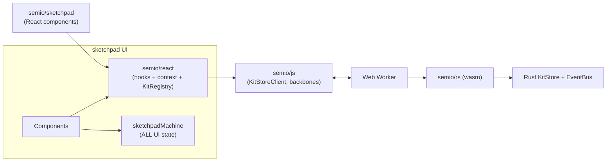

# Sketchpad kit-state removal & UI-state consolidation

## 1. Target architecture



Sketchpad becomes a pure consumer: all kit reads/writes go through `@semio/react`; all UI state (navigation, theme, panels, selection, hover, tools, tutorial, per-app slices) lives in a single XState machine.

## 2. Dependency flip (prerequisite)

`@semio/react` currently depends on `@semio/sketchpad` (circular) and dynamically imports it for `createSessionKitStore` (see [semio/react/index.tsx](semio/react/index.tsx) line 710, 12178).

- Move backbone factories (`createSessionKitStore`, `createFolderKitStore`, file/folder adapters currently under `SketchpadStore` in [semio/sketchpad/index.tsx](semio/sketchpad/index.tsx) ~20564+) into `@semio/js` as first-class exports.
- Delete `@semio/sketchpad` from [semio/react/package.json](semio/react/package.json) dependencies; rewrite the two dynamic imports to call `@semio/js` directly.
- Add `@semio/react` to [semio/sketchpad/package.json](semio/sketchpad/package.json) dependencies; remove `yjs` and `sql.js` (sql.js only if no remaining consumer).

## 3. `@semio/react` extensions

Single file to edit: [semio/react/index.tsx](semio/react/index.tsx).

### 3.1 `KitRegistry` (multi-kit, chosen option)

```ts
type KitRegistryEntry = {
 client: KitStoreClient;
 store: KitStore;
 refs: number;
};
type KitRegistryValue = {
 open(guid: string, init: { initialKit?: KitLike; backbone?: KitProviderBackbone }): Promise<void>;
 close(guid: string): void;
 list(): string[];
 get(guid: string): KitStoreClient | undefined;
 status(guid: string): "idle" | "loading" | "ready" | "error";
};
export const KitRegistryContext: React.Context<KitRegistryValue | null>;
export function KitRegistryProvider({ children }): JSX.Element;
export function useKitRegistry(): KitRegistryValue;
```

Extend `KitProvider` to accept a `kitGuid?: string` prop: when present and a `KitRegistryProvider` is above, `KitProvider` selects the registry entry instead of creating its own client. Existing standalone usage (no registry) keeps working.

### 3.2 Missing utility hooks

Add (promised in [.cursor/plans/rust_worker_hook_pipeline_52b2f61e.plan.md](.cursor/plans/rust_worker_hook_pipeline_52b2f61e.plan.md) but not present today):

- `useSetErrors(filter?) -> SetError[]` -- last-N rejected writes for the scoped entity.
- `useWriteQueue() -> { pending: number; byEntity: Record<string, number> }` -- aggregated pending counters.
- `useKitSync() -> { status: "idle" | "loading" | "saving" | "error"; lastError?: SetError }` -- persistence status.

### 3.3 Async-aware UI helpers (new, thin)

```ts
export function useOptimistic<T>(triad: HookTriad<T>): {
 display: T; // draft if dirty, else server value
 draft: T;
 setDraft: (next: T | ((prev: T) => T)) => void;
 commit: () => Promise<SetResult>;
 reset: () => void;
 status: WriteStatus;
 dirty: boolean;
};

export function useWriteIndicator(status: WriteStatus): {
 disabled: boolean;
 spinning: boolean;
 error?: SetError;
 warning?: SetError;
};
```

All form-like sites in sketchpad use `useOptimistic` so failed writes surface errors without losing user input, and `useWriteIndicator` standardizes spinner/disable/warning/error affordances. Everything non-blocking.

## 4. `@semio/sketchpad` removals

All in one file: [semio/sketchpad/index.tsx](semio/sketchpad/index.tsx).

### 4.1 Kit-state deletions

- `#region 🎙️Granular Hook Types` (~2335-2471): delete `HookResult`, `readonlyHookResult`, `writableHookResult`, `conditionalHookResult`, `Field`, `createField`, `fieldToHookResult`. Replace downstream usages with `HookTriad` from `@semio/react`.
- `#region 🥈Entity Hooks`, `⏰Entity Data Hooks`, `🎆Piece Derived Hooks`, `🎹Design Derived Hooks`, `⏱️Kit`, `💧Targeted Kit Hooks` (~9237-10050): delete every local `useKitSnapshot`, `useAuthor`, `useType`, `useQuality`, `useDesign`, `usePiece`, `useConnection`, `usePieces`, `useConnections`, `usePiece*`, `useKitName`, `useKitDescription`, ... -> re-export equivalents from `@semio/react`.
- Design-inspector field hooks (~19154-19587): `usePieceCenterU/V`, `usePieceScale`, `usePieceIsHidden`, `usePieceIsLocked`, `usePieceColor`, `usePieceDescription`, `usePieceName`, connection hooks -> replace with `@semio/react` hooks; callers use `useOptimistic` at input sites.
- `#region 💧useDesignAppCommands` (~31718-31820): delete `updatePiece`, `updatePieces`, `updateConnection`, `updateConnections` kit-mutation methods. Kit mutations happen inline at call sites via the hook triad.
- `SketchpadStore` kit paths (~20564+): remove `SessionKitStore`, `InMemoryKitStore` usage, file/folder factories, `createSessionKitStore`, `kit(kitGuid)` accessors, `kitStore` prop on `SketchpadScopeProvider`, `KitScopeProvider` / `KitScopeContext` (~9558-9584). Routes read the active kit from `KitRegistry`/`KitProvider`.
- `#region 🌉Sync` helpers `useSync`, `useSyncOptional`, `useSyncDeep`, `useSyncField(s)`, `usePath`, `useDerived`, `useSyncWithState` (~19992-20420): delete (they are Yjs-scoped). Kit-derived computations either move to `@semio/react` or become local `useMemo` over `usePieces()` / `useConnections()`.

### 4.2 UI-state consolidation into `sketchpadMachine`

- Delete the entire `SketchpadStore` class (Yjs `SyncDoc`, SyncMaps, per-app sub-stores) and `TutorialStore` class (~6632).
- `sketchpadMachine` context already owns `navigation`, `theme`, `language`, `expertise`, `mode`, `device`, `fullscreen`, `homeApp`, `kitApps`, `typeApps`, `designApps`, `qualityApps`, `feedbackApp`, `tutorial`, `history`. Fold in any slice that was previously only in Yjs (verify tutorial recording/playback, panel sizes, DnD, focus, origin context).
- `SketchpadInteractionBridge`, `OriginProvider`, `FocusProvider`, `PanelSectionProvider`, `SidePanelTabProvider`, `FooterItemProvider`, `DragDropProvider` (~27214-27245): migrate their state into machine context or machine child actors. If a provider survives, it must be a thin read-through of `useSketchpadActor` + `useSelector`.
- Replace `store.execute("semio.designApp.*", ...)` and every `useXxx` that reads from `SketchpadStore` with `useSelector(actor, ctx => ctx...)` + `actor.send({ type: "..." })`.
- Non-blocking I/O (load/save kit, import/export archive, tutorial recording, background jobs): machine invokes xstate `fromPromise` actors that return `SetResult`-shaped outcomes; UI binds to a state like `ctx.background[jobId] = { status, lastError }`.

### 4.3 Provider tree rewrite

New root (replaces [semio/sketchpad/index.tsx](semio/sketchpad/index.tsx) ~27177-27258):

```tsx
<SketchpadActorProvider>
 <KitRegistryProvider>
  <SketchpadScopeProvider>
   {" "}
   {/* UI-only scope; no kit anymore */}
   <RouterShell>
    <Route
     path="/kits/:kitGuid/*"
     element={
      <KitProvider kitGuid={activeKitGuid} fallback={<KitLoading />}>
       <KitRoutes />
      </KitProvider>
     }
    />
   </RouterShell>
  </SketchpadScopeProvider>
 </KitRegistryProvider>
</SketchpadActorProvider>
```

The machine emits `KIT.OPEN`/`KIT.CLOSE` events that call `registry.open(guid, backbone)` / `registry.close(guid)` via a service actor. Kits stay warm in the registry so multiple open kit tabs keep their WASM workers alive.

## 5. Call-site migration pattern

Every kit-field input becomes:

```tsx
const triad = usePieceName(guid);
const { display, draft, setDraft, commit, status } = useOptimistic(triad);
const ind = useWriteIndicator(status);

<Input
 value={draft ?? ""}
 onChange={(e) => setDraft(e.target.value)}
 onBlur={commit}
 disabled={ind.disabled}
 data-status={status.kind} // idle | pending | error | readonly
/>;
{
 ind.spinning && <Spinner />;
}
{
 ind.error && <InlineError error={ind.error} />;
}
{
 ind.warning && <InlineWarning error={ind.warning} />;
}
```

- `canSet` sites (~19002-19074 settings panel; ~22109-22193 theme/language; ~28394-28514 kit-app; ~30990-31100 design-app): replace `canSet` with `status.kind !== "readonly"`. Pure UI `canSet` (xstate-gated) keeps using `snapshot.can(...)` but is renamed for consistency.
- No synchronous kit mutation calls remain; every write is `await commit()` returning `SetResult`.

## 6. Tests

- Update the existing Playwright spec in [semio/sketchpad/index.tsx](semio/sketchpad/index.tsx) `describe(...)` region to cover: edit piece name to empty -> inline `IllegalName` error + draft preserved; edit to valid -> spinner appears briefly -> value commits; readonly mode disables input; concurrent writes (two inputs) keep independent pending counters.
- Extend `@semio/react` tests in [semio/react/index.tsx](semio/react/index.tsx) for `KitRegistry` open/close/refcount and `useOptimistic` rollback semantics.
- No new test files (follows the `no new test files` repo rule).

## 7. Out of scope

- Undo/redo (`UndoableKitStore`) -- separate ticket; re-add on top of `DesignDiff` round-trips later.
- CRDT/multiplayer UI sync (Yjs was only used for local collab scaffolding; new multiplayer ticket will put a `RemoteKitStoreClient` behind the same `KitStoreClient` interface).
- GraphQL, OpenAPI, Python, Ruby bundles.
