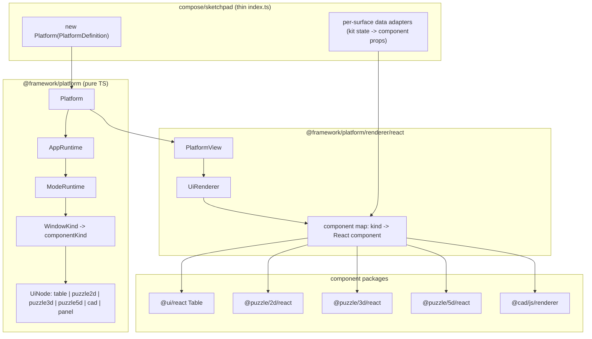

# Sketchpad to Platform Refactor

## Locked decisions
- `ProductRuntime` -> renamed to `Platform`; sketchpad becomes one declarative `new Platform({...})` instance. Core stays pure TS, render-agnostic. No legacy names kept.
- React renderer (`@framework/platform/renderer/react`) depends on `@puzzle/2d|3d|5d/react` and `@cad/js/renderer` and registers them as built-in named component kinds.
- Component kinds replace `board`/`scene3d`: `table`, `puzzle2d`, `puzzle3d`, `puzzle5d`, `cad`, `panel`.
- Scope = architecture + one vertical slice: build the full Platform + all component kinds, migrate `home table`, `kit table`, `kit diagram` (puzzle2d) end-to-end; remaining apps stay working and become follow-up tickets.

## Target architecture

## A. framework/platform/core ([framework/platform/core/index.ts](framework/platform/core/index.ts))
- Rename `ProductRuntime` -> `Platform` (class at 666-721) and all sibling names: `ProductSubscriber` -> `PlatformSubscriber`, `ProductDefinition` -> `PlatformDefinition`, `WindowBodyViewContext.runtime` type, etc. Update `SurfaceRouter.flattenFromProductDefinition` -> `flattenFromPlatformDefinition`/`flattenFromPlatformApps`.
- Add a declarative constructor: `new Platform(def: PlatformDefinition)` that builds `AppRuntime`/`ModeRuntime`/`WindowKindRuntime` from data (reusing existing `PluginManifest`/`SurfaceRouter` machinery). Keep imperative `addApp` for plugins.
- Replace `board`/`scene3d` surface node kinds in the `UiNode` union (93-101) with `puzzle2d`/`puzzle3d`/`puzzle5d`/`cad` (keep `table`, `panel`). Each carries `componentKind`, `surfaceId`, `controllerId`, optional `paneId`, and an opaque `props?: JsonValue`/binding id.
- Replace builders `buildScene3dWindowBody`/`buildBoardWindowBody` (104-116) with `buildPuzzle2dWindowBody`/`buildPuzzle3dWindowBody`/`buildPuzzle5dWindowBody`/`buildCadWindowBody`; keep `buildTableWindowBody`.
- Update `isCanvasOnlyWindowBody`/`assertCanvasOnlyWindowBody` (118-133) and the error message to the new kind set.
- All new code uses `//#region 🔖...` structuring per repo rules; docstrings start with an emoji.

## B. framework/platform/renderer/react ([framework/platform/renderer/react/index.tsx](framework/platform/renderer/react/index.tsx))
- Add deps to its `package.json`: `@puzzle/2d/react`, `@puzzle/3d/react`, `@puzzle/5d/react`, `@cad/js/renderer`.
- Replace the four `registerUi*SurfaceHost` registries + dispatch (1354-1413, 1490-1538) with a single component-kind model:
  - Built-in `componentRenderers: Record<ComponentKind, React.ComponentType<ComponentProps>>` wiring `table`->`@ui/react` `Table`, `puzzle2d`->`@puzzle/2d/react`, `puzzle3d`->`@puzzle/3d/react`, `puzzle5d`->`@puzzle/5d/react` `FiveD`, `cad`->`@cad/js/renderer`.
  - `registerSurfaceBinding(surfaceId, adapter)` where the host supplies a data/props adapter (plain data in, component props out) keyed by `surfaceId`. This is the renderer-agnostic seam a future Svelte renderer reuses with the same core + its own component map.
- Rename `ProductView` -> `PlatformView` and update `UiRenderer` (1587) to instantiate `componentRenderers[node.componentKind]` with adapter output; update `mountReactApp` references.

## C. sketchpad rewrite ([compose/client/lib/sketchpad/js/index.ts](compose/client/lib/sketchpad/js/index.ts))
- Replace `ensureSketchpadDeclarativeShell()` + `buildSketchpadExtensionManifest()` + `registerSketchpadDeclarativeBodies()` + `registerSketchpadUiSurfaceHosts()` (~22081-22420) with a single `buildSketchpadPlatform(): Platform` returning `new Platform({...})` whose apps reference component kinds:
  - home: `home-main` -> `table`
  - kit: `table` -> `table`, `diagram` -> `puzzle2d`
  - design: `scene`/`diagram` -> `puzzle5d`; type -> `cad`; docs/feedback/quality -> `panel`/existing.
- Migrate the slice cleanly: home table, kit table, kit diagram. Implement `registerSurfaceBinding` adapters that read kit state (via `@compose/react`) and return `table`/`puzzle2d` props. Kit diagram is re-wired from today's FiveD-flat onto the `puzzle2d` component per the chosen mapping.
- Keep remaining apps (design/type/quality/doc/feedback) functional by binding them to `puzzle5d`/`cad`/`panel` with thin adapters wrapping their current React implementations; deeper clean-rewrite of those deferred to follow-up tickets.
- Render via `<PlatformView platform={...} />`. Update boot path and `Sketchpad` export. Reorganize regions so the file stays a single clean `index.ts`.

## D. consumers + build fixes
- [compose/client/ui/desktop/renderer.tsx](compose/client/ui/desktop/renderer.tsx): update app-config registration (note: `qualityConfig` is referenced but not exported — fix to match real exports).
- [compose/client/ui/vscode/webview.tsx](compose/client/ui/vscode/webview.tsx): update `ensureSketchpadDeclarativeShell` import to the new Platform entry.
- [compose/client/lib/sketchpad/js/package.json](compose/client/lib/sketchpad/js/package.json): fix `exports` (`./index.tsx` -> `./index.ts`).
- [compose/client/lib/sketchpad/js/project.json](compose/client/lib/sketchpad/js/project.json): fix `cwd` `compose/client/lib/sketchpad/react` -> `.../js` in setup/dev/test targets.
- Grep the repo for any other `ProductRuntime`/`ProductView`/`board`/`scene3d` references and update.

## E. tests + ticket
- Extend framework vitest inline tests in core/renderer (no new files) to cover `Platform` construction from `PlatformDefinition` and the new component kinds/validation.
- Extend the embedded Playwright tests in sketchpad `index.ts` (no new files) for home table, kit table, kit diagram. Run framework vitest and sketchpad Playwright; confirm runtime via console logs (`[DEBUG]` prefixed, removed after).

## Constraints / notes
- Per repo rules, `AGENTS.md` files are not editable, so `framework/platform/AGENTS.md` ("WindowKind (table, board, scene)") will remain slightly stale after the rename; the code is the source of truth.
- All work happens inside a repo MCP ticket; remaining-app clean rewrites become separate follow-up tickets.

## Follow-up tickets (deferred)
- Clean-rewrite design app (`puzzle5d` flat + spatial), type app (`cad`), quality app, docs app, feedback app onto the Platform component model.
- Svelte renderer (`@framework/platform/renderer/svelte`) implementing the same core + component map / surface-binding seam.