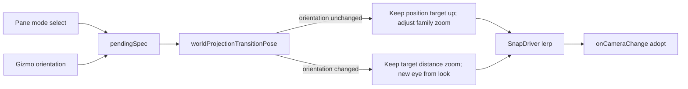

# Smooth Projection Transitions

## Problem

Two different paths apply projection changes today:


| Path                                                                          | What happens                                                                                                 |
| ----------------------------------------------------------------------------- | ------------------------------------------------------------------------------------------------------------ |
| **Pane** (`[handleProjectionKindChange](framework/renderer/react/index.tsx)`) | Instant `computeWorldProjectionPose` → rebuilds eye from canonical look → jump even when only *mode* changed |
| **Gizmo** (`[WorldProjectionSnapDriver](infinite/world/r3f/index.tsx)`)       | Already lerps (~280ms), keeps target/distance, but still rebuilds eye for every pending spec                 |


Mode-only switches (e.g. 3-Point → Orthographic with the same Top orientation) should keep the current eye/target and only swap camera family / matrix drivers. Orientation changes should keep focus + orbit radius + zoom and ease toward the new look.

CAD’s `[handleProjectionSpecChange](cad/renderer/js/index.tsx)` also still reads `spec.kind` (broken after mode⊗orientation) and does not drive a camera transition.

## Approach

Unify on the existing snap driver. Add a pure pose helper that chooses **preserve** vs **re-look**, then wire pane changes into the same `pendingSpec` pipeline as the gizmo.




## Implementation

### 1. Transition pose helper in `[infinite/world/r3f/index.tsx](infinite/world/r3f/index.tsx)`

Add `worldProjectionOrientationsEqual` and:

```ts
worldProjectionTransitionPose(pendingSpec, live: {
  position, target, up, zoom, isOrthographic, projectionSpec?
}): WorldCameraState
```

Rules:

- **Orientation unchanged** (or missing previous): `applyWorldProjectionToCameraState` on the live pose — keep `position` / `target` / `up`; only update `projection` + `projectionSpec` + family-safe zoom via existing `worldProjectionSnapZoom` / `applyWorldProjectionToCameraState`.
- **Orientation changed**: keep `target` + `orbitCameraDistance` + snap zoom; `computeWorldProjectionPose(pendingSpec, { target, distance, zoom })` for the destination eye (current gizmo behavior).

Update `[WorldProjectionSnapDriver](infinite/world/r3f/index.tsx)` to use this helper instead of always calling `computeWorldProjectionPose`.

### 2. Expose pending snaps from `[WorldOrbitViewControls](infinite/world/r3f/index.tsx)`

Extend props with optional external request:

- `externalPendingSpec` + clear callback, **or** a stable `requestSpec` that the host sets when the pane changes.

Internal gizmo `onSpecSelect` continues to set the same pending state. One driver animates both.

### 3. Framework host: pane uses snap, not instant recompute

In `[World3dHost](framework/renderer/react/index.tsx)`:

- Replace instant `computeWorldProjectionPose` + `adoptViewportCamera` in `handleProjectionKindChange` with setting external pending spec (title sync on snap complete via existing `handleGizmoCameraChange` / `onSpecSnap`).
- Pass that pending into `WorldOrbitViewControls`.

### 4. CAD parity

Fix `[handleProjectionSpecChange](cad/renderer/js/index.tsx)` to use `worldProjectionFamily` / `spec.mode.kind`, and route camera updates through the same controls pending-snap path (whatever CAD already uses for `onOrbitCameraChange`).

### 5. Tests (extend existing vitest in `[infinite/world/r3f/index.tsx](infinite/world/r3f/index.tsx)`)

- Mode-only (same Top orientation, 3pt → ortho): position/target unchanged; projectionSpec updates; zoom family-safe.
- Orientation change (same mode, free → Top): target/distance preserved; destination eye matches Top look.
- Logs under `.repo/🎫️/26/07/23/COMPLETE-3D-PROJECTION-GIZMO/`.

## Out of scope

- Changing snap duration (keep ~280ms easeInOutCubic).
- Re-framing to scene bounds on every mode switch (`frameWorldProjectionPose` stays for initial template seed only).

