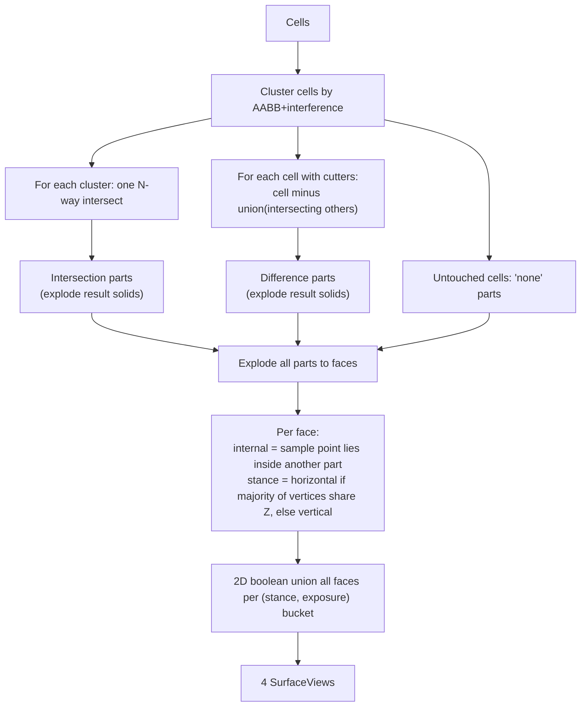

## Problem

Today the brep analyzer in [spatial/js/kernel-brepjs/index.ts](spatial/js/kernel-brepjs/index.ts) classifies faces via shared-vertex-set adjacency (`surfaceViewsFromAtomics`, ~L1882) and decomposes cells by `split` + interior point tests (`decomposeCells`, ~L1400). With 3+ closed shells this produces incorrect external/internal surfaces because the original cell faces aren't actually the exploded faces of the boolean-union solid, and never get unioned by (stance, exposure). The AABB fallback (`computeBooleanPartRecordsFromAabbs`, `computeSurfaceViewsFromTopologyFacesWithParts`) has the same flaws.

## Target algorithm (both paths)

## Key files / functions

- [spatial/js/kernel-brepjs/index.ts](spatial/js/kernel-brepjs/index.ts) — brep path
  - Replace `decomposeCells` (~L1400) with a cluster-aware version that does **one** `intersect`/`intersectAll` per overlapping cluster and **one** `cutAll(cell, otherIntersectors)` per touched cell. Untouched cells stay as `none` parts. Each resulting `ValidSolid` is exploded via `brepSolidsFromShape` into separate `AtomicPart` solids tagged by overlap.
  - Replace `surfaceViewsFromAtomics` (~L1882): for every face of every atomic part, compute centroid + normal, classify:
    - `internal` if a small offset of the centroid along ±normal lies inside any **other** part (`pointInSolidInterior`/`pointInOrOnSolid`); else `external`.
    - `stance = horizontal` if `|normal.z| ≥ √½` AND the face vertices' Z values agree within scale·1e-5 (i.e. majority horizontal); else `vertical`.
  - Boolean-union faces per `(stance, exposure)` bucket. Implementation: project all faces in a bucket onto their own planes, then union with brepjs `fuseAll` on 2D `face(wireLoop(...))` shapes per plane, and accumulate area + regionPoints across planes into ONE `SurfaceView`. Always emit exactly four views (drop empty buckets) with ids `surface-internal-horizontal`, `surface-internal-vertical`, `surface-external-horizontal`, `surface-external-vertical`.

- [spatial/js/kernel-brepjs/index.ts](spatial/js/kernel-brepjs/index.ts) — AABB fallback
  - Replace `computeBooleanPartRecordsFromAabbs` (~L1760): build cluster from interference graph; per cluster compute one N-way AABB intersection (and explode connected pieces using `aabbDifferencePieces` style splits when clusters are partially overlapping), per cell `aabbDifferencePieces(cell, intersectingOthers)`.
  - Replace `computeSurfaceViewsFromTopologyFacesWithParts` (~L2047) with the same face-explode → classify → union pipeline using `Rect2`/`derivedUnionRects` math already present in the file. Emit four `SurfaceView`s.

- `refreshDerivedViews` / `computeSurfaceViews` / `computePartViews` (~L2734–L2848): drop the fragile "if brep has only-internal, fall back to topo" branch — return the new brep result directly; only fall back when atomic decomposition throws or is empty.

- [spatial/js/core/index.ts](spatial/js/core/index.ts) tests (~L4274–L4475): update assertions that depend on specific surface counts/ids to match the new "exactly four buckets" output. Keep volume/part-count assertions (those still hold). Add a regression test with three boxes in an L arrangement asserting:
  - exactly 1 intersection part per overlapping pair (here 2), 3 difference parts, 4 surfaces, and `external-vertical` area equals expected after union of remaining wall pieces.

## Efficiency

- Build interference graph once with `checkInterference` (already used), then operate per connected component only — no boolean operations between non-intersecting clusters.
- Per cluster: one `intersect`/`intersectAll` call; per cell: one `cutAll` call. No pairwise loops in the brep path.
- Face classification uses the existing solids map; the sample-point-in-other-solid test is O(F·N) but bounded to the cluster.
- Surface union does one `fuseAll` per (stance, exposure, plane), not per face.

## Out of scope

- The renderer-r3f diff (visibility toggles) is unrelated and left untouched.
- `computeVolumeViews` keeps its current `fuseAll`-based implementation.
