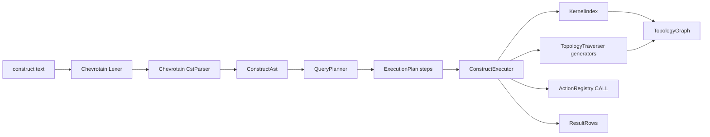

## 1. New package `spatial/js/query`

Mirror sibling packages (`core`, `machine-stately`). Add to root [spatial/js/package.json](spatial/js/package.json) workspaces.

Files:

- [spatial/js/query/index.ts](spatial/js/query/index.ts) — the engine (single file per AGENTS.md)
- [spatial/js/query/package.json](spatial/js/query/package.json) — name `@spatial/js-query`, deps `chevrotain ^11`, `@spatial/js-core: workspace:*`
- [spatial/js/query/project.json](spatial/js/query/project.json) — nx test target
- [spatial/js/query/tsconfig.json](spatial/js/query/tsconfig.json), [spatial/js/query/vitest.config.ts](spatial/js/query/vitest.config.ts), [spatial/js/query/script.ts](spatial/js/query/script.ts) — copies of core layout

## 2. The "construct" language (Cypher-subset)

Grammar (Chevrotain Lexer + CstParser, then visitor → AST):

```
Query     := (ReadClause | WriteClause)+ ReturnClause?
ReadClause:= MATCH Pattern (',' Pattern)* (WHERE Expr)?
            | WITH ProjList (WHERE Expr)?
WriteClause:= CALL ActionId '(' ArgList ')' (YIELD Ident (',' Ident)*)?
Pattern   := Node (Rel Node)*
Node      := '(' Var? (':' Label)? PropMap? ')'
Rel       := '-' '[' (':' RelType ('|' RelType)* RangeQuant?)? ']' '->' | '<-' ... | '-' ... '-'
PropMap   := '{' Ident ':' Literal (',' ...)* '}'
Expr      := Term (('AND'|'OR') Term)*  // ==, !=, <, >, <=, >=, +, -, *, /, .field, fn(...)
ReturnClause := RETURN ProjList (ORDER BY ...)? (LIMIT n)?
```

Reserved labels: `Vertex Edge Wire Face Shell Cell CellComplex Cluster Surface Part Topology`.
Reserved relationships: `BOUNDED_BY`, `CONTAINS`, `SHARES`, `DERIVES`, `MERGED_FROM`, `ADJACENT_TO`, `HAS_VERTEX`.

## 3. Engine architecture



Key components inside `index.ts`:

- `#region Lexer` — Chevrotain tokens (`MATCH`, `WHERE`, `RETURN`, `CALL`, `YIELD`, `WITH`, identifiers, literals, punctuation).
- `#region Parser` — `ConstructParser extends CstParser`, rule per grammar production.
- `#region Ast` — `buildAst(cst)` visitor producing tagged unions: `MatchNode`, `RelStep`, `Filter`, `CallStep`, `ReturnSpec`, `Expr`.
- `#region Index` — `KernelIndex` builds `Map<id, {kind, rec}>` and `Map<kind, Set<id>>` over a `TopologyGraph`; rebuilt lazily when `topo.revision` changes (cached `revisionAt`). Includes derived enumerators using `DerivedViewService`.
- `#region Traversers` — generator functions (`yield`) per relationship:
  - `boundedBy(face)` → wires; `containsEdges(wire)` → edges; `edgeVertices(edge)` etc.
  - `derivesSurface(face)` / `derivesPart(cell)` via `DerivedViewService`.
  - `adjacentCells(cell)` via shared face lookup (uses face→cell reverse index built once on top of `KernelIndex`).
  - `sharesVertex(a,b)` / `hasVertex(entity, depthRange)`.
- `#region Planner` — picks the most selective starting node (id-equality > label+prop > label scan), order rels by direction, push down WHERE filters before traversal where possible.
- `#region Executor` — interprets plan: each step yields binding rows `Record<varName, EntityHandle>`; lazy via async generator; eval expressions through reused `evalExpr` (extended with `field` / `fn` operations added in core).
- `#region Write` — `CALL ns.action(arg, ...)` resolves via `ActionRegistry`; arguments evaluated against current row bindings; results stored in `YIELD` names; write actions still must round-trip through the safe action layer (no direct topology mutation in the engine).
- `#region Api` — public surface:
  - `parseConstruct(text): ConstructAst`
  - `planConstruct(ast, ctx): ExecutionPlan`
  - `executeConstruct(plan, ctx): AsyncIterable<Row>`
  - `runConstruct(text, ctx): Promise<{ rows; data?; diff? }>`
  - `class ConstructEngine` wrapping the above with cached `KernelIndex`.

`ctx` shape: `{ topology: TopologyGraph; kernel: KernelAdapter; actions: ActionRegistry; derived?: DerivedViewService; metadata?: EntityMetadataStore }`.

## 4. Core extensions (`spatial/js/core/index.ts`)

- `#region 🏷️Metadata` — add `EntityMetadataStore` (sidecar `Map<entityId, Record<string, unknown>>`) attached to `TopologyGraph` (`topo.metadata`). Used by Surface/Part filters (`exposure`, `stance`, `overlap`) and arbitrary user props referenced from `WHERE m.foo = ...`.
- Extend `TopologyGraph` with `metadata: EntityMetadataStore` initialised in constructor; `bump()` already increments revision used by query index cache.
- Extend `KernelAdapter` with optional `adjacentCells?(cellId, topo)` and `sharedFacesBetween?(a,b,topo)` for kernels that can compute precise lateral adjacency; engine falls back to topology-only logic.
- `InteractionRuntime` gains `query(text: string): Promise<ConstructResult>` that lazily constructs a `ConstructEngine` over `opts.document.topology` + `opts.kernel` + `this.actions`. Implemented by importing `runConstruct` (no circular deps; query depends on core only).

To avoid a core→query dependency, the runtime accepts an injected `ConstructRunner` provider in `InteractionRuntimeOptions.query?`; `@spatial/js-query` exports a default provider, host wires it in (same shape as `stateEngine` provider). This keeps core minimal.

## 5. Kernel extensions (`spatial/js/kernel-brepjs/index.ts`)

Implement the optional adjacency hints used by `ADJACENT_TO`:

- `adjacentCells(cellId, topo)` — uses brepjs solid registry; returns ids of cells in `topo` whose tessellated faces share boundary verts (good-enough until brepjs exposes precise sharing).
- `sharedFacesBetween(a,b,topo)` — symmetric set intersection over `cell.shells*.faceIds`.

Rationale: query engine works without these, but `BrepjsKernel` showcases the hybrid path described in `.repo/✍️/construct.md`.

## 6. Tests (extend in-file `import.meta.vitest`)

In `spatial/js/query/index.ts`:

- Lexer/parser smoke tests (each grammar production).
- Planner picks index lookup for `MATCH (f:Face {id:'X'})` over scan.
- Executor reads: `MATCH (c:Cell)-[:BOUNDED_BY]->(:Shell)-[:CONTAINS]->(f:Face) RETURN f.id` against a hand-built `TopologyGraph` (seed 1 cell / 1 shell / multiple faces) — assert ids.
- Adjacency: synthesize 2 cells sharing a face; `MATCH (a:Cell)-[:ADJACENT_TO]-(b:Cell) RETURN a,b` returns the pair.
- Derived: register surface metadata, query `MATCH (s:Surface) WHERE s.exposure='external' RETURN s` returns expected rows.
- Writes: `CALL primitive.createBoxFromCorners(...) YIELD diff` returns a `TopologyDiff`; engine itself does not apply it (consumer applies via `applyTopologyDiff`).

In `spatial/js/core/index.ts`: add tests for `EntityMetadataStore` get/set + revision bump.
In `spatial/js/kernel-brepjs/index.ts`: add tests for `adjacentCells` & `sharedFacesBetween` on a 2-cell synthetic topology.

## 7. Ticket workflow

Per `CLAUDE.md` / `AGENTS.md`: open ticket via repo MCP (`ticket_open`) before edits, list goals, scope under topology/query goal if it exists else create one, close ticket at end with file list.
