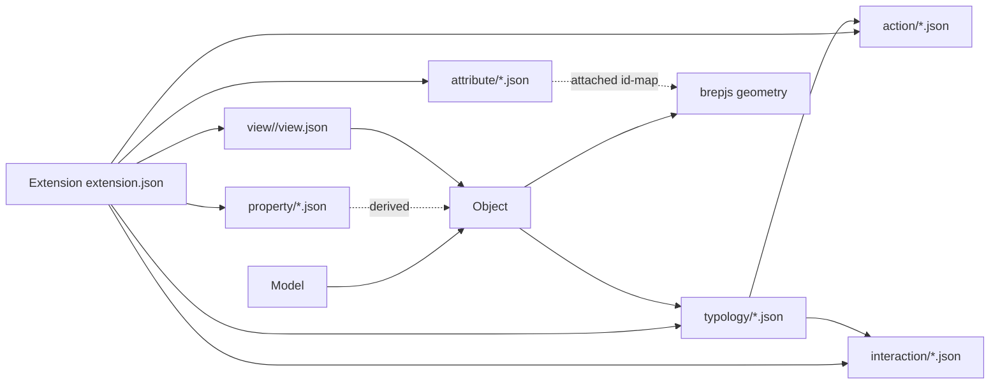

# Spatial Doctrine Refactor

## Goal

Drop the brepjs class hierarchy (`Vertex`, `Edge`, `Wire`, `Face`, `Shell`, `Cell`, `CellComplex`, `Cluster`) from the public spatial framework and replace it with the new extension-based vocabulary defined in [spatial/AGENTS.md](spatial/AGENTS.md):

- `Geometry`: brepjs (kernel-private only)
- `Model`: container of `Object`s (replaces the old `Topology` / `TopologyGraph`)
- `Typology`: class of objects; declared as a new extension asset kind
- `Object`: instance of a typology
- `View`: derived perspective on a model
- `Action`: declarative headless operation
- `Interaction`: declarative state machine
- `Attribute`: authored metadata attached to geometry via an external id-map
- `Property`: derived attribute
- `Extension`: data-only namespace packaging the above

The brepjs hierarchy survives only as an internal implementation detail of `spatial/js/kernel-brepjs` (never re-exported from `@spatial/js-core`).

## High-level architecture (target)

## Key decisions (already confirmed)

- Full refactor in one pass; per-package work delegated to subagents in parallel after the spec lands.
- `Typology` is a new asset kind: `assets/extension/<ext>/typology/<categoryFolders..>/<id>.json`, peer to `action/`, `interaction/`, `attribute/`, `property/`. Each typology references its construction actions/interactions by id.
- "Topology" in the old sense is renamed `Model`. Public schemas, fixtures, and JS types rename `Topology*` → `Model*` and `*.topology.json` → `*.model.json`.

## Phase 1 — Spec, schemas, and assets (do first, on this conversation)

### Open ticket + read goals

- `ticket_open` with title `Spatial Doctrine Refactor` and slug `spatial-doctrine`.
- Read `repo://goals` first to associate with the right goal.

### Rewrite the public spec

- `spatial/AGENTS.md` already matches the new doctrine; add one sentence formally introducing the `typology/` asset folder path.
- The old `spatial/AGENTS.md` cursor-rule section under "Command / Geometry" still teaches the `Vertex…Cluster` hierarchy and is the source of the user-reported confusion. Quarantine that text behind a `<!-- legacy brepjs kernel notes; not public framework vocabulary -->` heading or move it under `spatial/js/kernel-brepjs/AGENTS.md` so the public spec only speaks the new vocabulary.

### Rename + reshape JSON schemas under [spatial/schema/json](spatial/schema/json)

- Rename `topology.json` → `model.json` (`$id` `spatial://schema/json/model`, `title` `SpatialModel`, `const` `spatial.model/v1`). Replace the `vertices/edges/wires/faces/shells/cells/cellComplexes/clusters` arrays with a single `objects` array (`{id, typologyId, geometryRef, attributes?}`) plus an internal `geometry` block that holds the brepjs graph (still using the old field names, but namespaced and explicitly marked kernel-private — this is how the kernel persists brep data).
- Replace `editableEntities` enum in `interaction.json` (currently `["vertex","edge","wire","face","shell","cell","cellComplex","cluster","surface"]`) with `["object","attribute","property"]` plus an optional kernel-private `geometryEntities` extension array consumed only by `kernel-brepjs`.
- Add new schema `typology.json` (`$id` `spatial://schema/json/typology`, `const` `spatial.typology/v1`): `{ id, label, description?, actions: string[], interactions: string[], properties?: string[], attributes?: string[] }`.
- Add schema `view.json` (`spatial.view/v1`) capturing the shape already used in assets (`derivedObjects: [{ id, label, description?, properties?, allows? }]`) plus a `sourceTypologies` field for lineage.
- Add schema `extension.json` (`spatial.extension/v1`) matching the manifests in `assets/extension/<ext>/extension.json`, and extend its `kinds` enum with `"typology"` and `"view"`.

### Reshape assets under [spatial/asset/extension](spatial/asset/extension)

- Update each `extension.json` (`builtin`, `energy`, `structure`) `kinds` array to include `"typology"` and `"view"` where applicable.
- Author one typology per existing primitive/construction interaction in `assets/extension/builtin/typology/`, grouped by category (`primitive/box.json`, `curve/line.json`, `solid/sphere.json`, …). Each references the matching interaction id and the kernel-private action id.
- Rewrite every `assets/extension/builtin/interaction/**/*.json` to drop `requires.kernel.editableEntities` references to `vertex|edge|wire|face|shell|cell` and replace with `produces.typology: "<typology-id>"`. Concretely impacts: `primitive/box.json`, `curve/*.json`, `solid/*.json`, `surface/*.json`, `feature/extrude-wire.json`, `feature/offset-surface.json`, `edit/*.json`, `transform/*.json`, `measure/*.json`.
- Update attributes (`builtin/attribute/{bondable,exposure,gvalue,material,opening,uvalue}.json`): their `targets` arrays currently hold `surface` etc. Re-target to `object` plus an optional `geometrySelector` for sub-entity attachment.
- Update properties (`builtin/property/volume.json`, `energy/property/heatedvolume.json`): replace `sources: ["solid"]` with `sources: { typologies: ["builtin.solid", "..."] }`.

### Rename fixtures under [spatial/fixtures](spatial/fixtures)

- `small-building.topology.json` → `small-building.model.json`, same for `tall` and `large`.
- `simple.spatial.json` and `spatial.spatial.json` already use the bundle envelope; update the inner `"schema": "spatial.topology/v1"` to `"spatial.model/v1"` and rename the `raw` block from the topology shape to the new `objects` + kernel `geometry` shape.

## Phase 2 — JS package refactor (parallel subagents)

After Phase 1 schemas are merged, fan out to four `generalPurpose` subagents working simultaneously on the same files (per `CLAUDE.md`: no `git commit`/`stash`/`checkout`). Coordinator (this agent) handles `core` first because the others depend on its exports.

### 2a. [spatial/js/core/index.ts](spatial/js/core/index.ts) — self (blocking)

- Remove the public exports: `VertexRef`, `EdgeRef`, `WireRef`, `FaceRef`, `ShellRef`, `CellRef`, `CellComplexRef`, `ClusterRef`, `EditableEntityKind`, `DerivedEntityKind`, `TopologyEntityKind`, `*Record`, `*RecordDiff`, `TopologyGraph`, `TopologyGraphJson`, `parseTopologyGraphJson`, `applyTopologyDiff`, `EMPTY_TOPOLOGY_DIFF`, `isEmptyTopologyDiff`, `readTopologyEntityProperty`, `TopologyEntityRef`.
- Introduce instead: `ObjectRef`, `TypologyRef`, `ModelRef`, `ModelDocument` (already exists, repurpose), `Object`, `Typology`, `AttributeStore` (renamed from `EntityMetadataStore`), `PropertyStore`, `Extension`, `parseExtensionManifest`, `parseTypologySpec`, `parseModelJson`, `applyModelDiff`.
- Keep `Vec3`, `EdgeCurve`, `FaceSurface`, `CellSolid` types but re-export them under a `kernelGeometry` namespace (`export * as kernelGeometry from "./kernelGeometry"`) — public consumers should never import them directly.
- Update `parseInteractionSpec` / `InteractionSpec` to drop topology-entity vocabulary; `requires.kernel.editableEntities` becomes `requires.typologies`.

### 2b. [spatial/js/kernel-brepjs/index.ts](spatial/js/kernel-brepjs/index.ts) — subagent

- This is the only place where `Vertex…Cluster` survive. Stop re-exporting them.
- Rename public functions: `boxTopologyDiff` → `boxModelDiff`, `meshFaceTopologyDiff` → `meshObjectDiff`, `topologyCellAabb` → `modelObjectAabb`, etc. Anything user-facing loses `topology` from its name.
- Internally keep brepjs graph nodes; expose `BrepjsKernel.applyAction(action)` and `BrepjsKernel.queryObject(id)` as the new surface.

### 2c. [spatial/js/query/index.ts](spatial/js/query/index.ts) — subagent

- Rewrite the `MATCH (Vertex)`, `MATCH (Edge)`, … query grammar to `MATCH (Object {typology: 'builtin.box'})` plus property/attribute predicates.
- Drop `view.surfaces({}) / view.parts({}) / view.volumes({})` as kernel-level analytics; expose them only as `CALL view.<viewId>.<derivedObjectId>({})`.
- Update [spatial/js/query/package.json](spatial/js/query/package.json) any topology-vocabulary references in its README/exports.

### 2d. [spatial/js/machine-stately/index.ts](spatial/js/machine-stately/index.ts) + [machine.json](spatial/js/machine-stately/machine.json) — subagent

- Replace state context fields and effects that reference `editableEntity`/`topology` with `object`/`model`.
- Regenerate `machine.json` from the new interaction specs.

### 2e. [spatial/js/renderer-r3f/index.tsx](spatial/js/renderer-r3f/index.tsx) + [play/main.tsx](spatial/js/renderer-r3f/play/main.tsx) — subagent

- The import block in `play/main.tsx` (lines 4–22) imports `parseTopologyGraphJson`, `TopologyGraph`, and references `*.topology.json` fixtures — rewrite to `parseModelJson`, `Model`, and the renamed `.model.json` fixtures.
- Renderer-side: rename `SpatialPickViewKind` enum values from `vertex|edge|wire|face|shell|cell` to typology-aware object picking (`object`, `objectFace`, `objectEdge`, `objectVertex` where geometry pick is still needed for kernel feedback).

## Phase 3 — Tests, fixtures, AGENTS hygiene, ticket close

- Run `nx run-many -t test` across all five packages; extend the existing test files in place (no new test files) to cover `parseModelJson`, typology registration, attribute store, view derivation.
- Run the renderer `play` smoke once geometry fixtures resolve.
- Re-grep the repo for any remaining `Vertex|Edge|Wire|Face|Shell|Cell|CellComplex|Cluster|TopologyGraph|topology/v1` outside `kernel-brepjs/**` — must be zero.
- `ticket_close` with file list and a summary that the brepjs hierarchy is now kernel-private and the doctrine is extension-based.

## Out of scope

- No changes to `./elements`, `./semio`, `./coda`, `./reuse` per the no-cross-tech rule.
- No backwards compatibility shims, no deprecation aliases (per workspace rules — greenfield repo).