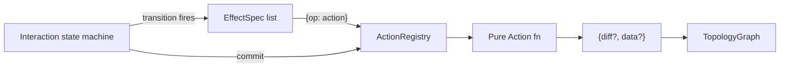

## 0. Ticket

Open `spatial-interactions-and-actions` via repo MCP `ticket_open`. All scratch files under `.repo/🎫/YY/MM/DD/spatial-interactions-and-actions/`.

## 1. Concept split

- **Action** — pure, non-interactive function with typed inputs and a typed result (`{ diff?, data? }`). Examples: `createBoxFromCorners`, `createBoxFrom3Points`, `extrudeWireToCell`, `offsetFaces`, `measureVertexDistance`, `measureFaceArea`, `measureCellVolume`, and the previously-hardcoded `box.transform` helpers (`aabbFromDiagonalCorners`, `tripletRubber`, `snapSquareFootprint`, `rubberCornerFromCenter`, `rubberSquareFromCenter`, `setCubeHeightFromFootprint`, `verticalFinalizeFootprint`, `initPeakAboveOrigin`, `peakFromOriginZ`, `verticalRubberCorner`, `cornerFromLengthWidth`, `tripletCommit`). Registerable at runtime via `ActionRegistry`.
- **Interaction** — interactive state machine (previous `CommandSpec`). Headless or rendered. Uses Actions via `EffectSpec` (during transitions) and via `commit.operation` (at commit time). Registerable at runtime via `InteractionRegistry`.
- **Effect** — declarative side-effect on a transition (previous `ActionSpec`: `assign` / `clear` / `append` / `emit` / `raise` / `openTransaction` / `commitTransaction` / `rollbackTransaction` / `requestPreview` / `resolveEditable` / `setDiagnostic` / `clearDiagnostic` / `kernel.query` / new `action`). Replaces the hardcoded `box.transform` op.




## 2. `spatial/js/core/index.ts` — TS surface rename + new registries

Region renames + symbol renames (kept in same file per `AGENTS.md`):

- `🎮CommandEvent` → `🎮InteractionEvent`; `CommandEvent` → `InteractionEvent`; `SelectionEvent` stays but extends `InteractionEvent`.
- `📜Spec` → `📜InteractionSpec`; `CommandSpec` → `InteractionSpec`; `parseCommandSpec` → `parseInteractionSpec`; `compileCommand` → `compileInteraction`; `CommandSpatialInteractionConfig` → `InteractionSpatialConfig`; `CommandSpatialInteractionResolved` → `InteractionSpatialResolved`; `mergeCommandSpatialInteraction` → `mergeInteractionSpatial`.
- `📜Command` → `📜Interaction`; `CommandRuntime` → `InteractionRuntime`; `CommandRuntimeOptions` → `InteractionRuntimeOptions`; `createCommandRuntime` → `createInteractionRuntime`; `CommandSnapshot` → `InteractionSnapshot`; `CommandResponse` → `InteractionResponse`; `EMPTY_COMMAND_RESPONSE` → `EMPTY_INTERACTION_RESPONSE`; `CommandMessage` → `InteractionMessage`; `CommandKeybindRow` → `InteractionKeybindRow`; `listKeyedCommandTransitions` → `listKeyedInteractionTransitions`; `isCommandSessionActive` → `isInteractionSessionActive`.
- `📦Commands` → `📦Interactions`; `SpatialCommandPreset` → `SpatialInteractionPreset`; `listSpatialCommandPresets` / `loadSpatialCommandPreset` / `resolveSpatialCommandPresetKey` → `listSpatialInteractionPresets` / `loadSpatialInteractionPreset` / `resolveSpatialInteractionPresetKey`; `buildBoxCommandSpec` → `buildBoxInteractionSpec`; same for `Extrude`/`OffsetSurface`/`Distance`/`Area`.
- Existing transition `ActionSpec` → `EffectSpec`; field `transitions[*].actions` → `effects`; helper `applyActionAsync` → `applyEffectAsync`. `EffectSpec` drops the `box.transform` variant and gains a generic action variant:
  ```ts
  | { op: "action"; action: string; params?: Record<string, Expr>; assignTo?: PathTarget }
  ```
- Remove `applyBoxGeometryTransform` (~120 lines in [spatial/js/core/index.ts](spatial/js/core/index.ts)); its 12 sub-ops become registered Actions (see §3).
- Remove `history.excludeEvents` from `InteractionSpec` and from `InteractionRuntime.excludeFromHistory` — every non-transient transition is undoable per requirement. `transient: true` remains the single opt-out.

New region `🧮ActionRegistry` (after `🪪Refs`):

```ts
export interface ActionResult<TData = unknown> {
  readonly diff?: TopologyDiff;
  readonly data?: TData;
}
export type ActionFn<TParams = Record<string, unknown>, TData = unknown> =
  (params: TParams, ctx: { kernel: KernelAdapter; topology: TopologyGraph }) => Promise<ActionResult<TData>> | ActionResult<TData>;

export interface ActionDef<TParams = Record<string, unknown>, TData = unknown> {
  readonly id: string;            // e.g. "primitive.createBoxFromCorners"
  readonly label?: string;
  readonly run: ActionFn<TParams, TData>;
}

export class ActionRegistry {
  register(def: ActionDef): void;
  get(id: string): ActionDef | null;
  list(): readonly ActionDef[];
  static withBuiltins(): ActionRegistry;   // registers all built-ins below
}
```

Built-in actions registered by `ActionRegistry.withBuiltins`:

- Geometry actions (call `KernelAdapter`): `primitive.createBoxFromCorners`, `primitive.createBoxFrom3Points` (composed of `aabbFromDiagonalCorners` + `setCubeHeightFromFootprint`), `feature.extrudeWireToCell`, `feature.offsetFaces`, `measure.vertexDistance`, `measure.faceArea`, `measure.cellVolume`.
- Pure geometry helpers (no kernel): the 12 ex-`box.transform` ops, each as its own `ActionDef` reading typed params (`origin`, `corner`, `cursor`, `p0`/`p1`, …) and returning `{ data: { origin?, corner?, height?, … } }` so transitions assign them back via `assignTo`.

New region `🧭InteractionRegistry`:

```ts
export class InteractionRegistry {
  register(spec: InteractionSpec): void;
  get(id: string): InteractionSpec | null;
  list(): readonly InteractionSpec[];
  static withBuiltins(): InteractionRegistry;   // box / extrude / offsetSurface / distance / area from fixtures
}
```

`InteractionRuntimeOptions` gains `actions?: ActionRegistry` (defaults to `ActionRegistry.withBuiltins()`); the runtime resolves `EffectSpec` `{op:"action"}` and `commit.operation { kind:"action", action, params }` against it.

`commit.operation` collapses to a single tagged variant:

```ts
type CommitOperationSpec = { kind: "action"; action: string; params?: Record<string, Expr>; outputDataPath?: PathTarget }
```

All previous variants (`cell.createBox`, `wire.extrudeToCell`, `face.offset`, `measure.*`) become `{kind:"action", action:"…"}`.

## 3. JSON fixtures + schema — [spatial/fixtures/](spatial/fixtures), [spatial/schema/json/](spatial/schema/json)

- Rename files: `box.command.json` → `box.interaction.json`, plus `extrude-wire`, `offset-surface`, `distance`, `area`. Delete the orphaned `factory.json`, `extrude.factory.json`, `offset-surface.factory.json` (per repo "no legacy api" rule) unless still referenced — verify with rg first.
- Bump schema string `"spatial.command/v1"` → `"spatial.interaction/v1"`. Update the matching schema file under `spatial/schema/json/`.
- In every fixture rewrite `actions: [...]` → `effects: [...]`; rewrite every `{op:"box.transform", transform:"X"}` to `{op:"action", action:"box.X", params:{ point:{kind:"path",…}, value:{kind:"path",…} }, assignTo:{root:"context",segments:[…]}}` (one `assign` per slot the helper writes), or alternatively a single `{op:"action"}` whose `assignTo` is a `context` sub-object that the transition's next `assign` effect spreads — pick the per-slot form for explicitness.
- Rewrite each `commit.operation` to the unified `{kind:"action", action:"…", params:{…}, outputDataPath?:…}` form.
- Drop the entire `normalizeLegacyCommandDocument` + `migrateLegacyActionObject` + `legacyPathToTarget` block in `parseInteractionSpec` (greenfield, no legacy compat).

## 4. Undo/redo for every state transition

`InteractionRuntime.send` already snapshots `{state, context}` before every non-transient transition into `snapUndoStack`. Confirm the removal of `excludeEvents` is the only behavioral change needed. Update the snapshot comment + `🪩Repl` docs accordingly.

## 5. `spatial/js/machine-stately/index.ts`

Mirror all type/symbol renames (`CommandSpec` → `InteractionSpec`, `SpatialStatelyMachineView` keeps its name but its `commandId` field → `interactionId`, `commandVersion` → `interactionVersion`, `buildSpatialStatelyMachineCatalogView`, etc.). The XState wiring is unchanged — `applyTransition` keeps the same semantics, only types rename. Update the `🧪Tests` region accordingly.

## 6. `spatial/js/renderer-r3f/index.tsx`

- Replace all `CommandRuntime` / `CommandSnapshot` / `CommandEvent` / `CommandRepl` references with the `Interaction*` names. `CommandRepl` → `InteractionRepl`; `CommandCanvas` → `InteractionCanvas`; `CommandSpatialView` → `InteractionSpatialView`; `useReplHistoryState` keeps name but typed against `InteractionRuntime`.
- The host palette + value-input handler keep working unchanged because it talks via `InteractionEvent` (string `kind` is unchanged).

## 7. `spatial/js/renderer-r3f/play/main.tsx` + `spatial/js/cli`

Update imports and symbol names. CLI surfacing of presets (`listSpatialInteractionPresets`) keeps the same keys (`q`/`j`/`k`/`d`/`a`).

## 8. Tests — extend existing vitest suites only

In the `🧪Tests` region of [spatial/js/core/index.ts](spatial/js/core/index.ts):

- `ActionRegistry`: `withBuiltins` lists all built-in ids; `register` allows overriding; `createBoxFrom3Points` returns the same diff as `createBoxFromCorners` for axis-aligned inputs.
- `InteractionRegistry.withBuiltins` returns all 5 presets and `get("primitive.box")` matches `buildBoxInteractionSpec`.
- Box interaction end-to-end through the new `effects:[{op:"action",action:"box.aabbFromDiagonalCorners",…}]` path produces identical context to the old test (snapshot of `state` + `context` after each `pointer.down`).
- `send` push to `snapUndoStack` on every non-transient transition (regression: previously `excludeEvents` could skip).

Extend `spatial/js/machine-stately/index.ts` `🧪Tests` to assert pure-ts vs XState parity through the new `effects` + `{kind:"action"}` commit path.

Extend `spatial/js/renderer-r3f/index.tsx` `🧪Tests` to rename + cover one full interaction via the renamed `InteractionRuntime`.

## 9. Out of scope

- Persisting `ActionRegistry` / `InteractionRegistry` across sessions.
- Touching `./elements`, `./semio`, `./coda`, `./reuse` (per AGENTS.md no-tech-mixing rule).
- Backwards compatibility — all `Command*` symbols, `spatial.command/v1` schema string, and `*.command.json` filenames are removed outright.

## 10. Ticket close

Run `bun nx test js-core js-machine-stately js-renderer-r3f` and `bun nx lint` for the three packages. Update the ticket with summary + file list, call `ticket_close`.