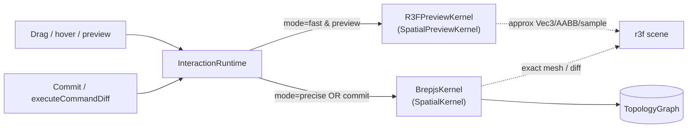

## Goal

- `spatial/js/core` keeps types, refs, topology data, expr/path/state/runtime plumbing, JSON parse/apply diff. **Zero `Math.`* calls, zero numeric geometry.**
- All math lives behind two interfaces, declared in core, implemented elsewhere:
  - `SpatialKernel` (precise, exact, may be async) — full superset.
  - `SpatialPreviewKernel` (fast, sync, approximate) — subset used for live drag/hover/snap.
- `BrepjsKernel` implements `SpatialKernel`. A new `R3FPreviewKernel` inside the renderer implements `SpatialPreviewKernel`.
- Play UI: `Fast | Precise` segmented control wired into `InteractionRuntimeOptions.mode`.

## Interface shape (declared in [spatial/js/core/index.ts](spatial/js/core/index.ts))

```ts
export interface SpatialPreviewKernel {
  // vec3 arithmetic
  vec3Add(a: Vec3, b: Vec3): Vec3;
  vec3Sub(a: Vec3, b: Vec3): Vec3;
  vec3Scale(a: Vec3, s: number): Vec3;
  vec3Dot(a: Vec3, b: Vec3): number;
  vec3Cross(a: Vec3, b: Vec3): Vec3;
  vec3Length(a: Vec3): number;
  vec3Distance(a: Vec3, b: Vec3): number;
  vec3Normalize(a: Vec3): Vec3;

  // curves / sampling (for preview rendering)
  arcSamplePoints(center: Vec3, start: Vec3, end: Vec3, segments?: number): readonly Vec3[];
  arcEndOnCircle(center: Vec3, start: Vec3, pick: Vec3): Vec3;
  arcEndFromAngle(center: Vec3, start: Vec3, angleDeg: number): Vec3 | null;
  circleSamplePoints(c: Vec3, n: Vec3, r: number, seg?: number): readonly Vec3[];
  ellipseSamplePoints(...): readonly Vec3[];
  nurbsDisplaySamplePoints(poles: readonly Vec3[], segsPerSpan?: number): readonly Vec3[];
  edgeSamplePoints(curve, ends, segments?): readonly Vec3[];
  polylineLength(points: readonly Vec3[]): number;
  edgeCurveLength(curve, ends): number;

  // curve construction
  circleFromCenterRadiusPoint(c: Vec3, p: Vec3): { center: Vec3; normal: Vec3; radius: number } | null;
  nurbsCurveFromPoles(poles: readonly Vec3[]): EdgeCurve | null;
  arcPlaneFrame(c: Vec3, s: Vec3, e: Vec3): ArcPlaneFrame | null;
  arcFrameFromRadiusPoint(c: Vec3, on: Vec3): ArcPlaneFrame | null;

  // aabb / layout
  aabbFromPoints(points: readonly Vec3[]): { min: Vec3; max: Vec3 } | null;
  aabbCornerPoints(min: Vec3, max: Vec3): readonly Vec3[];
  aabbIntersect(a: Aabb, b: Aabb): Aabb | null;
  cellSolidAabb(solid: CellSolid): { min: Vec3; max: Vec3 };
  topologyCellAabb(topo: TopologyGraph, cell: CellRecord): { min: Vec3; max: Vec3 } | null;

  // mesh/diff scaffolding
  boxTopologyDiff(input, cell: CellRef): TopologyDiff;
  meshFaceTopologyDiff(mesh: MeshPreview, idTag: string): TopologyDiff;

  // anchors + preview transforms
  evaluateAnchorPosition(topo: TopologyGraph, anchor: AnchorRecord): Vec3;
  computeBoxPreviewLayout(a: Vec3, b: Vec3, h: number): { position: Vec3; scale: Vec3 };
  transformPointsForPreviewKind(kind: string, params: Record<string, unknown>): (p: Vec3) => Vec3;

  // expr support (used by evalExpr's distance/abs)
  abs(x: number): number;
}

export interface SpatialKernel extends SpatialPreviewKernel, KernelAdapter {
  // precise overrides that *must* go through OCC (boolean parts, exact volume,
  // exact surface views, tessellation, brep-backed extrude/offset, etc.)
}
```

`KernelAdapter` is folded into `SpatialKernel` (the old optional methods become the precise-only surface); the name `KernelAdapter` is retired.

## Files touched

### [spatial/js/core/index.ts](spatial/js/core/index.ts) — remove math, declare interfaces

- Delete bodies of `vec3*`, `arc*`, `circle*`, `ellipseSamplePoints`, `nurbs*`, `polylineLength`, `edgeCurveLength`, `edgeSamplePoints`, `circleFromCenterRadiusPoint`, `nurbsCurveFromPoles`, `evaluateAnchorPosition`, `meshFaceTopologyDiff`, `boxTopologyDiff`, `cellSolidAabb`, `topologyCellAabb`, `aabbCornerPoints`, `aabbIntersect`, `computeSurfaceViewsFromTopology`, `computePartViewsFromTopology`.
- Keep their type signatures only if needed as helpers on the interface; otherwise remove from the public API.
- `DerivedViewService` keeps caching but delegates the actual computation to `kernel.computeSurfaceViews` / `kernel.computePartViews`.
- `evalExpr` `distance` / `abs` cases call `env.kernel.vec3Distance` / `env.kernel.abs`; `ExprEnv` gains a required `kernel: SpatialPreviewKernel` (the runtime hands in whichever kernel mode is active).
- `InteractionRuntimeOptions` gains:
  - `mode?: "fast" | "precise"` (default `"precise"`).
  - `previewKernel?: SpatialPreviewKernel` (required when `mode === "fast"`; runtime throws otherwise).
- `InteractionRuntime` routes preview-time math (display resolution, action previews, expr eval, derived views) through `previewKernel` when mode is fast, through `kernel` when precise. Commit/`executeCommandDiff`/`tessellate` always go to `kernel`.
- Add a new `//#region SpatialKernelInterface` region grouping the two interfaces.

### [spatial/js/kernel-brepjs/index.ts](spatial/js/kernel-brepjs/index.ts) — own all math

- `BrepjsKernel implements SpatialKernel`.
- Move every deleted core helper into a new `//#region SpatialKernelMath` block on `BrepjsKernel` (methods, not free functions). Internal helpers stay private.
- Existing tests stay — they already exercise the interface methods.

### [spatial/js/renderer-r3f/index.tsx](spatial/js/renderer-r3f/index.tsx) — preview kernel + display-only

- Add `//#region R3FPreviewKernel`: new `export class R3FPreviewKernel implements SpatialPreviewKernel` containing the fast/approximate impls (current local `vec3Sub/Add/translateVec3`, `bboxFromPoints`, `bboxWireSegments`, `computeBoxPreviewLayout`, `transformPointsForPreviewKind` become methods; plus straight ports of arc/curve sampling using cheap segment counts).
- Renderer math (highlights, gizmos, hover overlays) goes through the active preview kernel passed in via runtime/context, never imports raw math from core (because core no longer exports any).
- Export a default singleton `r3fPreviewKernel` for convenience.

### [spatial/js/renderer-r3f/play/main.tsx](spatial/js/renderer-r3f/play/main.tsx) — Fast|Precise toggle

- Add `const [mode, setMode] = useState<"fast" | "precise">("fast")` near the geometry asset picker.
- Render a two-button segmented control in `asideExtra`: `[ Fast ] [ Precise ]`.
- Plumb into `useInteractionRuntime` via `rtOpts`:

```tsx
const rtOpts = useMemo((): InteractionRuntimeOptions => ({
  kernel,
  previewKernel: r3fPreviewKernel,
  mode,
  document: documentModel,
  history,
  stateEngine: statelyStateEngineProvider,
  query: defaultConstructRunner,
  derived,
}), [kernel, mode, documentModel, history, derived]);
```

- Mode change triggers a runtime re-instantiation (already keyed off `rtOpts`).

## Data flow




## Validation

- `bun nx test @spatial/js-core` — core has no Math, tests still pass via the kernel-driven paths (any core tests that hit removed helpers get rewritten to call through a kernel instance, using `BrepjsKernel` as the reference).
- `bun nx test @spatial/js-kernel-brepjs` — existing suite plus new tests for the relocated helpers (arcSamplePoints, aabbIntersect, evaluateAnchorPosition, etc.).
- `bun nx test @spatial/js-renderer-r3f` — new `R3FPreviewKernel` unit tests for the subset methods (preview layout, transformPointsForPreviewKind, bbox).
- Manual play smoke: toggle Fast/Precise, draw a box, draw an extrude — verify previews render in both modes and committed cells match brepjs volume.

## Out of scope

- No changes to schema, fixtures, machine-stately, or query packages.
- No precision parity tests between fast and precise (documented as approximation).

