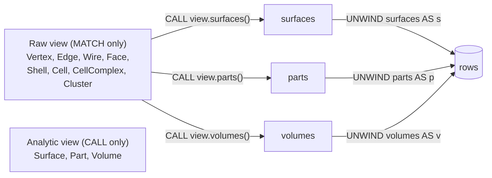

# Spatial Query: Raw vs Analytic, Explicit CALL, Complete YIELD

## 1. Semantics



Derived facts (from clarification):
- **Surface**: derived face = `Exposure × Stance` (shape-invariant repartition of faces).
- **Part**: derived closed shell = `Overlap (none|difference|intersection)` (shape-invariant repartition of closed shells).
- **Volume**: derived closed shell = boolean union of all closed shells in a cell group.
- **Skin** is dropped.

## 2. Language changes — [spatial/js/query/index.ts](spatial/js/query/index.ts)

- **Lexer**: add `UnwindKw` (`UNWIND`) and `AsKw` (`AS`).
- **Parser**: new `unwindClause = UNWIND expr AS Identifier`; allow inside the top-level `MANY` of `query` alongside `match | with | call`. Add optional `AS Identifier` to `yieldClause` items and `projectItem`.
- **AST**: add `UnwindClauseAst { kind: "unwind"; source: Expr; alias: string }`. Change `CallClauseAst.yieldNames` → `yieldItems: { key: string; alias?: string }[]` so any `ActionResult` key (incl. dot-paths like `data.cell`) can be bound.
- **Planner**: append `UnwindPlanStep`; rewrite `YieldNames` handling to copy arbitrary keys (`diff`, `data`, `patch`, or dotted paths into `data.*`) into row variables.
- **Executor**:
  - Remove hardcoded `if (y === "diff" / "data" / "cell")` branch — generic key-resolution against the `ActionResult` object plus `result.data` traversal.
  - New `unwind` step iterates the list-valued variable, producing one row per element.
- **Parse-time guard**: `parseConstruct` walks `MatchClauseAst` and throws `Error('Surface is analytic; use CALL view.surfaces() YIELD surfaces UNWIND surfaces AS s')` (and similarly for Part/Volume) whenever a node pattern's `label` resolves to `surface | part | volume`. The `LABEL_TO_KIND` map keeps the entries only for diagnostics; they are removed from `KernelIndex` enumeration.
- **`KernelIndex.rebuild`**: drop `if (this.derived) { ...computeSurfaces / computeParts }`. Index now exposes only raw kinds. `derived` parameter is removed from `KernelIndex`. Same for `iterateDerives` / `DERIVES` relation — removed.

Example after refactor:

```text
CALL view.surfaces() YIELD data AS surfaces
UNWIND surfaces AS s
WHERE s.exposure = 'external' AND s.stance = 'vertical'
RETURN s.id
```

## 3. Core changes — [spatial/js/core/index.ts](spatial/js/core/index.ts)

- Add `VolumeView { id: VolumeRef; sourceCellIds: CellRef[]; volume: number; regionPoints?: Vec3[] }` and brand `VolumeRef`.
- Extend `SpatialKernel` with `computeVolumeViews(topo): VolumeView[] | Promise<VolumeView[]>`.
- `DerivedViewService`:
  - Add `volumes: VolumeView[]`, `volumeRevision`, refresh path, and `computeVolumes(topo)` mirroring `computeParts`.
- New built-in actions in `builtinActionDefs()`:
  - `view.surfaces` — `run: (_, { topology, kernel }) => ({ data: await new DerivedViewService(kernel).computeSurfaces(topology) })` (or via injected service if already on ctx — see below).
  - `view.parts` — same shape for parts.
  - `view.volumes` — same shape for volumes.
- Extend `ConstructQueryContext.actions` invocation context so `view.*` actions can reach the shared `DerivedViewService` rather than constructing a new one per call: pass `derived` via the `ctx` argument given to `ActionFn`.
- `TopologyEntityKind`: keep `surface | part | volume` as type aliases for derived refs only (no longer in raw enumeration); add `volume` if missing.

## 4. Kernel — [spatial/js/kernel-brepjs/index.ts](spatial/js/kernel-brepjs/index.ts)

- Implement `computeVolumeViews(topo)`: boolean-union all closed shells per connected `cellComplex` (or one volume when no `cellComplex`), reporting `volume` and `sourceCellIds`. Stub uses existing boolean union helpers; degenerate fallback returns one `VolumeView` per cell with `overlap` ignored.

## 5. Docs — [spatial/AGENTS.md](spatial/AGENTS.md)

- Rename `## Raw (Editable)` / `## Analytic (Non-editable)` sections, remove `Skin` line, add `Volume: boolean union of all closed shells in a cell group.`, and document the language rule: analytic kinds are reachable only via `CALL view.*() YIELD … UNWIND … AS …`.

## 6. Tests (extend, do not add files)

- [spatial/js/query/index.ts](spatial/js/query/index.ts) `#region 🧪Tests`:
  - Reject `MATCH (s:Surface) RETURN s` at parse with the expected message.
  - `CALL view.surfaces() YIELD data AS surfaces UNWIND surfaces AS s WHERE s.exposure='external' RETURN s.id` returns the same surfaces previously asserted via `MATCH (s:Surface)`.
  - Same flow for `view.parts` and `view.volumes` on the two-cell intersection fixture.
  - `CALL primitive.createBoxFromCorners(...) YIELD diff, data.cell AS cell` binds both keys.
- [spatial/js/core/index.ts](spatial/js/core/index.ts) test region: add `DerivedViewService.computeVolumes` happy-path on two overlapping boxes (single volume, summed-bool-union).

## 7. Ticket plumbing

Use existing ticket `BREPJS-CELLCOMPLEX-PARTS-SURFACES` (folder already present under `.repo/🎫/26/05/25/`) or open a new one `SPATIAL-QUERY-RAW-VS-ANALYTIC` via `ticket_open` and close it at the end with the touched files.
