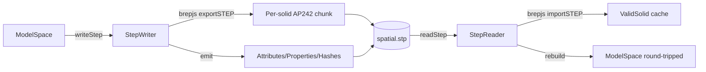

# Spatial STEP AP242 Roundtrip

Source spec: [.repo/✍️/spatial-step-export-import.md](.repo/%E2%9C%8D%EF%B8%8F/spatial-step-export-import.md). It pins the file to exactly six pillars (ModelSpace, Model, Object, Primitive, Attribute, Property) and forbids serializing Actions/Interactions/Transformations.

## Current state

- brepjs is `opencascade.js`-backed and exposes `exportSTEP`, `exportSTEPConfigured`, `exportAssemblySTEP`, and `importSTEP` (see `c:\git\semio\spatial\js\node_modules\brepjs\dist\brepjs.js`). It can write/read geometry but cannot attach metadata to shapes and has no JSON IO.
- Our spatial layer already keeps an out-of-band sidecar: [`AttributeStore`](spatial/js/core/index.ts) at line 327, attached to `Model.metadata` at line 1006. `Model.toJSON` / `fromJSON` cover JSON IO for primitives + objects but do not yet persist `AttributeStore` and have no STEP path.
- `ModelSpaceJson` (line 1140) covers the linked-model container.
- Properties are derived (`derivePropertyDefinitionForObject`, line 1597); they are not stored, so on STEP export they must be re-derived per object.
- The brepjs `ValidSolid` cache lives in the kernel (`solids = new Map<SolidRef, ValidSolid>` at line 1611 of [`spatial/js/kernel-brepjs/index.ts`](spatial/js/kernel-brepjs/index.ts)) — that gives us a Shape3D handle per `SolidRecord`.

## Six-pillar STEP mapping (matches the spec)

| Pillar | AP242 entity | Anchor in code |
| --- | --- | --- |
| ModelSpace | root `PRODUCT` + `PRODUCT_DEFINITION` (assembly) | `ModelSpace` |
| Model | child `PRODUCT_DEFINITION` linked via `NEXT_ASSEMBLY_USAGE_OCCURRENCE` | `Model` |
| Object | leaf `PRODUCT_DEFINITION` (`name = typologyId`) | `SpatialObjectRecord` |
| Primitive | Part 42 topology written via brepjs `exportSTEP` of the cached `ValidSolid`, plus our `KernelGeometryJson` shadow records (for non-solid primitives that brepjs cannot author) | kernel `solids`, `Model.faces/edges/...` |
| Attribute | `SHAPE_ASPECT` + `PROPERTY_DEFINITION` + `DESCRIPTIVE_REPRESENTATION_ITEM` pointing at the primitive entity id | `AttributeStore` |
| Property | `PRODUCT_DEFINITION_SHAPE` + `PROPERTY_DEFINITION` + `REAL`/`DESCRIPTIVE_REPRESENTATION_ITEM` pointing at the Object | derived via `listApplicablePropertyDefinitions` |

A `Spatial_Hash` `PROPERTY_DEFINITION` is appended per primitive root using the existing `hash*Record` family so the ModelSpace sync rule (same hash ⇒ same edit) is recoverable on import without trusting brepjs entity reuse.

## Architecture

Implementation lives entirely in [`spatial/js/kernel-brepjs/index.ts`](spatial/js/kernel-brepjs/index.ts) (per the rule against new files). Pure utilities (entity numbering, escaping, attribute serialization that doesn't need brepjs) go into [`spatial/js/core/index.ts`](spatial/js/core/index.ts) inside a new `// #region 🪜StepRoundtrip` block.

## Key code additions

In `core/index.ts` (new `#region 🪜StepRoundtrip`):

- `stepEscape(s: string): string` and `stepNumber(n: number): string` helpers.
- `class StepEntityWriter` with `next(): number` and `emit(id, line)`.
- `serializeAttributeStoreToStep(store: AttributeStore, anchorMap)` and inverse `applyStepAttributesToModel`.
- Extend `AttributeStore` with `entries(): Iterable<[id, Record<string, unknown>]>` so the writer can iterate it (currently `byId` is private).
- Extend `ModelJson` / `ModelSpaceJson` with optional `metadata` so JSON IO is also lossless (parallel benefit; same shape consumed by STEP writer).

In `kernel-brepjs/index.ts` (new `#region 🪜StepRoundtrip`):

- `exportModelSpaceToStep(space: ModelSpace, kernel: BrepjsKernel): string` — walks `space.models`, emits the AP242 header, writes the six-pillar entities, embeds per-solid brepjs STEP chunks via `exportSTEPConfigured({ schema: 'AP242_MANAGED_MODEL_BASED_3D_ENGINEERING_MIM_LF' })` with id-rewriting (renumber lines so each chunk shares the file's `StepEntityWriter` counter).
- `importStepToModelSpace(stepText: string, kernel: BrepjsKernel): ModelSpace` — uses brepjs `importSTEP` to recover `ValidSolid` per `MANIFOLD_SOLID_BREP`, then rebuilds the kernel geometry buckets from the brepjs topology iterators we already use (`iterTopo`, `getFaces`, `getEdges`, `getVertices`) so resulting `Model` matches what a JSON load would produce.
- `exportModelToStep(model, kernel)` convenience for the single-Model case (wraps ModelSpace with one entry).

Behavioral elements (Actions, Interactions, Transformations) are explicitly NOT written, per the spec's "only six elements" clause. They live in code/assets only.

## ModelSpace primitive sharing

For each `SolidRecord` we compute `hashSolidRecord(...)` and dedupe at write time: solids with the same hash across linked models reference the same brepjs STEP chunk, fulfilling the "edit one → edit all with same hash" contract through native STEP `#id` sharing.

## Tests (extend existing files, no new files)

- [`spatial/js/core/index.ts`](spatial/js/core/index.ts) test block: add cases in the existing `@spatial/js-core metadata` describe block — STEP escape/number helpers, `AttributeStore.entries`, `ModelJson` metadata roundtrip.
- [`spatial/js/kernel-brepjs/index.ts`](spatial/js/kernel-brepjs/index.ts) test block: extend the existing in-file `import.meta.vitest` block with:
  - "exports a single-box Model to AP242 and reimports identical primitives + attributes + objects"
  - "ModelSpace with two linked models that share a box hash dedupes to one brepjs solid in STEP"
  - "attribute on a face roundtrips via SHAPE_ASPECT"
  - "derived property (uValue) is re-derived on import (not stored)"
  - "Action/Interaction entities are absent from the produced STEP text"

All run with `bun nx test @spatial/js-kernel-brepjs` and `bun nx test @spatial/js-core` (already registered in `project.json`).

## Tracking

Open ticket `spatial-step-roundtrip` under the most appropriate goal via `ticket_open` before code work; close with `ticket_close` listing all touched files when done.
