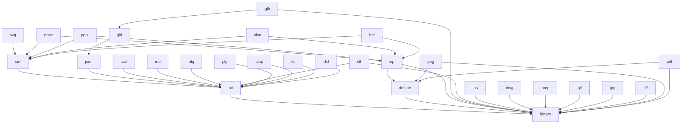

## Scale reality check

Confirmed on disk: 54 artifacts across 32 plugins, 383 mutation nodes, 1,152 existing `🚪️io` leaves, 210 `📖️component.grammar.semio` + 108 `📡️component.protocol.semio` files. None of `ebnf`/`g4`/`ksy`/`spicy`/`abnf` exist yet (0 files).

With the decisions taken (all spec languages handcrafted now, full schema absorb, all 26+ codecs spec-compliant, curated io matrix), this lands roughly **4,100 new files and 2,700 relocated files, plus 29 hand-rolled real codecs**. It must be sequenced so dependencies exist before consumers.

---

## Decision 1: New vocabulary

Added to [taxonomy.json](🧰️framework/🛍️products/🦑️repo/🔨️modules/📚️library/🔣️taxonomy.json), which is the single source of truth for all four twins.

- New artifact facets: `🏗️builder`, `🪓️decomposer`
- Removed from artifact root (absorbed): `🗣️dsl`, `🔧️op`, `📡️spr`, `🔺️diff`, `📸️snapshot`
- `schemaChildDirs`: `📸️snapshot`, `🔺️diff`, `🧬️mutations`
- `representationDirs`: `📝️text`, `💾️binary`
- `ioDirectionDirs`: `📥️import`, `📤️export`; `ioDirectionChildDirs`: `📥️import` to `🧩️deserializers`, `📤️export` to `🧵️serializers`; both then nest `🗿️artifacts/<artifact>`
- Deleted: `mediaFormatDirs`, `ioFormatChildDirs`, `snapshotChildDirs`, `diffChildDirs`

`textSpecFilenames` (8 per text node): `📖️component.grammar.semio`, `🔤️component.ebnf`, `🅰️component.g4`, `🔗️component.graphql`, `🔣️component.json`, `🛰️component.proto`, `🦀️component.rs`, `🟦️component.ts`

`binarySpecFilenames` (6 per binary node): `📡️component.protocol.semio`, `🔠️component.abnf`, `🥋️component.ksy`, `🌶️component.spicy`, `🦀️component.rs`, `🟦️component.ts`

## Decision 2: Old-to-new path map (applies to all 54 artifacts)

- `🗣️dsl/` to `🧬️schema/📸️snapshot/📝️text/`
- `📸️snapshot/🎒️pack/` to `🧬️schema/📸️snapshot/💾️binary/`
- `📸️snapshot/🧬️schema/` (5 leaves) to `🧬️schema/📸️snapshot/` root
- `🔺️diff/` grammar+rs+ts to `🧬️schema/🔺️diff/📝️text/`; `🔺️diff/🧬️schema/` to `🧬️schema/🔺️diff/` root; `🧬️schema/🔺️diff/💾️binary/` is new
- `🔧️op/` to `🧬️schema/🧬️mutations/📝️text/`
- `📡️spr/` to `🧬️schema/🧬️mutations/💾️binary/`
- `🧬️mutations/<m>/{🦠️mutation,🔺️diff,↩️inverse}/` to `🧬️schema/🧬️mutations/<m>/{…}/`
- `🧬️schema/` 5 leaves stay as the artifact-level schema
- `🚪️io/<format>/{📥️import,📤️export}/` to `🚪️io/📥️import/🧩️deserializers/🗿️artifacts/<stdio-artifact>/` and `🚪️io/📤️export/🧵️serializers/🗿️artifacts/<stdio-artifact>/`
- New: `🏗️builder/`, `🪓️decomposer/`

`exampleAssetKindPrefixes` in taxonomy still keys on `dsl`/`op`/`spr`/`pack`; it must be re-keyed to the new representation paths.

## Decision 3: stdio plugin and its dependency DAG

New plugin `✏️s/🔌️plugins/🗄️stdio/`, zero apps, modelled on `✏️s/🔌️plugins/🔋️energy` which already proves `Plugin::builder(id).label(..).version(..).library()` works with no `🎛️apps/` and no playground. 29 artifacts: the 26 rows of [mimes.csv](🧰️framework/🔨️modules/🖼️assets/📃️list/📋️mimes.csv) plus three new terminals/intermediates `binary`, `xml`, `deflate`.



A new rule `policyIoTerminalityBreaches` proves this graph is acyclic and every path terminates at `binary`.

## Decision 4: Contracts

Added to the plugin SDK at [🔌️plugin/🦀️component.rs](🧰️framework/🛍️products/💻️os/🔨️modules/🔌️plugin/🦀️component.rs), delegating to the existing `DocumentDsl` / `DocumentPack` / `Mutation` / `MutationDiff` / `ArtifactEngine` traits rather than reimplementing them.

```rust
pub trait ArtifactBuilder: Sized {
    type Snapshot; type Mutation; type Diff;
    fn empty() -> Self;
    fn from_snapshot(snapshot: Self::Snapshot) -> Self;
    fn from_text(text: &str) -> Result<Self, TextError>;
    fn from_binary(bytes: &[u8]) -> Result<Self, PackError>;
    fn mutate(self, mutation: Self::Mutation) -> Self;
    fn absorb(self, diff: Self::Diff) -> Self;
    fn build(self) -> Result<Self::Snapshot, Vec<Diagnostic>>;
}

pub trait ArtifactDecomposer: Sized {
    type Snapshot; type Parts;
    fn decompose(sources: &[DecomposeSource]) -> Decomposition<Self::Parts>;
}

pub struct Decomposition<T> { pub parts: T, pub confidence: Confidence, pub diagnostics: Vec<Diagnostic> }
```

`Decomposition` carries `Diagnostic` + `Severity` from `🗣️dsl/⚠️diagnostic`, not `Fault` — `Fault` is the hard-abort type and cannot express partial success. Both traits are re-exported from every plugin's Rust crate and TS barrel, since they are the cross-plugin utility surface.

## Decision 5: Deletions in the framework

`MediaFormat` (26 variants, `🧰️framework/🔨️modules/🔺️mesh/🦀️component.rs:816-1001`) and every codec below it are deleted; format identity becomes the stdio artifact kind id. Also deleted: `IoFormatSpec`, `ArtifactIo`, `ArtifactImport`, `ArtifactExport`, `required_media_formats`, `assert_os_media_export_coverage`, `assert_os_media_import_coverage`, `register_2d_export_handlers`, `register_mesh_exporter/importer`, `register_solid_exporter/importer`, `register_dwg_import_handler`, and the `SRAS` / `IFCCARTOONMESH` / "minimal" stub codecs.

The media registry is currently a **duplicated twin** in `💻️os/🦀️component.rs` and `💻️os/🖥️host/🦀️component.rs` (both carry a full `MediaExport` copy plus feature-gated stubs). It collapses to one module keyed `(artifact_kind, format_artifact_kind)` that the host re-exports.

`ArtifactKindSpec.export_formats` / `import_formats` become stdio kind ids derived from the io facet, fixing the current drift (for example `🎥️shooting` declares Svg and Png while its facet declares nine formats). `artifact_kinds` moves from `AppDefinition` to `PluginManifest` with a new `PluginBuilder::artifact_kind`, since a zero-app plugin cannot otherwise declare kinds.

---

## Waves

Every wave ends on a machine-checked gate; nothing proceeds while a gate is red. Models: `cursor-grok-4.5-high` for design, hard algorithms, and heavy artifacts; `composer-2.5` for high-volume mechanical fan-out.

**W0 — Ticket and normative spec.** 1 Grok. Read `repo://goals`, open the ticket, write the normative spec (vocabulary, per-facet file manifest, old-to-new path map, curated io matrix owner table for all 54 artifacts, stdio roster and DAG, trait signatures, gate list) plus the fan-out brief every later agent reads.

**W1 — Vocabulary, four twins, policies.** 1 Grok + 1 Composer. Rewrite `artifactFacetPathIsDeclared` in [discovery/🟦️component.ts](🧰️framework/🛍️products/🦑️repo/🔨️modules/📚️library/🔍️discovery/🟦️component.ts) to support **wildcard levels** — today it only chains fixed facet-to-child allowlists and cannot express `<artifact>` or `<mutation>` segments. Then update `validateTaxonomy()`, registry `validateTaxonomyTree`, Rust `assert_taxonomy_components`, and root `policyTaxonomyDirsBreaches`. New rules: `policyStdioCatalogBreaches`, `policyArtifactBuilderBreaches`, `policyArtifactDecomposerBreaches`, `policySchemaRepresentationBreaches`, `policyIoSerializerMatrixBreaches`, `policyIoTerminalityBreaches`, `policyCodecFidelityBreaches`. Deleted rules: `policyMediaFormatCatalogBreaches`, `policyArtifactIoFacetCompletenessBreaches`, `policyArtifactIoLeafParityBreaches`, `policyArtifactIoNoEngineIoBreaches`, `policyArtifactSchemaPackRelocationBreaches`. New gates registered in [launch.seed.jsonc](.vscode/🧩️launch.seed.jsonc).

**W2 — stdio skeleton and three reference artifacts.** 1 Grok + 2 Composer. Plugin crate, `📦️glue.rs`, `📋️project.json`, `📜️script.ts`, TS package, the four `🔌️plugin/` stubs including the required empty `🎛️apps/🦀️component.rs`, and the root `Cargo.toml` workspace member. Then `binary`, `txt`, `json` complete end to end as the verbatim template.

**W3 — SDK and registry.** 1 Grok + 1 Composer. Builder/decomposer traits, `PluginBuilder::artifact_kind`, the de-duplicated handler registry, and every framework deletion from Decision 5.

**W4 — 29 real codecs, 29 parallel agents.** Two sub-waves because of the DAG. W4a: `binary`, `txt`, `json`, `xml`, `deflate`, `zip`, `csv`, `md` — Grok owns `deflate` and `zip` (inflate plus deflate, CRC32, Adler32). W4b: the remaining 21 in parallel — Grok owns `png`, `jpg`, `tiff`, `pdf`, `dwg`, `step`, `ifc`; Composer owns the rest. Each artifact ships real sample files as `📚️examples` assets that double as conformance fixtures, with tests cross-checked against established third-party decoders (permitted: external libraries for testing only).

**W5 — Two pilot domain artifacts.** 2 Grok, `🗒️note` and `📐️cad`. Full schema absorb, builder, decomposer, and io rewritten through stdio artifacts. Output is the verbatim reference for W6.

**W6 — Fan-out to the remaining 52 artifacts, 32 agents.** One agent per plugin. Grok for the heavy ones (`🏛️architect` at 72 mutation nodes, `📸️remodel` 20, `🧱️block/🖐️5d` 18, `🏗️fem` 18+18, `🧱️block/🧊️3d` 15, `🖍️draw` 15, `🧱️block/◻2d` 14); Composer for the rest, including `📕️norm` which holds 15 artifacts with one mutation each. Each agent moves its facets, handcrafts the 8 text and 6 binary spec leaves per representation node, writes builder and decomposer, rewrites io against its curated matrix row, patches `📦️glue.rs` and the TS barrel, and deletes the old facets.

**W7 — Host, UI, and catalog integration.** 1 Grok + 1 Composer. Rewire the Space Studio media commands, `HostEffect::DownloadMediaExport` and `RequestFileOpen`, derive the file-picker accept filter from stdio artifact declarations, update the WASM bridge, export builder/decomposer from every TS barrel, and make `📋️mimes.csv` derived from the stdio artifacts — deleting the stale duplicate at `🧰️framework/🔨️modules/🖱️ui/🖼️assets/📃️list/📋️mimes.csv`.

**W8 — Aggregate gate and close.** 1 Grok. Full `bun ./📜️script.ts policy`, `plugin-registry check` and `generate`, `cargo test` across all plugin crates, launch.json freshness, a round-trip conformance matrix report, then close the ticket.

## Concurrency rules for the workforce

Because agents edit shared files simultaneously and no modifying git command may be used, ownership is exclusive: W1, W3, and W7 are the only waves permitted to touch `🔣️taxonomy.json`, root `📜️script.ts`, root `Cargo.toml`, `launch.seed.jsonc`, and the framework `os`/`os/host` components. W4 and W6 agents are confined to their own plugin subtree and its `📦️glue.rs`. All temporary generators, logs, and reports live inside the ticket folder and are not deleted.

## Gates

- `bun ./📜️script.ts policy` — 0 breaches
- `bun nx run @semio-tech/plugin-registry:check` and `:generate`
- `cargo test -p semio-s-plugin-stdio` — codec conformance round-trips
- `cargo check` per touched plugin crate
- `policyCodecFidelityBreaches` — 0, proving no stub markers survive
- `policyIoSerializerMatrixBreaches` and `policyIoTerminalityBreaches` — 0