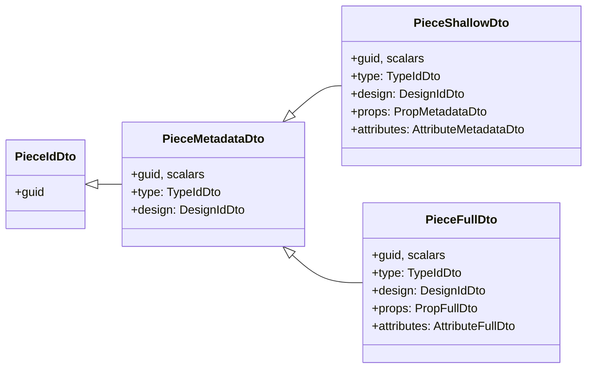

## Target per entity

Every entity file (`piece.rs`, `design.rs`, `kit.rs`, ...) exposes exactly six types plus one impl block:

- `XStore` — the in-memory rich object (previously `X`). `Arc<RwLock<XStore>>` for owned children, `Weak<RwLock<XStore>>` for parent/reference back-references, `OnceLock<_>` for derived caches.
- `XIdDto` — `{ guid }` only.
- `XMetadataDto` — `guid` + scalar fields + cross-entity refs as `*IdDto`. No owned-collection arrays.
- `XShallowDto` — all of metadata + each owned collection as `Vec<*MetadataDto>`.
- `XFullDto` — all of metadata + each owned collection as `Vec<*FullDto>`.

Rule confirmed with user: **cross-entity references are always `*IdDto` in every tier** (no cycles, no pointer types inside DTOs). Only owned collections change shape between tiers.

Field names are identical across tiers (`guid`, `name`, `description`, `plane`, `center`, `type`, `design`, ...), so a client can deserialize any tier from the same wire schema.

Example sketch for `piece.rs`:

```rust
pub struct PieceStore {
    pub guid: Guid,
    design: Weak<RwLock<DesignStore>>,
    type_ref: Option<Weak<RwLock<TypeStore>>>,
    state: RwLock<PieceState>,
    hash: OnceLock<String>,
    flat_plane: OnceLock<Plane>,
    flat_center: OnceLock<Coord>,
}

#[derive(Serialize, Deserialize)] pub struct PieceIdDto { pub guid: Guid }
#[derive(Serialize, Deserialize)] pub struct PieceMetadataDto { pub guid: Guid, /* scalars */ pub r#type: Option<TypeIdDto>, pub design: Option<DesignIdDto> }
#[derive(Serialize, Deserialize)] pub struct PieceShallowDto  { /* metadata fields */ pub props: Vec<PropMetadataDto>, pub attributes: Vec<AttributeMetadataDto> }
#[derive(Serialize, Deserialize)] pub struct PieceFullDto     { /* metadata fields */ pub props: Vec<PropFullDto>,     pub attributes: Vec<AttributeFullDto> }

impl PieceStore {
    pub fn from_id_dto(d: PieceIdDto) -> Self;
    pub fn from_metadata_dto(d: PieceMetadataDto) -> Self;
    pub fn from_shallow_dto(d: PieceShallowDto) -> Self;
    pub fn from_full_dto(d: PieceFullDto) -> Self;
    pub fn to_id_dto(&self) -> PieceIdDto;
    pub fn to_metadata_dto(&self) -> PieceMetadataDto;
    pub fn to_shallow_dto(&self) -> PieceShallowDto;
    pub fn to_full_dto(&self) -> PieceFullDto;

    pub fn flat_plane(&self)  -> Plane;   // walks Design via Weak, caches OnceLock
    pub fn flat_center(&self) -> Coord;   // walks Design via Weak, caches OnceLock

    pub fn set_plane(&self, p: Option<Plane>);  // invalidates own caches + bubbles flatten invalidation to Design
    // ...setters per field
}
```

## DTO tier cheat-sheet



## What gets deleted outright

- `FlattenedDesign` and `FlattenedPiece` in [semio/rs/src/design.rs](semio/rs/src/design.rs) and [semio/rs/src/piece.rs](semio/rs/src/piece.rs). `Design::flatten(&self) -> FlattenedDesign` becomes per-piece `PieceStore::flat_plane()` / `flat_center()`.
- All single-tier `*Dto` structs (`PieceDto`, `DesignDto`, `KitDto`, `TypeDto`, `ConnectorDto`, `PortDto`, `RepresentationDto`, `LayerDto`, `GroupDto`, `SideDto`, `ConnectionDto`, `QualityDto`, `FileDto`, `FolderDto`) and their `From<&X> for XDto` / `impl X { fn from_dto }` chains.
- `Kit::from_dto(KitDto) -> KitRef`, `Kit::to_dto`, `Type::from_dto`, `Design::from_dto` — replaced by tier-specific constructors and serializers on each `XStore`.
- `Kit::flatten_design`, the single-tier `FlattenedDesign` it returned.

## What changes shape

- [semio/rs/src/diff.rs](semio/rs/src/diff.rs) — `DesignDiff` fields become `Vec<Piece{Full|Id}Dto>` / `Vec<Connection{Full|Id}Dto>`; `DesignChange.before / after` become `DesignFullDto`. `Design::flatten_change` / `Design::delete_change` become `DesignStore::flatten_change` / `delete_change` and return `SemioReport<DesignChange>` built from the new DTOs.
- [semio/rs/src/session.rs](semio/rs/src/session.rs) — `Kit` → `KitStore`, `KitRef = Arc<RwLock<KitStore>>`; API preserved.
- [semio/rs/src/io/json.rs](semio/rs/src/io/json.rs) — `KitStore::from_json_str(s)` parses `KitFullDto` then hydrates; `KitStore::to_json_pretty()` emits `KitFullDto`.
- [semio/rs/src/wasm.rs](semio/rs/src/wasm.rs) — bindings keep JS-visible names; bodies call the new `from_full_dto` / `to_full_dto` pair.
- [semio/rs/src/lib.rs](semio/rs/src/lib.rs) — re-exports switch from `Piece` → `PieceStore` and expose the four DTO names per entity.
- [semio/algorithms/native-bridges/rs/src/main.rs](semio/algorithms/native-bridges/rs/src/main.rs) — `KitDto` → `KitFullDto`; `Kit::from_dto` → `KitStore::from_full_dto`; `kit.design(g)` → `kit.design(g)` (still a lookup on `KitStore`); `design.flatten_change` / `Design::delete_pieces_and_connections_ref` → `DesignStore::flatten_change` / `DesignStore::delete_change`.

## What stays (infrastructure, non-entity)

- `Guid`, `HashWriter`, `SemioError` / `Result`, `OperationNote`, `NoteSeverity`, `SemioReport`, `ValidationResult`.
- `Coord`, `Vector`, `Plane`, `Camera`, `Location` — pure value types inlined into every tier as-is.
- `KitGraphSession` — owns `Arc<RwLock<KitStore>>`.
- `DesignDiff` / `DesignChange` — change-flow DTOs (not per-entity); kept but rewired onto the new tiers.

## Rename map (short summary)

| before                                                                                                                                                                                   | after                                              |
| ---------------------------------------------------------------------------------------------------------------------------------------------------------------------------------------- | -------------------------------------------------- |
| `Kit`, `KitRef`, `KitWeak`                                                                                                                                                               | `KitStore`, `KitStoreRef`, `KitStoreWeak`          |
| `Design`, `DesignRef`, `DesignWeak`                                                                                                                                                      | `DesignStore`, `DesignStoreRef`, `DesignStoreWeak` |
| `Piece`, `PieceRef`, `PieceWeak`                                                                                                                                                         | `PieceStore`, `PieceStoreRef`, `PieceStoreWeak`    |
| `Type`, `Connection`, `Connector`, `Port`, `Representation`, `Layer`, `Group`, `Side`, `Quality`, `File`, `Folder`, `Benchmark`, `Stat`, `Concept`, `Tag`, `Author`, `Attribute`, `Prop` | same pattern (`XStore`, `XStoreRef`, `XStoreWeak`) |

(`Location`, `Coord`, `Vector`, `Plane`, `Camera` stay as value types — they are not stores.)

## Verification

- `cargo build -p semio` — clean.
- `cargo build --manifest-path semio\algorithms\native-bridges\rs\Cargo.toml` — clean.
- `cargo build -p semio --target wasm32-unknown-unknown` — compiles (target already supported in Cargo.toml).
- `cargo clippy -p semio -- -D warnings` — no warnings on the rewritten crate.
- Round-trip sanity (no tests required, per the previous directive): read any existing kit JSON via `KitStore::from_json_str` → re-emit via `to_json_pretty` → structurally equivalent.

## Out of scope

- SQLite / ZIP I/O remain stubs returning `SemioError::InvalidOperation` until the JSON tier is stable.
- Full connection-graph resolution inside `PieceStore::flat_plane` / `flat_center` ships as the deterministic identity walk (pose from `self.state.plane` / `self.state.center`, falling back to `Plane::world_xy()` / `Coord::ZERO`) plus one-hop propagation for pieces whose `Side` participates in a connection. The full N-hop transitive resolver is tracked as a follow-up but the method seam is the final one.
- Tests are not ported in this pass (per user directive).
