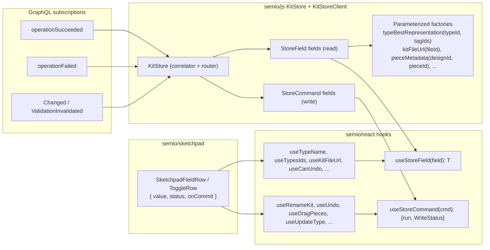

# Strict read / write hooks via StoreField + StoreCommand

## Target shape




The new contract is:

- A read hook returns the value only: `useTypeName(typeId): string`. No `WriteStatus`, no setter.
- A write hook returns `[run, WriteStatus]`: `useRenameType(): [(args) => Promise<SetResult>, WriteStatus]`. No value.
- Read + write of the same field are two separate hooks the consumer composes.

## Scope of deletion

In [semio/js/index.ts](semio/js/index.ts):

- Public `KitStoreClient.submitChangeKitCommands` and `KitStoreClient.fetchFullKit` move to `private` on `WasmKitStoreClient` / `FallbackKitClient` (only the StoreCommand executors call them).
- Delete `writeKitStoreClientSchemaField`, `kitStoreClientAddChildByKind`, `kitStoreClientRemoveChildByKind`, `submitChangeKitCommandsToClient` and the standalone `kitChangeDesign{Piece,Connection}` shorthands once their hook callers move to commands. Keep `ChangeKitCommand` builders that the new commands need internally.

In [semio/react/index.tsx](semio/react/index.tsx):

- Delete types `HookTriad<T>`, `HookRead<T>`, helper `kitReadonlyTriad`.
- Delete hooks `useDraft`, `useOptimistic`, `useSemioReadSnap`, `useSemioStoreSelector`, `useSchemaObjectState`, `useSchemaFieldState` and every auto-generated `use<Schema><Field>` (Actor / User / Agent / Coordinate / Point / Vector / Plane / Camera / Attribute / Author / Concept / Tag / Quality / Prop / Stat / Group / Layer / Type / Design / Piece / Connection / Kit / SessionActorInput / Folder / File / etc).
- Delete `useWriteQueue`, `useKitSync` (replaced by per-command `WriteStatus` aggregation if needed).
- Replace every read-with-`HookTriad`/`HookRead` hook with a value-only read.
- Replace every write hook that uses `useState<WriteStatus>` ad-hoc with `useStoreCommand(client.<command>)`.

In [semio/sketchpad/index.tsx](semio/sketchpad/index.tsx):

- Delete `SketchpadTriadInputRow`, `SketchpadTriadToggleRow` and replace with a new `SketchpadFieldRow({ value, status, onCommit, ... })` and `SketchpadToggleFieldRow({ value, status, onCommit })` that take separated read/write inputs.
- Update every call site (kit / type / design / folder / file detail panels and footer/navbar status). Every `const [v, set, st] = useXxx()` becomes `const v = useReadXxx(); const [run, st] = useWriteXxx();`.

## Phase 1 - KitStore + client surface ([semio/js/index.ts](semio/js/index.ts))

Add to `KitStore` (and mirror on `WasmKitStoreClient` getters + `FallbackKitClient`):

- Static `StoreField`s seeded from the opening DTO and refreshed by the operation/event subscriptions:
  - `kitName` (already exists), `kitMetadata`, `kitDescription`, `kitIcon`, `kitImage`, `kitPreview`, `kitVersion`, `kitRemote`, `kitHomepage`, `kitLicense`, `kitUri`, `kitCreatedAt`, `kitUpdatedAt`.
  - `typesIds`, `designsIds`, `typesShallow`, `designsShallow`, `typesMetadata`, `designsMetadata`, `typesFull`, `designsFull`, `filesFull`, `tagsFull`, `authorsShallow`, `authors`.
  - `kitColoredConnectors`, `kitDesignsShallow`, `kitTypesShallow`, `kitAuthorsShallow`.
  - `canUndo`, `canRedo`, `kitFileState`, `kitPersistenceKind`, `kitPersistenceSource`, `kitSnapshot` (= materialized `KitFullDto`).
- Parameterized factories on `KitStoreClient` (each returns a memoized `StoreField<T>`; identity is keyed by serialized args):
  - `typeBestRepresentation(typeId, tagIds): StoreField<unknown>`
  - `kitFileUrl(fileId): StoreField<string | null>`
  - `pieceMetadata(designId, pieceId): StoreField<PiecePlacementRowDto | undefined>`
  - `pieceFlatPlane(designId, pieceId)`, `pieceFlatCenter(designId, pieceId)`
  - `isConnectedPiece(designId, pieceId)`, `pieceDepth(designId, pieceId)`, `fixedPieceId(designId, pieceId)`, `parentPieceId(designId, pieceId)`, `pieceParentConnection(designId, pieceId)`
  - `kitPieces(designId)`, `kitConnections(designId)`, `includedDesigns(designId)`
  - `designClusterableGroups(designId, selection)`, `designQualitySum(designId, qualityId)`
  - `replacableTypes(designId, pieceIds)`, `replacableDesigns(designId, pieceIds)`, `explodeableDesignNodes(designId)`
  - Per-entity field factories `typeName(typeId)`, `typeIcon(typeId)`, ..., `designName(designId)`, ..., `pieceDescription(designId, pieceId)`, ... (only the ones today's hooks/sketchpad rows actually consume - exact list audited from the deleted `useSchemaFieldState` call sites in sketchpad).

Internally each parameterized factory returns the cached `StoreField`, lazily fetches via the existing GraphQL helpers (e.g. `gqlKitReadOnlyScope`, `runScopedTransactionBatch`), invalidates on the relevant `subscribeRootInvalidation` / `operationSucceeded` rows, and wires last-error onto the field via the existing `WriteStatus` slot only on the *command* side.

- `StoreCommand`s on `KitStore` (and exposed on `KitStoreClient`):
  - Already: `renameKit`.
  - Add: `undo`, `redo`, `clusterPieces`, `dragPiecesInDesign`, `movePieces`, `fixPieces`, `flattenDesign`, `expandDesign`, `deleteConnection`, `addConnections`, `removeConnections`, `changePieceType`.
  - Per-entity: `createType / deleteType / updateType`, `createDesign / deleteDesign / updateDesign`, `createAuthor / deleteAuthor / updateAuthor`, `createQuality / deleteQuality / updateQuality`, `createPort / deletePort / updatePort`, `createTag / deleteTag / updateTag`, `createConcept / deleteConcept`, `addFile / removeFile / updateFile`, `createFolder / deleteFolder / updateFolder`, `moveToFolder`, `moveKitArtifactToFolder`.
  - `importKit`, `exportKit` (kept readonly until backed; expose as `StoreCommand` whose status field is seeded `SCHEMA_HOOK_READONLY_STATUS`).

Each `StoreCommand` has a single typed `TArgs` (object). Examples:

```ts
client.dragPiecesInDesign : StoreCommand<{ designId: string; pieceIds: readonly string[]; offset: { u: number; v: number } }>
client.updateType : StoreCommand<{ id: string; key: string; value: unknown }>
client.flattenDesign : StoreCommand<{ designId: string }>
client.undo / client.redo : StoreCommand<void>
```

Subscriptions: extend `dispatchCorrelationEnvelope` / `startCorrelationSubscriptions` so that `operationSucceeded` (typed by `OperationKind`) routes to the matching `StoreField`s (e.g. a `RenamedKit` payload updates `kitName`, an `AddedType` payload appends to `typesIds` and refreshes `typesMetadata`, etc.). The router pattern is already in place via `OperationRouter` - this phase only widens it.

Drop public methods that no longer have callers (`KitStoreClient.submitChangeKitCommands`, `fetchFullKit`); keep them on the concrete classes as `private` so commands can still call them internally.

Embedded tests in [semio/js/index.ts](semio/js/index.ts) get one new `describe` per family asserting that:

- The opening DTO seeds every static field.
- Each `StoreCommand` resolves with `{ ok: true }` and bumps the matching read field.
- Parameterized factories return identical `StoreField` objects for identical args (memoization) and disposed on `KitStore.dispose`.

## Phase 2 - React hook layer ([semio/react/index.tsx](semio/react/index.tsx))

- Keep `useStoreField`, `useStoreCommand`, `useKitName`, `useRenameKit` as the canonical primitives.
- Add `useStoreFieldFactory<TArgs, T>(factory, args): T` that memoizes the produced `StoreField` by stable JSON-of-args key. Used internally by every parameterized read hook.
- Rewrite every existing read hook to one of the two shapes:
  - Static: `export function useTypesIds(): readonly string[] { return useStoreField(useKitStoreClient()!.typesIds); }`
  - Parameterized: `export function useKitFileUrl(fileId?: string): string | null { const c = useKitStoreClient(); return useStoreFieldFactory((id) => c!.kitFileUrl(id), [fileId]); }`
- Rewrite every existing write hook to: `export function useUndo() { return useStoreCommand(useKitStoreClient()!.undo); }`. Multi-arg hooks expose `[run(args), status]`.
- Delete bulk schema generators. The hooks that survive are only those that have a real consumer in sketchpad / external apps; the audit script `rg "useActor|useUser|useAgent|useCoordinate|usePoint|useVector|usePlane|useCamera|useAttribute|useGroup|useLayer|useStat|useProp|useFile\\(" semio` confirms zero outside-of-react consumers, so the entire generator block (~lines 5837-7100) is removed.
- Keep `useWriteIndicator(status)` (it is now the only `WriteStatus` UI helper; reads no longer need it).
- Delete `useDraft`, `useOptimistic`, `useSemioReadSnap`, `useSemioStoreSelector`, `useKitSync`, `useWriteQueue`, `useSetErrors` (subsumed by per-command `WriteStatus.lastError`).
- Embedded tests: keep the kit-name suite, add one suite per area exercising the new read/write split (rename / undo / dragPiece / updateType / addFile flows). Tests assert: read hook returns `T` only; write hook returns `[run, WriteStatus]`; `useStoreFieldFactory` returns stable refs across re-renders with identical args.

## Phase 3 - Sketchpad migration ([semio/sketchpad/index.tsx](semio/sketchpad/index.tsx))

- New row primitives:

```tsx
function SketchpadFieldRow<T>(props: {
  id: string;
  value: T;
  status: WriteStatus;
  onCommit: (next: T) => Promise<SetResult>;
  placeholder?: string;
  mapCommit?: (raw: string) => T;
}): React.ReactElement
```

  Same for `SketchpadToggleFieldRow`. Internally uses `useWriteIndicator(status)` for spinner + inline error and `<TreeRow>` / `<Input>` for layout. No coupling to any "triad" type.

- Migrate every existing `<SketchpadTriadInputRow triad={x} ... />` to `<SketchpadFieldRow value={useReadX()} status={writeX[1]} onCommit={writeX[0]} ... />`.
- Replace every `useKitSnapshotTriad()` consumer with `useKitSnapshot()` (the new value-only read returning `KitHostStoreSnapshot | undefined`). Because the legacy `useKitStore()` was a triad-shaped read, replace `const [kitStore] = useKitStore()` with `const kitStore = useKitStore()`.
- Remove the unused `import { type HookTriad }` line and any `useDraft` / `useOptimistic` references.

## Phase 4 - validation

- `npm run depcruise:layers` (root).
- `npx tsc --noEmit` in [semio/js](semio/js), [semio/react](semio/react), [semio/sketchpad](semio/sketchpad).
- `npm test` in [semio/js](semio/js) and [semio/react](semio/react).
- `rg "HookTriad|HookRead|useDraft|useOptimistic|useSchemaObjectState|useSchemaFieldState|writeKitStoreClientSchemaField|kitReadonlyTriad|useSemioReadSnap|SketchpadTriadInputRow|SketchpadTriadToggleRow|submitChangeKitCommands\b" semio` returns zero matches outside of `// removed` markers.
- Manual sketchpad smoke run: type a kit name, observe spinner -> success; rename a type; drag pieces; undo / redo.

## Delivery

This is multi-hour work. After plan acceptance I will split into three short-lived parallel sub-agents (one per phase, in dependency order: Phase 1 -> Phase 2 -> Phase 3, with Phase 4 run by me at the end) per the workspace rule on delegation. The ticket folder is `.repo/🎫/26/05/08/strict-read-write-hooks/` (to be created). All temporary scripts and notes live inside it.