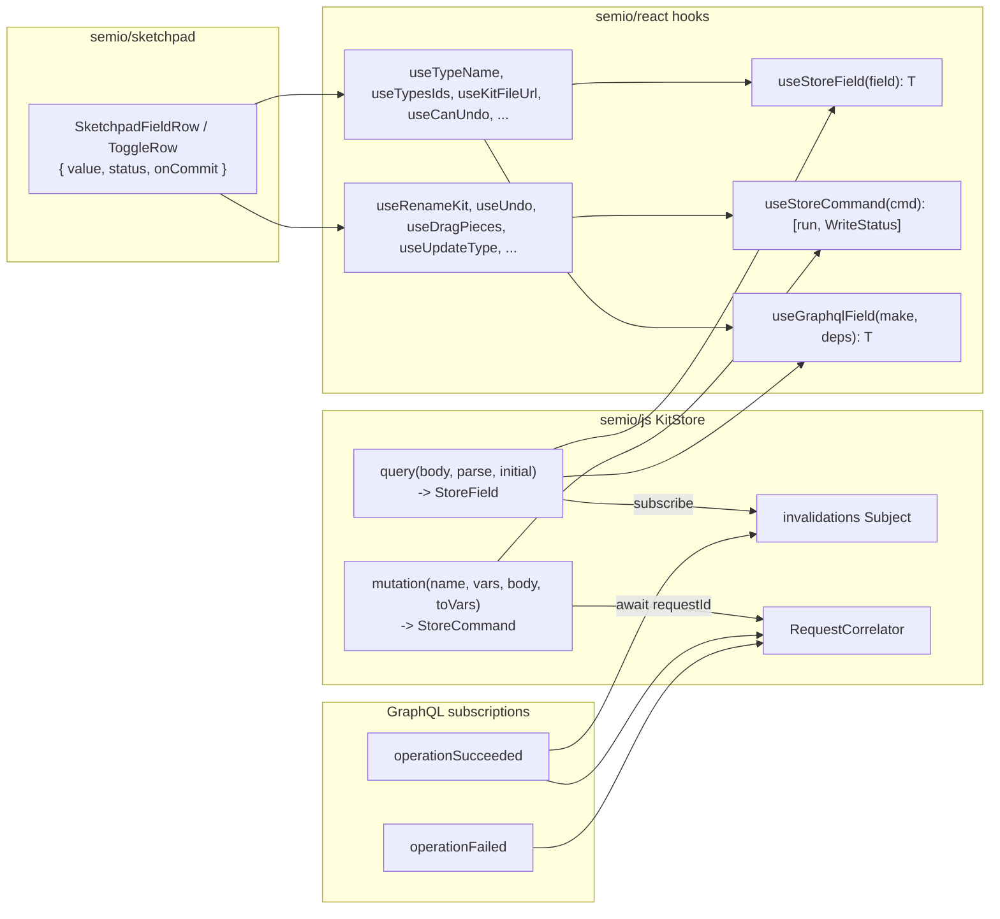

# Strict read / write hooks via StoreField + StoreCommand

## Target shape




Two mechanisms only, and they cannot be confused:

- **Read** = one GraphQL query → `StoreField<T>`. The field exposes `subscribe` / `getSnapshot` / `dispose` and **nothing else**; there is no public `set`. Values are pushed in by the `query` helper via a constructor-time `source` callback. Reads never have side-effects.
- **Write** = one GraphQL operation (`RenameKit`, `DraggedPiece`, `AddedType`, ... -- the SDL `union OperationKind`) wrapped in a draft + transaction → `StoreCommand<TArgs>`. A `StoreCommand` is the only thing in the system that produces side-effects; every side-effect is an operation. The shared `mutation<TArgs>` executor is the only place draft / transaction / correlator code exists.

The new contract is:

- A read hook returns the value only: `useTypeName(typeId): string`. No `WriteStatus`, no setter.
- A write hook returns `[run, WriteStatus]`: `useRenameType(): [(args) => Promise<SetResult>, WriteStatus]`. No value.
- Read + write of the same field are two separate hooks the consumer composes.

## Primitives ([semio/js/index.ts](semio/js/index.ts))

```ts
export type WriteStatus =
  | { kind: "readonly"; pending: 0; lastError?: SetError }
  | { kind: "idle";     pending: 0; lastError?: SetError }
  | { kind: "pending";  pending: number; lastError?: SetError }
  | { kind: "error";    pending: 0; lastError: SetError };

/** @emoji 📥 Read-only typed mirror. Values are pushed in by the `source` callback at construction; consumers cannot mutate. */
export class StoreField<T> {
  constructor(initial: T, source: (push: (next: T) => void) => Unsubscribe) {
    this.subject = new BehaviorSubject<T>(initial);
    this.unsubSource = source((next) => this.subject.next(next));
  }
  subscribe(h: () => void): Unsubscribe { /* BehaviorSubject -> handler */ }
  getSnapshot(): T { return this.subject.getValue(); }
  dispose(): void { this.unsubSource(); /* try { this.subject.complete(); } catch {} */ }
  // NOTE: no `set` method. The only path that writes a value is the `push` closure handed to `source`.
}

/** @emoji 📝 The only side-effect carrier. Always dispatches a GraphQL operation. */
export class StoreCommand<TArgs> {
  readonly status: StoreField<WriteStatus>;
  constructor(exec: (args: TArgs) => Promise<SetResult>) {
    this.status = new StoreField<WriteStatus>(SCHEMA_HOOK_IDLE_STATUS, (push) => {
      this.pushStatus = push;
      return () => {};
    });
    this.exec = exec;
  }
  readonly run = async (args: TArgs): Promise<SetResult> => {
    this.pushStatus(USE_KIT_NAME_PENDING_STATUS);
    const r = await this.exec(args);
    this.pushStatus(r.ok ? SCHEMA_HOOK_IDLE_STATUS : { kind: "error", pending: 0, lastError: r.error });
    return r;
  };
  dispose(): void { this.status.dispose(); }
  private pushStatus!: (next: WriteStatus) => void;
  private readonly exec: (args: TArgs) => Promise<SetResult>;
}

/** @emoji 🚦 request-id <-> Promise resolver. Used inside the shared mutation executor only. */
export class RequestCorrelator {
  await(requestId: string): Promise<SetResult>;
  resolve(requestId: string, r: SetResult): void;
  disposeAll(reason?: string): void;
}
```

Deleted in the same `#region 🧱StorePrimitives`: `OperationRouter`, `OperationEvent`, `StoreField.set` (public method gone), `KitStore.seedFieldsFromDto`, `KitStore.dispatchCorrelationEnvelope` (typed-kind branch), the dedicated `kitRenamed` GraphQL subscription, and `KitStore.fieldCache` / `cachedField` if present.

```tsx
// React-side primitives (kept; no surface change).
export function useStoreField<T>(field: StoreField<T>): T {
  return React.useSyncExternalStore(field.subscribe, field.getSnapshot, field.getSnapshot);
}
export function useStoreCommand<TArgs>(
  cmd: StoreCommand<TArgs>,
): readonly [(args: TArgs) => Promise<SetResult>, WriteStatus] {
  const status = useStoreField(cmd.status);
  return [cmd.run, status] as const;
}
```

## Scope of deletion

In [semio/js/index.ts](semio/js/index.ts):

- Public `KitStoreClient.submitChangeKitCommands` and `KitStoreClient.fetchFullKit` move to `private` on `WasmKitStoreClient` / `FallbackKitClient` (only the StoreCommand executors call them).
- Delete `writeKitStoreClientSchemaField`, `kitStoreClientAddChildByKind`, `kitStoreClientRemoveChildByKind`, `submitChangeKitCommandsToClient` and the standalone `kitChangeDesign{Piece,Connection}` shorthands once their hook callers move to commands. Keep `ChangeKitCommand` builders that the new commands need internally.

In [semio/react/index.tsx](semio/react/index.tsx):

- Delete types `HookTriad<T>`, `HookRead<T>`, helper `kitReadonlyTriad`.
- Delete hooks `useDraft`, `useOptimistic`, `useSemioReadSnap`, `useSemioStoreSelector`, `useSchemaObjectState`, `useSchemaFieldState` and every auto-generated `use<Schema><Field>` (Actor / User / Agent / Coordinate / Point / Vector / Plane / Camera / Attribute / Author / Concept / Tag / Quality / Prop / Stat / Group / Layer / Type / Design / Piece / Connection / Kit / SessionActorInput / Folder / File / etc).
- Delete `useWriteQueue`, `useKitSync` (replaced by per-command `WriteStatus` aggregation if needed).
- Replace every read-with-`HookTriad`/`HookRead` hook with a value-only read.
- Replace every write hook that uses `useState<WriteStatus>` ad-hoc with `useStoreCommand(client.<command>)`.

In [semio/sketchpad/index.tsx](semio/sketchpad/index.tsx):

- Delete `SketchpadTriadInputRow`, `SketchpadTriadToggleRow` and replace with a new `SketchpadFieldRow({ value, status, onCommit, ... })` and `SketchpadToggleFieldRow({ value, status, onCommit })` that take separated read/write inputs.
- Update every call site (kit / type / design / folder / file detail panels and footer/navbar status). Every `const [v, set, st] = useXxx()` becomes `const v = useReadXxx(); const [run, st] = useWriteXxx();`.

## Phase 1 - KitStore + client surface ([semio/js/index.ts](semio/js/index.ts))

Two helpers replace every read/write-specific method in `KitStore` and remove all seeding / typed-event filtering.

### Two helpers + one invalidation tick

`StoreField` has no `set`; the `query<T>` helper only feeds values via the `push` closure handed to the field's constructor. `mutation<TArgs>` is the only thing that calls draft / transaction / correlator code.

```ts
// semio/js/index.ts -- inside KitStore.
import { Subject } from "rxjs";

private readonly invalidations = new Subject<void>();

/** @emoji 🧾 GraphQL-backed read. Pushes `parse(data)` on initial fetch and on every invalidation tick. No public mutator. */
private query<T>(body: string, parse: (data: JsonValue) => T, initial: T): StoreField<T> {
  return new StoreField<T>(initial, (push) => {
    const refetch = async () => {
      try {
        const data = kitGraphqlData(await this.gqlRun({ query: `query { ${body} }` })) as JsonValue;
        push(parse(data));
      } catch {
        /* keep last value; read errors never leak to UI -- only writes carry status */
      }
    };
    void refetch();
    const sub = this.invalidations.subscribe({ next: () => void refetch() });
    return () => sub.unsubscribe();
  });
}

/** @emoji 📝 Transactional GraphQL operation. The single executor for every side-effect in the system. */
private mutation<TArgs>(
  fieldName: string,                                          // e.g. "renameKit"
  variableSignatures: string,                                 // e.g. "$name: String!"
  argList: string,                                            // e.g. "name: $name"
  toVariables: (args: TArgs) => Record<string, JsonValue>,
): StoreCommand<TArgs> {
  return new StoreCommand<TArgs>(async (args) => {
    const draftId = await this.openDraft();
    const transactionId = await this.openTransaction(draftId);
    try {
      const data = kitGraphqlData(await this.gqlRun({
        query: `mutation($draftId: Id!, $transactionId: Id!${variableSignatures ? ", " + variableSignatures : ""}) {
                  ${fieldName}(draftId: $draftId, transactionId: $transactionId${argList ? ", " + argList : ""})
                }`,
        variables: { draftId, transactionId, ...toVariables(args) },
      })) as Record<string, string>;
      const requestId = String(data[fieldName] ?? "");
      if (requestId === "") throw new Error(`${fieldName}: empty requestId`);
      const result = await this.correlator.await(requestId);
      if (result.ok) await this.commitTransaction(draftId, transactionId);
      else await this.abortTransaction(draftId, transactionId);
      return result;
    } catch (e) {
      await this.abortTransaction(draftId, transactionId).catch(() => {});
      return { ok: false, error: { kind: "Internal", message: String(e) } };
    }
  });
}
```

Every kit-store side-effect is one of the operations in SDL `union OperationKind = CreatedFixedPiece | FixedPiece | DraggedPiece | RenamedKit | ChangedDescription | ...`. Each `StoreCommand` exists only to dispatch the matching mutation through `mutation<TArgs>`. Reads can never trigger an operation; operations can never be issued except through a `StoreCommand`.

`operationSucceeded` and `operationFailed` are the only subscriptions; both call `correlator.resolve(...)` and the success path additionally `invalidations.next()`. No `kitRenamed`-specific subscription, no `OperationRouter`, no `seedFieldsFromDto`, no `dispatchCorrelationEnvelope` typed-kind branch.

```ts
private startCorrelationSubscriptions(): void {
  // operationSucceeded { id requestId } -> resolve correlator, then broadcast invalidation.
  this.subscribeOperationSucceeded((requestId) => {
    if (requestId) this.correlator.resolve(requestId, { ok: true });
    this.invalidations.next();
  });
  // operationFailed { kind message requestId } -> resolve correlator with error.
  this.subscribeOperationFailed((requestId, error) => {
    if (requestId) this.correlator.resolve(requestId, { ok: false, error });
  });
}
```

### Defining reads

Every read field is one line. `parse` returns the typed `T` directly (no `JsonObject` leaks out of `KitStore`).

```ts
// semio/js/index.ts -- KitStore constructor.
readonly kitName     = this.query<string>          ("wip { theKit { name } }",                    (d) => String((d as KitNameQuery).wip?.theKit?.name ?? ""), "");
readonly canUndo     = this.query<boolean>         ("wip { canUndo(steps: 1) }",                  (d) => Boolean((d as CanUndoQuery).wip?.canUndo), false);
readonly canRedo     = this.query<boolean>         ("wip { canRedo(steps: 1) }",                  (d) => Boolean((d as CanRedoQuery).wip?.canRedo), false);
readonly typesIds    = this.query<readonly string[]>("wip { theKit { types { edges { node { id } } } } }",
                                                     parseTypesIds, []);
readonly typesShallow = this.query<readonly TypeShallow[]>(
  `wip { theKit { types { edges { node { ${KIT_GQL_TYPE_SHALLOW_FIELDS} } } } } }`,
  parseTypesShallow, [],
);
readonly designsIds  = this.query<readonly string[]>("wip { theKit { designs { edges { node { id } } } } }",
                                                     parseDesignsIds, []);
readonly kitSnapshot = this.query<KitFullDto | undefined>("wip { theKit { fullSnapshot } }", parseKitFullSnapshot, undefined);
// ... rest of static reads ...
```

Parameterized reads are plain factory methods — they construct a fresh `StoreField` and never cache. The React layer disposes them on unmount.

```ts
kitFileUrl(fileId: string | undefined): StoreField<string | null> {
  return this.query<string | null>(
    `wip { theKit { file(id: "${fileId ?? ""}") { url } } }`,
    (d) => ((d as KitFileUrlQuery).wip?.theKit?.file?.url ?? null) as string | null,
    null,
  );
}

pieceMetadata(designId: string, pieceId: string): StoreField<PiecePlacementRowDto | undefined> {
  return this.query<PiecePlacementRowDto | undefined>(
    `pieceInDesign(designId: "${designId}", pieceId: "${pieceId}") { ${KIT_GQL_PIECE_METADATA_FIELDS} }`,
    parsePieceMetadata, undefined,
  );
}

typeName(typeId: string): StoreField<string> {
  return this.query<string>(
    `wip { theKit { type(id: "${typeId}") { name } } }`,
    (d) => String((d as TypeNameQuery).wip?.theKit?.type?.name ?? ""), "",
  );
}
```

### Defining writes (one mechanism for every mutation)

```ts
// semio/js/index.ts -- KitStore constructor.
readonly renameKit          = this.mutation<string>("renameKit",
  "$name: String!", "name: $name",
  (name) => ({ name }));

readonly undo               = this.mutation<void>("undo", "", "", () => ({}));
readonly redo               = this.mutation<void>("redo", "", "", () => ({}));

readonly dragPiecesInDesign = this.mutation<{ designId: string; pieceIds: readonly string[]; offset: { u: number; v: number } }>(
  "dragPiecesInDesign",
  "$designId: Id!, $pieceIds: [Id!]!, $offset: OffsetInput!",
  "designId: $designId, pieceIds: $pieceIds, offset: $offset",
  (a) => ({ designId: a.designId, pieceIds: [...a.pieceIds], offset: a.offset }),
);

readonly flattenDesign      = this.mutation<{ designId: string }>(
  "flattenDesign", "$designId: Id!", "designId: $designId",
  (a) => ({ designId: a.designId }),
);

readonly updateType         = this.mutation<{ id: string; key: string; value: unknown }>(
  "updateType",
  "$id: Id!, $key: String!, $value: AttributeValueInput!",
  "id: $id, key: $key, value: $value",
  (a) => ({ id: a.id, key: a.key, value: a.value as JsonValue }),
);

// ...same shape for every other mutation in the OperationKind union.
```

The `mutation<TArgs>` helper is the only place `openDraft` / `openTransaction` / `commit/abort` / `correlator.await` ever appear.

- `StoreCommand`s on `KitStore` (and exposed on `KitStoreClient`):
  - Already: `renameKit`.
  - Add: `undo`, `redo`, `clusterPieces`, `dragPiecesInDesign`, `movePieces`, `fixPieces`, `flattenDesign`, `expandDesign`, `deleteConnection`, `addConnections`, `removeConnections`, `changePieceType`.
  - Per-entity: `createType / deleteType / updateType`, `createDesign / deleteDesign / updateDesign`, `createAuthor / deleteAuthor / updateAuthor`, `createQuality / deleteQuality / updateQuality`, `createPort / deletePort / updatePort`, `createTag / deleteTag / updateTag`, `createConcept / deleteConcept`, `addFile / removeFile / updateFile`, `createFolder / deleteFolder / updateFolder`, `moveToFolder`, `moveKitArtifactToFolder`.
  - `importKit`, `exportKit` (kept readonly until backed; expose as `StoreCommand` whose status field is seeded `SCHEMA_HOOK_READONLY_STATUS`).

Each `StoreCommand` has a single typed `TArgs` (object). Concrete signatures:

```ts
client.renameKit          : StoreCommand<string>;                                          // arg = name
client.undo               : StoreCommand<void>;
client.redo               : StoreCommand<void>;
client.dragPiecesInDesign : StoreCommand<{ designId: string; pieceIds: readonly string[]; offset: { u: number; v: number } }>;
client.flattenDesign      : StoreCommand<{ designId: string }>;
client.expandDesign       : StoreCommand<{ designId: string; pieceIds: readonly string[] }>;
client.deleteConnection   : StoreCommand<{ designId: string; connectionId: string }>;
client.changePieceType    : StoreCommand<{ designId: string; pieceId: string; typeId: string }>;
client.addConnections     : StoreCommand<{ designId: string; connections: readonly ConnectionDto[] }>;
client.removeConnections  : StoreCommand<{ designId: string; connectionIds: readonly string[] }>;
client.createType         : StoreCommand<{ dto: TypeDto }>;
client.deleteType         : StoreCommand<{ id: string }>;
client.updateType         : StoreCommand<{ id: string; key: string; value: unknown }>;
client.moveToFolder       : StoreCommand<{ artifactId: string; folderId: string | null }>;
// …same shape for createDesign/deleteDesign/updateDesign, createAuthor/deleteAuthor/updateAuthor,
//    createQuality/deleteQuality/updateQuality, createPort/deletePort/updatePort,
//    createTag/deleteTag/updateTag, createConcept/deleteConcept,
//    addFile/removeFile/updateFile, createFolder/deleteFolder/updateFolder,
//    moveKitArtifactToFolder, importKit, exportKit.
```

### `KitStoreClient` interface delta

```ts
// BEFORE -- semio/js/index.ts
export interface KitStoreClient {
  readonly kitName: StoreField<string>;
  readonly renameKit: StoreCommand<string>;
  readKitName(): Promise<string>;
  fetchFullKit(): Promise<KitFullDto>;                                  // remove
  submitChangeKitCommands(commands: readonly ChangeKitCommand[]): Promise<SetResult>; // remove
}

// AFTER -- one StoreField per read, one StoreCommand per write, factories for parameterized reads.
export interface KitStoreClient {
  // Static reads.
  readonly kitName:        StoreField<string>;
  readonly canUndo:        StoreField<boolean>;
  readonly canRedo:        StoreField<boolean>;
  readonly typesIds:       StoreField<readonly string[]>;
  readonly typesShallow:   StoreField<readonly TypeShallow[]>;
  readonly typesMetadata:  StoreField<readonly TypeMetadataDto[]>;
  readonly designsIds:     StoreField<readonly string[]>;
  readonly designsShallow: StoreField<readonly DesignShallow[]>;
  readonly designsMetadata:StoreField<readonly DesignMetadataDto[]>;
  readonly kitSnapshot:    StoreField<KitFullDto | undefined>;
  // ... rest of static fields ...

  // Parameterized reads. Each call returns a fresh, single-purpose StoreField; React disposes via useGraphqlField.
  kitFileUrl(fileId: string | undefined): StoreField<string | null>;
  pieceMetadata(designId: string, pieceId: string): StoreField<PiecePlacementRowDto | undefined>;
  typeName(typeId: string): StoreField<string>;
  // ... rest of factories ...

  // Writes (every mutation built via KitStore.mutation<TArgs>).
  readonly renameKit:          StoreCommand<string>;
  readonly undo:               StoreCommand<void>;
  readonly redo:               StoreCommand<void>;
  readonly dragPiecesInDesign: StoreCommand<{ designId: string; pieceIds: readonly string[]; offset: { u: number; v: number } }>;
  readonly updateType:         StoreCommand<{ id: string; key: string; value: unknown }>;
  // ... rest of commands ...
}
```

`fetchFullKit` and `submitChangeKitCommands` become `private` on `WasmKitStoreClient` / `KitStore`. Nothing on the public surface bypasses the `query` / `mutation` helpers.

Embedded tests in [semio/js/index.ts](semio/js/index.ts) get one new `describe` per family asserting that:

- The opening DTO seeds every static field.
- Each `StoreCommand` resolves with `{ ok: true }` and bumps the matching read field.
- Parameterized factories return identical `StoreField` objects for identical args (memoization) and disposed on `KitStore.dispose`.

## Phase 2 - React hook layer ([semio/react/index.tsx](semio/react/index.tsx))

- Keep `useStoreField`, `useStoreCommand`, `useKitName`, `useRenameKit` as primitives.
- Add `useGraphqlField<T>(make, deps): T` for parameterized reads. The hook memoizes the `StoreField` over `deps` and **disposes** it on dep change / unmount (no caching anywhere else).
- Delete bulk schema generators (`useActor`*, `useUser*`, ..., `useKitTags`, `useKitVersion`, `useKitId`, `useKitHash` -- all `useSchemaFieldState` / `useSchemaObjectState` callers).
- Keep `useWriteIndicator(status)` as the only `WriteStatus` UI helper; reads no longer carry status.
- Delete `useDraft`, `useOptimistic`, `useSemioReadSnap`, `useSemioStoreSelector`, `useKitSync`, `useWriteQueue`, `useSetErrors` (subsumed by per-command `WriteStatus.lastError`).

### `useGraphqlField` (new helper)

```tsx
// semio/react/index.tsx
export function useGraphqlField<T>(make: () => StoreField<T>, deps: React.DependencyList): T {
  const field = React.useMemo(make, deps);
  React.useEffect(() => () => field.dispose(), [field]);
  return useStoreField(field);
}
```

Each dep change throws away the previous field (which unsubscribes from `invalidations` and completes its subject) and constructs a fresh one. No caching, no shared identity, no leaks.

### Read hook -- before / after

```tsx
// BEFORE (lines ~2096-2136)
export function useTypesIds(explicitKitId?: string): HookTriad<readonly string[]> {
  const scopeKey = useKitDataScopeKey();
  const readScope = useKitDataScope();
  // ~30 lines of subscribe + getSnapshot + ad-hoc WriteStatus + setter
  const snap = useSemioReadSnap(subscribe, getSnap, getSnap);
  const status: WriteStatus = /* ... */;
  return [snap.data as readonly string[], setter, status] as const;
}

// AFTER
export function useTypesIds(): readonly string[] {
  const client = useKitStoreClient();
  if (!client) throw new Error("useTypesIds: kit client required inside KitScope");
  return useStoreField(client.typesIds);
}
```

```tsx
// Parameterized read -- BEFORE: HookTriad<string | null>, ~80 lines.
// AFTER:
export function useKitFileUrl(fileId: string | undefined): string | null {
  const client = useKitStoreClient();
  if (!client) throw new Error("useKitFileUrl: kit client required inside KitScope");
  return useGraphqlField(() => client.kitFileUrl(fileId), [client, fileId]);
}

export function usePieceMetadata(designId?: string, pieceId?: string): PiecePlacementRowDto | undefined {
  const client = useKitStoreClient();
  if (!client) throw new Error("usePieceMetadata: kit client required inside KitScope");
  return useGraphqlField(() => client.pieceMetadata(designId ?? "", pieceId ?? ""), [client, designId, pieceId]);
}
```

### Write hook -- before / after

```tsx
// BEFORE (lines ~3404-3431) -- useDragPieces with manual useState<WriteStatus>.
export function useDragPieces(): {
  run: (designId: string, pieceIds: readonly string[], offset: { u: number; v: number }) => Promise<SetResult>;
  status: WriteStatus;
} {
  const client = useKitStoreClient();
  const [status, setStatus] = React.useState<WriteStatus>({ kind: "idle", pending: 0 });
  const run = React.useCallback(async (designId, pieceIds, offset) => {
    setStatus({ kind: "pending", pending: 1 });
    const r = await client!.submitChangeKitCommands(/* hand-built ChangeKitCommand */);
    setStatus(r.ok ? { kind: "idle", pending: 0 } : { kind: "error", pending: 0, lastError: r.error });
    return r;
  }, [client]);
  return { run, status };
}

// AFTER -- one line; tuple shape; args packaged into a single TArgs object.
export function useDragPieces(): readonly [
  (args: { designId: string; pieceIds: readonly string[]; offset: { u: number; v: number } }) => Promise<SetResult>,
  WriteStatus,
] {
  const client = useKitStoreClient();
  if (!client) throw new Error("useDragPieces: kit client required inside KitScope");
  return useStoreCommand(client.dragPiecesInDesign);
}
```

### Embedded tests (sample)

```tsx
it("useTypesIds returns readonly string[] only (no WriteStatus)", async () => {
  const { result } = renderHook(() => useTypesIds(), { wrapper: KitScopeWrapper });
  expect(Array.isArray(result.current)).toBe(true);
});

it("useDragPieces returns [run, WriteStatus] tuple", async () => {
  const { result } = renderHook(() => useDragPieces(), { wrapper: KitScopeWrapper });
  const [run, status] = result.current;
  expect(typeof run).toBe("function");
  expect(status.kind).toBe("idle");
});

it("useGraphqlField disposes the previous field on dep change", () => {
  const disposed: string[] = [];
  const make = (id: string) =>
    new StoreField<string>(id, (_push) => () => { disposed.push(id); });
  const { rerender } = renderHook(
    ({ id }: { id: string }) => useGraphqlField(() => make(id), [id]),
    { initialProps: { id: "a" } },
  );
  rerender({ id: "b" });
  expect(disposed).toEqual(["a"]);
});

it("StoreField has no public set / mutation surface", () => {
  const f = new StoreField<number>(0, () => () => {});
  expect((f as unknown as { set?: unknown }).set).toBeUndefined();
  expect(typeof f.subscribe).toBe("function");
  expect(typeof f.getSnapshot).toBe("function");
  expect(typeof f.dispose).toBe("function");
});
```

## Phase 3 - Sketchpad migration ([semio/sketchpad/index.tsx](semio/sketchpad/index.tsx))

### New row primitives

```tsx
// semio/sketchpad/index.tsx — replaces SketchpadTriadInputRow / SketchpadTriadToggleRow.
function SketchpadFieldRow<T = string>(props: {
  id: string;
  value: T;
  status: WriteStatus;
  onCommit: (next: T) => Promise<SetResult>;
  placeholder?: string;
  placeholderId?: string;
  mapCommit?: (raw: string) => T;          // default: identity for T = string
}): React.ReactElement {
  const { disabled, spinning, error } = useWriteIndicator(props.status);
  const [draft, setDraft] = React.useState<T | null>(null);
  const display = (draft ?? props.value) as T;
  const commit = React.useCallback(async () => {
    if (draft === null) return;
    const r = await props.onCommit(draft);
    if (r.ok) setDraft(null);
  }, [draft, props.onCommit]);
  return (
    <TreeRow id={props.id}>
      <Input
        value={String(display ?? "")}
        disabled={disabled}
        placeholder={props.placeholder}
        onChange={(e) => setDraft((props.mapCommit ?? ((s) => s as unknown as T))(e.target.value))}
        onBlur={commit}
      />
      {spinning ? <Spinner /> : null}
      {error ? <ErrorLine message={error.message} /> : null}
    </TreeRow>
  );
}

function SketchpadToggleFieldRow(props: {
  id: string;
  value: boolean | undefined | null;
  status: WriteStatus;
  onCommit: (next: boolean) => Promise<SetResult>;
  icon?: React.ReactNode;
}): React.ReactElement {
  const { disabled, spinning, error } = useWriteIndicator(props.status);
  return (
    <TreeRow id={props.id} icon={props.icon}>
      <Toggle checked={!!props.value} disabled={disabled} onChange={(next) => void props.onCommit(next)} />
      {spinning ? <Spinner /> : null}
      {error ? <ErrorLine message={error.message} /> : null}
    </TreeRow>
  );
}
```

### Call site migration — kit name row

```tsx
// BEFORE — legacy triad row.
function KitSectionForm() {
  const nameTriad = useKitName();   // legacy: returned [name, setName, status] before this ticket
  return <SketchpadTriadInputRow triad={nameTriad} id="…name" />;
}

// AFTER — strict split.
function KitSectionForm() {
  const name = useKitName();                                 // read: string
  const [renameKit, status] = useRenameKit();                // write: [run, WriteStatus]
  return (
    <SketchpadFieldRow
      id="semio.sketchpad.app.kit.panel.details.section.kit.name"
      value={name}
      status={status}
      onCommit={renameKit}
    />
  );
}
```

### Call site migration — type detail row (icon)

```tsx
// BEFORE — auto-generated schema field hook.
function TypeSectionForm({ id }: { id: string }) {
  const iconTriad = useTypeIcon(id);                       // HookTriad<any>
  return <SketchpadTriadInputRow triad={iconTriad} id="…type.icon" placeholderId="…iconPlaceholder" />;
}

// AFTER -- paired read + write, no caching, fresh StoreField per typeId.
function TypeSectionForm({ id }: { id: string }) {
  const client = useKitStoreClient()!;
  const icon = useGraphqlField(() => client.typeIcon(id), [client, id]);
  const [updateType, status] = useStoreCommand(client.updateType);
  return (
    <SketchpadFieldRow
      id="semio.sketchpad.app.type.panel.details.section.type.icon"
      value={icon}
      status={status}
      onCommit={(next) => updateType({ id, key: "icon", value: next })}
      placeholderId="semio.sketchpad.app.type.iconPlaceholder.label"
    />
  );
}
```

### Call site migration — snapshot consumer

```tsx
// BEFORE — destructure triad even though only the value is used.
const [ks0] = useKitSnapshotTriad();
if (ks0) doStuff(ks0);

// AFTER — value-only read, no destructure.
const ks0 = useKitSnapshot();
if (ks0) doStuff(ks0);
```

- Remove `import { type HookTriad }` and any residual `useDraft` / `useOptimistic` references.
- All ~100 `useKitSnapshotTriad()` / `useTypesFull()` / `useDesignsFull()` / `useFilesFull()` / `useTagsFull()` call sites collapse to single-binding reads in the same way.

## Phase 4 - validation

- `npm run depcruise:layers` (root).
- `npx tsc --noEmit` in [semio/js](semio/js), [semio/react](semio/react), [semio/sketchpad](semio/sketchpad).
- `npm test` in [semio/js](semio/js) and [semio/react](semio/react).
- `rg "HookTriad|HookRead|useDraft|useOptimistic|useSchemaObjectState|useSchemaFieldState|writeKitStoreClientSchemaField|kitReadonlyTriad|useSemioReadSnap|SketchpadTriadInputRow|SketchpadTriadToggleRow|submitChangeKitCommands\b|OperationRouter|OperationEvent|seedFieldsFromDto|dispatchCorrelationEnvelope|fieldCache|cachedField" semio` returns zero matches.
- `rg "StoreField[^>]*\\.set\\(|\\.kitName\\.set\\(|\\.status\\.set\\(" semio` returns zero matches (no public mutator on `StoreField`).
- Manual sketchpad smoke run: type a kit name, observe spinner -> success; rename a type; drag pieces; undo / redo.

## Delivery

This is multi-hour work. After plan acceptance I will split into three short-lived parallel sub-agents (one per phase, in dependency order: Phase 1 -> Phase 2 -> Phase 3, with Phase 4 run by me at the end) per the workspace rule on delegation. The ticket folder is `.repo/🎫/26/05/08/strict-read-write-hooks/` (to be created). All temporary scripts and notes live inside it.