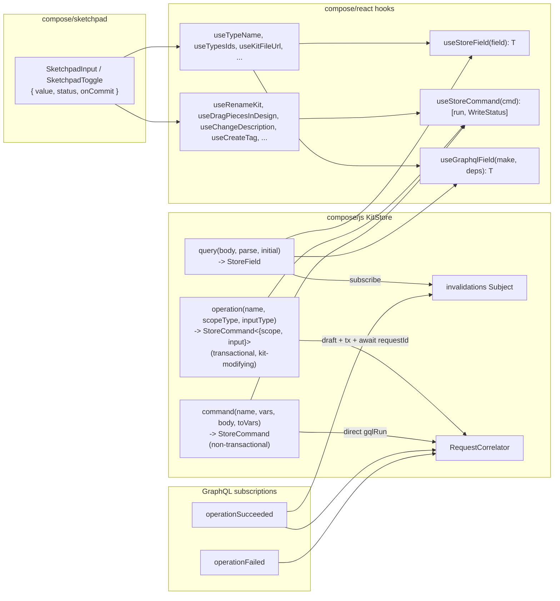

# Strict read / write hooks via StoreField + StoreCommand

## Vocabulary

- **Read** = a `StoreField<T>` fed by one GraphQL query. No side-effects. No public mutator.
- **Command** = a `StoreCommand<TArgs>` -- the only side-effect carrier in the system. Every write is a command.
- **Operation** = a _kit-modifying_ command. Operations correspond 1:1 to the SDL `Mutation` fields backed by `union OperationKind` (`renameKit`, `dragPiecesInDesign`, `changeDescription`, `addFixedPieceToDesign`, `fixPieceInDesign`, ...). Operations are always scoped inside a draft + transaction and complete asynchronously through the rs operation stream (correlated by `requestId`).
- **Scope** = the ids that pinpoint _where_ an operation runs (`draftId`, `transactionId`, plus operation-specific addressing such as `entityId`, `designId`, `pieceId`, `tagId`, `ownerId`, `tagIds`). Every operation takes a `scope: <Operation>Scope!` GraphQL variable. Caller-side, the user-facing `scope` excludes `draftId` and `transactionId`; the `operation<...>` helper opens the draft + transaction itself and merges those ids in before dispatch.
- **Input** = the data the operation needs to perform its change (`name`, `description`, `offset`, `position`, `tag`, `tags`, `concept`, `quality`, `blueprintId`, ...). Every operation takes an `input: <Operation>Input!` GraphQL variable. Empty inputs are still passed (`input: {}`) for uniformity.
- **Finalize** = the act of closing a transaction. The operation helper finalizes the transaction with `applied: true` after `operationSucceeded` arrives (the SDL term used in `Draft.finalizedTransactions` and the existing `KitStore.finalizeKitWriteTransaction()`); on failure it finalizes with `applied: false`. There is no separate "commit" or "abort" verb.
- **Save** = the act of turning the current draft into a checkpoint. `Save` belongs to the workspace command tier (built via `command<TArgs>`), not the operation tier. Inside an SDL operation we never "save" -- we only "finalize the open transaction".

Every operation has the _same_ GraphQL signature: `<fieldName>(scope: <Operation>Scope!, input: <Operation>Input!): Id!`. The TypeScript signature mirrors it: `StoreCommand<{ scope: TScope; input: TInput }>` where `TScope` is the operation-specific scope (no `draftId` / `transactionId` -- those are auto-supplied) and `TInput` is the operation-specific input. This is the only shape any operation ever carries.

Operations are a strict subset of commands. The `operation<TScope, TInput>` helper builds a kit-modifying `StoreCommand` (transactional, finalized per call); the `command<TArgs>` helper builds a non-transactional `StoreCommand` (e.g. save draft -> checkpoint, backbone attach, sync now, file import / export). Both produce the same `StoreCommand<...>` public type; consumers never need to care which kind they hold.

## Target shape



The new contract is:

- A read hook returns the value only: `useTypeName(typeId): string`. No `WriteStatus`, no setter.
- A write hook returns `[run, WriteStatus]`: `useRenameType(): [(args) => Promise<SetResult>, WriteStatus]`. No value.
- Read + write of the same field are two separate hooks the consumer composes.

## Primitives ([compose/js/index.ts](compose/js/index.ts))

The primitives are domain-agnostic. Nothing in here mentions kit, kit name, schema hooks, or any other consumer concept.

```ts
export type WriteStatus = { kind: "readonly"; pending: 0; lastError?: SetError } | { kind: "idle"; pending: 0; lastError?: SetError } | { kind: "pending"; pending: number; lastError?: SetError } | { kind: "error"; pending: 0; lastError: SetError };

/** @emoji 🧊 Stable frozen identities for `useSyncExternalStore` snapshots. */
export const WRITE_STATUS_IDLE: WriteStatus = Object.freeze({ kind: "idle", pending: 0 });
export const WRITE_STATUS_READONLY: WriteStatus = Object.freeze({ kind: "readonly", pending: 0 });
export const WRITE_STATUS_PENDING: WriteStatus = Object.freeze({ kind: "pending", pending: 1 });

/** @emoji 📥 Read-only typed mirror. Values are pushed in by the `source` callback at construction; consumers cannot mutate. */
export class StoreField<T> {
 constructor(initial: T, source: (push: (next: T) => void) => Unsubscribe) {
  this.subject = new BehaviorSubject<T>(initial);
  this.unsubSource = source((next) => this.subject.next(next));
 }
 subscribe(h: () => void): Unsubscribe {
  /* BehaviorSubject -> handler */
 }
 getSnapshot(): T {
  return this.subject.getValue();
 }
 dispose(): void {
  this.unsubSource(); /* try { this.subject.complete(); } catch {} */
 }
 // NOTE: no `set` method. The only path that writes a value is the `push` closure handed to `source`.
}

/** @emoji 📝 The only side-effect carrier. Generic over `TArgs`; knows nothing about kit / kit-name / schema hooks. */
export class StoreCommand<TArgs> {
 readonly status: StoreField<WriteStatus>;
 constructor(exec: (args: TArgs) => Promise<SetResult>) {
  this.status = new StoreField<WriteStatus>(WRITE_STATUS_IDLE, (push) => {
   this.pushStatus = push;
   return () => {};
  });
  this.exec = exec;
 }
 readonly run = async (args: TArgs): Promise<SetResult> => {
  this.pushStatus(WRITE_STATUS_PENDING);
  const r = await this.exec(args);
  this.pushStatus(r.ok ? WRITE_STATUS_IDLE : { kind: "error", pending: 0, lastError: r.error });
  return r;
 };
 dispose(): void {
  this.status.dispose();
 }
 private pushStatus!: (next: WriteStatus) => void;
 private readonly exec: (args: TArgs) => Promise<SetResult>;
}

/** @emoji 🚦 request-id <-> Promise resolver. Used inside the shared mutation executor only. */
export class RequestCorrelator {
 await(requestId: string): Promise<SetResult>;
 resolve(requestId: string, r: SetResult): void;
 disposeAll(reason?: string): void;
}
```

Renamed across the codebase as part of Phase 1 (none of these names embed a consumer-specific concept like "kit name" or "schema hook"):

- `SCHEMA_HOOK_IDLE_STATUS` -> `WRITE_STATUS_IDLE`
- `SCHEMA_HOOK_READONLY_STATUS` -> `WRITE_STATUS_READONLY`
- `USE_KIT_NAME_PENDING_STATUS` -> `WRITE_STATUS_PENDING`

Deleted in the same `#region 🧱StorePrimitives`: `OperationRouter`, `OperationEvent`, `StoreField.set` (public method gone), `KitStore.seedFieldsFromDto`, `KitStore.dispatchCorrelationEnvelope` (typed-kind branch), the dedicated `kitRenamed` GraphQL subscription, and `KitStore.fieldCache` / `cachedField` if present.

```tsx
// React-side primitives (kept; no surface change).
export function useStoreField<T>(field: StoreField<T>): T {
 return React.useSyncExternalStore(field.subscribe, field.getSnapshot, field.getSnapshot);
}
export function useStoreCommand<TArgs>(cmd: StoreCommand<TArgs>): readonly [(args: TArgs) => Promise<SetResult>, WriteStatus] {
 const status = useStoreField(cmd.status);
 return [cmd.run, status] as const;
}
```

## Scope of deletion

In [compose/js/index.ts](compose/js/index.ts):

- Public `KitStoreClient.submitChangeKitCommands` and `KitStoreClient.fetchFullKit` move to `private` on `WasmKitStoreClient` / `FallbackKitClient` (only the StoreCommand executors call them).
- Delete `writeKitStoreClientSchemaField`, `kitStoreClientAddChildByKind`, `kitStoreClientRemoveChildByKind`, `submitChangeKitCommandsToClient` and the standalone `kitChangeDesign{Piece,Connection}` shorthands once their hook callers move to commands. Keep `ChangeKitCommand` builders that the new commands need internally.

In [compose/react/index.tsx](compose/react/index.tsx):

- Delete types `HookTriad<T>`, `HookRead<T>`, helper `kitReadonlyTriad`.
- Delete hooks `useDraft`, `useOptimistic`, `useComposeReadSnap`, `useComposeStoreSelector`, `useSchemaObjectState`, `useSchemaFieldState` and every auto-generated `use<Schema><Field>` (Actor / User / Agent / Coordinate / Point / Vector / Plane / Camera / Attribute / Author / Concept / Tag / Quality / Prop / Stat / Group / Layer / Type / Design / Piece / Connection / Kit / SessionActorInput / Folder / File / etc).
- Delete `useWriteQueue`, `useKitSync` (replaced by per-command `WriteStatus` aggregation if needed).
- Replace every read-with-`HookTriad`/`HookRead` hook with a value-only read.
- Replace every write hook that uses `useState<WriteStatus>` ad-hoc with `useStoreCommand(client.<command>)`.

In [compose/sketchpad/index.tsx](compose/sketchpad/index.tsx):

- Delete `SketchpadTriadInputRow`, `SketchpadTriadToggleRow` and replace with `SketchpadInput({ value, status, onCommit, ... })` and `SketchpadToggle({ value, status, onCommit })` that take separated read/write inputs. No "Row" suffix anywhere; rows are rendered by `TreeRow` internally and the binding component just wires `StoreField` + `StoreCommand` to a single widget.
- Update every call site (kit / type / design / folder / file detail panels and footer/navbar status). Every `const [v, set, st] = useXxx()` becomes `const v = useReadXxx(); const [run, st] = useWriteXxx();`.

## Phase 1 - KitStore + client surface ([compose/js/index.ts](compose/js/index.ts))

Two helpers replace every read/write-specific method in `KitStore` and remove all seeding / typed-event filtering.

### Three helpers + one invalidation tick

`StoreField` has no `set`; the `query<T>` helper only feeds values via the `push` closure handed to the field's constructor. `operation<TArgs>` is the only place draft / transaction / correlator code exists. `command<TArgs>` is the escape hatch for non-transactional GraphQL mutations (no kit modification, no draft/tx).

```ts
// compose/js/index.ts -- inside KitStore.
import { Subject } from "rxjs";

private readonly invalidations = new Subject<void>();

/** @emoji 🧾 GraphQL-backed read. Pushes `parse(data)` on initial fetch and on every invalidation tick. No public mutator. */
private query<T>(body: string, parse: (data: JsonValue) => T, initial: T): StoreField<T> {
  return new StoreField<T>(initial, (push) => {
    const refetch = async () => {
      try {
        const data = kitGraphqlData(await this.gqlRun({ query: `query { ${body} }` })) as JsonValue;
        push(parse(data));
      } catch {
        /* keep last value; read errors never leak to UI -- only writes carry status */
      }
    };
    void refetch();
    const sub = this.invalidations.subscribe({ next: () => void refetch() });
    return () => sub.unsubscribe();
  });
}

/** @emoji 🪪 Transactional kit-modifying operation. Every SDL operation has the uniform signature `<name>(scope: <Operation>Scope!, input: <Operation>Input!): Id!`. The helper opens draft + tx, merges `{ draftId, transactionId }` into `scope`, runs the mutation, awaits `operationSucceeded` by `requestId`, then finalizes the transaction (`applied: true|false`). Maps 1:1 to a SDL `Mutation` field backed by `union OperationKind`. */
private operation<TScope extends Record<string, JsonValue> = Record<string, never>, TInput extends Record<string, JsonValue> = Record<string, never>>(
  fieldName: string,                  // e.g. "renameKit"
  scopeTypeName: string,              // e.g. "RenameKitScope"
  inputTypeName: string,              // e.g. "RenameKitInput"
): StoreCommand<{ scope: TScope; input: TInput }> {
  return new StoreCommand<{ scope: TScope; input: TInput }>(async ({ scope, input }) => {
    const draftId = await this.openDraft();
    const transactionId = await this.openTransaction(draftId);
    try {
      const data = kitGraphqlData(await this.gqlRun({
        query: `mutation($scope: ${scopeTypeName}!, $input: ${inputTypeName}!) {
                  ${fieldName}(scope: $scope, input: $input)
                }`,
        variables: {
          scope: { draftId, transactionId, ...scope } as JsonValue,
          input: (input ?? {}) as JsonValue,
        },
      })) as Record<string, string>;
      const requestId = String(data[fieldName] ?? "");
      if (requestId === "") throw new Error(`${fieldName}: empty requestId`);
      const result = await this.correlator.await(requestId);
      await this.finalizeTransaction(draftId, transactionId, { applied: result.ok });
      return result;
    } catch (e) {
      await this.finalizeTransaction(draftId, transactionId, { applied: false }).catch(() => {});
      return { ok: false, error: { kind: "Internal", message: String(e) } };
    }
  });
}

/** @emoji 📝 Non-transactional command. Builds a StoreCommand that runs a plain GraphQL mutation (no draft / tx / correlator). Used for workspace-level writes that are not kit operations. */
private command<TArgs, TData = JsonValue>(
  fieldName: string,
  variableSignatures: string,
  argList: string,
  toVariables: (args: TArgs) => Record<string, JsonValue>,
  parse: (data: TData) => SetResult = () => ({ ok: true }),
): StoreCommand<TArgs> {
  return new StoreCommand<TArgs>(async (args) => {
    try {
      const data = kitGraphqlData(await this.gqlRun({
        query: `mutation(${variableSignatures}) {
                  ${fieldName}(${argList})
                }`,
        variables: toVariables(args),
      })) as TData;
      return parse(data);
    } catch (e) {
      return { ok: false, error: { kind: "Internal", message: String(e) } };
    }
  });
}
```

Every kit side-effect is an entry in SDL `union OperationKind = CreatedFixedPiece | FixedPiece | DraggedPiece | RenamedKit | ChangedDescription | ...`; every operation `StoreCommand` is built by `operation<TArgs>`. Workspace-level writes (backbone attach / detach, sync now, file import / export, conflict resolution) are commands built by `command<TArgs>`. Reads never trigger either.

`operationSucceeded` and `operationFailed` are the only subscriptions; both call `correlator.resolve(...)` and the success path additionally `invalidations.next()`. No `kitRenamed`-specific subscription, no `OperationRouter`, no `seedFieldsFromDto`, no `dispatchCorrelationEnvelope` typed-kind branch.

```ts
private startCorrelationSubscriptions(): void {
  // operationSucceeded { id requestId } -> resolve correlator, then broadcast invalidation.
  this.subscribeOperationSucceeded((requestId) => {
    if (requestId) this.correlator.resolve(requestId, { ok: true });
    this.invalidations.next();
  });
  // operationFailed { kind message requestId } -> resolve correlator with error.
  this.subscribeOperationFailed((requestId, error) => {
    if (requestId) this.correlator.resolve(requestId, { ok: false, error });
  });
}
```

### Defining reads

Every read field is one line. `parse` returns the typed `T` directly (no `JsonObject` leaks out of `KitStore`).

```ts
// compose/js/index.ts -- KitStore constructor.
readonly kitName     = this.query<string>          ("wip { theKit { name } }",                    (d) => String((d as KitNameQuery).wip?.theKit?.name ?? ""), "");
// canUndo / canRedo: only added when the SDL exposes them; not in current schema, so the read field is omitted and the legacy useCanUndo / useCanRedo hooks are deleted.
readonly typesIds    = this.query<readonly string[]>("wip { theKit { types { edges { node { id } } } } }",
                                                     parseTypesIds, []);
readonly typesShallow = this.query<readonly TypeShallow[]>(
  `wip { theKit { types { edges { node { ${KIT_GQL_TYPE_SHALLOW_FIELDS} } } } } }`,
  parseTypesShallow, [],
);
readonly designsIds  = this.query<readonly string[]>("wip { theKit { designs { edges { node { id } } } } }",
                                                     parseDesignsIds, []);
readonly kitSnapshot = this.query<KitFullDto | undefined>("wip { theKit { fullSnapshot } }", parseKitFullSnapshot, undefined);
// ... rest of static reads ...
```

Parameterized reads are plain factory methods — they construct a fresh `StoreField` and never cache. The React layer disposes them on unmount.

```ts
kitFileUrl(fileId: string | undefined): StoreField<string | null> {
  return this.query<string | null>(
    `wip { theKit { file(id: "${fileId ?? ""}") { url } } }`,
    (d) => ((d as KitFileUrlQuery).wip?.theKit?.file?.url ?? null) as string | null,
    null,
  );
}

pieceMetadata(designId: string, pieceId: string): StoreField<PiecePlacementRowDto | undefined> {
  return this.query<PiecePlacementRowDto | undefined>(
    `pieceInDesign(designId: "${designId}", pieceId: "${pieceId}") { ${KIT_GQL_PIECE_METADATA_FIELDS} }`,
    parsePieceMetadata, undefined,
  );
}

typeName(typeId: string): StoreField<string> {
  return this.query<string>(
    `wip { theKit { type(id: "${typeId}") { name } } }`,
    (d) => String((d as TypeNameQuery).wip?.theKit?.type?.name ?? ""), "",
  );
}
```

### Defining operations (kit-modifying, transactional)

One declaration per SDL `Mutation` field. Every operation has the _same_ shape: `<name>(scope: <Operation>Scope!, input: <Operation>Input!): Id!`. The helper takes `(fieldName, scopeTypeName, inputTypeName)` and the TS type params declare the user-facing scope (no draft/tx -- those are auto-supplied) and input.

```ts
// compose/js/index.ts -- KitStore constructor.
readonly renameKit             = this.operation<{},                                                { name: string }>                                  ("renameKit",             "RenameKitScope",             "RenameKitInput");
readonly changeDescription     = this.operation<{ entityId: string },                              { description: string }>                           ("changeDescription",     "ChangeDescriptionScope",     "ChangeDescriptionInput");
readonly addFixedPieceToDesign = this.operation<{ designId: string },                              { blueprintId: string; position: PositionInput }>  ("addFixedPieceToDesign", "AddFixedPieceToDesignScope", "AddFixedPieceToDesignInput");
readonly fixPieceInDesign      = this.operation<{ designId: string; pieceId: string },             {}>                                                ("fixPieceInDesign",      "FixPieceInDesignScope",      "FixPieceInDesignInput");
readonly dragPieceInDesign     = this.operation<{ designId: string; pieceId: string },             { offset: { u: number; v: number } }>              ("dragPieceInDesign",     "DragPieceInDesignScope",     "DragPieceInDesignInput");
readonly dragPiecesInDesign    = this.operation<{ designId: string; pieceIds: readonly string[] }, { offset: { u: number; v: number } }>              ("dragPiecesInDesign",    "DragPiecesInDesignScope",    "DragPiecesInDesignInput");
readonly createTag             = this.operation<{ ownerId: string },                               { tag: TagInput }>                                 ("createTag",             "CreateTagScope",             "CreateTagInput");
readonly createTags            = this.operation<{ ownerId: string },                               { tags: readonly TagInput[] }>                     ("createTags",            "CreateTagsScope",            "CreateTagsInput");
readonly renameTag             = this.operation<{ tagId: string },                                 { name: string }>                                  ("renameTag",             "RenameTagScope",             "RenameTagInput");
readonly deleteTag             = this.operation<{ tagId: string },                                 {}>                                                ("deleteTag",             "DeleteTagScope",             "DeleteTagInput");
readonly deleteTags            = this.operation<{ tagIds: readonly string[] },                     {}>                                                ("deleteTags",            "DeleteTagsScope",            "DeleteTagsInput");
readonly createConcept         = this.operation<{ ownerId: string },                               { concept: ConceptInput }>                         ("createConcept",         "CreateConceptScope",         "CreateConceptInput");
readonly createQuality         = this.operation<{ ownerId: string },                               { quality: QualityInput }>                         ("createQuality",         "CreateQualityScope",         "CreateQualityInput");
```

Allocation rule between scope and input: ids that _address_ the operation belong to scope; everything else (data the operation acts with) belongs to input. `dragPiecesInDesign` puts `pieceIds` in scope (target set) and `offset` in input (data). `deleteTags` puts `tagIds` in scope (the targets) with an empty input. Whole-kit operations (`renameKit`) have an empty scope and a single input field. Empty objects (`{}`) are passed explicitly so every call has the same shape.

### Defining commands (non-transactional, non-kit)

The `command<TArgs>` helper exists for workspace-level writes (save draft -> checkpoint, backbone attach / detach, sync now, file import / export, conflict resolution) **as soon as the SDL exposes the matching named mutations**. Until then no `command<TArgs>` instances are declared and the legacy hooks (`useAttachBackbone`, `useSyncNow`, etc.) are deleted in Phase 2 with their UI marked `WRITE_STATUS_READONLY`.

The `operation<TScope, TInput>` helper is the only place `openDraft` / `openTransaction` / `finalizeTransaction` / `correlator.await` ever appear. `command<TArgs>` is a flat GraphQL mutation with no draft or transaction lifecycle. Saving (turning the current draft into a checkpoint) is a separate `command<TArgs>` -- never triggered implicitly inside an operation.

The complete `StoreCommand` surface (operations only -- one per `Mutation` field in [compose/graphql/schema.graphql](compose/graphql/schema.graphql); each `TArgs` is the uniform `{ scope, input }`):

```ts
client.renameKit             : StoreCommand<{ scope: {};                                                input: { name: string } }>;
client.changeDescription     : StoreCommand<{ scope: { entityId: string };                              input: { description: string } }>;
client.addFixedPieceToDesign : StoreCommand<{ scope: { designId: string };                              input: { blueprintId: string; position: PositionInput } }>;
client.fixPieceInDesign      : StoreCommand<{ scope: { designId: string; pieceId: string };             input: {} }>;
client.dragPieceInDesign     : StoreCommand<{ scope: { designId: string; pieceId: string };             input: { offset: { u: number; v: number } } }>;
client.dragPiecesInDesign    : StoreCommand<{ scope: { designId: string; pieceIds: readonly string[] }; input: { offset: { u: number; v: number } } }>;
client.createTag             : StoreCommand<{ scope: { ownerId: string };                               input: { tag: TagInput } }>;
client.createTags            : StoreCommand<{ scope: { ownerId: string };                               input: { tags: readonly TagInput[] } }>;
client.renameTag             : StoreCommand<{ scope: { tagId: string };                                 input: { name: string } }>;
client.deleteTag             : StoreCommand<{ scope: { tagId: string };                                 input: {} }>;
client.deleteTags            : StoreCommand<{ scope: { tagIds: readonly string[] };                     input: {} }>;
client.createConcept         : StoreCommand<{ scope: { ownerId: string };                               input: { concept: ConceptInput } }>;
client.createQuality         : StoreCommand<{ scope: { ownerId: string };                               input: { quality: QualityInput } }>;
```

**Removed**: every "general" command that took a free-form key/value bag and dispatched legacy `submitChangeKitCommands` -- `updateType`, `updateDesign`, `updateAuthor`, `updateQuality`, `updatePort`, `updateTag`, `updateFile`, `updateFolder`, plus the never-real `createType`, `deleteType`, `createDesign`, `deleteDesign`, `createAuthor`, `deleteAuthor`, `createPort`, `deletePort`, `addFile`, `removeFile`, `createFolder`, `deleteFolder`, `clusterPieces`, `movePieces`, `fixPieces` (bulk), `flattenDesign`, `expandDesign`, `deleteConnection`, `addConnections`, `removeConnections`, `changePieceType`, `moveToFolder`, `moveKitArtifactToFolder`, `useKitAddToKit` / `useKitRemoveFromKit`, `useUndo` / `useRedo`. None of these are in `union OperationKind`; if the SDL grows a specific named operation later (e.g. `renameType`, `undo`, `redo`), it appears as one more line in the same uniform `<scope, input>` operation list. Until then, the corresponding sketchpad bindings render with `WRITE_STATUS_READONLY` (or are removed from the panel altogether).

### `KitStoreClient` interface delta

```ts
// BEFORE -- compose/js/index.ts
export interface KitStoreClient {
 readonly kitName: StoreField<string>;
 readonly renameKit: StoreCommand<string>;
 readKitName(): Promise<string>;
 fetchFullKit(): Promise<KitFullDto>; // remove
 submitChangeKitCommands(commands: readonly ChangeKitCommand[]): Promise<SetResult>; // remove
}

// AFTER -- one StoreField per read, one StoreCommand per write, factories for parameterized reads.
export interface KitStoreClient {
 // Static reads.
 readonly kitName: StoreField<string>;
 readonly typesIds: StoreField<readonly string[]>;
 readonly typesShallow: StoreField<readonly TypeShallow[]>;
 readonly typesMetadata: StoreField<readonly TypeMetadataDto[]>;
 readonly designsIds: StoreField<readonly string[]>;
 readonly designsShallow: StoreField<readonly DesignShallow[]>;
 readonly designsMetadata: StoreField<readonly DesignMetadataDto[]>;
 readonly kitSnapshot: StoreField<KitFullDto | undefined>;
 // ... rest of static fields ...

 // Parameterized reads. Each call returns a fresh, single-purpose StoreField; React disposes via useGraphqlField.
 kitFileUrl(fileId: string | undefined): StoreField<string | null>;
 pieceMetadata(designId: string, pieceId: string): StoreField<PiecePlacementRowDto | undefined>;
 typeName(typeId: string): StoreField<string>;
 // ... rest of factories ...

 // Operations (kit-modifying; built via KitStore.operation<TScope, TInput>; exactly one per SDL Mutation field; uniform { scope, input } TArgs).
 readonly renameKit: StoreCommand<{ scope: {}; input: { name: string } }>;
 readonly changeDescription: StoreCommand<{ scope: { entityId: string }; input: { description: string } }>;
 readonly addFixedPieceToDesign: StoreCommand<{ scope: { designId: string }; input: { blueprintId: string; position: PositionInput } }>;
 readonly fixPieceInDesign: StoreCommand<{ scope: { designId: string; pieceId: string }; input: {} }>;
 readonly dragPieceInDesign: StoreCommand<{ scope: { designId: string; pieceId: string }; input: { offset: { u: number; v: number } } }>;
 readonly dragPiecesInDesign: StoreCommand<{ scope: { designId: string; pieceIds: readonly string[] }; input: { offset: { u: number; v: number } } }>;
 readonly createTag: StoreCommand<{ scope: { ownerId: string }; input: { tag: TagInput } }>;
 readonly createTags: StoreCommand<{ scope: { ownerId: string }; input: { tags: readonly TagInput[] } }>;
 readonly renameTag: StoreCommand<{ scope: { tagId: string }; input: { name: string } }>;
 readonly deleteTag: StoreCommand<{ scope: { tagId: string }; input: {} }>;
 readonly deleteTags: StoreCommand<{ scope: { tagIds: readonly string[] }; input: {} }>;
 readonly createConcept: StoreCommand<{ scope: { ownerId: string }; input: { concept: ConceptInput } }>;
 readonly createQuality: StoreCommand<{ scope: { ownerId: string }; input: { quality: QualityInput } }>;

 // Commands: empty until SDL exposes non-transactional mutations (saveDraft -> checkpoint, attachBackbone, syncNow, importKit, ...).
}
```

`fetchFullKit` and `submitChangeKitCommands` become `private` on `WasmKitStoreClient` / `KitStore`. Nothing on the public surface bypasses the `query` / `operation` / `command` helpers. There are no generic `update<Entity>` shapes; every write is a specific named SDL operation with the uniform `{ scope, input }` shape.

Embedded tests in [compose/js/index.ts](compose/js/index.ts) get one new `describe` per family asserting that:

- Every static read field returns the same value as a hand-rolled GraphQL query against the same body.
- Each operation `StoreCommand` resolves with `{ ok: true }` after a `requestId` arrives on `operationSucceeded`, and the broadcast `invalidations.next()` makes dependent read fields refetch.
- A failing operation surfaces `{ ok: false, error }` and `status.kind === "error"` with `lastError` populated.
- A parameterized read field disposes its `invalidations` subscription on `dispose()`.

## Phase 2 - React hook layer ([compose/react/index.tsx](compose/react/index.tsx))

- Keep `useStoreField`, `useStoreCommand`, `useKitName`, `useRenameKit` as primitives.
- Add `useGraphqlField<T>(make, deps): T` for parameterized reads. The hook memoizes the `StoreField` over `deps` and **disposes** it on dep change / unmount (no caching anywhere else).
- Delete bulk schema generators (`useActor`_, `useUser`_, ..., `useKitTags`, `useKitVersion`, `useKitId`, `useKitHash` -- all `useSchemaFieldState` / `useSchemaObjectState` callers).
- Keep `useWriteIndicator(status)` as the only `WriteStatus` UI helper; reads no longer carry status.
- Delete `useDraft`, `useOptimistic`, `useComposeReadSnap`, `useComposeStoreSelector`, `useKitSync`, `useWriteQueue`, `useSetErrors` (subsumed by per-command `WriteStatus.lastError`).

### `useGraphqlField` (new helper)

```tsx
// compose/react/index.tsx
export function useGraphqlField<T>(make: () => StoreField<T>, deps: React.DependencyList): T {
 const field = React.useMemo(make, deps);
 React.useEffect(() => () => field.dispose(), [field]);
 return useStoreField(field);
}
```

Each dep change throws away the previous field (which unsubscribes from `invalidations` and completes its subject) and constructs a fresh one. No caching, no shared identity, no leaks.

### Read hook -- before / after

```tsx
// BEFORE (lines ~2096-2136)
export function useTypesIds(explicitKitId?: string): HookTriad<readonly string[]> {
  const scopeKey = useKitDataScopeKey();
  const readScope = useKitDataScope();
  // ~30 lines of subscribe + getSnapshot + ad-hoc WriteStatus + setter
  const snap = useComposeReadSnap(subscribe, getSnap, getSnap);
  const status: WriteStatus = /* ... */;
  return [snap.data as readonly string[], setter, status] as const;
}

// AFTER
export function useTypesIds(): readonly string[] {
  const client = useKitStoreClient();
  if (!client) throw new Error("useTypesIds: kit client required inside KitScope");
  return useStoreField(client.typesIds);
}
```

```tsx
// Parameterized read -- BEFORE: HookTriad<string | null>, ~80 lines.
// AFTER:
export function useKitFileUrl(fileId: string | undefined): string | null {
 const client = useKitStoreClient();
 if (!client) throw new Error("useKitFileUrl: kit client required inside KitScope");
 return useGraphqlField(() => client.kitFileUrl(fileId), [client, fileId]);
}

export function usePieceMetadata(designId?: string, pieceId?: string): PiecePlacementRowDto | undefined {
 const client = useKitStoreClient();
 if (!client) throw new Error("usePieceMetadata: kit client required inside KitScope");
 return useGraphqlField(() => client.pieceMetadata(designId ?? "", pieceId ?? ""), [client, designId, pieceId]);
}
```

### Write hook -- before / after

```tsx
// BEFORE (lines ~3404-3431) -- useDragPieces with manual useState<WriteStatus> and hand-built ChangeKitCommand.
export function useDragPieces(): {
 run: (designId: string, pieceIds: readonly string[], offset: { u: number; v: number }) => Promise<SetResult>;
 status: WriteStatus;
} {
 const client = useKitStoreClient();
 const [status, setStatus] = React.useState<WriteStatus>({ kind: "idle", pending: 0 });
 const run = React.useCallback(
  async (designId, pieceIds, offset) => {
   setStatus({ kind: "pending", pending: 1 });
   const r = await client!.submitChangeKitCommands(/* hand-built ChangeKitCommand */);
   setStatus(r.ok ? { kind: "idle", pending: 0 } : { kind: "error", pending: 0, lastError: r.error });
   return r;
  },
  [client],
 );
 return { run, status };
}

// AFTER -- one line; tuple shape; named SDL operation; uniform { scope, input } TArgs.
export function useDragPiecesInDesign(): readonly [(args: { scope: { designId: string; pieceIds: readonly string[] }; input: { offset: { u: number; v: number } } }) => Promise<SetResult>, WriteStatus] {
 const client = useKitStoreClient();
 if (!client) throw new Error("useDragPiecesInDesign: kit client required inside KitScope");
 return useStoreCommand(client.dragPiecesInDesign);
}
```

Hooks for legacy generic writes (`useUpdateType`, `useUpdateDesign`, `useUpdateAuthor`, `useUpdateQuality`, `useUpdatePort`, `useUpdateTag`, `useUpdateFile`, `useUpdateFolder`, `useCreateType` / `useDeleteType` / ... / `useDeleteConnection`, `useFlattenDesign`, `useExpandDesign`, `useChangePieceType`, `useMoveToFolder`, `useMoveKitArtifactToFolder`, `useUndo`, `useRedo`, `useImportKit`, `useExportKit`, `useAttachBackbone`, `useDetachBackbone`, `useResolveConflict`, `useSyncNow`, `useAddConnections`, `useRemoveConnections`, `useClusterPieces`, `useMovePieces`, `useFixPieces`) are deleted outright -- they have no SDL operation behind them. Sketchpad rows that previously bound to them either disappear or render with `WRITE_STATUS_READONLY` (Phase 3).

### Embedded tests (sample)

```tsx
it("useTypesIds returns readonly string[] only (no WriteStatus)", async () => {
 const { result } = renderHook(() => useTypesIds(), { wrapper: KitScopeWrapper });
 expect(Array.isArray(result.current)).toBe(true);
});

it("useDragPieces returns [run, WriteStatus] tuple", async () => {
 const { result } = renderHook(() => useDragPieces(), { wrapper: KitScopeWrapper });
 const [run, status] = result.current;
 expect(typeof run).toBe("function");
 expect(status.kind).toBe("idle");
});

it("useGraphqlField disposes the previous field on dep change", () => {
 const disposed: string[] = [];
 const make = (id: string) =>
  new StoreField<string>(id, (_push) => () => {
   disposed.push(id);
  });
 const { rerender } = renderHook(({ id }: { id: string }) => useGraphqlField(() => make(id), [id]), { initialProps: { id: "a" } });
 rerender({ id: "b" });
 expect(disposed).toEqual(["a"]);
});

it("StoreField has no public set / mutation surface", () => {
 const f = new StoreField<number>(0, () => () => {});
 expect((f as unknown as { set?: unknown }).set).toBeUndefined();
 expect(typeof f.subscribe).toBe("function");
 expect(typeof f.getSnapshot).toBe("function");
 expect(typeof f.dispose).toBe("function");
});
```

## Phase 3 - Sketchpad migration ([compose/sketchpad/index.tsx](compose/sketchpad/index.tsx))

### New row primitives

```tsx
// compose/sketchpad/index.tsx -- replaces SketchpadTriadInputRow / SketchpadTriadToggleRow.
// "Row" is gone from every name; the binding component is just a value+status+onCommit widget.
function SketchpadInput<T = string>(props: {
 id: string;
 value: T;
 status: WriteStatus;
 onCommit: (next: T) => Promise<SetResult>;
 placeholder?: string;
 placeholderId?: string;
 mapCommit?: (raw: string) => T; // default: identity for T = string
}): React.ReactElement {
 const { disabled, spinning, error } = useWriteIndicator(props.status);
 const [draft, setDraft] = React.useState<T | null>(null);
 const display = (draft ?? props.value) as T;
 const finalize = React.useCallback(async () => {
  if (draft === null) return;
  const r = await props.onCommit(draft);
  if (r.ok) setDraft(null);
 }, [draft, props.onCommit]);
 return (
  <TreeRow id={props.id}>
   <Input value={String(display ?? "")} disabled={disabled} placeholder={props.placeholder} onChange={(e) => setDraft((props.mapCommit ?? ((s) => s as unknown as T))(e.target.value))} onBlur={finalize} />
   {spinning ? <Spinner /> : null}
   {error ? <ErrorLine message={error.message} /> : null}
  </TreeRow>
 );
}

function SketchpadToggle(props: { id: string; value: boolean | undefined | null; status: WriteStatus; onCommit: (next: boolean) => Promise<SetResult>; icon?: React.ReactNode }): React.ReactElement {
 const { disabled, spinning, error } = useWriteIndicator(props.status);
 return (
  <TreeRow id={props.id} icon={props.icon}>
   <Toggle checked={!!props.value} disabled={disabled} onChange={(next) => void props.onCommit(next)} />
   {spinning ? <Spinner /> : null}
   {error ? <ErrorLine message={error.message} /> : null}
  </TreeRow>
 );
}
```

`SketchpadInput` and `SketchpadToggle` are the _only_ binding components. `TreeRow` stays as the layout primitive but is never wrapped under a "Row"-suffixed semantic name.

### Call site migration -- kit name

```tsx
// BEFORE -- legacy triad input.
function KitSectionForm() {
 const nameTriad = useKitName(); // legacy: returned [name, setName, status] before this ticket
 return <SketchpadTriadInputRow triad={nameTriad} id="...name" />;
}

// AFTER -- strict split; uniform { scope, input }.
function KitSectionForm() {
 const name = useKitName(); // read: string
 const [renameKit, status] = useRenameKit(); // write: [run, WriteStatus]
 return <SketchpadInput id="compose.sketchpad.app.kit.panel.details.section.kit.name" value={name} status={status} onCommit={(next) => renameKit({ scope: {}, input: { name: next } })} />;
}
```

### Call site migration -- type description (real SDL operation)

```tsx
// BEFORE -- auto-generated generic-field hook routed through legacy submitChangeKitCommands.
function TypeSection({ id }: { id: string }) {
 const descTriad = useTypeDescription(id); // HookTriad<string>
 return <SketchpadTriadInputRow triad={descTriad} id="...type.description" />;
}

// AFTER -- paired read + write, no caching, fresh StoreField per typeId, actual SDL operation.
function TypeSection({ id }: { id: string }) {
 const client = useKitStoreClient()!;
 const description = useGraphqlField(() => client.entityDescription(id), [client, id]);
 const [changeDescription, status] = useStoreCommand(client.changeDescription);
 return <SketchpadInput id="compose.sketchpad.app.type.panel.details.section.type.description" value={description} status={status} onCommit={(next) => changeDescription({ scope: { entityId: id }, input: { description: next } })} />;
}
```

### Call site migration -- type icon (no SDL operation yet -> readonly)

```tsx
// AFTER -- read still works; finalize short-circuits with WRITE_STATUS_READONLY until SDL exposes a `changeTypeIcon` operation.
function TypeIcon({ id }: { id: string }) {
 const client = useKitStoreClient()!;
 const icon = useGraphqlField(() => client.typeIcon(id), [client, id]);
 return (
  <SketchpadInput id="compose.sketchpad.app.type.panel.details.section.type.icon" value={icon} status={WRITE_STATUS_READONLY} onCommit={async () => ({ ok: false, error: { kind: "Readonly", message: "icon edits not yet supported by SDL" } })} />
 );
}
```

### Call site migration — snapshot consumer

```tsx
// BEFORE — destructure triad even though only the value is used.
const [ks0] = useKitSnapshotTriad();
if (ks0) doStuff(ks0);

// AFTER — value-only read, no destructure.
const ks0 = useKitSnapshot();
if (ks0) doStuff(ks0);
```

- Remove `import { type HookTriad }` and any residual `useDraft` / `useOptimistic` references.
- All ~100 `useKitSnapshotTriad()` / `useTypesFull()` / `useDesignsFull()` / `useFilesFull()` / `useTagsFull()` call sites collapse to single-binding reads in the same way.

## Phase 4 - validation

- `npm run depcruise:layers` (root).
- `npx tsc --noEmit` in [compose/js](compose/js), [compose/react](compose/react), [compose/sketchpad](compose/sketchpad).
- `npm test` in [compose/js](compose/js) and [compose/react](compose/react).
- `rg "HookTriad|HookRead|useDraft|useOptimistic|useSchemaObjectState|useSchemaFieldState|writeKitStoreClientSchemaField|kitReadonlyTriad|useComposeReadSnap|SketchpadTriadInputRow|SketchpadTriadToggleRow|SketchpadFieldRow|SketchpadToggleFieldRow|submitChangeKitCommands\b|OperationRouter|OperationEvent|seedFieldsFromDto|dispatchCorrelationEnvelope|fieldCache|cachedField|commitTransaction|abortTransaction" compose` returns zero matches (legacy primitives + Row-suffixed bindings + commit/abort vocabulary all gone).
- `rg "StoreField[^>]*\\.set\\(|\\.kitName\\.set\\(|\\.status\\.set\\(" compose` returns zero matches (no public mutator on `StoreField`).
- `rg "SCHEMA_HOOK_IDLE_STATUS|SCHEMA_HOOK_READONLY_STATUS|USE_KIT_NAME_PENDING_STATUS" compose` returns zero matches (consumer-specific names removed from the generic primitives).
- `rg "\\bupdateType\\b|\\bupdateDesign\\b|\\bupdateAuthor\\b|\\bupdateQuality\\b|\\bupdatePort\\b|\\bupdateTag\\b|\\bupdateFile\\b|\\bupdateFolder\\b|\\bcreateType\\b|\\bdeleteType\\b|\\bcreateDesign\\b|\\bdeleteDesign\\b|\\bcreatePort\\b|\\bdeletePort\\b|\\bdeleteConnection\\b|\\bflattenDesign\\b|\\bexpandDesign\\b|\\bchangePieceType\\b|\\bmoveToFolder\\b|\\bmoveKitArtifactToFolder\\b|\\buseUndo\\b|\\buseRedo\\b" compose/js compose/react compose/sketchpad` returns zero matches (every generic / non-SDL operation removed).
- `rg "\\$draftId|\\$transactionId|\\$entityId|\\$designId|\\$pieceId|\\$tagId|\\$ownerId" compose/js/index.ts` returns zero matches inside `KitStore` operation declarations (every operation must use the uniform `$scope`/`$input` variables; per-id GraphQL variables are only allowed inside the `operation<TScope, TInput>` helper body).
- `rg "operation<\\{[^}]*draftId" compose/js/index.ts` returns zero matches (no operation declares `draftId` / `transactionId` in its user-facing TArgs -- those ids belong inside the helper, not the public command).
- The `KitStoreClient` operation list matches `Mutation` field names in [compose/graphql/schema.graphql](compose/graphql/schema.graphql) one-for-one and every operation's `Args` member has the shape `{ scope: ...; input: ... }` (sanity check via `rg "type Mutation" -A 30 compose/graphql/schema.graphql` and visual diff against the interface).
- Manual sketchpad smoke run: type a kit name, observe spinner -> success; rename a type; drag pieces; undo / redo.

## Delivery

This is multi-hour work. After plan acceptance I will split into three short-lived parallel sub-agents (one per phase, in dependency order: Phase 1 -> Phase 2 -> Phase 3, with Phase 4 run by me at the end) per the workspace rule on delegation. The ticket folder is `.repo/🎫/26/05/08/strict-read-write-hooks/` (to be created). All temporary scripts and notes live inside it.
