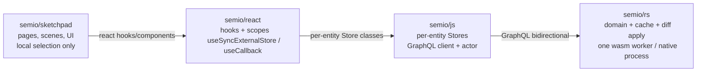

# Strict Semio Layering Refactor

## 1. Target Architecture



Hard rules per layer (enforced by AGENTS.md + dependency-cruiser):

- `semio/sketchpad` MUST NOT import `@semio/js` or `@semio/rs-wasm`.
- `semio/react` MUST NOT touch domain math, kit DTO mutation, or persistence.
- `semio/js` MUST NOT cache kit data (every read goes through rs; subscriptions are passthrough events).
- `semio/rs` is the single source of truth and the only mutator.

## 2. semio/rs (single mutating boundary, diff-only application)

Existing entry: [`semio/rs/lib.rs`](semio/rs/lib.rs) (1.5MB; keep as one file with `pub mod` blocks; do NOT split).

### 2.1 Collapse the GraphQL surface

Inside `pub mod kit_graphql` keep only:

- `Query` — pure reads (existing read commands stay; reads return data inline).
- `Mutation { submitKitCommand(input: KitCommandShellInput): KitCommandReceipt }` — the **only** mutation field.
- `Subscription { eventStream: KitEvent }` — single event stream.

Delete every typed mutation field already on `RootMutation` (~30 of them — `clusterPieces`, `dragPieces`, `movePieces`, `fixPieces`, `flattenDesign`, `expandDesign`, `deleteConnection`, `changePieceType`, `pasteDesignSelection`, `createHangingPieces`, `createConnectedPiece`, `createFixedPiece`, `undo`, `redo`, `changeKitCommands`, `changeKitWithInverse`, `attachBackbone`, `detachBackbone`, `backboneStatus`, `listConflicts`, `resolveConflict`, `syncNow`, `batch`, …).

`KitCommandShellInput.commandKind` becomes a typed Rust enum `KitCommand` (serde tag = "kind") with one variant per current mutation. Acceptance is queued; the actual work runs on the existing single-writer actor (`kit_graphql::spawn_actor` + `GraphWork::*`). Receipts return `{ requestId }`; `succeeded`/`failed` are emitted as `KitEvent::SemioKitCommand` (unchanged shape).

### 2.2 Promote semantic commands to the only mutator

In `pub mod change_command` (line 2637+), every existing variant of `ChangeKitCommand` already has a forward path that yields inverse commands. Add the missing semantic variants currently expressed as ad-hoc helpers:

```rust
pub enum ChangeKitCommand {
    // ... existing variants ...
    ClusterPieces { design_id: DesignIdDto, piece_ids: Vec<PieceIdDto>, name: String },
    DragPieces    { design_id: DesignIdDto, piece_ids: Vec<PieceIdDto>, du: f64, dv: f64 },
    MovePieces    { design_id: DesignIdDto, piece_ids: Vec<PieceIdDto>, gap: f64, shift: f64, rise: f64 },
    FixPieces     { design_id: DesignIdDto, piece_ids: Vec<PieceIdDto> },
    FlattenDesign { design_id: DesignIdDto },
    ExpandDesign  { parent_design_id: DesignIdDto, nested_design_id: DesignIdDto },
    DeleteConnection      { design_id: DesignIdDto, connection_id: ConnectionIdDto },
    ChangePieceType       { design_id: DesignIdDto, piece_id: PieceIdDto, new_type_id: TypeIdDto },
    PasteDesignSelection  { design_id: DesignIdDto, selection: DesignSelectionDto, plane: Option<Plane> },
    CreateHangingPieces   { design_id: DesignIdDto, type_ids: Vec<TypeIdDto>, plane: Plane },
    CreateConnectedPiece  { design_id: DesignIdDto, parent_piece: PieceIdDto, parent_port: PortIdDto, child_type: TypeIdDto, child_port: PortIdDto },
    CreateFixedPiece      { design_id: DesignIdDto, type_id: TypeIdDto, plane: Plane },
}
```

For every variant enforce a uniform contract on the impl block (no exceptions):

```rust
impl ChangeKitCommand {
    /// pure: params -> diff against `baseline`
    pub fn forward_diff(&self, baseline: &KitFullDto) -> Result<KitDiff>;
    /// pure: ordered cmds + baseline -> inverse cmds (LIFO)
    pub fn inverse_for(cmds: &[Self], baseline: &KitFullDto) -> Result<Vec<Self>>;
}
```

Implement `forward_diff` directly (no twin/mutate-and-diff) for each variant; the existing twin path becomes a fallback only inside tests.

### 2.3 One central diff applier

In `pub mod kit_graph` (line 17605+), replace the dual `apply_kit_mutation(before, after)` + `apply_kit_diff(diff)` paths with a **single** `apply_kit_diff(diff)` that:

1. Applies the diff to the live `KitGraphRef` in place (no DTO replacement).
2. Invalidates derived caches (flatten map, hierarchies).
3. Emits `KitEvent::DiffApplied { diff }` once.

Delete `apply_kit_mutation(before, after)` callers (search 18874 area + `apply_kit_state` full re-layout). Update `with_undo` and the actor `GraphWork::ChangeKitCommands` to call:

```rust
let diff = ChangeKitCommand::forward_diff_many(&kit, cmds)?;
let inverse = ChangeKitCommand::inverse_for(cmds, &baseline)?;
KitGraph::apply_kit_diff(&kit, &diff)?;  // sole mutator
push_undo(inverse);
```

### 2.4 Backbones become the only persistence

Extend [`pub mod kit_backbone_wire`](semio/rs/lib.rs) with `BackboneConfig::Memory` (no-op storage; default after `KitStoreHandle::create`). Keep `Dev` (single JSON), `Local` (`.semio/kit.db` + blobs), `Remote` (hub).

Add `attachBackbone(cfg)` / `detachBackbone` / `backboneStatus` / `listConflicts` / `resolveConflict` / `syncNow` to the `submitKitCommand` shell as `KitCommand` variants (not separate GraphQL fields). Wasm executes Dev/Memory natively; Local/Remote return `NotSupported` on wasm and are routed to a native semio-store sidecar.

### 2.5 Reads stay typed and inline

`pub mod read::ReadKitCommand` already exists and is exhaustive. Kit reads remain inline GraphQL `query` resolvers (no event ping-pong) — only **mutations** are async fire-and-forget per the spec.

## 3. semio/js (per-entity Store classes, thin GraphQL client)

Refactor [`semio/js/index.ts`](semio/js/index.ts) (currently a single ~1100-line `KitStore` god class).

### 3.1 Public surface

Export exactly one open function plus typed entity stores:

```ts
export async function openKit(initial: KitFullDto, opts?: KitStoreOpenOptions): Promise<KitStore>;

export class KitStore {
  // root-level kit metadata + lifecycle
  name(): Promise<string>;
  setName(name: string): Promise<KitCommandReceipt>;
  // ... description / icon / image / preview / remote / homepage / license / version ...

  // entity collections
  designs(): Promise<readonly DesignStore[]>;
  design(id: string): DesignStore;          // handle, no I/O
  addDesign(dto: DesignFullDto): Promise<KitCommandReceipt>;
  removeDesign(id: string): Promise<KitCommandReceipt>;

  types(): Promise<readonly TypeStore[]>;
  type(id: string): TypeStore;
  addType(dto: TypeFullDto): Promise<KitCommandReceipt>;
  // ... files / folders / authors / concepts / tags / qualities / ports / families / locations / attributes ...

  // version control / persistence
  attachBackbone(cfg: BackboneConfig): Promise<KitCommandReceipt>;
  detachBackbone(): Promise<KitCommandReceipt>;
  backboneStatus(): Promise<BackboneStatusDto>;
  listConflicts(): Promise<readonly KitConflict[]>;
  resolveConflict(id: string, resolution: ConflictResolution): Promise<KitCommandReceipt>;
  syncNow(): Promise<KitCommandReceipt>;
  undo(): Promise<KitCommandReceipt>;
  redo(): Promise<KitCommandReceipt>;
  canUndo(): Promise<boolean>;
  canRedo(): Promise<boolean>;
  vcsState(): Promise<VcsStateDto>;
  materializeAt(checkpointId: string): Promise<KitFullDto>;

  // events
  subscribe(handler: (e: KitEvent) => void): Unsubscribe;
  subscribeFiltered(filter: (e: KitEvent) => boolean, handler: (e: KitEvent) => void): Unsubscribe;
  dispose(): Promise<void>;
}

export class DesignStore {
  readonly id: string;
  metadata(): Promise<DesignMetadataDto>;
  shallow(): Promise<DesignShallowDto>;
  full(): Promise<DesignFullDto>;
  pieces(): Promise<readonly PieceStore[]>;
  piece(id: string): PieceStore;
  connections(): Promise<readonly ConnectionStore[]>;
  connection(id: string): ConnectionStore;
  setName(name: string): Promise<KitCommandReceipt>;
  addPiece(dto: PieceFullDto): Promise<KitCommandReceipt>;
  removePiece(id: string): Promise<KitCommandReceipt>;
  cluster(pieceIds: readonly string[], name: string): Promise<KitCommandReceipt>;
  drag(pieceIds: readonly string[], du: number, dv: number): Promise<KitCommandReceipt>;
  move(pieceIds: readonly string[], gap: number, shift: number, rise: number): Promise<KitCommandReceipt>;
  fix(pieceIds: readonly string[]): Promise<KitCommandReceipt>;
  flatten(): Promise<KitCommandReceipt>;
  paste(selection: DesignSelectionDto, plane?: Plane): Promise<KitCommandReceipt>;
  createHangingPieces(typeIds: readonly string[], plane: Plane): Promise<KitCommandReceipt>;
  createConnectedPiece(parent: PieceIdDto, parentPort: PortIdDto, childType: TypeIdDto, childPort: PortIdDto): Promise<KitCommandReceipt>;
  createFixedPiece(typeId: string, plane: Plane): Promise<KitCommandReceipt>;
  subscribe(handler: (e: DesignScopedEvent) => void): Unsubscribe;
}

export class TypeStore { /* full / metadata / shallow / setName / addRepresentation / addConnector / addProp / setStock / ... / subscribe */ }
export class PieceStore       { /* setPlane / setCenter / setScale / setColor / hide / lock / addProp / subscribe */ }
export class ConnectionStore  { /* setGap / setShift / setRotation / setTilt / setTurn / delete / subscribe */ }
export class PortStore        { /* full / metadata / setName / setIcon / setMaxChildren / setCompatiblePorts */ }
export class ConnectorStore   { /* full / setName / setT / setPoint / setDirection / setMandatory / setProps */ }
export class RepresentationStore /* setName / setTags / setFile / setDescription */
export class AuthorStore      { /* setName / setEmail / setAttributes */ }
export class FileStore        { /* setName / setRemote / setFolder / setHash / setBlob */ }
export class FolderStore      /* + ConceptStore / TagStore / QualityStore / BenchmarkStore / StatStore / PropStore / LayerStore / GroupStore / LocationStore / AttributeStore / FamilyStore */
```

Implementation rules:

- Each store holds only `{ root: KitStore, id: string }` (no DTO cache).
- Every reader is a single GraphQL `Query` (one of the existing `ReadKitCommand` variants); every mutator is one `submitKitCommand` call whose `kind` is a typed `ChangeKitCommand` enum variant matching §2.2.
- `subscribe` filters `KitEvent::DiffApplied` to those whose `KitDiff` touches the entity id (filter table generated from rs).
- No `patchEntityField`, `addChild`, `removeChild`, `getPieces`, `getDesigns`, `getTypes`, `getPiecesMetadata`, `read(batch)` exposed publicly. Internal-only `executeRead`/`executeChange` helpers stay.
- Delete the entire `// #region 🪢InternalReadWire` block plus all `mapReadCommand` / `mapDesignRead` / `mapPieceRead` / `mapTypeRead` shape-mapping (rs returns the canonical shape directly).

### 3.2 Transport

Keep `WorkerStringTransport` + `InlineWasmTransport` (current files [`semio/js/worker.ts`](semio/js/worker.ts), [`semio/js/index.ts`](semio/js/index.ts) lines 270-416). Tighten to GraphQL strings only. RxJS becomes a private `Subject`; never appears in `.d.ts`.

## 4. semio/react (thin hooks bundle)

Reduce [`semio/react/index.tsx`](semio/react/index.tsx) (currently 635KB) and delete [`semio/react/kitWasmClient.ts`](semio/react/kitWasmClient.ts) (118KB).

### 4.1 Move out of react

| Currently in react                                                                                                                                      | New home                                            | Rationale            |
| ------------------------------------------------------------------------------------------------------------------------------------------------------- | --------------------------------------------------- | -------------------- | ----- | --------- | ----------------- |
| `Coordinate`, `Vec`, `Plane`, `Point`, `Vector`, schemas                                                                                                | `@semio/js` (re-exported domain types)              | not React            |
| `Kit`, `Type`, `Design`, `Piece`, `Connection`, `Port`, `Connector`, `Representation`, `Author`, `File`, `Folder`, `Concept`, `Quality`, `Tag`, schemas | `@semio/js` per-entity store DTOs                   | not React            |
| `InMemoryKitStore`, `JsonFileKitStore`, `FolderKitStore`, `createSessionKitStore`                                                                       | `@semio/rs` backbones via `attachBackbone({memory   | dev                  | local | remote})` | persistence in rs |
| `LiveKitRoot`, `SemioKitLiveReadStore`, `SemioKitViewStore`, `SemioKitDesignReadStore`, `SemioKitShallowListReadStore`                                  | folded into `KitStore`/`DesignStore` subscriptions  | reads in rs          |
| `kitEventAffects*` predicates                                                                                                                           | rs ships per-event affected ids; JS just dispatches | classification in rs |
| `diffSchemaPropertyEvents`, `applyKitClientSnapshotToLocalStore`, `importKitToPlain`, `acquireSemioKitCommandFacade`, `createKitCommandEngine*`         | delete (no consumer outside react/sketchpad)        | dead glue            |

### 4.2 What semio/react keeps

```ts
// providers / scopes (id contexts only — no kit data)
export function KitStoreProvider(props: { initial: KitFullDto, opts?, children }): JSX.Element;
export function KitScope(props: { id: string, children }): JSX.Element;
export function DesignScope(props: { id: string, children }): JSX.Element;
export function TypeScope(props: { id: string, children }): JSX.Element;
export function PieceScope(props: { designId: string, id: string, children }): JSX.Element;
// ... ConnectionScope / PortScope / ConnectorScope / RepresentationScope / AuthorScope / FileScope / FolderScope / ConceptScope / TagScope / QualityScope / BenchmarkScope / StatScope / PropScope / LayerScope / GroupScope / LocationScope / AttributeScope / FamilyScope

// store handles (uses useContext + KitStore.design(id) etc.; never caches DTOs)
export function useKitStore(): KitStore;
export function useDesignStore(id?: string): DesignStore;
export function useTypeStore(id?: string): TypeStore;
export function usePieceStore(designId?: string, id?: string): PieceStore;
// ... one per entity store ...

// reads — all useSyncExternalStore over store.subscribe + cached promise getter
export function useKit(): KitFullDto | undefined;
export function useDesigns(): readonly DesignMetadataDto[];
export function useDesign(id?: string): DesignFullDto | undefined;
export function usePieces(designId?: string): readonly PieceMetadataDto[];
export function usePiece(designId?: string, id?: string): PieceFullDto | undefined;
export function useTypes(): readonly TypeMetadataDto[];
export function useType(id?: string): TypeFullDto | undefined;
// ... one per entity, plus useCanUndo / useCanRedo / useVcsState / useBackboneStatus / useListConflicts ...

// mutations — all useCallback wrapping store methods; return Promise<KitCommandReceipt>
export function useSetKitName(): (name: string) => Promise<KitCommandReceipt>;
export function useAddDesign(): (dto: DesignFullDto) => Promise<KitCommandReceipt>;
export function useDeleteDesign(): (id: string) => Promise<KitCommandReceipt>;
export function useSetDesignName(designId?: string): (name: string) => Promise<KitCommandReceipt>;
export function useClusterPieces(designId?: string): (ids: readonly string[], name: string) => Promise<KitCommandReceipt>;
export function useDragPieces(designId?: string): (ids: readonly string[], du: number, dv: number) => Promise<KitCommandReceipt>;
export function useMovePieces(designId?: string): (ids: readonly string[], gap: number, shift: number, rise: number) => Promise<KitCommandReceipt>;
export function useFlattenDesign(designId?: string): () => Promise<KitCommandReceipt>;
export function useCreateConnectedPiece(designId?: string): (...) => Promise<KitCommandReceipt>;
// ... full coverage of every set*/add*/remove* on every store ...

// backbone / vcs
export function useAttachBackbone(): (cfg: BackboneConfig) => Promise<KitCommandReceipt>;
export function useDetachBackbone(): () => Promise<KitCommandReceipt>;
export function useResolveConflict(): (id: string, r: ConflictResolution) => Promise<KitCommandReceipt>;
export function useSyncNow(): () => Promise<KitCommandReceipt>;
export function useUndo(): () => Promise<KitCommandReceipt>;
export function useRedo(): () => Promise<KitCommandReceipt>;
```

Read-hook implementation pattern (uniform):

```tsx
export function useDesign(explicitId?: string): DesignFullDto | undefined {
 const ds = useDesignStore(explicitId);
 return React.useSyncExternalStore(
  useCallback((cb) => ds.subscribe(cb), [ds]),
  useCallback(() => ds.cachedFullSync(), [ds]),
  () => undefined,
 );
}
```

(The cache is owned by `DesignStore` and is just the last event-resolved snapshot; the _authoritative_ cache is still in rs.)

## 5. semio/sketchpad (UI + local selection only)

Edit [`semio/sketchpad/index.tsx`](semio/sketchpad/index.tsx) and the VS Code adapter section.

### 5.1 Remove

- All imports of `InMemoryKitStore`, `JsonFileKitStore`, `FolderKitStore`, `createSessionKitStore`, `applyKitClientSnapshotToLocalStore`, `acquireSemioKitCommandFacade`, `createKitCommandEngine*`, `KitHostStore`, `KitHostStoreSnapshot`, `KitBinaryStore`, `KitFileState`.
- `SketchpadStore.registerKitStore`, `SketchpadStore.injectedKitStore`, all kit registry entries that hold host stores.
- The VS Code webview "JsonFileKitStore" bridge — replaced by a `BackboneAdapter` (read/write blobs) passed to `attachBackbone({ dev: { adapter } })` from the rs side.

### 5.2 Keep / add

```tsx
function App() {
 return (
  <KitStoreProvider initial={emptyKit}>
   <KitScope id={activeKitId}>
    <Sketchpad /> // uses @semio/react hooks only
   </KitScope>
  </KitStoreProvider>
 );
}

// open file/folder/remote — pure backbone wiring, no host stores
const attach = useAttachBackbone();
async function openJson(path: string) {
 await attach({ dev: { path } });
}
async function openFolder(path: string) {
 await attach({ local: { path } });
}
async function openRemote(url: string) {
 await attach({ remote: { url } });
}
```

Selection state stays here as a small Zustand store (or `useState`); never references kit data — only ids.

## 6. Rollout (one ticket per phase, in order)

Each phase opens a ticket via `repo` MCP, edits the existing files only, runs the relevant test suites, and closes the ticket.

1. **`refactor-rs-single-mutation-shell`** — collapse `RootMutation` to only `submitKitCommand`; route every inline mutation through it; promote the new semantic `ChangeKitCommand` variants (§2.1, §2.2). Tests: extend `kit_graphql_smoke` + `kit_store` integration tests.
2. **`refactor-rs-diff-only-applier`** — single `apply_kit_diff` mutator; delete `apply_kit_mutation(before, after)`; enforce `forward_diff` / `inverse_for` on every variant (§2.3). Tests: extend `kit_diff` and `change_command` units.
3. **`refactor-rs-backbone-memory-and-shell`** — add `Memory` backbone; move `attach/detach/status/listConflicts/resolveConflict/syncNow` into `submitKitCommand`; emit results on the event stream (§2.4). Tests: extend `backbone` + `kit_coordinator`.
4. **`refactor-js-per-entity-stores`** — rewrite [`semio/js/index.ts`](semio/js/index.ts) into per-entity Store classes; delete inline read shape mapping; update [`semio/js/worker.ts`](semio/js/worker.ts) to GraphQL-only (§3). Tests: extend the existing embedded tests at the bottom of `index.ts`.
5. **`refactor-react-thin-hooks`** — delete [`semio/react/kitWasmClient.ts`](semio/react/kitWasmClient.ts); reduce [`semio/react/index.tsx`](semio/react/index.tsx) to scopes + `useSyncExternalStore` reads + `useCallback` mutations; move domain types to `@semio/js` (§4). Tests: extend `semio/react` test file (vitest).
6. **`refactor-sketchpad-no-host-store`** — strip every `*KitStore` host instantiation and the kit registry from [`semio/sketchpad/index.tsx`](semio/sketchpad/index.tsx); replace VS Code/file/folder/remote opening with `useAttachBackbone(...)`; consolidate selection in a tiny zustand store (§5). Tests: extend the existing sketchpad playwright/vitest specs.
7. **`enforce-strict-layering`** — add a dependency-cruiser config in repo root that fails CI when `sketchpad` imports `@semio/js` or `@semio/rs-wasm`, when `react` imports `@semio/rs-wasm` directly, or when `js` imports anything from `react`/`sketchpad`. Add an AGENTS.md update per bundle pinning these rules.

## 7. Out of scope

- Rust file split (`lib.rs` stays one file, per workspace rules).
- Schema changes to DTOs (already canonical).
- Backwards compatibility for any external consumer (none exist; per workspace rules).
