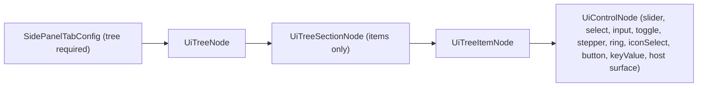

# Strict Side Panel Tree API

## Why the spacing diverges today

`SidePanel` -> `Tree` defines no content padding; consumers inject their own. Two escape hatches make that possible:

- `TreeDataSection.content?: ReactNode` in [ui/react/index.tsx](ui/react/index.tsx) (~9147) lets a section bypass items entirely.
- `playgroundPanelSection` + `PlaygroundPanelBody` in [framework/product/playground/renderer/react/index.tsx](framework/product/playground/renderer/react/index.tsx) (~~1557-1569) wrap whole React forms (`p-single`) into one property row. Puzzle 2d inspector batches add `border-l pl-2 space-y-3` (~~4195), settings adds `p-3 gap-2 space-y-4` (~~3670), puzzle 5d status a raw `<dl class="p-2">` (~~2559), CAD play asides similar (~2680-2727 in [cad/js/renderer/play/index.tsx](cad/js/renderer/play/index.tsx)).

The declarative path (puzzle 3d, sketchpad, hierarchy/kinds tabs) already enforces `UiTreeNode -> UiTreeSectionNode -> UiTreeItemNode -> UiControlNode` via `uiTreeNodeToTreePanelConfig` ([framework/product/platform/renderer/react/index.tsx](framework/product/platform/renderer/react/index.tsx) ~1231). The fix: make that the only path.

## Enforced containment

## 1. Tighten `ui/react` primitives ([ui/react/index.tsx](ui/react/index.tsx))

- Remove `TreeDataSection.content` and its rendering (~10921-10950). A section type-accepts only `items`/`getItems`.
- Rework the two internal users of section `content` — `BasicChatPanel` feed (~~11423) and `ControlTree` (~~11868) — to render their rows directly (`TreeRow`-based list), since they are not side-panel trees.
- Standardize the property-row control slot in `TreeItem`: canonical height/padding from tokens, auto-height for tall controls (Ring), control fills the slot. No consumer spacing can leak in.
- Keep existing guards: `Tree` rejects children, `SidePanelTabConfig.tree` required, no nested `TreeSection`.
- Remove the in-file test for `playgroundPanelSection` (playground renderer ~7594) and extend ui tests for the removed `content` prop.

## 2. Extend the typed control vocabulary

- [framework/product/platform/core/index.ts](framework/product/platform/core/index.ts) `UiControlNode` (~119): add `UiSliderNode`, `UiNumberStepperNode` (absolute + delta), `UiRingNode`, `UiIconSelectNode` (mode-classifier callback) — everything puzzle 2d inspector/settings need.
- Render the new kinds in `renderUiControl` ([framework/product/platform/renderer/react/index.tsx](framework/product/platform/renderer/react/index.tsx) ~1100-1170) using ui/react `Slider`, stepper, `Ring`, `IconSelector` with one canonical class set.

## 3. Delete the escape hatches (playground renderer)

- Delete `playgroundPanelSection` and `PlaygroundPanelBody`; drop their wrappers in `DeclarativeSidePanelBody`/`DeclarativeTreeWorkbenchPanel` (~948-1008) and assert side-panel bodies are `type: "tree"`.
- Playground tab definitions only accept `UiTreeNode` (static or callback); the conversion to `TreePanelConfig` happens centrally via `uiTreeNodeToTreePanelConfig`. Removes the raw `TreeDataSection[]` callbacks and the unsafe `sections as TreeDataSection[]` cast in `Puzzle5dPlayHierarchyPanelDefinition` (~2609).

## 4. Migrate every offending panel to items + controls

All in [framework/product/playground/renderer/react/index.tsx](framework/product/playground/renderer/react/index.tsx) unless noted:

- Puzzle 2d Inspector: replace `InspectorNodeBatch`/`InspectorHandleBatch`/`InspectorEdgeBatch` with `buildPuzzle2dPlayInspectorSections` returning `UiTreeNode` sections whose items carry typed controls (name input, kind select, icon select, x/y steppers, ring + angle stepper + radius, source/target selects). Empty/unknown selection becomes section `emptyState`/keyValue items.
- Puzzle 2d Settings: `Puzzle2dPlaySettingsPanel` becomes declarative sections (Redraw, Graph, Tree) of select/toggle/slider items; delete the custom header and `p-3` chrome.
- Puzzle 5d Status: `Puzzle5dPlayStatusPanel` `<dl>` becomes keyValue items in one section.
- CAD play ([cad/js/renderer/play/index.tsx](cad/js/renderer/play/index.tsx) ~2680-2941): `CadPlayCatalogAside`/`CadPlayDetailsAside` (incl. `ModelStatsPanel`, `SelectionAttributesPanel`, `SelectionPropertiesPanel`) become `UiTreeNode` sections with stat keyValue items and attribute editor items (input/select/button controls).
- Verify flow/procedural/presentation/sketchpad/puzzle 3d tabs still compile against the stricter API (they already use the declarative path; sketchpad's hosted details surface stays a typed `UiPanelHostSurfaceNode` control).

## 5. Spacing audit + verification

- After migration, grep side-panel code for ad-hoc `p-*`/`gap-*`/`space-y-*`/`border-l` and remove leftovers; spacing tokens live only in ui/react Tree/SidePanel.
- Extend existing in-file tests (ui/react, both renderers, migrated apps) — no new test files.
- Runtime-verify via launch.json apps (puzzle 2d, wires, puzzle 3d/5d, cad, sketchpad): every details/workbench tab renders identical section/row rhythm; confirm controls dispatch via `[DEBUG]` console logs, then remove the logs.

## Repo process

- Read `repo://goals`, reopen the matching ticket if one covers this (e.g. the earlier panel-enforcement ticket) or open a new one; keep temp artifacts in the ticket folder; close with summary + file list.

