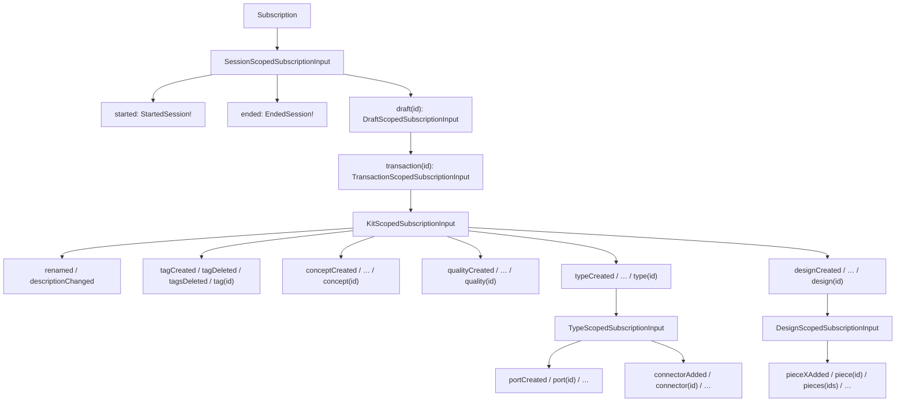

## Subscription tree mirrors mutation

### Why

The new mutation tree in [semio/graphql/target.schema.graphql](semio/graphql/target.schema.graphql) has every kit-changing operation reachable only via `session.draft(id).transaction(id).kit.…(id)`. The current `type Subscription` is still flat (95 sibling fields like `renamedTag`, `addedAttributeToPiece`) and has subscriptions for plural creates that the mutation API no longer exposes (`createdTags`, `addedAttributesToTag`, `addedChildPiecesWithParentConnections`, …). Per the user, the global feeds (`commandSucceeded`, `operationSucceeded`, `operationFailed`, `error`) are dropped — every leaf already returns a concrete operation result type that encodes its outcome.

### Shape of the tree (mirror of the mutation)



### Naming convention (deterministic)

- Scope-self events use bare past-tense verbs: `rename(newName)` → `renamed`, `changeDescription` → `descriptionChanged`, `changeIcon` → `iconChanged`, `flatten` → `flattened`, `drag/move/fix` → `dragged/moved/fixed`, `changeToType` → `changedToType`.
- Owns events use `<entity><verb>` in past tense: `createTag` → `tagCreated`, `deleteTag` → `tagDeleted`, `deleteTags` → `tagsDeleted`, `addConnector` → `connectorAdded`, `addFixedPiece` → `fixedPieceAdded`, `addChildPieceWithParentConnection` → `childPieceWithParentConnectionAdded`, `deletePiecesAndConnections` → `piecesAndConnectionsDeleted`.
- Attribute events: `addAttribute` → `attributeAdded`, `removeAttribute` → `attributeRemoved`, `removeAttributes` → `attributesRemoved`.

### Edits in [semio/graphql/target.schema.graphql](semio/graphql/target.schema.graphql)

Replace the entire `type Subscription { … }` block (currently lines 6383–6501) with:

1) Root + four navigation scopes (no events except `started`/`ended` + nav fields):

```graphql
type Subscription {
  session: SessionScopedSubscriptionInput!
}

type SessionScopedSubscriptionInput {
  started: StartedSession!
  ended: EndedSession!
  draft(id: ID!): DraftScopedSubscriptionInput!
}

type DraftScopedSubscriptionInput {
  transaction(id: ID!): TransactionScopedSubscriptionInput!
}

type TransactionScopedSubscriptionInput {
  kit: KitScopedSubscriptionInput!
}
```

2) `KitScopedSubscriptionInput` mirrors `KitScopedOperationInput` 1:1 (artifact + tag/concept/quality/type/design create-delete + scope navigator). Each per-entity scope (`Tag/Concept/Quality/Type/Port/Connector/Design/Piece/Pieces ScopedSubscriptionInput`) has exactly the same leaves as its mutation counterpart, but past-tense names returning the existing concrete operation result types (`RenamedTag`, `CreatedTag`, `AddedAttributeToTag`, `MovedPiece`, `DraggedPieces`, `ChangedPieceToType`, …).

3) Drop these subscriptions (mutation no longer exposes them):

- `createdTags`, `createdConcepts`, `createdQualities`, `createdTypes`, `createdPorts`, `addedConnectors`, `createdDesigns`
- every `addedAttributesTo<Entity>` (Tag/Concept/Quality/Type/Port/Design/Piece)
- `addedChildPiecesWithParentConnections`, `addedHangingChildPiecesWithParentConnections`

Keep delete-plural events (`tagsDeleted`, `conceptsDeleted`, `piecesDeleted`, …) because `deleteTags(ids: [ID!]!)` and similar remain in the mutation. Keep multi-piece transform events (`draggedPieces`, `movedPieces`, `fixedPieces`, `changedPiecesToType`) on `PiecesScopedSubscriptionInput`.

4) Add four missing concrete operation types (next to the matching `Created*`/`Renamed*` blocks; modeled after `RenamedTag` and `CreatedTag` which are full `Operation & Entity` types with their own `*Scope`/`*Input` children — same pattern, no shortcuts):

- `StartedSession` + `StartedSessionScope` + `StartedSessionInput` (`session.started`)
- `EndedSession` + `EndedSessionScope` + `EndedSessionInput` (`session.ended`)
- `RenamedDesign` + `RenamedDesignScope { designId: ID! }` + `RenamedDesignInput { design: Design! }` (`design.renamed`)
- `UpdatedDesignDescription` + `UpdatedDesignDescriptionScope { designId: ID! }` + `UpdatedDesignDescriptionInput { design: Design! }` (`design.descriptionChanged`)

These four are gaps even in the current schema: the mutation has `design.rename(newName)` and `design.changeDescription(newDescription)` but no event types exist for them.

### Equivalence example

```graphql
# new
subscription { session { draft(id:"d") { transaction(id:"t") { kit { design(id:"des") { piece(id:"p") { moved { id } } } } } } } }

# old (flat)
subscription { movedPiece { id } }
```

The new form lets clients narrow to one specific draft / transaction / design / piece; the old flat form is a firehose with no narrowing.

### Verification

- `node -e "buildSchema(read('semio/graphql/target.schema.graphql'))"` → `parse OK` and `build OK`.
- `rg "^type \w+ScopedSubscriptionInput\b" semio/graphql/target.schema.graphql` → 11 types (Session, Draft, Transaction, Kit, Tag, Concept, Quality, Type, Port, Connector, Design, Piece, Pieces minus the four pure-event scopes — adjust count after writing).
- `rg "^  (createdTags|createdConcepts|createdQualities|createdTypes|createdPorts|addedConnectors|createdDesigns|addedAttributesTo|addedChildPiecesWith|addedHangingChildPiecesWith)" semio/graphql/target.schema.graphql` → 0 matches.
- Every leaf field on every `*ScopedSubscriptionInput` returns a `Created*!`/`Renamed*!`/`Updated*!`/`Added*!`/`Removed*!`/`Deleted*!`/`Dragged*!`/`Moved*!`/`Fixed*!`/`Changed*!`/`Flattened*!`/`Started*!`/`Ended*!` concrete `Operation` type (no unions, no abstract types).
- Update [.repo/🎫/26/05/10/GRAPHQL-TARGET-MUTATION-CLEANUP/ticket.md](.repo/🎫/26/05/10/GRAPHQL-TARGET-MUTATION-CLEANUP/ticket.md) with a new problem entry (#9) and corresponding change/verification entries.