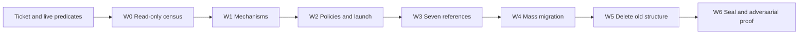

# Subset-Owned Implementations and Roundtrips

## Scope and verified baseline

At execution start, revalidate the live tree because related tickets are editing it concurrently. The current audited baseline is 33 plugins, 91 artifacts, 138 real subsets, 128 artifact examples plus 53 app examples, and two corrupt phantom subset trees. The approximately 30 named stdio profile subsets already have substantial Rust conformance implementations; their principal implementation gap is the 2–7 line TypeScript metadata stubs. Measured remaining gaps are 66 subsets without inferences, 54 without both IO directions, 30 without real TypeScript mirrors, and all 138 without subset-owned integrated examples.

Before any source edit:

- Fetch `repo://goals`, inspect open related tickets, and reopen an overlapping ticket or open `SUBSET-CONFORMANCE-AND-INTEGRATED-ROUNDTRIPS` against the most appropriate live goal.
- Persist this plan, the live census, freeze ledger, status, workflow, and all reports/logs under that ticket.
- Treat the status predicates of the artifacts-only, composable-artifact, semantic-mutation, inference, builder/derive, dissolve, DWG collision, and dashboard-workforce tickets as live inputs rather than copied assumptions.

## Target architecture

1. Make the subset the sole unit of implementation, registration, conformance, examples, and artifact tests.
2. Move each standard engine from `standards/<standard>/engine` into each `subsets/<subset>/engine`. Put genuinely shared standard behavior in the unconstrained `any` subset; standards become namespaces plus subset manifests.
3. Move all artifact-level and standard-level examples to the subset whose dialect actually recognizes and validates them. Keep app examples app-owned.
4. Define exactly two subset archetypes:
  - Owning: owns snapshot, diff, mutation, and inference types.
  - Derived: reuses owning types but owns a real conformance gate, TypeScript mirror, inference, IO declaration, positive and negative examples, and exact diagnostic tests.
5. Require every subset to own snapshot, diff, mutations, inferences, import, export, engine, and examples. Unsupported behavior, skips, ignores, hollow re-exports, whole-snapshot-only mutations, and identity inferences do not satisfy the contract.
6. Delete old engine paths, old example paths, manual compatibility shims, and the two phantom `standards` trees only after generated registration and all subset tests are green.

Update the ownership vocabulary in [taxonomy.json](🧰️framework/🛍️products/🦑️repo/🔨️modules/📚️library/🔣️taxonomy.json): artifacts retain standards only; standards retain subsets only; subsets gain schema, engine, IO, and examples; schema requires inferences. Add owning/derived archetypes and exact/canonical/semantic/lossy fidelity classes.

## Machine-checkable subset contract

Extend every standard's `subsets/component.json` entry with:

- subset kind and optional `derivesFrom` plus hard conformance codes;
- non-empty partial mutations and inferences;
- import/export dialects;
- strongest achieved IO fidelity and a minimal field-drop set when lossy;
- assigned positive examples and a negative example for every derived subset.

Enforce:

- Five schema leaves where schema-bearing: Rust, TypeScript, GraphQL, JSON Schema, and Proto.
- Executable behavior in Rust and TypeScript; GraphQL/JSON/Proto prove schema parity, not runtime execution.
- A subset-local engine exposing registration and composer entries.
- Runtime resolution of schema descriptors, composers, validators, languages, and format descriptors for every declared dialect.
- At least one complete mutation/diff/inverse triad whose diff touches a proper subset of snapshot state.
- At least one deterministic inference with a proper dependency set, using the API owned by the open inference ticket rather than creating a second cache model.
- Both IO directions. Universal semio DSL/pack is valid IO for artifacts such as norms without a real native interchange; native adapters are additional only where a genuine format exists.
- At least one vendored, authentic, licensed example per subset. Prefer public-domain or CC0 assets, keep them small, record provenance and hashes, and never fetch at runtime.

Assign existing examples deterministically: use sniffed dialect first, then unique validating subset, then `any`; split only when one example genuinely covers multiple dialects. Move existing test leaves with examples. Do not create new test files: extend moved existing test files, existing subset component test regions, engine/IO leaves, plugin glue tests, and existing TypeScript in-source tests for the 56 examples currently lacking test files.

## Integrated real-world roundtrip law

Extend existing Rust `test_support` in [store](🧰️framework/🛍️products/💻️os/🔨️modules/🏪️store/🦀️component.rs) and the existing TypeScript testkit with one staged harness:

1. Load the vendored asset and verify provenance/non-empty content.
2. Sniff and analyze to the expected subset dialect.
3. Import through the registered native or universal deserializer.
4. Prove snapshot DSL and pack roundtrips and equivalence.
5. Prove empty self-diff, diff application, absorption, and text/binary diff codecs.
6. Apply each declared mutation to the real snapshot; prove produced diff, inverse restoration, and operation/command text-binary equivalence.
7. Prove inference determinism, dependency-hit invalidation, dependency-miss stability, and serialization.
8. Prove event-store apply/undo/redo, command envelopes, live-equals-replay, and document text/pack laws.
9. Export through the registered serializer, re-import, and prove the strongest declared fidelity. For lossy codecs, prove the drop set is minimal; under-declaration must be upgraded rather than accepted.
10. Run the registered validator. Derived positive examples must have no hard faults; negative examples must produce exactly the declared hard codes.
11. Prove dialect migration succeeds for conforming assets and fails for derived negative assets.

## Mechanisms and exact hot files

Extend existing files only:

- [plugin component](🧰️framework/🛍️products/💻️os/🔨️modules/🔌️plugin/🦀️component.rs): add a declarative `subset!` macro beside the existing artifact-facet derive. It emits registration and inline tests in its invoking module, never new test files.
- [store component](🧰️framework/🛍️products/💻️os/🔨️modules/🏪️store/🦀️component.rs): integrated Rust roundtrip stages reusing existing law helpers.
- [command component](🧰️framework/🛍️products/💻️os/🔨️modules/📡️spr/🎮️command/🦀️component.rs), [IO component](🧰️framework/🔨️modules/🚪️io/🦀️component.rs), and [schema component](🧰️framework/🔨️modules/🧬️schema/🦀️component.rs): inference metadata integration, fidelity declarations, and registry enumeration without duplicating the inference ticket's API.
- [root script](📜️script.ts): deterministic `generate plugin-glue`, subset-aware example verification, and subset conformance policies. Land policies as reporting/medium severity, then promote to high only at final seal.
- [launch configurations](.vscode/launch.json): add subset conformance, subset examples, roundtrip, and inference-law gates plus a single-subset development command in existing group/order conventions.
- [Vitest aggregator](🧪️vitest.config.ts): ensure every TypeScript subset test region executes and remove broken-project exclusions as repaired.
- Every plugin Rust glue: regenerate artifact/subset/example registration and remove compatibility shims only after migration.

## Parallel workflow

Use one Cursor Grok 4.5 High coordinator, Composer 2.5 explorers/workers, and the existing ticket `workflow.json`. Set global concurrency to six and encode wave isolation through dependencies because the scheduler has no per-wave concurrency. Since current path claims compare exact strings, tasks use exact leaf scopes and the coordinator rejects every ancestor/descendant scope overlap before dispatch. Only the coordinator edits workflow/status/freeze files.

### Wave 0: eight read-only Composer 2.5 explorers

Produce separate ticket reports for subset/facet census, example assignment, derived-profile Rust/TypeScript parity, engine relocation, glue/shim inventory, peer-ticket collisions, inference ownership boundary, and asset licensing. Gate on a merged 138-row matrix, frozen example assignment, and a hot-file freeze ledger.

### Wave 1: serialized mechanisms

Tasks: `W1-MACRO`, `W1-HARNESS`, `W1-IO-FIDELITY`, `W1-INFERENCE-METADATA`, `W1-TAXONOMY`, `W1-GENERATOR`, and a ticket-local scope-prefix audit. Acquire explicit peer freezes before every hot file. Gate on compile/tests plus a generator dry run and one fully hand-wired pilot roundtrip.

### Wave 2: policies and launch

Serialize root-script policy work, launch configuration, and Vitest discovery. Gate on countable medium-severity reports without introducing new high-severity blockers for concurrent tickets.

### Wave 3: seven reference implementations

Parallel subset-body workers implement one exact reference per archetype: CAD `any`, EN 1990 norm, CSV text, TIFF binary, DOCX office, semio mesh typed, and XML valid derived. Each produces a complete changed-file map, manifest body, macro use, example provenance, and Rust/TypeScript 11-stage output. Regenerate each affected plugin glue in a separate serialized task. No mass migration starts until all references pass.

### Wave 4: mass migration

Dispatch one exact subset root per Composer 2.5 worker, gated by live semantic-mutation/inference/plugin release predicates. Batch remaining norms, domain plugins, semio typed subsets, stdio text/binary, derived profiles grouped by base artifact, and office/document artifacts. Run one serialized generated-glue task per plugin after all its subset tasks succeed. Each worker records commands, results, asset provenance, and unresolved scope discoveries in its own ticket report.

### Wave 5: deletions

After all 138 subsets pass medium conformance, delete in order: phantom trees, remaining standard engines, remaining artifact/standard examples, then shim modules. Build and run structural gates after each deletion group.

### Wave 6: seal

Promote policies to high, run the complete Rust/TypeScript and Nx matrix, and dispatch one fresh Composer 2.5 adversarial verifier to find any subset that passes without real behavior. Any finding requeues a new remediation task before seal.

## Coordination, retries, and verification

The coordinator maintains an exclusive freeze ledger for the framework plugin/store/command/IO/schema files, root script, taxonomy, launch configuration, and each plugin glue. Workers never widen their scope; they stop and report unexpected dependencies.

The scheduler currently treats failure as terminal and does not honor its retry count. Therefore failures are coordinator-requeued as new task IDs with the prior report attached. Retry transient churn/environment failures up to three attempts; logic failures require a corrected prompt; scope failures require a new non-overlapping task. Dependents remain blocked until an actual succeeded predecessor exists.

Use bun and Nx entrypoints and package-specific Cargo tests from existing scripts. Verification classes per task are: package compile, package Rust tests, package TypeScript tests, subset-filtered conformance, subset-filtered roundtrip, example verification, generated-glue check, and finally full workspace verify/test/exhaustive coverage.

## Acceptance and proof

Close only when ticket artifacts prove:

- all 138 subsets satisfy the complete manifest/facet/engine/IO/mutation/inference/example contract;
- every subset passes all 11 stages in Rust and TypeScript on at least one authentic example;
- every derived subset rejects its negative example with exact declared hard codes;
- declared fidelity is the strongest achieved class and every lossy drop set is minimal;
- runtime registration resolves every declared dialect and capability;
- no TypeScript metadata-only subset implementations, skips, ignores, hollow re-exports, or compatibility shims remain;
- no artifact/standard examples, standard engines, or phantom trees remain; app examples remain untouched;
- generated plugin glues are deterministic and clean;
- all package suites, full Nx tests, workspace verification, launch registrations, and the adversarial audit pass.

Persist a 138-row proof matrix, per-stage roundtrip output, negative-gate report, fidelity report, inference-cache report, registry dump, structural census, suite logs, launch proof, freeze ledger, and adversarial report inside the ticket. Close through repo MCP with the complete changed-file list.