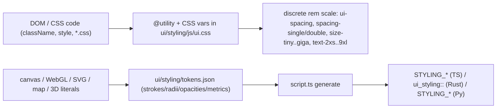

# Systematic Pixel Sizing Across the Monorepo

## Two systematic mechanisms (already exist, we route everything through them)

Base unit: `--ui-spacing` = `0.2rem` compact / `0.275rem` touch, so the scale auto-adjusts to root font size / resolution. Reference px (compact): single 3.2, double 6.4, tiny 9.6, small 16, workbench 24, medium 22.4, large 28.8, huge 35.2, mega 41.6, giga 48.

## Structural decisions (snap-first, per your choice)

- Snap small DOM values to the nearest existing step: `h-[22px]`->`h-medium`, `h-[24px]`->`size-workbench`, `size-[12px]`/`[14px]`->`size-tiny`/`size-small`, `text-[10px]`->`text-2xs`, `text-[11px]`->`text-tiny`/`text-xs`, `gap-[6px]`->`gap-double`, `gap-[8px]`->`gap-tiny`, `px-[6px]`/`pl-[4px]`->`px-double`/`pl-single`, `py-[2px]`->`py-single`.
- The scale has no step above ~48px, so large layout widths (`120px`..`800px` popovers/panels/decks) get a small upward extension of the _same_ ramp (new named rem steps, e.g. `--size-tera`/`--size-peta` ... or a dedicated `--layout-`_ ladder) in [ui/styling/js/ui.css](ui/styling/js/ui.css) with matching `@utility` + `min-w-_`/`max-w-\*`. Still discrete, still rem/resolution-relative.
- 1px hairlines (borders/outlines/`padding:1px`) become a single systematic `--stroke-hairline` token referenced everywhere (kept at device-hairline, but no longer scattered literals).
- Glass blur radii (`24/40/14px`) -> rem-based `--glass-*-blur` tokens; update the assertion in [ui/styling/js/index.test.ts](ui/styling/js/index.test.ts).
- Radius/shape is out of scope: `rounded-[9999px]`/`rounded-full` (slider tracks, avatars, badges) are circular shape, not sizing; `rounded-[3px]` snaps to the (zero) radius scale `rounded-sm`.
- Inline-style px (`${n}px` templates, `*Px` constants, `ICON_SIZE_PX`) are replaced by reading resolved token values (CSS var via `getComputedStyle` or shared TS size constants exported from `@semio-tech/ui-styling`) so JS-driven geometry stays on the same scale.
- z-index arbitrary values (`z-[9999]`, `10080`) route to the existing `--z-*` tokens.

## Phase 1 - Ticket + token foundation

- Read `repo://goals`, open a ticket via repo MCP (`ticket_open`) associated with the UI/styling goal; keep all temp logs/scripts inside the ticket folder.
- Extend [ui/styling/js/ui.css](ui/styling/js/ui.css): add upward layout-size steps + `@utility`/`min-w`/`max-w`/`w`/`h` variants, `--stroke-hairline`, rem-based glass-blur tokens, touch GoldenLayout overrides (`28px`,`4px 12px`,`44px`) -> tokens.
- Extend [ui/styling/tokens.json](ui/styling/tokens.json) with the render namespaces the audit found missing: `metrics.cad` (Three.js line widths, dimension font, pick widths, hatch), 3D outline thickness, `strokes.mapRoad*` road-class table, flow/label offset metrics, map wheel-zoom factor. Run `script.ts generate`; commit generated TS/Rust/Py.

## Phase 2 - ui/react/index.tsx (largest, ~70%)

- Replace all arbitrary `[Npx]` classes, inline-style px, and the `*Px` constant layer (`treeRowHeightPx`, `windowMeasures*`, `detailPanel*`, `ICON_SIZE_PX`, etc.) with utilities/tokens and resolved size constants.
- Update the colocated vitest assertions in the same file that match on `[Npx]` markup.
- Organize new shared size constants behind `//#region` blocks per repo rules.

## Phase 3 - CSS files

- [ui/react/globals-ui.css](ui/react/globals-ui.css) (`1.5px` guides), [framework/product/presentation/renderer/react/globals.css](framework/product/presentation/renderer/react/globals.css) (reveal.js overrides, `960/700px` deck, handles, glass) -> tokens/utilities. Update [ui/styling/js/index.test.ts](ui/styling/js/index.test.ts) glass-blur expectation.

## Phase 4 - Other DOM renderers

- [framework/product/platform/renderer/react/index.tsx](framework/product/platform/renderer/react/index.tsx), [framework/product/playground/renderer/react/index.tsx](framework/product/playground/renderer/react/index.tsx), [framework/product/presentation/renderer/react/index.tsx](framework/product/presentation/renderer/react/index.tsx) (logo `24px`, deck vars, `960/700px`).
- [cad/js/renderer/index.tsx](cad/js/renderer/index.tsx) floating UI panel/menu widths + z-index.
- `text-[10px]`/`[11px]` sprinkles in [flow/react/index.tsx](flow/react/index.tsx), [coda/client/ui/desktop/renderer.tsx](coda/client/ui/desktop/renderer.tsx), [infinite/world/r3f/index.tsx](infinite/world/r3f/index.tsx) DOM overlays.

## Phase 5 - Canvas / 3D / map render math -> tokens

- Wire duplicated literals to `STYLING_*`/`ui_styling::`: puzzle 2d/3d brush/camera/grid/stroke/label, [flow/react/index.tsx](flow/react/index.tsx)+[flow/core/lib.rs](flow/core/lib.rs) (proximity `48`, zoom, wheel factors, label), [gis/map/react/index.tsx](gis/map/react/index.tsx)+[gis/map/rs/lib.rs](gis/map/rs/lib.rs) (layer weights, route stroke, road-class), [cad/js/renderer/index.tsx](cad/js/renderer/index.tsx) Three.js widths, [infinite/world/r3f/index.tsx](infinite/world/r3f/index.tsx) grid quanta/opacity, and the DAG preview/threshold constants in [mathematical/graph/port/directed/dag/lib.rs](mathematical/graph/port/directed/dag/lib.rs) / [normal/lib.rs](mathematical/graph/port/directed/normal/lib.rs).

## Phase 6 - Enforcement

- Add a `check`/`lint` subcommand to the appropriate `script.ts` (extend, do not create new files) that scans source for forbidden patterns (`[ Npx]` Tailwind arbitrary px, inline `Npx`, `Npx` in `*.css` outside hairline/token defs) and fails with file:line. Register it in `launch.json` and `project.json` per repo ordering.

## Phase 7 - Validate + close

- Run `script.ts generate`, typecheck, `bun` tests (incl. updated ui.css/index.test.ts assertions), and `cargo test -p ui_styling`. Confirm runtime visually where snaps shift layout. Close the ticket via `ticket_close` listing all touched files.
