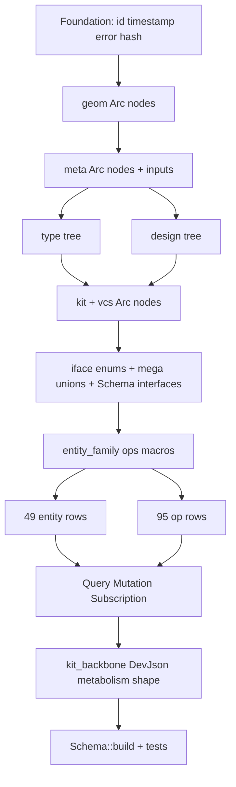

# Target Schema Parity + Metabolism-Shaped Dev Backbone

## Goal

- **Schema**: every type / interface / union / enum / scalar / input declared in [target.schema.graphql](semio/graphql/target.schema.graphql) is registered statically in [semio/rs/lib.rs](semio/rs/lib.rs) — same fields, arg lists, return types, union members, `implements` lists. Comments / formatting / trivia ignored. No `dynamic-schema`, no `Schema::register`-at-runtime tricks; everything reachable from `Schema::build(Query, Mutation, Subscription)` via static `#[Object] / #[Interface] / #[Union] / #[Enum] / #[InputObject] / #[Scalar]`.
- **Dev backbone**: `BackboneStoreKind::DevJson` reads / writes the layout in [metabolism.new.kit.semio.json](semio/assets/semio/metabolism.new.kit.semio.json): top-level `schema / wip / authoritative / stage / conflicts / blobs`, each graph as `{id, hash, authors, root (=Kit DTO), alternatives, drafts}`, drafts carrying `transactions[].forwards/backwards` rows.

## Scope numbers (from grep)

- 49 entity families (`Alternative, Attribute, Author, Benchmark, Change, Checkpoint, Concept, Conflict, Connection, Connector, Coordinate, Design, Draft, Family, File, Folder, Graph, Group, Kit, Layer, Location, Offset, Piece, Place, Plane, Point, Port, Position, Prop, Quality, ReadVersion, Representation, Session, Side, Stat, Tag, Transaction, Type, Vector, WriteVersion`, plus 9 op-only families that still get Edge/Connection: `Blueprint, DiffAttributes, Diff, Diffs, Modification, Operation, …`).
- Each entity family expands to 12 GraphQL types (49×12 = 588) + 6 per-entity unions (`XOwner, XOwned, XModificationOwner, XModificationOwned, XDiffsOwner, XDiffsOwned`).
- 95 operations (`CreatedTag … DeletedPiecesAndConnectionsInDesign`) — each gets `OpName / OpNameEdge / OpNameConnection / OpNameOwner` (95×4 ≈ 380 names already counted in 689).
- 11 interfaces (`Node, Entity, WeakEntity, StrongEntity, Artifact, Document, Modification, Diff, Operation, EntityEdge, EntityConnectionInterface`).
- Mega-unions (~9): `OwnerEntity (250+ variants), OwnedEntityConnection (165), Modification (35), DiffOwner (~95), DiffOwned (~37), DiffsOwner, DiffsOwned, EntityConnection, AggregateEntityEdge, Operation, Input`.
- 95 mutation fields + 99 subscription fields + 8 query fields.

Generated single file lands around **35–45 kLOC**, 95 % macro-expanded (target authored < 8 kLOC).

## File / region map (single-file rule)

All edits in [semio/rs/lib.rs](semio/rs/lib.rs):



- `🪢 gql_relay` — host the four macros: `entity_relay!`, `entity_modification!`, `entity_diff!`, `entity_diffs!`, plus the umbrella `entity_family!`.
- `🧷 iface` — declare the 11 interfaces as `#[derive(Interface)]` enums **after** the entity scaffolding, and the 9 mega-unions as `#[derive(Union)]` enums (every variant is `Arc<…>`).
- `⚙️ op` — declare the `ops!` macro and invoke it 95 times. Each row generates: per-op struct + `#[Object]` impl, Edge / Connection, per-op `OpNameOwner` union, registration entries for the mega `OperationIface / OperationKind / Input` unions, an `Event::OpName(Arc<OpName>)` event variant, and a `Subscription.<sdl_name>` stream emitter.
- `🌐 gql.Mutation` — 95 async fns, each ~12 lines, builds a `Command::OpName { … }` and routes through `ParentRuntime::dispatch_wip`. The 13 already-wired ones (Tag/Concept/Quality/AddFixed/Fix/RenameKit/ChangeDescription/Drag) keep their child apply paths; the other 82 ops add new `Command` variants + `ChildRuntime::apply` arms that mutate the live `Arc<RwLock<…>>` graph and emit `Event::OperationSucceeded(OperationKind::OpName(Arc<OpName>))`.
- `🌐 gql.Subscription` — 4 base streams (`commandSucceeded / operationSucceeded / operationFailed / error`) + 95 generated streams. Each generated stream subscribes to `EventBus::subscribe()`, filters for the matching `OperationKind` variant, and yields the `Arc<OpName>`.
- `🗄️ kit_backbone` — replace `DevJsonBackboneFile` with the metabolism shape (see below).
- `🧪 tests` — drop the dead `kit_store_bundle_metabolism_new_has_contract_shape` keys, replace with a real per-shape test, and turn on the AST-equivalence target test.

## Macro shape

```rust
// gql_relay
macro_rules! entity_relay {
    ($Name:ident, $NodeTy:ty, $id:expr) => { /* simple Edge + Connection (already exists, generalise) */ };
}

macro_rules! entity_modification {
    ($Name:ident, fields = [ $( $f:ident : $ft:ty ),* $(,)? ]) => {
        /* XModification struct + #[Object] + Edge + Connection + XModificationOwner + XModificationOwned unions */
    };
}

macro_rules! entity_diff {
    ($Name:ident) => { /* XDiff struct + #[Object] + Edge + Connection */ };
}

macro_rules! entity_diffs {
    ($Name:ident) => { /* XDiffs struct + #[Object] + Edge + Connection */ };
}

macro_rules! entity_family {
    ($Name:ident, fields = [ $( $f:ident : $ft:ty ),* $(,)? ]) => {
        entity_relay!($Name, std::sync::Arc<$Name>, |x: &std::sync::Arc<$Name>| x.id.clone());
        entity_modification!($Name, fields = [ $( $f : $ft ),* ]);
        entity_diff!($Name);
        entity_diffs!($Name);
    };
}
```

Per-entity `Owner / Owned` unions are not symmetrical (target schema picks specific variants — e.g. `union TagOwner = Kit | Type | Representation | Concept | Quality | Stat | Port | Connector | Family | Group | Layer | Author | Folder | File | Benchmark` is unique). Each entity gets a hand-written `union XOwner = …` (one line per variant) inside the same region, expressed as `#[derive(Union)] enum { … }` whose variants are `Arc<…>`. ~50 of these, ~30 lines each = ~1500 lines authored.

## `ops!` macro (95 rows)

```rust
macro_rules! ops {
    ($( $OpName:ident { input = $InputDto:ty, payload = $PayloadTy:ty, mutate = $apply:path } ),+ $(,)?) => {
        // 1. per-op struct + #[Object(name = stringify!($OpName))]
        // 2. per-op OpNameEdge + OpNameConnection
        // 3. union OpNameOwner = Change
        // 4. extend OperationIface / OperationKind / Input mega-unions
        // 5. extend Event::$OpName(Arc<$OpName>)
        // 6. extend ChildRuntime::apply -> Command::$OpName -> $apply -> emit
        // 7. emit Subscription stream for the SDL name (mapped via attribute)
    };
}
```

Each row is one line. The 95 rows live in `op` region.

## Dev backbone wire format (metabolism.new shape)

Replace [DevJsonBackboneFile](semio/rs/lib.rs#L5046-L5070) and [AttachedBackbone](semio/rs/lib.rs#L5222-L5266) with:

```rust
pub struct DevJsonBackboneFile {
    pub schema: String,
    pub wip: GraphSnapshotDto,
    pub authoritative: GraphSnapshotDto,
    pub stage: GraphSnapshotDto,
    pub conflicts: BlockHashedListDto<ConflictDto>,
    pub blobs: BlockHashedListDto<BlobDto>,
}

pub struct GraphSnapshotDto {
    pub id: String,
    pub hash: String,
    pub authors: BlockHashedListDto<AuthorDto>,
    pub root: KitDto,
    pub alternatives: BlockHashedListDto<AlternativeDto>,
    pub drafts: BlockHashedListDto<DraftDto>,
}

pub struct DraftDto {
    pub id: String,
    pub hash: String,
    pub checkpoint: HashRefDto,
    pub transactions: BlockHashedListDto<TransactionDto>,
}

pub struct TransactionDto {
    pub id: String,
    pub hash: String,
    pub forwards: BlockHashedListDto<TransactionStepDto>,
    pub backwards: BlockHashedListDto<TransactionStepDto>,
}

pub struct TransactionStepDto {
    pub id: String,
    pub hash: String,
    pub kind: String,            // "kit.design.piece.createdFixedPiece" etc.
    pub description: Option<String>,
    pub input: serde_json::Value,
}

pub struct KitDto { /* hash, name, description, types, qualities, concepts, designs, files, folders, … (mirrors metabolism root snapshot exactly) */ }
```

`AttachedBackbone::DevJson` flow becomes:

1. **Attach (file present)** — deserialize, install `wip`/`authoritative`/`stage` snapshots into the matching `Graph` Arcs (`Kit::hydrate_from_dev_json_kit_dto`), seed authors / alternatives / drafts, replay any draft `forwards` ops on top of the chosen child (the existing `wip` child only consumes `wip.drafts[*].transactions[*].forwards[*]`).
2. **Attach (file absent)** — write an empty template (`schema = "🎆26🌙06⬆️1"`, three empty Graph snapshots, empty conflicts/blobs).
3. **Append op** — load → push a new `TransactionStepDto` onto the active draft / transaction's `forwards` (mint a backwards-inverse stub) → atomic rewrite (existing `atomic_write_json` keeps working).
4. **Replay** — for each Graph, hydrate the `root` Kit DTO into the in-memory entities, then iterate drafts → transactions → forwards in order calling `kit_graph_engine::apply_semantic_op_json`.

`KitDto` (de)serialisation reuses the existing `kit::Kit::hydrate_from_kit_full_snapshot_json` (extended to cover types/representations/connectors/qualities/concepts/tags exactly as in the metabolism file) and an inverse `Kit::dump_kit_full_snapshot_json` that writes the same shape.

`metabolism.new.kit.semio.json` itself becomes the canonical attach target for `DEV_JSON` and the on-disk file the dev json backbone produces — round-trip stable (read → mutate → write → read produces structurally identical content modulo ids regenerated for new ops).

## Mutation / Subscription wiring

- The 13 already-wired mutations stay; the 82 new ones are added by `ops!{}` rows. Each row points at a small `apply_*` async fn on `Graph` / `Kit` (mostly already exist for tag / concept / quality / piece / connector / type / design — for the missing few hundred lines of `apply_*` are added directly into the matching entity's region, e.g. `apply_create_concept_in_owner`, `apply_rename_port`, `apply_add_attribute_to_design`, …).
- Subscription streams are pure event filters; no per-stream state. The macro emits 95 fns of `~6 lines` each.

## AST-equivalence test (replace the ignored byte-match)

```rust
#[test]
fn target_sdl_ast_match() {
    use async_graphql_parser::parse_schema;
    let want = parse_schema(include_str!("../graphql/target.schema.graphql")).unwrap();
    let got = parse_schema(&block_on(crate::gql::sdl())).unwrap();
    let want = normalise(want); // sets of {types, fields, args, union members, interfaces}
    let got  = normalise(got);
    assert_eq!(got, want);
}
```

`async-graphql-parser` is already a transitive dep of `async-graphql`. The normaliser strips comments / order, sorts fields lexicographically, keeps argument-name → type pairs, keeps union member sets, keeps interface implements sets.

Existing `parses_target_schema` is augmented to assert each of the 95 mutation field names, 99 subscription field names, 11 interfaces, 9 mega-union names, and `RenamedKit / CreatedTag / AddedFixedPieceToDesign / FlattenedDesign` op types appear in `gql::sdl()`.

## Existing tests to update

- `kit_store_bundle_metabolism_new_has_contract_shape` ([lib.rs L6835-L6842](semio/rs/lib.rs)) — replace bogus key list (`kind, rootSnapshot, semanticOpLog, histories, backbonePointers` aren't present) with `["schema", "wip", "authoritative", "stage", "conflicts", "blobs"]`, plus a new `dev_backbone_round_trip_metabolism_new` test that loads the file into a runtime, asserts `wip.theKit.types` count > 0, mutates one tag, dumps, reloads, asserts equal.
- `parses_target_schema` — extend the keyword list (95 mutation fields + 95 op type names).
- `target_sdl_byte_match` (ignored) — delete; replaced by `target_sdl_ast_match`.
- `create_tag_on_kit_graphql_roundtrip / create_concept_on_kit_graphql_roundtrip / create_quality_on_kit_graphql_roundtrip / create_fixed_piece_end_to_end / wip_and_authoritative_are_isolated / mutation_visible_without_resnapshotting / no_deep_clone_on_traversal` — keep.
- Existing dev json + sqlite golden replay tests — keep, but the dev json format changes shape (the golden ops file → metabolism.new shape conversion happens inside `stored_ops_from_golden_ops_json`, which is updated to read the new draft-tree shape if present, else fall back to the legacy flat array).

## Risks / Costs

- **Compile time** — async-graphql's `#[derive(Union)]` on a 250-variant `OwnerEntity` will be slow (~30 s extra). Mitigated by `Arc<…>` payloads (no recursive monomorphisation) and `#[allow(clippy::large_enum_variant)]`.
- **Macro debugging** — `cargo expand` is essential when iterating; expansion errors surface at the `entity_family!` invocation site.
- **WASM build** — same code path; `kit_backbone` mod stays `#[cfg(not(target_arch = "wasm32"))]`. The schema build is identical for both targets.
- **AST-equivalence false negatives** — if the target file uses an SDL feature async-graphql can't reproduce (e.g. `extend type`, descriptions on input args), the normaliser explicitly drops those before comparing. The target file inspected does not use them.

## Out of scope

- `semio/js`, `semio/react`, hosts, browser UI.
- Migrating existing real-world dev backbone files. Greenfield rule applies — the in-tree fixture is the only consumer.
- Removing the 4 ignored `target_sdl_byte_match` test (replaced).