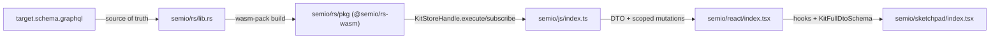
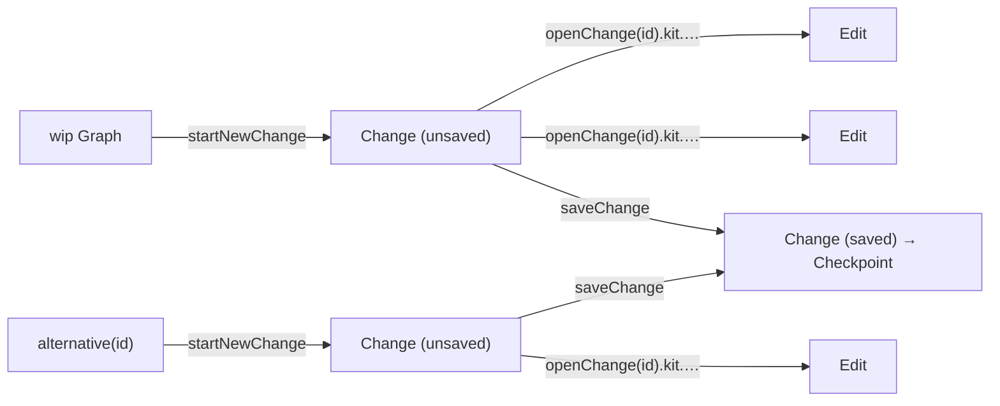

## Goal

Make [semio/rs/lib.rs](semio/rs/lib.rs) emit SDL that is byte-equal (modulo trailing whitespace) to [semio/graphql/target.schema.graphql](semio/graphql/target.schema.graphql), then propagate the new schema through [semio/js/index.ts](semio/js/index.ts), [semio/react/index.tsx](semio/react/index.tsx), [semio/sketchpad/index.tsx](semio/sketchpad/index.tsx). All seven workers run in parallel via the Task tool on disjoint regions.

## Concrete schema deltas (target vs prior implementation)

### Terminology rename (drop "Scoped" prefix; split Operations vs Commands)

| Prior | Target |
|---|---|
| `KitScopedOperationInput` | **`KitOperationInput`** |
| `TagScopedOperationInput` | **`TagOperationInput`** |
| `ConceptScopedOperationInput` | **`ConceptOperationInput`** |
| `QualityScopedOperationInput` | **`QualityOperationInput`** |
| `TypeScopedOperationInput` | **`TypeOperationInput`** |
| `PortScopedOperationInput` | **`PortOperationInput`** |
| `ConnectorScopedOperationInput` | **`ConnectorOperationInput`** |
| `DesignScopedOperationInput` | **`DesignOperationInput`** |
| `PieceScopedOperationInput` | **`PieceOperationInput`** |
| `PiecesScopedOperationInput` | **`PiecesOperationInput`** |
| `SessionScopedCommandInput` | **`SessionCommandInput`** |
| `WipScopedCommandInput` | **`WipCommandInput`** |
| `AlternativeScopedCommandInput` | **`AlternativeCommandInput`** |
| `OpenChangeScopedCommandInput` | **`OpenChangeCommandInput`** |
| `startNewOpenChange` | **`startNewChange`** |
| `saveOpenChange` | **`saveChange`** |
| `Alternative.openChanges` | **`Alternative.unsavedChanges`** |
| `Alternative.store: Kit!` | **`Alternative.kit: Kit!`** |

The conceptual split: **Operations** = entity-level CRUD scopes (`*OperationInput`); **Commands** = VCS lifecycle scopes (`*CommandInput`). All `*OperationInput` and `*CommandInput` definitions live under [target.schema.graphql](semio/graphql/target.schema.graphql) `#region VCS → #region Commands` (lines 5430–5606). The `interface Operation` itself + `OperationEdge`/`OperationConnection` live in the top-level `#region Kit → #region Operations` (lines 977–1000); concrete `Operation`-implementing types are nested inside each entity's own `#region Operations` (e.g. `#region Quality → #region Operations` lines 1906–2084).

### VCS rewrite (the major change)

| Concept | Prior schema | Target schema |
|---|---|---|
| Per-op record | `type Change` with `forwards/backwards: [OperationKind!]!`, semantic op id arrays, `owner: ChangeOwner` (`Transaction \| Draft \| Checkpoint`) | **`type Edit implements StrongEntity`** with `forwards: OperationConnection!`, `backwards: OperationConnection!`, `sequenceNumber: Int!`, `startedAt: Timestamp!`, `finishedAt: Timestamp`, `finished: Boolean`, `description: String!`, `origin: String!`, `owner: Entity` (Alternative \| Checkpoint per comment) |
| Group of ops | (none) | **`type Change implements StrongEntity`** = **group of `Edit`s**: `edits: EditConnection!`, `startedAt: Timestamp!`, `finishedAt: Timestamp`, `finished: Boolean`, `description: String!`, `origin: String!` |
| Open work-in-progress | `type Draft` (separate entity, owned by Alternative) | **REMOVED.** Open work surfaces as `Alternative.unsavedChanges: ChangeConnection!` (and the wip `Graph` exposes the implicit "wip alternative"). Command side calls them "open changes" via `WipCommandInput` / `AlternativeCommandInput.openChange(id)` |
| Transactional grouping | `type Transaction` (owner of `Change` records) | **REMOVED.** Replaced by **`Change`** (group of `Edit`s) + the new **`OpenChangeCommandInput`** scope |
| Checkpoint | `Checkpoint { changeCount, semanticOpRecordIds, parentCheckpoint, root: Kit, … }` | **`Checkpoint implements StrongEntity`** with `timestamp`, `message: String!`, `authors: AuthorConnection!`, `parent: Checkpoint`, `ancestors: [Checkpoint!]!`, `initial: Kit`, `kit: Kit`, `changes: [Change!]!`, `change(id: ID): Change`, `edits: EditConnection!`, `edit(id: ID): Edit`, `owner: Entity` (Alternative \| Graph \| Kit \| Author), `owns: EntityConnection` (Edit). **No `isRelease`** (releases live on Graph) |
| Alternative | `Alternative { start: Checkpoint!, checkpoints: [Checkpoint!]!, store: Kit!, draft: Draft, transaction: Transaction, … }` | **`Alternative implements StrongEntity`** with `name: String!`, `checkpoint: CheckpointConnection!`, `latestWipCheckpointAncestor: Checkpoint`, `savedChanges: ChangeConnection!`, `unsavedChanges: ChangeConnection!`, `kit: Kit!`, `owner: Entity` (Graph), `owns: EntityConnection` (Edit \| Checkpoint). **No `start: Checkpoint!`, no `store`, no `draft`, no `transaction`** |
| Graph | (looser) | **`Graph implements StrongEntity`** with `theKit: Kit`, `alternative(id: ID!)`, `alternatives: AlternativeConnection!`, `checkpoint(id: ID!)`, `checkpoints: CheckpointConnection!`, `release(id: ID!)`, `releases: CheckpointConnection!`, `owner: Entity` (Session), `owns: EntityConnection` (Kit \| Alternative \| Checkpoint \| Session) |
| Session | (extended) | **`Session implements StrongEntity`** with `startedAt: Timestamp`, `alternatives: AlternativeConnection!`, `owner: Entity` (Graph \| Checkpoint \| Alternative), `owns: EntityConnection` (Alternative \| Graph \| Checkpoint) |
| Conflict | included `ReadVersion`/`WriteVersion` references | **`Conflict implements StrongEntity`** with `authoritativeChange: Change`, `wipChange: Change`, `reasons: [String!]!`, `owner: Entity` (Session), `owns: EntityConnection` (Nothing). **`ReadVersion` and `WriteVersion` are dropped entirely from the schema** |

### Command tree (Mutation) — exact target shape

```graphql
type Mutation { session: SessionScopedCommandInput! }   # NOTE: typo in target file — references undeclared SessionScopedCommandInput; fix to SessionCommandInput!

type SessionCommandInput {
  start: ID!
  end: ID!
  wip: WipCommandInput
  alternative(id: ID!): AlternativeCommandInput
}

type WipCommandInput {
  startNewChange: ID!
  saveChange: ID!
  openChange(id: ID!): OpenChangeCommandInput!
}

type AlternativeCommandInput {
  startNewChange: ID!
  saveChange: ID!
  openChange(id: ID!): OpenChangeCommandInput!
}

type OpenChangeCommandInput { kit: KitOperationInput! }
```

Then `KitOperationInput` / `TagOperationInput` / `ConceptOperationInput` / `QualityOperationInput` / `TypeOperationInput` / `PortOperationInput` / `ConnectorOperationInput` / `DesignOperationInput` / `PieceOperationInput` / `PiecesOperationInput` follow exactly the schema (every leaf returns `ID!` = the resulting `Edit.id`).

### Operation interface and concrete types

`interface Operation implements Entity { id, hash, owner: Entity (// Edit), owns: EntityConnection, modification: Modification!, scope: Entity! }` — note `scope` is just `Entity!`, not the prior huge union.

Each concrete Operation pair is `XInput { …data fields… }` + `X implements Operation { id, hash, owner, owns, scope, input, modification, <result-fields> }`. Examples:

```graphql
type CreatedQualityInput { quality: Quality! }
type CreatedQuality implements Operation {
  id: ID!  hash: String!  owner: Entity  owns: EntityConnection
  scope: Entity!  input: CreatedQualityInput!  modification: Modification!
  quality: Quality!  # result
}

type RenamedKitInput { name: String! }
type RenamedKit implements Operation {
  id: ID!  hash: String!  owner: Entity  owns: EntityConnection
  scope: Entity!  input: RenamedKitInput!  modification: Modification!
  kit: Kit!  # result
}

type ChangedDescriptionInput { description: String! }
type ChangedDescription implements Operation {
  id: ID!  hash: String!  owner: Entity  owns: EntityConnection
  scope: Entity!  input: ChangedDescriptionInput!  modification: Modification!
  entity: Entity!  # generic result
}
```

Result-field naming follows the entity affected (`quality`, `qualities`, `kit`, `entity`, `tag`, `tags`, `concept`, `port`, `ports`, `type`, `connector`, `design`, `piece`, `pieces`, `attribute`, …). Worker B/C must mirror exactly the per-entity result field names from [target.schema.graphql](semio/graphql/target.schema.graphql).

### Other deltas

- `Query` shrinks to `{ session: Session!, wip: Graph!, authoritative: Graph, conflicts: ConflictConnection!, node(id: ID!): Node, entity(hash: ID!): Entity }`. Drop `kitStoreBundleJson`, `pieceInDesign`, `alternativePieceKind`.
- `Subscription` collapses to `{ event: Json! }`. All prior streams (`commandSucceeded`, `kitRenamed`, `operationSucceeded`, `operationFailed`) become envelope kinds inside the JSON payload of `event`.
- `scalar Json` is referenced by `Subscription.event` but not declared in `target.schema.graphql`. Worker D adds `scalar Json` to the emitted SDL **and** patches `target.schema.graphql` to declare it (so the file is internally valid).
- The `Mutation.session: SessionScopedCommandInput!` field references an undeclared type (`SessionScopedCommandInput`). Worker D fixes this in the target file to `SessionCommandInput!` and emits matching SDL.
- VCS entities (`Edit`, `Change`, `Checkpoint`, `Alternative`, `Graph`, `Session`, `Conflict`) `implement StrongEntity` (not `Entity`).
- 12-type families (`Foo` / `FooEdge` / `FooConnection` / `FooDiff` / `FooDiffEdge` / `FooDiffConnection` / `FooModification` / `FooModificationEdge` / `FooModificationConnection` / `FooModifications` / `FooModificationsEdge` / `FooModificationsConnection`) for: Vector, Point, Coordinate, Offset, Plane, Position, Location, Attribute, Place, Family, Folder, File, Author, Prop, Benchmark, Quality, Tag, Concept, Stat, Port, Connector, Representation, Type, Layer, Group, Piece, Connection, Side, Design, Kit. Plus `Clump implements WeakEntity` and `BlueprintEdge` / `BlueprintConnection` and `enum PieceConnectionKind { FIXED, CONNECTED }`.
- `interface Operation` lives in the top-level `#region Kit → #region Operations`; concrete `Operation`-implementing types are nested inside each entity's `#region Operations` (e.g. `Quality`, `Tag`, `Concept`, `Port`, `Type`, `Connector`, `Piece`, `Design`, `Kit`).

## Architecture



Change lifecycle (replaces Draft/Transaction):



## Worker task split (parallel via Task tool)

Workers A–D all edit [semio/rs/lib.rs](semio/rs/lib.rs); they own non-overlapping `//#region` blocks and never touch the same lines. Workers E/F/G own one file each.

### Worker A — rs/lib.rs core interfaces + geometry + the relay/diff/modification macro

- File: [semio/rs/lib.rs](semio/rs/lib.rs).
- Owned regions: `gql_relay`, `geom`, `iface`, plus a new `gql::interfaces` subregion.
- Declare async-graphql `#[Interface]`s for `Node`, `Entity`, `EntityEdge`, `EntityConnection`, `WeakEntity`, `StrongEntity`, `Artifact`, `Document`, `Event`, `Diff`, `Modification`, `Operation`, plus `PageInfo`.
- Extend the existing `entity_relay!` macro (rename to `entity_family!` or add a new `entity_full_family!`) so a single invocation emits all 12 types for a domain entity. Concrete pattern:

```rust
macro_rules! entity_full_family {
    ($entity:ident, $weak_or_strong:ident) => {
        // 1. Foo (already present)
        // 2. FooEdge implements EntityEdge { cursor, node: Foo! }
        // 3. FooConnection implements EntityConnection { edges: [FooEdge!]!, pageInfo, hash }
        // 4. FooDiff implements Entity { ...optional fields per schema... }
        // 5. FooDiffEdge / FooDiffConnection
        // 6. FooModification implements Modification { id, hash, owner, owns, before: Foo!, diff: FooDiff!, after: Foo! }
        // 7. FooModificationEdge / FooModificationConnection
        // 8. FooModifications implements Entity { id, hash, owner, owns, removed, modifications: FooModificationConnection, added }
        // 9. FooModificationsEdge / FooModificationsConnection
    };
}
```

- Apply the macro to: `Vector`, `Point`, `Coordinate`, `Offset`, `Plane`, `Position`, `Location`, `Attribute`. Declare matching GraphQL inputs `VectorInput`, `PointInput`, `CoordinateInput`, `OffsetInput`, `PlaneInput`, `PositionInput`, `LocationInput`.
- Important: `*Diff` fields are nullable (optional new value) per the `interface Diff` doc-comment — match field-by-field exactly to [semio/graphql/target.schema.graphql](semio/graphql/target.schema.graphql) lines 109–171 and the per-entity sections (e.g. `PlaneDiff` at lines 601–611).

### Worker B — rs/lib.rs kit-level entities

- File: [semio/rs/lib.rs](semio/rs/lib.rs).
- Owned regions: subregions inside `kit` for `Place`, `Family`, `Folder`, `File`, `Author`, `Prop`, `Benchmark`, `Stat`, `Quality`, `Tag`, `Concept`, `Port` — apply Worker A's macro.
- Operation pairs (`CreatedQualityInput`+`CreatedQuality` … `DeletedQualities`, same for Tag/Concept/Port). Each operation type is:

```rust
#[derive(SimpleObject)]
struct CreatedQualityInput { name: String, value: Option<String>, /* … fields per schema lines 1814-1828 */ }

#[derive(SimpleObject)]
#[graphql(impl = "Operation")]
struct CreatedQuality {
    id: ID, hash: String,
    owner: Option<EntityRef>, owns: Option<EntityConnectionRef>,
    scope: KitScopeRef, input: CreatedQualityInput, modification: QualityModificationRef,
}
```

### Worker C — rs/lib.rs Type/Connector/Representation + Design tree + Kit aggregate

- File: [semio/rs/lib.rs](semio/rs/lib.rs).
- Owned regions: `kit::r#type` (Connector, Representation, Type), `kit::design` (Layer, Group, Piece, Connection, Side, Clump, Design), kit aggregate (Kit + KitDiff/Modification/Modifications + `RenamedKit*`/`ChangedDescription*`).
- Apply Worker A's macro for Connector, Representation, Type, Layer, Group, Piece, Connection, Side, Design, Kit; emit `Clump implements WeakEntity` (no diff/modification family per schema lines 4467–4479); emit `enum PieceConnectionKind { FIXED, CONNECTED }`; emit `BlueprintEdge` / `BlueprintConnection`.
- Operation pairs for Type/Connector/Design/Piece/Pieces (CreatedTypeInput…DeletedTypes, AddedConnectorInput…RemovedConnectors, CreatedDesignInput…RemovedAttributesFromDesign, AddedFixedPieceInput…DeletedPiecesAndConnections).

### Worker D — rs/lib.rs VCS rewrite + roots + parity test

- File: [semio/rs/lib.rs](semio/rs/lib.rs).
- Owned regions: `vcs`, `event`, `worker`, the `gql` root (Query/Mutation/Subscription + Commands region with all `*OperationInput` and `*CommandInput` types).
- **Delete** old `Draft`, `Transaction`, `ChangeOwner` union, `forwardSemanticOpRecordIds`/`backwardSemanticOpRecordIds`, `transactionOpen`/`transactionCommit`/`transactionAbort` mutations.
- **Rename** old `Change` → `Edit`; restructure to:

```rust
#[derive(SimpleObject)]
#[graphql(impl = "StrongEntity")]
pub struct Edit {
    pub id: ID, pub hash: String,
    pub owner: Option<EntityRef>, pub owns: Option<EntityConnectionRef>,
    pub forwards: OperationConnection,
    pub backwards: OperationConnection,
    pub sequence_number: i32,
    pub started_at: Timestamp,
    pub finished_at: Option<Timestamp>,
    pub finished: Option<bool>,
    pub description: String,
    pub origin: String,
}
```

- **Add new** `Change` as group of `Edit`s:

```rust
#[derive(SimpleObject)]
#[graphql(impl = "StrongEntity")]
pub struct Change {
    pub id: ID, pub hash: String,
    pub owner: Option<EntityRef>, pub owns: Option<EntityConnectionRef>,
    pub edits: EditConnection,
    pub started_at: Timestamp,
    pub finished_at: Option<Timestamp>,
    pub finished: Option<bool>,
    pub description: String,
    pub origin: String,
}
```

- Rebuild `Checkpoint`, `Alternative`, `Graph`, `Session`, `Conflict` with the field set listed in the **VCS rewrite** table above (all implement `StrongEntity`). `Alternative` exposes `unsavedChanges` and `kit: Kit!` (no `start`, no `store`, no `draft`). `Conflict` carries `authoritativeChange: Change`, `wipChange: Change`, `reasons: [String!]!` — drop `ReadVersion`/`WriteVersion` entirely.
- Implement the command tree exactly. Concrete async-graphql sketch:

```rust
pub struct Mutation;

#[Object]
impl Mutation {
    async fn session(&self) -> SessionCommandInput { SessionCommandInput::default() }
}

#[derive(Default)]
pub struct SessionCommandInput;

#[Object]
impl SessionCommandInput {
    async fn start(&self, ctx: &Context<'_>) -> Result<ID> { /* ParentRuntime::start_session */ }
    async fn end(&self, ctx: &Context<'_>) -> Result<ID> { /* ParentRuntime::end_session */ }
    async fn wip(&self) -> Option<WipCommandInput> { Some(WipCommandInput) }
    async fn alternative(&self, id: ID) -> Option<AlternativeCommandInput> { Some(AlternativeCommandInput { id }) }
}

pub struct WipCommandInput;

#[Object]
impl WipCommandInput {
    async fn start_new_change(&self, ctx: &Context<'_>) -> Result<ID> { /* opens Change on wip Graph */ }
    async fn save_change(&self, ctx: &Context<'_>) -> Result<ID> { /* closes the open Change → checkpoint */ }
    async fn open_change(&self, id: ID) -> OpenChangeCommandInput { OpenChangeCommandInput { scope: ScopeRef::Wip, change_id: id } }
}

// AlternativeCommandInput mirrors WipCommandInput shape with an extra alternative_id field.

pub struct OpenChangeCommandInput { scope: ScopeRef, change_id: ID }

#[Object]
impl OpenChangeCommandInput {
    async fn kit(&self) -> KitOperationInput { KitOperationInput { scope: self.scope, change_id: self.change_id.clone() } }
}

pub struct KitOperationInput { scope: ScopeRef, change_id: ID }

#[Object]
impl KitOperationInput {
    async fn rename(&self, ctx: &Context<'_>, new_name: String) -> Result<ID> { apply_op(ctx, self, KitOp::Rename(new_name)) }
    async fn change_description(&self, ctx: &Context<'_>, new_description: String) -> Result<ID> { … }
    async fn create_tag(&self, …) -> Result<ID> { … }
    async fn tag(&self, id: ID) -> TagOperationInput { … }
    // … exactly the leaves listed at target.schema.graphql lines 5547-5581 (KitOperationInput)
}
```

- Important typo fix: `target.schema.graphql` line 5627 has `session: SessionScopedCommandInput!` referencing an undeclared type. Worker D updates the target file to `session: SessionCommandInput!` and emits matching SDL. Also adds `scalar Json` to the target file (declared adjacent to `scalar Timestamp`).

Each leaf calls a single helper `apply_op(ctx, scope, op) -> Result<ID>` that funnels into the existing `kit_graph_engine` apply path, records an `Edit` inside the addressed open `Change`, and returns the new `Edit.id` (which is the operation `ID!`).

- Replace today's many subscriptions with:

```rust
pub struct Subscription;

#[Subscription]
impl Subscription {
    async fn event(&self, ctx: &Context<'_>) -> impl Stream<Item = Result<serde_json::Value>> { … }
}
```

The stream multiplexes the existing event bus and serializes each event as JSON envelope `{ "kind": "...", "payload": { ... } }` so JS can discriminate.

- Update `gql::sdl()` and `export_semio_graphql_schema_file` to write [semio/graphql/schema.graphql](semio/graphql/schema.graphql).
- Add a parity test:

```rust
#[test]
fn schema_matches_target() {
    let actual = futures::executor::block_on(crate::gql::sdl());
    let expected = include_str!("../graphql/target.schema.graphql");
    assert_eq!(normalize(&actual), normalize(expected), "SDL must equal target.schema.graphql");
}
```

`normalize` strips trailing whitespace and collapses multiple blank lines.

- `wasm_bridge::KitStoreHandle::execute` / `subscribe` keep their string-in / string-out signatures; the JS boundary does not change.

### Worker E — js/index.ts

- File: [semio/js/index.ts](semio/js/index.ts).
- Owned regions: `JsonGraphQlDtoTypes`, `KitWriteScope`, `ChangeKitCommand`, `GraphqlUtil`, `KitGraphqlReadSelections`, `Transport`, `KitStore`, `KitEntitiesMerged`, `EmbeddedTests`.
- **`KitWriteScope` rewrite** (drops `Draft`/`Transaction`):

```ts
export type KitWriteScope =
  | { kind: 'wip'; changeId: ChangeId }
  | { kind: 'alternative'; alternativeId: AlternativeId; changeId: ChangeId };

export interface ChangeLifecycle {
  startNewChange(scope: { kind: 'wip' | 'alternative'; alternativeId?: AlternativeId }): Promise<ChangeId>;
  saveChange(scope: { kind: 'wip' | 'alternative'; alternativeId?: AlternativeId }): Promise<ChangeId>;
}
```

- **Replace** `ChangeKitCommand` flat union with a typed command builder. Concrete shape:

```ts
export class CommandBuilder {
  constructor(private readonly transport: KitStoreClient) {}
  session() { return new SessionCommand(this.transport); }
}

class SessionCommand {
  start(): Promise<Id>; end(): Promise<Id>;
  wip(): WipCommand;
  alternative(id: Id): AlternativeCommand;
}

class WipCommand { startNewChange(): Promise<ChangeId>; saveChange(): Promise<ChangeId>; openChange(id: ChangeId): OpenChangeCommand; }
class AlternativeCommand extends WipCommand { /* same shape, parameterized by alternativeId */ }
class OpenChangeCommand { kit(): KitOperation; }
class KitOperation {
  rename(newName: string): Promise<Id>;
  changeDescription(newDescription: string): Promise<Id>;
  createTag(args): Promise<Id>; tag(id: Id): TagOperation; deleteTag(id: Id): Promise<Id>; deleteTags(ids: Id[]): Promise<Id>;
  createConcept(args); concept(id); deleteConcept(id); deleteConcepts(ids);
  createQuality(args); quality(id); deleteQuality(id); deleteQualities(ids);
  createType(args); type(id): TypeOperation; deleteType(id); deleteTypes(ids);
  createDesign(args); design(id): DesignOperation; deleteDesign(id); deleteDesigns(ids);
}
// TagOperation / ConceptOperation / QualityOperation / TypeOperation / PortOperation / ConnectorOperation / DesignOperation / PieceOperation / PiecesOperation mirror target.schema.graphql Commands region exactly.
```

Each leaf serializes a GraphQL document of the form:

```graphql
mutation Op($altId: ID!, $changeId: ID!, $newName: String!) {
  session { alternative(id: $altId) { openChange(id: $changeId) { kit { design(id: "...") { piece(id: "...") { rename(newName: $newName) } } } } } }
}
```

- **`KitGraphqlReadSelections`** rewrite: walk the new `wip: Graph`, `authoritative: Graph`, `session: Session` trees. Replace any `draft { … }` / `transaction { … }` field selections with `unsavedChanges { edges { node { id edits { edges { node { id } } } } } }` on the data side; the command-builder uses `openChange(id)` for navigation. Replace `change { forwards backwards }` reads with `edit { forwards { … } backwards { … } sequenceNumber startedAt finishedAt finished description origin }`. Replace `Alternative.store` reads with `Alternative.kit`.
- **Subscription rewrite**: a single `subscription { event }` plus a JSON dispatcher:

```ts
type KitEventEnvelope = { kind: KitEventKind; payload: unknown };

function dispatchEvent(env: KitEventEnvelope) { /* match env.kind → invoke per-kind listeners */ }
```

- **Zod schemas**: regenerate per-entity `*Schema`, `*DiffSchema`, `*ModificationSchema`, `*ModificationsSchema` for the 30 entities. Drop `DraftSchema`, `TransactionSchema`, old `ChangeSchema`. Add `EditSchema`, new `ChangeSchema` (group of edits), updated `CheckpointSchema` / `AlternativeSchema` (with `unsavedChanges`, `kit`, no `start`/`store`/`draft`/`transaction`) / `GraphSchema` / `SessionSchema` / `ConflictSchema` (with `authoritativeChange`, `wipChange`, `reasons`).
- Rename old types where appropriate: `kitChangeDesignPiece` → `kitEditDesignPiece` etc., to keep semantics with the new vocabulary (`Edit` is the per-op record).
- Embedded tests assert: (1) every leaf builder emits a document accepted by `gql::sdl()`; (2) `startNewChange` → leaf op → `saveChange` round-trips against an in-memory WASM `KitStoreHandle`.

### Worker F — react/index.tsx

- File: [semio/react/index.tsx](semio/react/index.tsx).
- Owned regions: `Types, Constants, Utilities`, `Context, KitRegistry`, `KitStoreClient command hooks`, `SchemaReadWriteSegregation`, `Direct Domain Exports`, embedded tests.
- **Hook renames**:

| Prior | Target |
|---|---|
| `useDraft` / `useDraftCommit` | **REMOVE** |
| `useTransaction` / `useTransactionOpen` / `useTransactionCommit` / `useTransactionAbort` | **REMOVE** |
| `useChange` (per-op) | `useEdit` |
| (none) | `useChange(scope)` returning `{ startNewChange, saveChange, currentChangeId }` (Note: name reused — old `useChange` semantics moved to `useEdit`.) |
| `useChangeForwards/Backwards` | `useEditForwards/Backwards` |
| `useDraftPieces` / `useOpenChanges` | `useUnsavedChanges` (consumes `Alternative.unsavedChanges`) |

- **Mutation hooks** wire via the JS builder from Worker E. Pattern:

```tsx
function useDragPiece(designId: Id, pieceId: Id) {
  const builder = useCommandBuilder();
  const { changeId, alternativeId } = useChangeContext();
  return useCallback((offset: OffsetInput) =>
    builder.session().alternative(alternativeId).openChange(changeId)
      .kit().design(designId).piece(pieceId).drag(offset),
    [builder, changeId, alternativeId, designId, pieceId]);
}
```

- **`KitFieldBinding`**: regenerate bindings for every entity in the 30-entity list, including the new `*Diff` / `*Modification` shapes. Drop bindings for removed fields (`changeCount`, `semanticOpRecordIds`, `forwardSemanticOpRecordIds`, `Alternative.store`, `Alternative.start`, `Alternative.draft`, `Alternative.transaction`, `Conflict.reason` (now `reasons`), `Conflict.authoritativeChange: ReadVersion`/`transactionVersion`).
- Embedded tests cover the new hooks against an in-memory `KitStoreClient`, including the `startNewChange` → leaf hook → `saveChange` flow.

### Worker G — sketchpad/index.tsx

- File: [semio/sketchpad/index.tsx](semio/sketchpad/index.tsx).
- Owned regions (per TOC slices F/G/H/I/J/K/L/M/O/P): Kit app shell, sketchpad runtime, consolidated apps, entrypoint, Playwright suite.
- **XState rename**: `TransactionMachineConfig` → `ChangeMachineConfig`, `AppTransactionState` → `AppChangeState`, `transaction` actor → `change` actor. Events become `START_NEW_CHANGE`, `SAVE_CHANGE`, `RUN_OPERATION` instead of `TRANSACTION_OPEN` / `TRANSACTION_COMMIT` / `TRANSACTION_ABORT`. The rollback "abort" semantics map to `discardChange` (a new `WipCommandInput.discardChange: ID!` and `AlternativeCommandInput.discardChange: ID!` may need to be added by Worker D if rollback is required; otherwise expose it via `KitStoreHandle.discardChange`).
- **Alternatives footer**: drop the `draft` chip; show `Alternative.unsavedChanges.edges.length` and a "save change" button driven by the new builder. Show saved checkpoint count from `Alternative.checkpoint.edges.length`.
- **`KitFullDtoSchema.parse` call sites** (entrypoint + VS Code adapter): re-validate against the new entity DTOs from Worker E.
- **Imports**: prune removed exports (`Draft`, `Transaction`, `KitWriteScope` with old shape), add `Edit`, new `Change`, `OpenChangeCommand*`, `WipCommand*`, `AlternativeCommand*`, `*OperationInput` types.
- Playwright suite (slice P): update fixtures that referenced `transaction` or `draft` to use `unsavedChanges` (data side) and `openChange` (command side). Behavioural assertions for kit operations remain unchanged.

## Coordination contracts

- **Naming**: every entity uses PascalCase exactly as in [semio/graphql/target.schema.graphql](semio/graphql/target.schema.graphql); all scalar IDs are `ID!`. `scalar Json` declared in Worker D and added to `target.schema.graphql`.
- **Macro ownership**: Worker A owns the `entity_full_family!` macro definition. Workers B and C use it without modifying it; if shape changes are needed they're funnelled through Worker A.
- **Parity test = merge gate**: Worker D's parity test against `target.schema.graphql` must pass before the bundles' tests (E/F/G) are validated.
- **Stub schema sync for E/F/G**: while Workers A–D land Rust changes, Workers E/F/G can start in parallel using the literal type names from `target.schema.graphql`. They reconcile after the parity test passes.
- **Schema typo / inconsistency fixes** (owned by Worker D, applied to `target.schema.graphql`):
  - Line 5627 `session: SessionScopedCommandInput!` → `session: SessionCommandInput!`.
  - Add `scalar Json` adjacent to `scalar Timestamp`.
  - Region label fixes: lines 5284 `#endregion Edits` (under `#region Changes`) → `#endregion Changes`; line 5218 `#endregion Kits` (opened as `#region Kit`) → `#endregion Kit`.
- **Scope IDs**: every leaf returns `ID!` = the resulting `Edit.id`; the JS builder must propagate this so React hooks can subscribe to operation completion via the `event` subscription.
- **Operations vs Commands vocabulary**: enforce throughout JS/React/Sketchpad — entity scopes are *Operations*, VCS lifecycle scopes are *Commands*. Builder methods that descend from `Mutation.session` are `*Command` classes; methods on / under `KitOperationInput` and below are `*Operation` classes.

## Validation

- `cargo test` in [semio/rs](semio/rs) — including the new `schema_matches_target` parity test.
- `node ../rs/scripts/build-wasm.mjs` then `npm test` in [semio/js](semio/js).
- `npm test` in [semio/react](semio/react).
- `npm test` in [semio/sketchpad](semio/sketchpad) (Playwright with `SEMIO_SKETCHPAD_RUN_EMBEDDED_TESTS=1`).
- `nx build semio/graphql` regenerates [semio/graphql/schema.graphql](semio/graphql/schema.graphql); diff against `target.schema.graphql` must be empty.

## Ticket plumbing (per workspace rules)

- `ticket_open` titled "Align Rust Schema and Bundles with Target Schema"; associate to the most relevant goal from `repo://goals`.
- Each worker writes temp logs/scripts under `.repo/🎫/YY/MM/DD/TICKETSLUG/`.
- `ticket_close` once parity test, JS, React, Sketchpad tests pass and `schema.graphql` re-export is byte-equal to `target.schema.graphql`.
