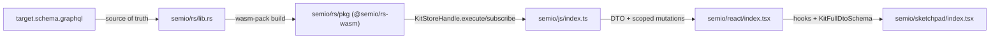
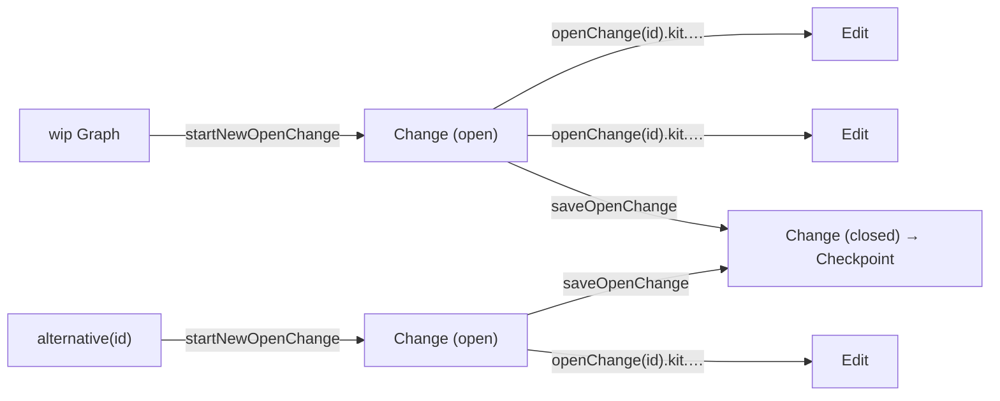

## Goal

Make [semio/rs/lib.rs](semio/rs/lib.rs) emit SDL that is byte-equal (modulo trailing whitespace) to [semio/graphql/target.schema.graphql](semio/graphql/target.schema.graphql), then propagate the new schema through [semio/js/index.ts](semio/js/index.ts), [semio/react/index.tsx](semio/react/index.tsx), [semio/sketchpad/index.tsx](semio/sketchpad/index.tsx). All seven workers run in parallel via the Task tool on disjoint regions.

## Concrete schema deltas (target vs prior)

### VCS rewrite (the major change)

| Concept | Prior schema | Target schema |
|---|---|---|
| Per-op record | `type Change` with `forwards/backwards: [OperationKind!]!`, `forwardSemanticOpRecordIds/backwardSemanticOpRecordIds`, `owner: ChangeOwner` (`Transaction \| Draft \| Checkpoint`) | **`type Edit implements Entity`** with `forwards: OperationConnection!`, `backwards: OperationConnection!`, `sequenceNumber: Int!`, `startedAt: Timestamp!`, `finishedAt: Timestamp`, `finished: Boolean`, `description: String!`, `origin: String!`, `owner: Entity` (Transaction \| Alternative \| Checkpoint per comment) |
| Group of ops | (none) | **`type Change implements Entity`** = **group of `Edit`s**: `edits: EditConnection!`, `startedAt: Timestamp!`, `finishedAt: Timestamp`, `finished: Boolean`, `description: String!`, `origin: String!` |
| Open work-in-progress | `type Draft` (separate entity, owned by Alternative) | **REMOVED.** Drafts are now expressed as **open `Change`s** hanging off `Alternative` (`openChanges: ChangeConnection!`) or off the wip `Graph` |
| Transactional grouping | `type Transaction` (open changes, owner of `Change` records) | **REMOVED.** Replaced by **`Change`** (group of `Edit`s) + the new **`OpenChangeScopedCommandInput`** mutation scope |
| Checkpoint | `Checkpoint { changeCount, semanticOpRecordIds: [Id!]!, parentCheckpoint, root: Kit, … }` | `Checkpoint { changes: [Change!]!, change(id: ID): Change, edits: EditConnection!, edit(id: ID): Edit, parent: Checkpoint, ancestors: [Checkpoint!]!, initial: Kit, kit: Kit, message, isRelease, authors: AuthorConnection!, timestamp, owner: Entity (Alternative\|Graph\|Kit\|Author), owns: EntityConnection (Edit) }` |
| Alternative | `Alternative { start: Checkpoint!, checkpoints: [Checkpoint!]!, store: Kit!, draft: Draft, transaction: Transaction, … }` | `Alternative { name: String!, start: Checkpoint!, checkpoint: CheckpointConnection!, latestWipCheckpointAncestor: Checkpoint, savedChanges: ChangeConnection!, openChanges: ChangeConnection!, store: Kit!, owns: EntityConnection (Edit\|Transaction\|Checkpoint per comment) }` |
| Graph | (looser) | `Graph { theKit: Kit, alternative(id), alternatives: AlternativeConnection!, checkpoint(id), checkpoints: CheckpointConnection!, release(id), releases: CheckpointConnection!, owner: Entity (Session), owns: EntityConnection (Kit\|Alternative\|Checkpoint\|Session) }` |
| Session | (extended) | `Session { startedAt: Timestamp, alternatives: AlternativeConnection!, owner: Entity (Graph\|Checkpoint\|Alternative), owns: EntityConnection (Alternative\|Graph\|Checkpoint) }` |
| Conflict | richer | `Conflict { authoritativeChange: ReadVersion, transactionVersion: WriteVersion, reason: String! }` — **note**: target schema references `ReadVersion`/`WriteVersion` but does **not declare them**; Worker D must declare them as minimal `type … implements Entity { id, hash, owner, owns }` stubs to keep the schema valid (these were under `#region Versions/Read|Write` in earlier drafts and must be re-added to the target if they are missing) |

### Scoped mutation tree rewrite

Prior: `session → alternative(id) → transaction(id) → kit → …`. Target replaces `transaction(id)` with `openChange(id)`, splits the session entry into wip vs alternative, and wires the open/save-change verbs on the wip & alternative scopes. Exact target shape:

```graphql
type Mutation { session: SessionScopedCommandInput! }

type SessionScopedCommandInput {
  start: ID!
  end: ID!
  wip: WipScopedCommandInput
  alternative(id: ID!): AlternativeScopedCommandInput
}

type WipScopedCommandInput {
  startNewOpenChange: ID!
  saveOpenChange: ID!
  openChange(id: ID!): OpenChangeScopedCommandInput!
}

type AlternativeScopedCommandInput {
  startNewOpenChange: ID!
  saveOpenChange: ID!
  openChange(id: ID!): OpenChangeScopedCommandInput!
}

type OpenChangeScopedCommandInput { kit: KitScopedOperationInput! }
```

Then `KitScopedOperationInput` / `TagScopedOperationInput` / `ConceptScopedOperationInput` / `QualityScopedOperationInput` / `TypeScopedOperationInput` / `PortScopedOperationInput` / `ConnectorScopedOperationInput` / `DesignScopedOperationInput` / `PieceScopedOperationInput` / `PiecesScopedOperationInput` follow exactly the schema (every leaf returns `ID!`).

### Other deltas

- `Query` shrinks to `{ session: Session!, wip: Graph!, authoritative: Graph, conflicts: ConflictConnection!, node(id: ID!): Node, entity(hash: ID!): Entity }`. Drop `kitStoreBundleJson`, `pieceInDesign`, `alternativePieceKind`.
- `Subscription` collapses to `{ event: Json! }`. All prior streams (`commandSucceeded`, `kitRenamed`, `operationSucceeded`, `operationFailed`) become envelope kinds inside the JSON payload of `event`.
- `scalar Json` is referenced by `Subscription.event` but not declared in the target file. Worker D adds `scalar Json` to the SDL emitted by `gql::sdl()` (and adds it to `target.schema.graphql` if/when we regenerate as the source of truth).
- 12-type families (`Foo` / `FooEdge` / `FooConnection` / `FooDiff` / `FooDiffEdge` / `FooDiffConnection` / `FooModification` / `FooModificationEdge` / `FooModificationConnection` / `FooModifications` / `FooModificationsEdge` / `FooModificationsConnection`) for: Vector, Point, Coordinate, Offset, Plane, Position, Location, Attribute, Place, Family, Folder, File, Author, Prop, Benchmark, Quality, Tag, Concept, Stat, Port, Connector, Representation, Type, Layer, Group, Piece, Connection, Side, Design, Kit. Plus `Clump implements WeakEntity` and `BlueprintEdge`/`BlueprintConnection` and `enum PieceConnectionKind { FIXED, CONNECTED }`.
- ~120 `Operation` concrete pairs (e.g. `CreatedQualityInput`+`CreatedQuality implements Operation { id, hash, owner, owns, scope, input, modification }`). The exact list and field shapes are in [semio/graphql/target.schema.graphql](semio/graphql/target.schema.graphql).

## Architecture



Open-change lifecycle (replaces Draft/Transaction):



## Worker task split (parallel via Task tool)

Workers A–D all edit [semio/rs/lib.rs](semio/rs/lib.rs); they own non-overlapping `//#region` blocks and never touch the same lines. Workers E/F/G own one file each.

### Worker A — rs/lib.rs core interfaces + geometry + the relay/diff/modification macro

- File: [semio/rs/lib.rs](semio/rs/lib.rs).
- Owned regions: `gql_relay`, `geom`, `iface`, plus a new `gql::interfaces` subregion.
- Declare async-graphql `#[Interface]`s for `Node`, `Entity`, `EntityEdge`, `EntityConnection`, `WeakEntity`, `StrongEntity`, `Artifact`, `Document`, `Event`, `Diff`, `Modification`, `Operation`, plus `PageInfo`.
- Extend the existing `entity_relay!` macro (rename to `entity_family!` or add a new `entity_full_family!`) so a single invocation emits all 12 types for a domain entity. Concrete pattern:

```rust
macro_rules! entity_full_family {
    ($entity:ident, $weak_or_strong:ident) => {
        // 1. Foo (already present)
        // 2. FooEdge implements EntityEdge { cursor, node: Foo! }
        // 3. FooConnection implements EntityConnection { edges: [FooEdge!]!, pageInfo, hash }
        // 4. FooDiff implements Entity { ...optional fields per schema... }
        // 5. FooDiffEdge / FooDiffConnection
        // 6. FooModification implements Modification { id, hash, owner, owns, before: Foo!, diff: FooDiff!, after: Foo! }
        // 7. FooModificationEdge / FooModificationConnection
        // 8. FooModifications implements Entity { id, hash, owner, owns, removed, modifications: FooModificationConnection, added }
        // 9. FooModificationsEdge / FooModificationsConnection
    };
}
```

- Apply the macro to: `Vector`, `Point`, `Coordinate`, `Offset`, `Plane`, `Position`, `Location`, `Attribute`. Declare matching GraphQL inputs `VectorInput`, `PointInput`, `CoordinateInput`, `OffsetInput`, `PlaneInput`, `PositionInput`, `LocationInput`.
- Important: `*Diff` fields are nullable (optional new value) per the `interface Diff` doc-comment — match field-by-field exactly to [semio/graphql/target.schema.graphql](semio/graphql/target.schema.graphql) lines 109–171 and the per-entity sections (e.g. `PlaneDiff` at lines 601–611).

### Worker B — rs/lib.rs kit-level entities

- File: [semio/rs/lib.rs](semio/rs/lib.rs).
- Owned regions: subregions inside `kit` for `Place`, `Family`, `Folder`, `File`, `Author`, `Prop`, `Benchmark`, `Stat`, `Quality`, `Tag`, `Concept`, `Port` — apply Worker A's macro.
- Operation pairs (`CreatedQualityInput`+`CreatedQuality` … `DeletedQualities`, same for Tag/Concept/Port). Each operation type is:

```rust
#[derive(SimpleObject)]
struct CreatedQualityInput { name: String, value: Option<String>, /* … fields per schema lines 1814-1828 */ }

#[derive(SimpleObject)]
#[graphql(impl = "Operation")]
struct CreatedQuality {
    id: ID, hash: String,
    owner: Option<EntityRef>, owns: Option<EntityConnectionRef>,
    scope: KitScopeRef, input: CreatedQualityInput, modification: QualityModificationRef,
}
```

### Worker C — rs/lib.rs Type/Connector/Representation + Design tree + Kit aggregate

- File: [semio/rs/lib.rs](semio/rs/lib.rs).
- Owned regions: `kit::r#type` (Connector, Representation, Type), `kit::design` (Layer, Group, Piece, Connection, Side, Clump, Design), kit aggregate (Kit + KitDiff/Modification/Modifications + `RenamedKit*`/`ChangedDescription*`).
- Apply Worker A's macro for Connector, Representation, Type, Layer, Group, Piece, Connection, Side, Design, Kit; emit `Clump implements WeakEntity` (no diff/modification family per schema lines 4467–4479); emit `enum PieceConnectionKind { FIXED, CONNECTED }`; emit `BlueprintEdge` / `BlueprintConnection`.
- Operation pairs for Type/Connector/Design/Piece/Pieces (CreatedTypeInput…DeletedTypes, AddedConnectorInput…RemovedConnectors, CreatedDesignInput…RemovedAttributesFromDesign, AddedFixedPieceInput…DeletedPiecesAndConnections).

### Worker D — rs/lib.rs VCS rewrite + roots + parity test

- File: [semio/rs/lib.rs](semio/rs/lib.rs).
- Owned regions: `vcs`, `event`, `worker`, the `gql` root (Query/Mutation/Subscription + entire scoped command tree).
- **Delete** old `Draft`, `Transaction`, `ChangeOwner` union, `forwardSemanticOpRecordIds`/`backwardSemanticOpRecordIds`, `transactionOpen`/`transactionCommit`/`transactionAbort` mutations.
- **Rename** old `Change` → `Edit`; restructure to:

```rust
#[derive(SimpleObject)]
#[graphql(impl = "Entity")]
pub struct Edit {
    pub id: ID, pub hash: String,
    pub owner: Option<EntityRef>, pub owns: Option<EntityConnectionRef>,
    pub forwards: OperationConnection,
    pub backwards: OperationConnection,
    pub sequence_number: i32,
    pub started_at: Timestamp,
    pub finished_at: Option<Timestamp>,
    pub finished: Option<bool>,
    pub description: String,
    pub origin: String,
}
```

- **Add new** `Change` as group of `Edit`s:

```rust
#[derive(SimpleObject)]
#[graphql(impl = "Entity")]
pub struct Change {
    pub id: ID, pub hash: String,
    pub owner: Option<EntityRef>, pub owns: Option<EntityConnectionRef>,
    pub edits: EditConnection,
    pub started_at: Timestamp,
    pub finished_at: Option<Timestamp>,
    pub finished: Option<bool>,
    pub description: String,
    pub origin: String,
}
```

- Rebuild `Checkpoint`, `Alternative`, `Graph`, `Session`, `Conflict` with the field set listed in the **VCS rewrite** table above. Add minimal stub `type ReadVersion implements Entity { id, hash, owner, owns }` and `type WriteVersion implements Entity { id, hash, owner, owns }` (so `Conflict.authoritativeChange` / `transactionVersion` are valid).
- Implement the scoped command tree exactly. Concrete async-graphql sketch:

```rust
pub struct Mutation;

#[Object]
impl Mutation {
    async fn session(&self) -> SessionScopedCommandInput { SessionScopedCommandInput::default() }
}

#[derive(Default)]
pub struct SessionScopedCommandInput;

#[Object]
impl SessionScopedCommandInput {
    async fn start(&self, ctx: &Context<'_>) -> Result<ID> { /* ParentRuntime::start_session */ }
    async fn end(&self, ctx: &Context<'_>) -> Result<ID> { /* ParentRuntime::end_session */ }
    async fn wip(&self) -> Option<WipScopedCommandInput> { Some(WipScopedCommandInput) }
    async fn alternative(&self, id: ID) -> Option<AlternativeScopedCommandInput> { Some(AlternativeScopedCommandInput { id }) }
}

pub struct WipScopedCommandInput;

#[Object]
impl WipScopedCommandInput {
    async fn start_new_open_change(&self, ctx: &Context<'_>) -> Result<ID> { /* opens Change on wip Graph */ }
    async fn save_open_change(&self, ctx: &Context<'_>) -> Result<ID> { /* closes the open Change → checkpoint */ }
    async fn open_change(&self, id: ID) -> OpenChangeScopedCommandInput { OpenChangeScopedCommandInput { scope: ScopeRef::Wip, change_id: id } }
}

// AlternativeScopedCommandInput mirrors WipScopedCommandInput

pub struct OpenChangeScopedCommandInput { scope: ScopeRef, change_id: ID }

#[Object]
impl OpenChangeScopedCommandInput {
    async fn kit(&self) -> KitScopedOperationInput { KitScopedOperationInput { scope: self.scope, change_id: self.change_id.clone() } }
}

pub struct KitScopedOperationInput { scope: ScopeRef, change_id: ID }

#[Object]
impl KitScopedOperationInput {
    async fn rename(&self, ctx: &Context<'_>, new_name: String) -> Result<ID> { apply_op(ctx, self, KitOp::Rename(new_name)) }
    async fn change_description(&self, ctx: &Context<'_>, new_description: String) -> Result<ID> { … }
    async fn create_tag(&self, …) -> Result<ID> { … }
    async fn tag(&self, id: ID) -> TagScopedOperationInput { … }
    // … exactly the leaves listed at target.schema.graphql lines 5203-5237
}
```

Each leaf calls a single helper `apply_op(ctx, scope, op) -> Result<ID>` that funnels into the existing `kit_graph_engine` apply path, records an `Edit` inside the addressed open `Change`, and returns the new `Edit.id` (which is the operation `ID!`).

- Replace today's many subscriptions with:

```rust
pub struct Subscription;

#[Subscription]
impl Subscription {
    async fn event(&self, ctx: &Context<'_>) -> impl Stream<Item = Result<serde_json::Value>> { … }
}
```

The stream multiplexes the existing event bus and serializes each event as JSON envelope `{ "kind": "...", "payload": { ... } }` so JS can discriminate.

- Update `gql::sdl()` and `export_semio_graphql_schema_file` to write [semio/graphql/schema.graphql](semio/graphql/schema.graphql).
- Add a parity test:

```rust
#[test]
fn schema_matches_target() {
    let actual = futures::executor::block_on(crate::gql::sdl());
    let expected = include_str!("../graphql/target.schema.graphql");
    assert_eq!(normalize(&actual), normalize(expected), "SDL must equal target.schema.graphql");
}
```

`normalize` strips trailing whitespace and collapses multiple blank lines.

- `wasm_bridge::KitStoreHandle::execute` / `subscribe` keep their string-in / string-out signatures; the JS boundary does not change.

### Worker E — js/index.ts

- File: [semio/js/index.ts](semio/js/index.ts).
- Owned regions: `JsonGraphQlDtoTypes`, `KitWriteScope`, `ChangeKitCommand`, `GraphqlUtil`, `KitGraphqlReadSelections`, `Transport`, `KitStore`, `KitEntitiesMerged`, `EmbeddedTests`.
- **`KitWriteScope` rewrite** (drops `Draft`/`Transaction`):

```ts
export type KitWriteScope =
  | { kind: 'wip'; openChangeId: ChangeId }
  | { kind: 'alternative'; alternativeId: AlternativeId; openChangeId: ChangeId };

export interface OpenChangeLifecycle {
  startNewOpenChange(scope: { kind: 'wip' | 'alternative'; alternativeId?: AlternativeId }): Promise<ChangeId>;
  saveOpenChange(scope: { kind: 'wip' | 'alternative'; alternativeId?: AlternativeId }): Promise<ChangeId>;
}
```

- **Replace** `ChangeKitCommand` flat union with a typed scoped-command builder. Concrete shape:

```ts
export class ScopedCommandBuilder {
  constructor(private readonly transport: KitStoreClient) {}
  session() { return new SessionScope(this.transport); }
}

class SessionScope {
  start(): Promise<Id>; end(): Promise<Id>;
  wip(): WipScope;
  alternative(id: Id): AlternativeScope;
}

class WipScope { startNewOpenChange(): Promise<ChangeId>; saveOpenChange(): Promise<ChangeId>; openChange(id: ChangeId): OpenChangeScope; }
class AlternativeScope extends WipScope { /* same shape, parameterized by alternativeId */ }
class OpenChangeScope { kit(): KitOpScope; }
class KitOpScope {
  rename(newName: string): Promise<Id>;
  changeDescription(newDescription: string): Promise<Id>;
  createTag(args): Promise<Id>; tag(id: Id): TagOpScope; deleteTag(id: Id): Promise<Id>; deleteTags(ids: Id[]): Promise<Id>;
  createConcept(args); concept(id); deleteConcept(id); deleteConcepts(ids);
  createQuality(args); quality(id); deleteQuality(id); deleteQualities(ids);
  createType(args); type(id): TypeOpScope; deleteType(id); deleteTypes(ids);
  createDesign(args); design(id): DesignOpScope; deleteDesign(id); deleteDesigns(ids);
}
// TagOpScope / ConceptOpScope / QualityOpScope / TypeOpScope / PortOpScope / ConnectorOpScope / DesignOpScope / PieceOpScope / PiecesOpScope mirror target.schema.graphql exactly.
```

Each leaf serializes a GraphQL document of the form:

```graphql
mutation Op($altId: ID!, $changeId: ID!, $newName: String!) {
  session { alternative(id: $altId) { openChange(id: $changeId) { kit { design(id: "...") { piece(id: "...") { rename(newName: $newName) } } } } } }
}
```

- **`KitGraphqlReadSelections`** rewrite: walk the new `wip: Graph`, `authoritative: Graph`, `session: Session` trees. Replace any `draft { … }` / `transaction { … }` field selections with `openChanges { edges { node { id edits { edges { node { id } } } } } }`. Replace `change { forwards backwards }` reads with `edit { forwards { … } backwards { … } sequenceNumber startedAt finishedAt finished description origin }`.
- **Subscription rewrite**: a single `subscription { event }` plus a JSON dispatcher:

```ts
type KitEventEnvelope = { kind: KitEventKind; payload: unknown };

function dispatchEvent(env: KitEventEnvelope) { /* match env.kind → invoke per-kind listeners */ }
```

- **Zod schemas**: regenerate per-entity `*Schema`, `*DiffSchema`, `*ModificationSchema`, `*ModificationsSchema` for the 30 entities. Drop `DraftSchema`, `TransactionSchema`, old `ChangeSchema`. Add `EditSchema`, new `ChangeSchema` (group of edits), updated `CheckpointSchema`/`AlternativeSchema`/`GraphSchema`/`SessionSchema`.
- Rename old types where appropriate: `kitChangeDesignPiece` → `kitEditDesignPiece` etc., to keep semantics with the new vocabulary (`Edit` is the per-op record).
- Embedded tests assert: (1) every leaf builder emits a document accepted by `gql::sdl()`; (2) `startNewOpenChange` → leaf op → `saveOpenChange` round-trips against an in-memory WASM `KitStoreHandle`.

### Worker F — react/index.tsx

- File: [semio/react/index.tsx](semio/react/index.tsx).
- Owned regions: `Types, Constants, Utilities`, `Context, KitRegistry`, `KitStoreClient command hooks`, `SchemaReadWriteSegregation`, `Direct Domain Exports`, embedded tests.
- **Hook renames**:

| Prior | Target |
|---|---|
| `useDraft` / `useDraftCommit` | **REMOVE** |
| `useTransaction` / `useTransactionOpen` / `useTransactionCommit` / `useTransactionAbort` | **REMOVE** |
| `useChange` (per-op) | `useEdit` |
| (none) | `useOpenChange(scope)` returning `{ startNewOpenChange, saveOpenChange, currentOpenChangeId }` |
| `useChangeForwards/Backwards` | `useEditForwards/Backwards` |

- **Mutation hooks** wire via the JS builder from Worker E. Pattern:

```tsx
function useDragPiece(designId: Id, pieceId: Id) {
  const builder = useScopedCommandBuilder();
  const { openChangeId, alternativeId } = useOpenChangeContext();
  return useCallback((offset: OffsetInput) =>
    builder.session().alternative(alternativeId).openChange(openChangeId)
      .kit().design(designId).piece(pieceId).drag(offset),
    [builder, openChangeId, alternativeId, designId, pieceId]);
}
```

- **`KitFieldBinding`**: regenerate bindings for every entity in the 30-entity list, including the new `*Diff` / `*Modification` shapes. Drop bindings for removed fields (`changeCount`, `semanticOpRecordIds`, `forwardSemanticOpRecordIds`, etc.).
- Embedded tests cover the new hooks against an in-memory `KitStoreClient`, including the `startNewOpenChange` → leaf hook → `saveOpenChange` flow.

### Worker G — sketchpad/index.tsx

- File: [semio/sketchpad/index.tsx](semio/sketchpad/index.tsx).
- Owned regions (per TOC slices F/G/H/I/J/K/L/M/O/P): Kit app shell, sketchpad runtime, consolidated apps, entrypoint, Playwright suite.
- **XState rename**: `TransactionMachineConfig` → `OpenChangeMachineConfig`, `AppTransactionState` → `AppOpenChangeState`, `transaction` actor → `openChange` actor. Keep one machine per app; the events become `START_OPEN_CHANGE`, `SAVE_OPEN_CHANGE`, `RUN_LEAF_OP` instead of `TRANSACTION_OPEN` / `TRANSACTION_COMMIT` / `TRANSACTION_ABORT`. The rollback "abort" semantics map to `discardOpenChange` (a new `WipScopedCommandInput.discardOpenChange` mutation **may** need to be added — Worker D should add it if rollback is needed; otherwise expose it via `KitStoreHandle.discardOpenChange`).
- **Alternatives footer**: drop the `draft` chip; show `openChanges.edges.length` and a "save change" button driven by the new builder.
- **`KitFullDtoSchema.parse` call sites** (entrypoint + VS Code adapter): re-validate against the new entity DTOs from Worker E.
- **Imports**: prune removed exports (`Draft`, `Transaction`, etc.), add `Edit`, `Change`, `OpenChange*` types.
- Playwright suite (slice P): update fixtures that referenced `transaction` or `draft` to use `openChange`. Behavioural assertions for kit operations remain unchanged.

## Coordination contracts

- **Naming**: every entity uses PascalCase exactly as in [semio/graphql/target.schema.graphql](semio/graphql/target.schema.graphql); all scalar IDs are `ID!`. `scalar Json` declared in Worker D.
- **Macro ownership**: Worker A owns the `entity_full_family!` macro definition. Workers B and C use it without modifying it; if shape changes are needed they're funnelled through Worker A.
- **Parity test = merge gate**: Worker D's parity test against `target.schema.graphql` must pass before the bundles' tests (E/F/G) are validated.
- **Stub schema sync for E/F/G**: while Workers A–D land Rust changes, Workers E/F/G can start in parallel using the literal type names from `target.schema.graphql`. They reconcile after the parity test passes.
- **Naming for ReadVersion/WriteVersion**: target schema references but does not declare these. Worker D must declare minimal stubs and **also patch [semio/graphql/target.schema.graphql](semio/graphql/target.schema.graphql)** to add them under `#region VCS → Versions` so the file is internally consistent. Same for `scalar Json`.
- **Scope IDs**: every leaf returns `ID!` = the resulting `Edit.id`; the JS builder must propagate this so React hooks can subscribe to operation completion via the `event` subscription.

## Validation

- `cargo test` in [semio/rs](semio/rs) — including the new `schema_matches_target` parity test.
- `node ../rs/scripts/build-wasm.mjs` then `npm test` in [semio/js](semio/js).
- `npm test` in [semio/react](semio/react).
- `npm test` in [semio/sketchpad](semio/sketchpad) (Playwright with `SEMIO_SKETCHPAD_RUN_EMBEDDED_TESTS=1`).
- `nx build semio/graphql` regenerates [semio/graphql/schema.graphql](semio/graphql/schema.graphql); diff against `target.schema.graphql` must be empty.

## Ticket plumbing (per workspace rules)

- `ticket_open` titled "Align Rust Schema and Bundles with Target Schema"; associate to the most relevant goal from `repo://goals`.
- Each worker writes temp logs/scripts under `.repo/🎫/YY/MM/DD/TICKETSLUG/`.
- `ticket_close` once parity test, JS, React, Sketchpad tests pass and `schema.graphql` re-export is byte-equal to `target.schema.graphql`.
