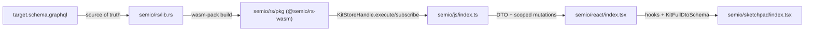
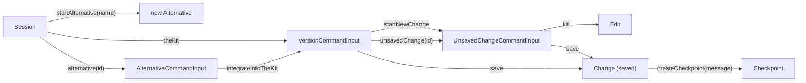

## Goal

Make [semio/rs/lib.rs](semio/rs/lib.rs) emit SDL that is byte-equal (modulo trailing whitespace) to [semio/graphql/target.schema.graphql](semio/graphql/target.schema.graphql), then propagate the new schema through [semio/js/index.ts](semio/js/index.ts), [semio/react/index.tsx](semio/react/index.tsx), [semio/sketchpad/index.tsx](semio/sketchpad/index.tsx). All seven workers run in parallel via the Task tool on disjoint regions.

## Field-annotation discipline (data vs computed vs cached vs reference)

Every field in [target.schema.graphql](semio/graphql/target.schema.graphql) carries an inline annotation:

- `# data` — **stored**. Persisted in the SQLite/file backend. Owned by the struct holding the field. Hash inputs.
- `# computed` — **derived**. Implemented as a resolver method, not an owned struct field. Reads other data and the kit-graph engine.
- `# cached` — derived but memoized. Currently used only for `hash: String!` on every entity/connection. Computed lazily and invalidated when any input `# data` field changes.
- `# reference` — pointer/relation. Stored as an `Id`/`Hash`, resolved on read. Counts as data when it pins identity, otherwise as computed.

**Most fields are `# computed`.** Only a small per-entity slice is actually stored. The Rust structs and the SQLite schema must reflect this — keeping computed fields off the structs avoids drift between persisted state and derived views, and lets the kit-graph engine remain the single source of truth.

Concrete examples (from the target schema):

- **`Quality` (Artifact, lines 1790-1816)** — stored: `id`, `name`, `description`, `icon`, `key`, `value`, `unit`, `definition`, `benchmarks`. Cached: `hash`. Reference: `owner`, `owns`. Computed: `createdAt`, `createdBy`, `authoredBy`, `changedIn`, `lastChangedAt`, `lastChangedBy`, `lastChangedIn`, `changes`, `edits`, `attributes`.
- **`QualityDiff` (lines 1829-1848)** — every domain field is `# computed`. The diff struct holds **no owned data**; it's projected from the `Edit.forwards`/`backwards` arrays at resolve time. Cached `hash` only.
- **`QualityModification` and `QualityModifications` (lines 1861-1903)** — entirely computed/reference; no stored fields. Resolved from the same `Edit` log.
- **VCS entities** (target schema lines 5226-5417):
  - **`Edit`** (5226-5241) — stored: `id`, `forwards`, `backwards`, `startedAt`, `finishedAt`, `description`, `origin`. Cached: `hash`. Reference: `owner`, `owns`. Computed: `sequenceNumber`, `finished`.
  - **`Change`** (5258-5271) — stored: `id`, `edits`, `startedAt`, `finishedAt`, `description`, `origin`. Cached: `hash`. Reference: `owner`, `owns`. Computed: `finished`.
  - **`Checkpoint`** (5288-5306) — stored: `id`, `timestamp`, `message`, `changes` (the change-set ids). Cached: `hash`. Reference: `owner`, `owns`, `parent`, `authors`. Computed: `ancestors`, `initial`, `kit`, `change(id)`, `edits`, `edit(id)`.
  - **`Alternative`** (5323-5336) — stored: `id`, `name`, `savedChanges`, `unsavedChanges`. Cached: `hash`. Reference: `owner`, `owns`, `checkpoint`. Computed: `latestWipCheckpointAncestor`, `kit`.
  - **`Graph`** (5353-5365) — stored: `id`, `alternatives`, `checkpoints`. Cached: `hash`. Reference: `owner`, `owns`. Computed: `theKit`, `alternative(id)`, `checkpoint(id)`, `release(id)`, `releases`.
  - **`Session`** (5379-5386) — stored: `id`, `startedAt`, `alternatives`. Cached: `hash`. Reference: `owner`, `owns`.
  - **`Conflict`** (5408-5416) — stored: `id`, `reasons`. Cached: `hash`. Reference: `owner`, `owns`, `authoritativeChange`, `wipChange`.
- **All `*Edge` types** — only `node` is `# reference`; `cursor` is `# computed`.
- **All `*Connection` types** — only `hash` is `# cached`; `edges` and `pageInfo` are `# computed`.

### Implementation rules across the workers

1. **Rust structs (Workers A–D)**: only define struct fields for `# data` and `# cached` annotations. Implement `# computed` and reference-as-derived fields as `async fn` resolvers in `#[ComplexObject]` blocks, reading from `kit_graph_engine` / `kit_backbone`. The macro `entity_full_family!` (Worker A) generates only the data fields as struct members; everything else lives in the impl block.
2. **In-memory references are `Arc<T>` pointers — NEVER stored `Id`s.** This is a hard rule (matches the existing `Arc<Self>`-architecture documented in the [lib.rs](semio/rs/lib.rs) header: *"Every entity is one hand-written Rust struct shared as `Arc<Self>` with interior `async_lock::RwLock` per mutable field. GraphQL resolvers take `&self` on the entity (deref'd through the Arc) and return `Arc<Child>` for relationships"*). Concretely:
   - `# reference` fields hold `Arc<Concrete>` for monomorphic targets (e.g. `Arc<Edit>`, `Arc<Quality>`) and an enum like `Arc<EntityRef>` for heterogeneous interface targets (`Entity`, `EntityConnection`, `Operation`).
   - `# data` collections of references hold `Vec<Arc<Concrete>>` (not `Vec<Id>`). E.g. `Edit.forwards`/`backwards` is `Vec<Arc<dyn Operation>>` (or `Vec<Arc<OperationRef>>` enum), `Change.edits` is `Vec<Arc<Edit>>`, `Checkpoint.changes` is `Vec<Arc<Change>>`, `Alternative.savedChanges`/`unsavedChanges` are `Vec<Arc<Change>>`.
   - `Id` lives **only** as the entity's own identity (`pub id: Id` on the entity itself, used for the GraphQL `id: ID!` field, hash inputs, and serde wire format) and as a parameter on resolver methods (e.g. `async fn alternative(&self, id: ID) -> Option<Arc<Alternative>>`).
   - The lookup-by-id paths (`Query.node(id)`, `Query.entity(hash)`, `Graph.alternative(id)`, `Checkpoint.change(id)`, etc.) live in resolvers that walk an `Arc`-backed index map (`HashMap<Id, Arc<T>>`) maintained by the kit-graph engine, not by chasing stored `Id` foreign keys.
   - Operation `*Input` types likewise hold `Arc<T>` (e.g. `CreatedQualityInput { quality: Arc<Quality> }`).
3. **Persistence layer (Worker D)**: when serializing for SQLite/JSON/wire, references are projected to the target's `Id` (the only stable handle that survives round-trip). On rehydrate, the index map is rebuilt and every `Arc` is re-pointed. SQLite tables store ids as foreign keys; the Rust value graph stores `Arc`s. No `Id` is ever **kept** on a struct in place of an `Arc`.
4. **Hash invalidation**: any write that mutates a `# data` field on an entity must invalidate its `hash` and propagate up its ownership chain (parent `# cached` hashes recomputed lazily on next read). Because cross-references are `Arc`s, the chain is walked by pointer.
5. **JS DTOs (Worker E)**: TypeScript has no `Arc`; the JS bundle stores **pointers** as direct object references (closure-captured handles) on the live store and **ids** only on the wire DTOs. Two flavors per entity: `*DataDto` (the wire slice with id-based references for round-trip) and `*Dto` (the live GraphQL response with embedded entity references when the query selects them). Zod schemas come in matching `*DataSchema` (id-references) and `*Schema` (embedded references) flavors.
6. **React hooks (Worker F)**: hooks that drive **mutations** target the `# data` slice via the command builder, passing entity ids as arguments. Hooks that **read** return live entity objects (the JS pointer equivalent of `Arc<T>`) backed by `useSyncExternalStore`.
7. **Sketchpad (Worker G)**: `KitFullDtoSchema.parse(dto)` validates only the `# data` slice; all rendering of `# computed` fields is derived at read time from store snapshots, not from imported JSON.
8. **Subscription `event` payloads (Worker D)**: serialize only `# data` plus the entity `id`/`hash`. Receivers re-read computed fields via Query when needed. Keeps the wire small and avoids stale computed snapshots.

## Concrete schema deltas (target vs prior implementation)

### Terminology rename (drop "Scoped" prefix; split Operations vs Commands; collapse Wip → Version)

| Prior | Target |
|---|---|
| `KitScopedOperationInput` | **`KitOperationInput`** |
| `TagScopedOperationInput` | **`TagOperationInput`** |
| `ConceptScopedOperationInput` | **`ConceptOperationInput`** |
| `QualityScopedOperationInput` | **`QualityOperationInput`** |
| `TypeScopedOperationInput` | **`TypeOperationInput`** |
| `PortScopedOperationInput` | **`PortOperationInput`** |
| `ConnectorScopedOperationInput` | **`ConnectorOperationInput`** |
| `DesignScopedOperationInput` | **`DesignOperationInput`** |
| `PieceScopedOperationInput` | **`PieceOperationInput`** |
| `PiecesScopedOperationInput` | **`PiecesOperationInput`** |
| `SessionScopedCommandInput` | **`SessionCommandInput`** |
| `WipScopedCommandInput` / `WipCommandInput` | **`VersionCommandInput`** (entered via `SessionCommandInput.theKit`) |
| `AlternativeScopedCommandInput` / old `AlternativeCommandInput` | **`AlternativeCommandInput`** (drastically simplified — see Command tree below) |
| `OpenChangeScopedCommandInput` / `OpenChangeCommandInput` | **`UnsavedChangeCommandInput`** |
| `startNewOpenChange` | **`startNewChange`** (now lives on `VersionCommandInput`) |
| `saveOpenChange` / `saveChange` | **`save: ID!`** (nested either on `VersionCommandInput` or on `UnsavedChangeCommandInput`) |
| `openChange(id: ID!)` | **`unsavedChange(id: ID!): UnsavedChangeCommandInput!`** (now on `VersionCommandInput`) |
| `Alternative.openChanges` | **`Alternative.unsavedChanges`** |
| `Alternative.store: Kit!` | **`Alternative.kit: Kit!`** |
| `Conflict.transactionVersion: WriteVersion` | **`Conflict.wipChange: Change`** |
| `Conflict.reason: String!` | **`Conflict.reasons: [String!]!`** |
| `Graph.kit` | **`Graph.theKit: Kit`** (distinct from `Alternative.kit: Kit!`) |
| `Checkpoint.isRelease` | **REMOVED.** Releases live on `Graph.releases: CheckpointConnection!` and `Graph.release(id)` |
| (none) | **NEW** `SessionCommandInput.login(username, passwordHash, hubUrl): ID!`, **`logout: ID!`**, **`startAlternative(name: String): ID!`** |
| (none) | **NEW** `VersionCommandInput.createCheckpoint(message: String!): ID!` |
| (none) | **NEW** `AlternativeCommandInput.version: ID!`, **`integrateIntoTheKit: ID!`** |

The conceptual split: **Operations** = entity-level CRUD scopes (`*OperationInput`); **Commands** = VCS lifecycle scopes (`*CommandInput`). All `*OperationInput` and `*CommandInput` definitions live under [target.schema.graphql](semio/graphql/target.schema.graphql) `#region VCS → #region Commands` (lines 5430–5606). The `interface Operation` itself + `OperationEdge`/`OperationConnection` live in the top-level `#region Kit → #region Operations` (lines 977–1000); concrete `Operation`-implementing types are nested inside each entity's own `#region Operations` (e.g. `#region Quality → #region Operations` lines 1906–2084).

### VCS rewrite (the major change)

| Concept | Prior schema | Target schema |
|---|---|---|
| Per-op record | `type Change` with `forwards/backwards: [OperationKind!]!`, semantic op id arrays, `owner: ChangeOwner` (`Transaction \| Draft \| Checkpoint`) | **`type Edit implements StrongEntity`** with `forwards: OperationConnection!`, `backwards: OperationConnection!`, `sequenceNumber: Int!`, `startedAt: Timestamp!`, `finishedAt: Timestamp`, `finished: Boolean`, `description: String!`, `origin: String!`, `owner: Entity` (Alternative \| Checkpoint per comment) |
| Group of ops | (none) | **`type Change implements StrongEntity`** = **group of `Edit`s**: `edits: EditConnection!`, `startedAt: Timestamp!`, `finishedAt: Timestamp`, `finished: Boolean`, `description: String!`, `origin: String!` |
| Open work-in-progress | `type Draft` (separate entity, owned by Alternative) | **REMOVED.** Open work surfaces as `Alternative.unsavedChanges: ChangeConnection!` (and the wip `Graph` exposes the implicit "wip alternative"). Command side calls them "open changes" via `WipCommandInput` / `AlternativeCommandInput.openChange(id)` |
| Transactional grouping | `type Transaction` (owner of `Change` records) | **REMOVED.** Replaced by **`Change`** (group of `Edit`s) + the new **`OpenChangeCommandInput`** scope |
| Checkpoint | `Checkpoint { changeCount, semanticOpRecordIds, parentCheckpoint, root: Kit, … }` | **`Checkpoint implements StrongEntity`** with `timestamp`, `message: String!`, `authors: AuthorConnection!`, `parent: Checkpoint`, `ancestors: [Checkpoint!]!`, `initial: Kit`, `kit: Kit`, `changes: [Change!]!`, `change(id: ID): Change`, `edits: EditConnection!`, `edit(id: ID): Edit`, `owner: Entity` (Alternative \| Graph \| Kit \| Author), `owns: EntityConnection` (Edit). **No `isRelease`** (releases live on Graph) |
| Alternative | `Alternative { start: Checkpoint!, checkpoints: [Checkpoint!]!, store: Kit!, draft: Draft, transaction: Transaction, … }` | **`Alternative implements StrongEntity`** with `name: String!`, `checkpoint: CheckpointConnection!`, `latestWipCheckpointAncestor: Checkpoint`, `savedChanges: ChangeConnection!`, `unsavedChanges: ChangeConnection!`, `kit: Kit!`, `owner: Entity` (Graph), `owns: EntityConnection` (Edit \| Checkpoint). **No `start: Checkpoint!`, no `store`, no `draft`, no `transaction`** |
| Graph | (looser) | **`Graph implements StrongEntity`** with `theKit: Kit`, `alternative(id: ID!)`, `alternatives: AlternativeConnection!`, `checkpoint(id: ID!)`, `checkpoints: CheckpointConnection!`, `release(id: ID!)`, `releases: CheckpointConnection!`, `owner: Entity` (Session), `owns: EntityConnection` (Kit \| Alternative \| Checkpoint \| Session) |
| Session | (extended) | **`Session implements StrongEntity`** with `startedAt: Timestamp`, `alternatives: AlternativeConnection!`, `owner: Entity` (Graph \| Checkpoint \| Alternative), `owns: EntityConnection` (Alternative \| Graph \| Checkpoint) |
| Conflict | included `ReadVersion`/`WriteVersion` references | **`Conflict implements StrongEntity`** with `authoritativeChange: Change`, `wipChange: Change`, `reasons: [String!]!`, `owner: Entity` (Session), `owns: EntityConnection` (Nothing). **`ReadVersion` and `WriteVersion` are dropped entirely from the schema** |

### Command tree (Mutation) — exact target shape

```graphql
type Mutation { session: SessionScopedCommandInput! }   # NOTE: typo in target file — references undeclared SessionScopedCommandInput; fix to SessionCommandInput!

type SessionCommandInput {
  start: ID!
  end: ID!
  login(username: String!, passwordHash: String!, hubUrl: String): ID!
  logout: ID!
  theKit: VersionCommandInput
  alternative(id: ID!): AlternativeCommandInput
  startAlternative(name: String): ID!
}

# `VersionCommandInput` replaces the old `WipCommandInput`. Entered via Session.theKit.
# It exposes the change/checkpoint lifecycle for the kit-version a session is currently editing.
type VersionCommandInput {
  startNewChange: ID!                                        # opens a new unsaved Change on theKit
  unsavedChange(id: ID!): UnsavedChangeCommandInput!          # navigate into an existing unsaved Change to add operations or save
  save: ID!                                                  # save the current open change at version-level (no id required)
  createCheckpoint(message: String!): ID!                    # promote the saved-change set to a Checkpoint
}

type UnsavedChangeCommandInput {
  kit: KitOperationInput!                                    # navigator into kit operations recorded under this unsaved change
  save: ID!                                                  # save (close) just this unsaved change
}

# Alternatives are simpler: they expose a version pointer and an integration verb. All
# kit-changing operations occur via `Session.theKit` (the session's currently-active kit version).
# `startAlternative(name)` on Session is the entry point that creates a new alternative and
# switches `theKit` onto it; `integrateIntoTheKit` merges the alternative's saved changes back.
type AlternativeCommandInput {
  version: ID!
  integrateIntoTheKit: ID!
}
```

Then `KitOperationInput` / `TagOperationInput` / `ConceptOperationInput` / `QualityOperationInput` / `TypeOperationInput` / `PortOperationInput` / `ConnectorOperationInput` / `DesignOperationInput` / `PieceOperationInput` / `PiecesOperationInput` follow exactly the schema (every leaf returns `ID!` = the resulting `Edit.id`).

### Operation interface and concrete types

`interface Operation implements Entity { id, hash, owner: Entity (// Edit), owns: EntityConnection, modification: Modification!, scope: Entity! }` — note `scope` is just `Entity!`, not the prior huge union.

Each concrete Operation pair is `XInput { …data fields… }` + `X implements Operation { id, hash, owner, owns, scope, input, modification, <result-fields> }`. Examples:

```graphql
type CreatedQualityInput { quality: Quality! }
type CreatedQuality implements Operation {
  id: ID!  hash: String!  owner: Entity  owns: EntityConnection
  scope: Entity!  input: CreatedQualityInput!  modification: Modification!
  quality: Quality!  # result
}

type RenamedKitInput { name: String! }
type RenamedKit implements Operation {
  id: ID!  hash: String!  owner: Entity  owns: EntityConnection
  scope: Entity!  input: RenamedKitInput!  modification: Modification!
  kit: Kit!  # result
}

type ChangedDescriptionInput { description: String! }
type ChangedDescription implements Operation {
  id: ID!  hash: String!  owner: Entity  owns: EntityConnection
  scope: Entity!  input: ChangedDescriptionInput!  modification: Modification!
  entity: Entity!  # generic result
}
```

Result-field naming follows the entity affected (`quality`, `qualities`, `kit`, `entity`, `tag`, `tags`, `concept`, `port`, `ports`, `type`, `connector`, `design`, `piece`, `pieces`, `attribute`, …). Worker B/C must mirror exactly the per-entity result field names from [target.schema.graphql](semio/graphql/target.schema.graphql).

### Other deltas

- `Query` shrinks to `{ session: Session!, wip: Graph!, authoritative: Graph, conflicts: ConflictConnection!, node(id: ID!): Node, entity(hash: ID!): Entity }`. Drop `kitStoreBundleJson`, `pieceInDesign`, `alternativePieceKind`.
- `Subscription` collapses to `{ event: Json! }`. All prior streams (`commandSucceeded`, `kitRenamed`, `operationSucceeded`, `operationFailed`) become envelope kinds inside the JSON payload of `event`.
- `scalar Json` is referenced by `Subscription.event` but not declared in `target.schema.graphql`. Worker D adds `scalar Json` to the emitted SDL **and** patches `target.schema.graphql` to declare it (so the file is internally valid).
- The `Mutation.session: SessionScopedCommandInput!` field references an undeclared type (`SessionScopedCommandInput`). Worker D fixes this in the target file to `SessionCommandInput!` and emits matching SDL.
- VCS entities (`Edit`, `Change`, `Checkpoint`, `Alternative`, `Graph`, `Session`, `Conflict`) `implement StrongEntity` (not `Entity`).
- **`interface Artifact` gains** `changes: ChangeConnection # computed` and `edits: EditConnection # computed` (lines 74-75); same on `interface Document` (lines 95-96). Every `*: Artifact`-implementing type (`Place`, `Family`, `Folder`, `File`, `Author`, `Prop`, `Benchmark`, `Quality`, `Tag`, `Concept`, `Port`, `Connector`, `Representation`, `Type`, `Layer`, `Group`, `Piece`, `Connection`, `Design`, `Kit`) re-declares these fields and Worker B/C must include them. Resolvers should query the per-entity edit/change indexes maintained by `kit_graph_engine`.
- `interface Modification.owner` documentation now lists `Edit` (no longer `EditModification`) confirming that operations are owned by `Edit` records.
- 12-type families (`Foo` / `FooEdge` / `FooConnection` / `FooDiff` / `FooDiffEdge` / `FooDiffConnection` / `FooModification` / `FooModificationEdge` / `FooModificationConnection` / `FooModifications` / `FooModificationsEdge` / `FooModificationsConnection`) for: Vector, Point, Coordinate, Offset, Plane, Position, Location, Attribute, Place, Family, Folder, File, Author, Prop, Benchmark, Quality, Tag, Concept, Stat, Port, Connector, Representation, Type, Layer, Group, Piece, Connection, Side, Design, Kit. Plus `Clump implements WeakEntity` and `BlueprintEdge` / `BlueprintConnection` and `enum PieceConnectionKind { FIXED, CONNECTED }`.
- `interface Operation` lives in the top-level `#region Kit → #region Operations`; concrete `Operation`-implementing types are nested inside each entity's `#region Operations` (e.g. `Quality`, `Tag`, `Concept`, `Port`, `Type`, `Connector`, `Piece`, `Design`, `Kit`).

## Architecture



Change lifecycle (replaces Draft/Transaction):



## Worker task split (parallel via Task tool)

Workers A–D all edit [semio/rs/lib.rs](semio/rs/lib.rs); they own non-overlapping `//#region` blocks and never touch the same lines. Workers E/F/G own one file each.

### Worker A — rs/lib.rs core interfaces + geometry + the relay/diff/modification macro

- File: [semio/rs/lib.rs](semio/rs/lib.rs).
- Owned regions: `gql_relay`, `geom`, `iface`, plus a new `gql::interfaces` subregion.
- Declare async-graphql `#[Interface]`s for `Node`, `Entity`, `EntityEdge`, `EntityConnection`, `WeakEntity`, `StrongEntity`, `Artifact`, `Document`, `Event`, `Diff`, `Modification`, `Operation`, plus `PageInfo`.
- Extend the existing `entity_relay!` macro (rename to `entity_family!` or add a new `entity_full_family!`) so a single invocation emits all 12 types for a domain entity. The macro respects the `# data` vs `# computed` split from the schema:

```rust
macro_rules! entity_full_family {
    ($entity:ident, $weak_or_strong:ident, { $( $data_field:ident : $data_ty:ty ),* $(,)? }) => {
        // 1. struct Foo { id, hash (cached), $( $data_field: $data_ty ),* }
        //    All `$data_ty` slots holding cross-references MUST be Arc<T> (or
        //    Vec<Arc<T>> / RwLock<Vec<Arc<T>>>) — never `Id` / `Vec<Id>`. Ids
        //    appear only as the entity's own `pub id: Id` identity field.
        //    impl with #[Object]: every # computed and connection field is an async fn resolver,
        //    not a struct member.
        // 2. type FooEdge — node: Foo (reference, struct field), cursor: String (computed, resolver).
        // 3. type FooConnection — hash (cached) struct field; edges/pageInfo are resolvers
        //    over a paginator that walks the kit-graph engine.
        // 4. type FooDiff — id (computed = hash), hash (cached). NO struct fields for the
        //    domain-shape — every `# computed` field on the diff is a resolver that projects
        //    from the owning Edit's forward/backward op log.
        // 5. FooDiffEdge / FooDiffConnection — same pattern.
        // 6. type FooModification — id (computed), hash (cached). before/diff/after are resolvers.
        // 7. FooModificationEdge / FooModificationConnection — same pattern.
        // 8. type FooModifications — id (computed), hash (cached). removed/modifications/added
        //    are resolvers; no owned domain data.
        // 9. FooModificationsEdge / FooModificationsConnection — same pattern.
    };
}
```

The crucial discipline: `# data` annotations from the schema are the **only** struct fields the macro emits; everything else is a resolver. This matches the semantic split: data is stored in `Edit`/`Change` records (and a small per-entity owned slice), while diff/modification/connection views are projections.

- Apply the macro to: `Vector`, `Point`, `Coordinate`, `Offset`, `Plane`, `Position`, `Location`, `Attribute`. Declare matching GraphQL inputs `VectorInput`, `PointInput`, `CoordinateInput`, `OffsetInput`, `PlaneInput`, `PositionInput`, `LocationInput`.
- Important: `*Diff` fields are nullable (optional new value) per the `interface Diff` doc-comment — match field-by-field exactly to [semio/graphql/target.schema.graphql](semio/graphql/target.schema.graphql) lines 109–171 and the per-entity sections (e.g. `PlaneDiff` at lines 601–611).

### Worker B — rs/lib.rs kit-level entities

- File: [semio/rs/lib.rs](semio/rs/lib.rs).
- Owned regions: subregions inside `kit` for `Place`, `Family`, `Folder`, `File`, `Author`, `Prop`, `Benchmark`, `Stat`, `Quality`, `Tag`, `Concept`, `Port` — apply Worker A's macro.
- Operation pairs (`CreatedQualityInput`+`CreatedQuality` … `DeletedQualities`, same for Tag/Concept/Port). The `*Input` types from the schema's per-entity `#region Operations` carry **`Arc` pointers** to the affected entities, never ids. The companion `*` Operation type owns the input + id/hash; everything else is a resolver:

```rust
// Operation input — pointer-based reference.
pub struct CreatedQualityInput { pub quality: Arc<Quality> }   // # data: pointer, not id

pub struct CreatedQuality {
    pub id: Id,                                          // # data — own identity
    pub hash: ArcSwap<String>,                           // # cached
    pub owner: ArcSwap<Arc<Edit>>,                       // # reference — pointer to Edit
    pub input: CreatedQualityInput,                      // # data
}

#[Object]
impl CreatedQuality {
    async fn id(&self) -> Id { self.id.clone() }
    async fn hash(&self, ctx: &Context<'_>) -> Result<String> { /* lazy */ }
    async fn owner(&self) -> Option<Arc<EntityRef>> { Some(Arc::new(EntityRef::Edit(self.owner.load_full()))) }
    async fn owns(&self) -> EntityConnection { /* QualityConnection wrapping self.input.quality */ }
    async fn scope(&self, ctx: &Context<'_>) -> Arc<EntityRef> { /* Kit (per schema line 1918) — pointer */ }
    async fn input(&self) -> &CreatedQualityInput { &self.input }
    async fn modification(&self) -> Arc<dyn ModificationTrait> { /* QualityModification projected from owning Edit */ }
    async fn quality(&self) -> Arc<Quality> { self.input.quality.clone() }
}
```

### Worker C — rs/lib.rs Type/Connector/Representation + Design tree + Kit aggregate

- File: [semio/rs/lib.rs](semio/rs/lib.rs).
- Owned regions: `kit::r#type` (Connector, Representation, Type), `kit::design` (Layer, Group, Piece, Connection, Side, Clump, Design), kit aggregate (Kit + KitDiff/Modification/Modifications + `RenamedKit*`/`ChangedDescription*`).
- Apply Worker A's macro for Connector, Representation, Type, Layer, Group, Piece, Connection, Side, Design, Kit; emit `Clump implements WeakEntity` (no diff/modification family per schema lines 4467–4479); emit `enum PieceConnectionKind { FIXED, CONNECTED }`; emit `BlueprintEdge` / `BlueprintConnection`.
- Operation pairs for Type/Connector/Design/Piece/Pieces (CreatedTypeInput…DeletedTypes, AddedConnectorInput…RemovedConnectors, CreatedDesignInput…RemovedAttributesFromDesign, AddedFixedPieceInput…DeletedPiecesAndConnections).

### Worker D — rs/lib.rs VCS rewrite + roots + parity test

- File: [semio/rs/lib.rs](semio/rs/lib.rs).
- Owned regions: `vcs`, `event`, `worker`, the `gql` root (Query/Mutation/Subscription + Commands region with all `*OperationInput` and `*CommandInput` types).
- **Delete** old `Draft`, `Transaction`, `ChangeOwner` union, `forwardSemanticOpRecordIds`/`backwardSemanticOpRecordIds`, `transactionOpen`/`transactionCommit`/`transactionAbort` mutations.
- **Rename** old `Change` → `Edit`. The Rust struct stores `Arc` pointers (never ids) for cross-references; relay views and computed flags are resolvers:

```rust
pub struct Edit {
    pub id: Id,                                              // # data — own identity only
    pub hash: ArcSwap<String>,                               // # cached
    pub owner: ArcSwap<Option<Arc<EntityRef>>>,              // # reference (Alternative | Checkpoint)
    pub forwards: RwLock<Vec<Arc<OperationRef>>>,            // # data (ordered ops, pointers)
    pub backwards: RwLock<Vec<Arc<OperationRef>>>,           // # data
    pub started_at: Timestamp,                               // # data
    pub finished_at: ArcSwap<Option<Timestamp>>,             // # data (mutates on save)
    pub description: RwLock<String>,                         // # data
    pub origin: String,                                      // # data
}

#[Object]
impl Edit {
    async fn id(&self) -> Id { self.id.clone() }
    async fn hash(&self, ctx: &Context<'_>) -> Result<String> { /* lazy compute */ }
    async fn owner(&self) -> Option<Arc<EntityRef>> { self.owner.load_full().as_ref().clone() }
    async fn owns(&self, ctx: &Context<'_>) -> EntityConnection { /* derived from forwards */ }
    async fn forwards(&self) -> OperationConnection { OperationConnection::from_ops(self.forwards.read().await.clone()) }
    async fn backwards(&self) -> OperationConnection { OperationConnection::from_ops(self.backwards.read().await.clone()) }
    async fn sequence_number(&self, ctx: &Context<'_>) -> i32 { /* index within owning Change */ }
    async fn started_at(&self) -> Timestamp { self.started_at.clone() }
    async fn finished_at(&self) -> Option<Timestamp> { self.finished_at.load_full().as_ref().clone() }
    async fn finished(&self) -> Option<bool> { Some(self.finished_at.load().is_some()) }
    async fn description(&self) -> String { self.description.read().await.clone() }
    async fn origin(&self) -> &str { &self.origin }
}
```

- **Add new** `Change` as group of `Edit`s — same `Arc`-only discipline:

```rust
pub struct Change {
    pub id: Id,                                              // # data
    pub hash: ArcSwap<String>,                               // # cached
    pub owner: ArcSwap<Option<Arc<EntityRef>>>,              // # reference
    pub edits: RwLock<Vec<Arc<Edit>>>,                       // # data — pointers, not ids
    pub started_at: Timestamp,                               // # data
    pub finished_at: ArcSwap<Option<Timestamp>>,             // # data
    pub description: RwLock<String>,                         // # data
    pub origin: String,                                      // # data
}

// Resolver impl mirrors Edit's pattern: id/hash/owner from struct; owns/edits/finished as resolver methods.
```

- Other VCS entities, same pattern (pointers everywhere):
  - `Checkpoint { id, hash, parent: ArcSwap<Option<Arc<Checkpoint>>>, authors: RwLock<Vec<Arc<Author>>>, changes: RwLock<Vec<Arc<Change>>>, timestamp, message, … }`
  - `Alternative { id, hash, name, checkpoint: RwLock<Vec<Arc<Checkpoint>>>, savedChanges: RwLock<Vec<Arc<Change>>>, unsavedChanges: RwLock<Vec<Arc<Change>>> }`
  - `Graph { id, hash, alternatives: RwLock<Vec<Arc<Alternative>>>, checkpoints: RwLock<Vec<Arc<Checkpoint>>> }`
  - `Session { id, hash, startedAt, alternatives: RwLock<Vec<Arc<Alternative>>> }`
  - `Conflict { id, hash, authoritativeChange: ArcSwap<Option<Arc<Change>>>, wipChange: ArcSwap<Option<Arc<Change>>>, reasons: RwLock<Vec<String>> }`
- **`*Diff` / `*Modification` / `*Modifications`** types own **no data fields** other than `id` (= hash) and cached `hash`. Their domain fields and `before`/`diff`/`after` references are resolvers that project from the owning `Edit`'s `forwards`/`backwards` `Arc<OperationRef>` lists.

- Rebuild `Checkpoint`, `Alternative`, `Graph`, `Session`, `Conflict` with the field set listed in the **VCS rewrite** table above (all implement `StrongEntity`). `Alternative` exposes `unsavedChanges` and `kit: Kit!` (no `start`, no `store`, no `draft`). `Conflict` carries `authoritativeChange: Change`, `wipChange: Change`, `reasons: [String!]!` — drop `ReadVersion`/`WriteVersion` entirely.
- Implement the command tree exactly. Concrete async-graphql sketch:

```rust
pub struct Mutation;

#[Object]
impl Mutation {
    async fn session(&self) -> SessionCommandInput { SessionCommandInput::default() }
}

#[derive(Default)]
pub struct SessionCommandInput;

#[Object]
impl SessionCommandInput {
    async fn start(&self, ctx: &Context<'_>) -> Result<ID> { /* ParentRuntime::start_session */ }
    async fn end(&self, ctx: &Context<'_>) -> Result<ID> { /* ParentRuntime::end_session */ }
    async fn login(&self, ctx: &Context<'_>, username: String, password_hash: String, hub_url: Option<String>) -> Result<ID> { /* hub auth */ }
    async fn logout(&self, ctx: &Context<'_>) -> Result<ID> { /* hub logout */ }
    async fn the_kit(&self) -> Option<VersionCommandInput> { Some(VersionCommandInput) }
    async fn alternative(&self, id: ID) -> Option<AlternativeCommandInput> { Some(AlternativeCommandInput { id }) }
    async fn start_alternative(&self, ctx: &Context<'_>, name: Option<String>) -> Result<ID> { /* spawn alternative, switch theKit onto it */ }
}

pub struct VersionCommandInput;

#[Object]
impl VersionCommandInput {
    async fn start_new_change(&self, ctx: &Context<'_>) -> Result<ID> { /* opens unsaved Change on theKit */ }
    async fn unsaved_change(&self, id: ID) -> UnsavedChangeCommandInput { UnsavedChangeCommandInput { change_id: id } }
    async fn save(&self, ctx: &Context<'_>) -> Result<ID> { /* save the current open change at version-level */ }
    async fn create_checkpoint(&self, ctx: &Context<'_>, message: String) -> Result<ID> { /* promote saved-change set to a Checkpoint */ }
}

pub struct UnsavedChangeCommandInput { change_id: ID }

#[Object]
impl UnsavedChangeCommandInput {
    async fn kit(&self) -> KitOperationInput { KitOperationInput { change_id: self.change_id.clone() } }
    async fn save(&self, ctx: &Context<'_>) -> Result<ID> { /* save just this unsaved change */ }
}

pub struct AlternativeCommandInput { id: ID }

#[Object]
impl AlternativeCommandInput {
    async fn version(&self, ctx: &Context<'_>) -> Result<ID> { /* return the alternative's version */ }
    async fn integrate_into_the_kit(&self, ctx: &Context<'_>) -> Result<ID> { /* merge alternative back into theKit */ }
}

pub struct KitOperationInput { change_id: ID }

#[Object]
impl KitOperationInput {
    async fn rename(&self, ctx: &Context<'_>, new_name: String) -> Result<ID> { apply_op(ctx, self, KitOp::Rename(new_name)) }
    async fn change_description(&self, ctx: &Context<'_>, new_description: String) -> Result<ID> { … }
    async fn create_tag(&self, …) -> Result<ID> { … }
    async fn tag(&self, id: ID) -> TagOperationInput { … }
    // … exactly the leaves listed at target.schema.graphql lines 5547-5581 (KitOperationInput)
}
```

- Important typo fix: `target.schema.graphql` line 5631 has `session: SessionScopedCommandInput!` referencing an undeclared type. Worker D updates the target file to `session: SessionCommandInput!` and emits matching SDL. Also adds `scalar Json` to the target file (declared adjacent to `scalar Timestamp`). The stale comment at lines 5627-5629 ("session → alternative(id) → transaction(id) → kit → …") must be updated to the new `session → theKit | alternative(id) | startAlternative(name) | …` flow.

Each leaf calls a single helper `apply_op(ctx, scope, op) -> Result<ID>` that funnels into the existing `kit_graph_engine` apply path, records an `Edit` inside the addressed open `Change`, and returns the new `Edit.id` (which is the operation `ID!`).

- Replace today's many subscriptions with:

```rust
pub struct Subscription;

#[Subscription]
impl Subscription {
    async fn event(&self, ctx: &Context<'_>) -> impl Stream<Item = Result<serde_json::Value>> { … }
}
```

The stream multiplexes the existing event bus and serializes each event as JSON envelope `{ "kind": "...", "payload": { ... } }` so JS can discriminate.

- Update `gql::sdl()` and `export_semio_graphql_schema_file` to write [semio/graphql/schema.graphql](semio/graphql/schema.graphql).
- Add a parity test:

```rust
#[test]
fn schema_matches_target() {
    let actual = futures::executor::block_on(crate::gql::sdl());
    let expected = include_str!("../graphql/target.schema.graphql");
    assert_eq!(normalize(&actual), normalize(expected), "SDL must equal target.schema.graphql");
}
```

`normalize` strips trailing whitespace and collapses multiple blank lines.

- `wasm_bridge::KitStoreHandle::execute` / `subscribe` keep their string-in / string-out signatures; the JS boundary does not change.

### Worker E — js/index.ts

- File: [semio/js/index.ts](semio/js/index.ts).
- Owned regions: `JsonGraphQlDtoTypes`, `KitWriteScope`, `ChangeKitCommand`, `GraphqlUtil`, `KitGraphqlReadSelections`, `Transport`, `KitStore`, `KitEntitiesMerged`, `EmbeddedTests`.
- **`KitWriteScope` rewrite** (drops `Draft`/`Transaction` and the wip/alternative split — the session always writes via `theKit`):

```ts
export type KitWriteScope = { changeId: ChangeId };   // theKit's currently-open unsaved change

export interface ChangeLifecycle {
  startNewChange(): Promise<ChangeId>;
  saveChange(changeId?: ChangeId): Promise<Id>;       // omitted = save at version level (Session.theKit.save)
  createCheckpoint(message: string): Promise<Id>;
  startAlternative(name?: string): Promise<AlternativeId>;
  integrateAlternative(alternativeId: AlternativeId): Promise<Id>;
  login(username: string, passwordHash: string, hubUrl?: string): Promise<Id>;
  logout(): Promise<Id>;
}
```

- **Replace** `ChangeKitCommand` flat union with a typed command builder. Concrete shape:

```ts
export class CommandBuilder {
  constructor(private readonly transport: KitStoreClient) {}
  session() { return new SessionCommand(this.transport); }
}

class SessionCommand {
  start(): Promise<Id>; end(): Promise<Id>;
  login(username: string, passwordHash: string, hubUrl?: string): Promise<Id>;
  logout(): Promise<Id>;
  theKit(): VersionCommand;                                // navigator into theKit's version command tree
  alternative(id: AlternativeId): AlternativeCommand;
  startAlternative(name?: string): Promise<AlternativeId>;
}

class VersionCommand {
  startNewChange(): Promise<ChangeId>;
  unsavedChange(id: ChangeId): UnsavedChangeCommand;
  save(): Promise<Id>;                                     // version-level save
  createCheckpoint(message: string): Promise<Id>;
}

class UnsavedChangeCommand {
  kit(): KitOperation;
  save(): Promise<Id>;                                     // change-level save
}

class AlternativeCommand {
  version(): Promise<Id>;
  integrateIntoTheKit(): Promise<Id>;
}

class KitOperation {
  rename(newName: string): Promise<Id>;
  changeDescription(newDescription: string): Promise<Id>;
  createTag(args): Promise<Id>; tag(id: Id): TagOperation; deleteTag(id: Id): Promise<Id>; deleteTags(ids: Id[]): Promise<Id>;
  createConcept(args); concept(id); deleteConcept(id); deleteConcepts(ids);
  createQuality(args); quality(id); deleteQuality(id); deleteQualities(ids);
  createType(args); type(id): TypeOperation; deleteType(id); deleteTypes(ids);
  createDesign(args); design(id): DesignOperation; deleteDesign(id); deleteDesigns(ids);
}
// TagOperation / ConceptOperation / QualityOperation / TypeOperation / PortOperation / ConnectorOperation / DesignOperation / PieceOperation / PiecesOperation mirror target.schema.graphql Commands region exactly.
```

Each leaf serializes a GraphQL document of the form:

```graphql
mutation Op($changeId: ID!, $newName: String!) {
  session { theKit { unsavedChange(id: $changeId) { kit { design(id: "...") { piece(id: "...") { rename(newName: $newName) } } } } } }
}
```

Save the change with:

```graphql
mutation SaveChange($changeId: ID!) {
  session { theKit { unsavedChange(id: $changeId) { save } } }
}
# or version-level (saves whichever change is currently unsaved):
# mutation SaveCurrent { session { theKit { save } } }
```

- **`KitGraphqlReadSelections`** rewrite: walk the new `wip: Graph`, `authoritative: Graph`, `session: Session` trees. Replace any `draft { … }` / `transaction { … }` field selections with `unsavedChanges { edges { node { id edits { edges { node { id } } } } } }` on the data side; the command-builder navigates via `unsavedChange(id)`. Replace `change { forwards backwards }` reads with `edit { forwards { … } backwards { … } sequenceNumber startedAt finishedAt finished description origin }`. Replace `Alternative.store` reads with `Alternative.kit`. Replace `Graph.kit` reads with `Graph.theKit`. Replace `Conflict.reason` with `Conflict.reasons`. Drop any `Checkpoint.isRelease` reads (use `Graph.releases` instead).
- **Subscription rewrite**: a single `subscription { event }` plus a JSON dispatcher:

```ts
type KitEventEnvelope = { kind: KitEventKind; payload: unknown };

function dispatchEvent(env: KitEventEnvelope) { /* match env.kind → invoke per-kind listeners */ }
```

- **Zod schemas**: regenerate per-entity `*Schema`, `*DiffSchema`, `*ModificationSchema`, `*ModificationsSchema` for the 30 entities. Drop `DraftSchema`, `TransactionSchema`, old `ChangeSchema`. Add `EditSchema`, new `ChangeSchema` (group of edits), updated `CheckpointSchema` / `AlternativeSchema` (with `unsavedChanges`, `kit`, no `start`/`store`/`draft`/`transaction`) / `GraphSchema` / `SessionSchema` / `ConflictSchema` (with `authoritativeChange`, `wipChange`, `reasons`).
- Rename old types where appropriate: `kitChangeDesignPiece` → `kitEditDesignPiece` etc., to keep semantics with the new vocabulary (`Edit` is the per-op record).
- Embedded tests assert: (1) every leaf builder emits a document accepted by `gql::sdl()`; (2) `startNewChange` → leaf op → `saveChange` round-trips against an in-memory WASM `KitStoreHandle`.

### Worker F — react/index.tsx

- File: [semio/react/index.tsx](semio/react/index.tsx).
- Owned regions: `Types, Constants, Utilities`, `Context, KitRegistry`, `KitStoreClient command hooks`, `SchemaReadWriteSegregation`, `Direct Domain Exports`, embedded tests.
- **Hook renames**:

| Prior | Target |
|---|---|
| `useDraft` / `useDraftCommit` | **REMOVE** |
| `useTransaction` / `useTransactionOpen` / `useTransactionCommit` / `useTransactionAbort` | **REMOVE** |
| `useChange` (per-op) | `useEdit` |
| (none) | `useChange()` returning `{ startNewChange, save, createCheckpoint, currentChangeId }` (drives `Session.theKit`). Name reused — old `useChange` semantics moved to `useEdit`. |
| `useChangeForwards/Backwards` | `useEditForwards/Backwards` |
| `useDraftPieces` / `useOpenChanges` | `useUnsavedChanges` (consumes `Alternative.unsavedChanges` or `Session.theKit` reads) |
| (none) | `useStartAlternative()`, `useIntegrateAlternative(alternativeId)`, `useLogin()`, `useLogout()` |

- **Mutation hooks** wire via the JS builder from Worker E. Pattern:

```tsx
function useDragPiece(designId: Id, pieceId: Id) {
  const builder = useCommandBuilder();
  const { changeId } = useChangeContext();
  return useCallback((offset: OffsetInput) =>
    builder.session().theKit().unsavedChange(changeId)
      .kit().design(designId).piece(pieceId).drag(offset),
    [builder, changeId, designId, pieceId]);
}
```

Alternatives use a separate hook that drives `Session.alternative(id)`:

```tsx
function useIntegrateAlternative(alternativeId: AlternativeId) {
  const builder = useCommandBuilder();
  return useCallback(() =>
    builder.session().alternative(alternativeId).integrateIntoTheKit(),
    [builder, alternativeId]);
}
```

- **`KitFieldBinding`**: regenerate bindings for every entity in the 30-entity list, including the new `*Diff` / `*Modification` shapes. Drop bindings for removed fields (`changeCount`, `semanticOpRecordIds`, `forwardSemanticOpRecordIds`, `Alternative.store`, `Alternative.start`, `Alternative.draft`, `Alternative.transaction`, `Conflict.reason` (now `reasons`), `Conflict.authoritativeChange: ReadVersion`/`transactionVersion`).
- Embedded tests cover the new hooks against an in-memory `KitStoreClient`, including the `startNewChange` → leaf hook → `saveChange` flow.

### Worker G — sketchpad/index.tsx

- File: [semio/sketchpad/index.tsx](semio/sketchpad/index.tsx).
- Owned regions (per TOC slices F/G/H/I/J/K/L/M/O/P): Kit app shell, sketchpad runtime, consolidated apps, entrypoint, Playwright suite.
- **XState rename**: `TransactionMachineConfig` → `ChangeMachineConfig`, `AppTransactionState` → `AppChangeState`, `transaction` actor → `change` actor. Events become `START_NEW_CHANGE`, `SAVE_CHANGE`, `CREATE_CHECKPOINT`, `RUN_OPERATION` instead of `TRANSACTION_OPEN` / `TRANSACTION_COMMIT` / `TRANSACTION_ABORT`. New top-level `START_ALTERNATIVE`, `INTEGRATE_ALTERNATIVE`, `LOGIN`, `LOGOUT` events on the sketchpad shell machine. Rollback "abort" semantics map to `discardChange` — Worker D should add `VersionCommandInput.discardChange: ID!` and `UnsavedChangeCommandInput.discard: ID!` if rollback is required; otherwise expose via `KitStoreHandle.discardChange`.
- **Alternatives footer**: drop the `draft` chip; show `Alternative.unsavedChanges.edges.length` and a "save change" button driven by `Session.theKit.save` / `Session.theKit.unsavedChange(id).save`. Add a "create checkpoint" button (with a message dialog) wired to `Session.theKit.createCheckpoint(message)`. Add a "start alternative" button wired to `Session.startAlternative(name)` and an "integrate alternative" button on each non-current alternative wired to `Session.alternative(id).integrateIntoTheKit`.
- **Auth UI**: add a login/logout flow in the sketchpad navbar that calls `Session.login(username, passwordHash, hubUrl)` and `Session.logout`.
- **`KitFullDtoSchema.parse` call sites** (entrypoint + VS Code adapter): re-validate against the new entity DTOs from Worker E.
- **Imports**: prune removed exports (`Draft`, `Transaction`, `WipCommandInput`, `KitWriteScope` with old shape), add `Edit`, new `Change`, `UnsavedChangeCommand*`, `VersionCommand*`, simplified `AlternativeCommand*`, `*OperationInput` types.
- Playwright suite (slice P): update fixtures that referenced `transaction` or `draft` to use `unsavedChanges` (data side) and `theKit.unsavedChange(id)` (command side). Add new fixtures covering `startAlternative` / `integrateIntoTheKit` / `createCheckpoint` / `login` / `logout` paths. Behavioural assertions for kit operations remain unchanged.

## Coordination contracts

- **Naming**: every entity uses PascalCase exactly as in [semio/graphql/target.schema.graphql](semio/graphql/target.schema.graphql); all scalar IDs are `ID!`. `scalar Json` declared in Worker D and added to `target.schema.graphql`.
- **Macro ownership**: Worker A owns the `entity_full_family!` macro definition. Workers B and C use it without modifying it; if shape changes are needed they're funnelled through Worker A.
- **Parity test = merge gate**: Worker D's parity test against `target.schema.graphql` must pass before the bundles' tests (E/F/G) are validated.
- **Stub schema sync for E/F/G**: while Workers A–D land Rust changes, Workers E/F/G can start in parallel using the literal type names from `target.schema.graphql`. They reconcile after the parity test passes.
- **Schema typo / inconsistency fixes** (owned by Worker D, applied to `target.schema.graphql`):
  - Line 5631 `session: SessionScopedCommandInput!` → `session: SessionCommandInput!`.
  - Add `scalar Json` adjacent to `scalar Timestamp`.
  - Update the stale Mutation comment at lines 5627-5629 (still says "session → alternative(id) → transaction(id) → kit → …") to match the new shape: `session → theKit | alternative(id) | startAlternative(name) | start | end | login | logout`.
  - Region label fixes: lines 5284 `#endregion Edits` (under `#region Changes`) → `#endregion Changes`; line 5218 `#endregion Kits` (opened as `#region Kit`) → `#endregion Kit`.
- **Scope IDs**: every leaf returns `ID!` = the resulting `Edit.id`; the JS builder must propagate this so React hooks can subscribe to operation completion via the `event` subscription.
- **Operations vs Commands vocabulary**: enforce throughout JS/React/Sketchpad — entity scopes are *Operations*, VCS lifecycle scopes are *Commands*. Builder methods that descend from `Mutation.session` are `*Command` classes; methods on / under `KitOperationInput` and below are `*Operation` classes.

## Validation

- `cargo test` in [semio/rs](semio/rs) — including the new `schema_matches_target` parity test.
- `node ../rs/scripts/build-wasm.mjs` then `npm test` in [semio/js](semio/js).
- `npm test` in [semio/react](semio/react).
- `npm test` in [semio/sketchpad](semio/sketchpad) (Playwright with `SEMIO_SKETCHPAD_RUN_EMBEDDED_TESTS=1`).
- `nx build semio/graphql` regenerates [semio/graphql/schema.graphql](semio/graphql/schema.graphql); diff against `target.schema.graphql` must be empty.

## Ticket plumbing (per workspace rules)

- `ticket_open` titled "Align Rust Schema and Bundles with Target Schema"; associate to the most relevant goal from `repo://goals`.
- Each worker writes temp logs/scripts under `.repo/🎫/YY/MM/DD/TICKETSLUG/`.
- `ticket_close` once parity test, JS, React, Sketchpad tests pass and `schema.graphql` re-export is byte-equal to `target.schema.graphql`.
