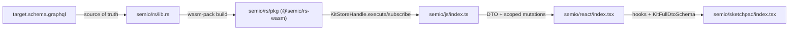

## Goal

Make `semio/rs/lib.rs` emit SDL that exactly matches [semio/graphql/target.schema.graphql](semio/graphql/target.schema.graphql) (relay + merkle merge), then refactor [semio/js/index.ts](semio/js/index.ts), [semio/react/index.tsx](semio/react/index.tsx), and [semio/sketchpad/index.tsx](semio/sketchpad/index.tsx) so they consume the new schema. Run the work in parallel across seven workers via the Task tool.

## Target schema shape (essentials)

- Interfaces: `Node`, `Entity` (extends `Node`), `EntityEdge`, `EntityConnection` (with `hash: String!`), `WeakEntity` (id = hash), `StrongEntity` (id = uuidv7), `Artifact`, `Document`, `Event`, `Diff` (`implements WeakEntity`), `Modification` (`before`/`diff`/`after`), `Operation` (`implements Entity`).
- For each domain entity `Foo` in {`Vector`, `Point`, `Coordinate`, `Offset`, `Plane`, `Position`, `Location`, `Attribute`, `Place`, `Family`, `Folder`, `File`, `Author`, `Prop`, `Benchmark`, `Quality`, `Tag`, `Concept`, `Stat`, `Port`, `Connector`, `Representation`, `Type`, `Layer`, `Group`, `Piece`, `Connection`, `Side`, `Design`, `Kit`}: emit `Foo`, `FooEdge`, `FooConnection`, `FooDiff`, `FooDiffEdge`, `FooDiffConnection`, `FooModification`, `FooModificationEdge`, `FooModificationConnection`, `FooModifications`, `FooModificationsEdge`, `FooModificationsConnection`. (`Clump`, `Blueprint*` are exceptions; conflict/version family stripped down — see schema.)
- VCS: `Edit`, `Change`, `Checkpoint`, `Alternative`, `Graph`, `Session`, `ReadVersion`, `WriteVersion`, `Conflict` (+ relay edges/connections + minimal diff/modification stubs for `Conflict`/`Session`/`ReadVersion`/`WriteVersion`).
- Operation concrete types (~120) each pair `XInput { … }` + `X implements Operation { …, scope, input, modification }`. Examples: `CreatedConcept`, `RenamedKit`, `AddedFixedPiece`, `DraggedPiece`, … (full list in `target.schema.graphql`).
- Roots:

```graphql
type Query { session: Session!, wip: Graph!, authoritative: Graph, conflicts: ConflictConnection!, node(id: ID!): Node, entity(hash: ID!): Entity }
type Mutation { session: SessionScopedCommandInput! }
type Subscription { event: Json! }
```

- Scoped command tree: `Session → Alternative(id) → Transaction(id) → Kit → {tag/concept/quality/type/design scopes → leaf operations returning ID!}`.

## Architecture



## Worker task split (run in parallel via Task tool)

Each worker owns disjoint regions of disjoint files and can run concurrently. Workers A-D all modify [semio/rs/lib.rs](semio/rs/lib.rs); they own non-overlapping regions and never touch the same lines.

### Worker A — rs/lib.rs core interfaces + geometry

- File: [semio/rs/lib.rs](semio/rs/lib.rs).
- Regions owned: `gql_relay`, `geom`, `iface` (replace), plus a new `gql::interfaces` subregion with the `Node`/`Entity`/`WeakEntity`/`StrongEntity`/`Artifact`/`Document`/`Event`/`Diff`/`Modification`/`Operation` async-graphql `Interface` declarations and `PageInfo`.
- Emit per-entity `Foo`, `FooEdge`, `FooConnection`, `FooDiff`, `FooDiffEdge`, `FooDiffConnection`, `FooModification`, `FooModificationEdge`, `FooModificationConnection`, `FooModifications`, `FooModificationsEdge`, `FooModificationsConnection` for: `Vector`, `Point`, `Coordinate`, `Offset`, `Plane`, `Position`, `Location`, `Attribute` and the matching `*Input` GraphQL inputs (`VectorInput`, `PointInput`, `CoordinateInput`, `OffsetInput`, `PlaneInput`, `PositionInput`, `LocationInput`).
- Use a Rust macro (e.g. `entity_relay!`/`weak_entity!` already present) extended to also generate the `Diff`/`Modification`/`Modifications` family.

### Worker B — rs/lib.rs kit-level entities

- File: [semio/rs/lib.rs](semio/rs/lib.rs).
- Regions owned: inside `kit` (Place/Family/Folder/File/Author/Prop/Benchmark/Stat/Quality/Tag/Concept/Port subregions). Emit the 12-type family for: `Place`, `Family`, `Folder`, `File`, `Author`, `Prop`, `Benchmark`, `Quality`, `Tag`, `Concept`, `Stat`, `Port`.
- Emit the operations subregions for `Quality`, `Tag`, `Concept`, `Port` (CRUD + attribute add/remove pairs), each as `XInput { … }` + `X implements Operation { …, scope, input, modification }`.

### Worker C — rs/lib.rs Type+Design+Kit

- File: [semio/rs/lib.rs](semio/rs/lib.rs).
- Regions owned: `kit::r#type` (Connector/Representation/Type), `kit::design` (Layer/Group/Piece/Connection/Side/Clump/Design + `BlueprintEdge`/`BlueprintConnection`/`PieceConnectionKind` enum), and the kit aggregate (Kit + KitDiff/Modification/Modifications + `RenamedKit*`/`ChangedDescription*`).
- Emit per-entity 12-type family + Operation pairs for type/connector/design/piece/pieces (`CreatedTypeInput…DeletedTypes`, `CreatedDesignInput…DeletedDesigns`, `AddedFixedPieceInput…DeletedPiecesAndConnections`).

### Worker D — rs/lib.rs VCS + Subscription + Roots

- File: [semio/rs/lib.rs](semio/rs/lib.rs).
- Regions owned: `vcs` (Edit, Change, Checkpoint, Alternative, Graph, Session, ReadVersion, WriteVersion, Conflict + their stripped diff/modification variants), `event`, `worker`, and the `gql` root (`Query`, `Mutation`, `Subscription`, scoped command tree types `SessionScopedCommandInput` / `AlternativeScopedCommandInput` / `TransactionScopedCommandInput` / `KitScopedOperationInput` / `TagScopedOperationInput` / `ConceptScopedOperationInput` / `QualityScopedOperationInput` / `TypeScopedOperationInput` / `PortScopedOperationInput` / `ConnectorScopedOperationInput` / `DesignScopedOperationInput` / `PieceScopedOperationInput` / `PiecesScopedOperationInput`).
- Replace today's flat `Mutation` impl with the scoped tree. Each leaf calls into the existing `kit_graph_engine`/`operation` apply path and returns the operation `ID!`. Replace today's many subscriptions with a single `Subscription.event: Json!` that JSON-serializes the existing event bus.
- Update `gql::sdl()` and the `export_semio_graphql_schema_file` test (`#[ignore]`) so it now writes to [semio/graphql/schema.graphql](semio/graphql/schema.graphql); add a parity test that asserts `gql::sdl()` is byte-equal (modulo trailing whitespace) to [semio/graphql/target.schema.graphql](semio/graphql/target.schema.graphql).
- Update `wasm_bridge::KitStoreHandle::execute`/`subscribe` to keep working with the new schema (no API change at JS boundary).

### Worker E — js/index.ts

- File: [semio/js/index.ts](semio/js/index.ts).
- Regions to refactor: `JsonGraphQlDtoTypes`, `KitWriteScope`, `ChangeKitCommand`, `GraphqlUtil`, `KitGraphqlReadSelections`, `Transport`, `KitStore`, `KitEntitiesMerged` (per-entity), `EmbeddedTests`.
- Replace `ChangeKitCommand` flat union and string-built mutations with a typed builder for the scoped tree, e.g. `session(start, end).alternative(id).transaction(id).kit.<op>(…)` that emits valid GraphQL like:

```graphql
mutation {
  session { alternative(id: $alt) { transaction(id: $tx) { kit { design(id: $d) { piece(id: $p) { drag(offset: $o) } } } } } }
}
```

- Replace the per-event subscriptions with a single `subscription { event }` and a JSON discriminator on the worker side; rebuild the `KitEvent` union and `kitEventTouches*`/`kitEventAffects*` predicates from the new payloads.
- Regenerate Zod schemas for the new entity DTOs (`KitFullDtoSchema`, per-entity `*Schema`, `*DiffSchema`, `*ModificationSchema`, `*ModificationsSchema`). Rename/remove obsolete schemas (no backwards compatibility).
- Update read-point selections (`KIT_*_QUERY`, `theKitReadPoint`, etc.) to walk the new `Graph → Checkpoint → Kit` tree exposed by `Query.wip`/`authoritative`/`session`.
- Update the embedded test region to assert round-trip against the new schema using `gql::sdl()` from the WASM build.

### Worker F — react/index.tsx

- File: [semio/react/index.tsx](semio/react/index.tsx).
- Regions to refactor: `Types, Constants, Utilities`, `Context, KitRegistry`, `KitStoreClient command hooks`, `SchemaReadWriteSegregation`, `Direct Domain Exports`, embedded tests.
- Re-bind every `useX` / `useXField` hook to the new entity field set (e.g. `useAuthorTriad`, `usePort`, `useConnector`, `usePiece`, `useDesign`, `useType`, `useKit`).
- Replace any remaining direct mutation hooks with helpers that build scoped-command selections via the JS builder from Worker E (e.g. `useDragPiece` → `kitClient.session().alternative(id).transaction(id).kit.design(id).piece(id).drag({…})`).
- Replace `KitFieldBinding` field bindings to match new attribute/quality/tag/concept fields and the new Diff/Modification shapes.
- Update embedded test region to cover the new hooks against an in-memory `KitStoreClient`.

### Worker G — sketchpad/index.tsx

- File: [semio/sketchpad/index.tsx](semio/sketchpad/index.tsx).
- Regions to refactor (using TOC ranges): macro slices F/G (Kit app shell), J/K/L/M (Kit/Design/Type/Quality apps), O (entrypoint, `KitFullDtoSchema.parse` calls).
- Update the `@semio/react` import list to drop removed symbols and add new ones (esp. new diff/modification types). Re-validate `KitFullDtoSchema.parse(dto)` call sites at the entrypoint and the VS Code adapter.
- Update the XState transaction handlers and `applyKitHostGraphOp` integration to drive the new scoped command tree (open transaction → run leaf ops → commit), matching the new `Mutation.session` flow.
- The Playwright suite (slice P, lines ~46966–55205) should not need behavioural change; only update fixtures/expectations that referenced removed schema fields.

## Coordination contracts

- Naming: every entity uses PascalCase exactly as in [target.schema.graphql](semio/graphql/target.schema.graphql); all scalar IDs are `ID!`. The `Json` scalar must be declared in Worker D (the target schema uses it but does not declare it — declare it for runtime correctness).
- Workers A–D must use the same Rust macro to generate the 12-type family so emitted SDL is identical. Worker A defines/extends the macro; B–D consume it.
- Worker D writes a parity test that diffs `gql::sdl()` against `target.schema.graphql`; this is the merge gate.
- Workers E/F/G can start in parallel using stub types matching the target schema; they reconcile after Worker D's parity test passes.

## Validation

- `cargo test` in [semio/rs](semio/rs) — including the new parity test against [target.schema.graphql](semio/graphql/target.schema.graphql).
- `node ../rs/scripts/build-wasm.mjs` then `npm test` in [semio/js](semio/js).
- `npm test` in [semio/react](semio/react).
- `npm test` in [semio/sketchpad](semio/sketchpad) (Playwright).
- Re-export `semio/graphql/schema.graphql` via the `nx build semio/graphql` task; verify it now matches `target.schema.graphql`.

## Ticket plumbing (per workspace rules)

- Open a single parent ticket via repo MCP `ticket_open` titled "Align Rust Schema and Bundles with Target Schema". Each worker receives the ticket id and writes its temp logs/scripts under `.repo/🎫/YY/MM/DD/TICKETSLUG/`. Close the ticket with `ticket_close` once all workers and validation pass.