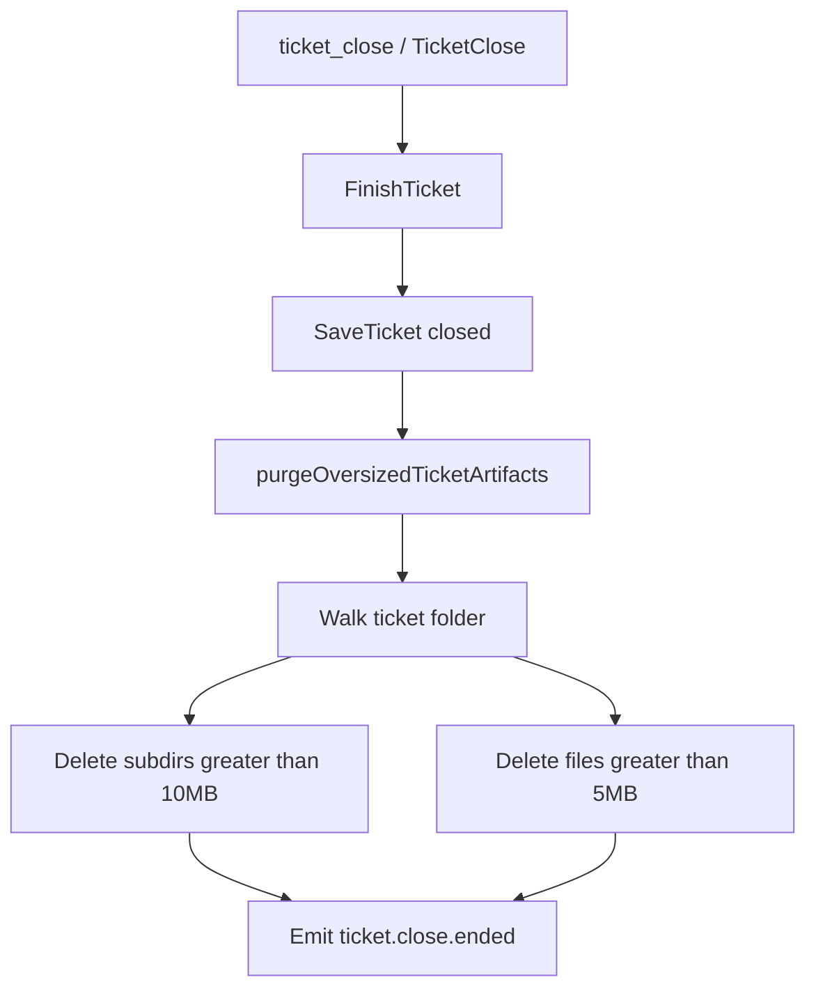

# Ticket Close Oversized Artifact Purge

## Scope (chosen)

- **Only** the closed ticket directory: `ticket.FolderPath` / `[GetTicketPath](�¸️framework/🛍️products/🦑️repo/🔨️modules/💻️client/⌨️cli/🐹️component.go)` under `.🧬semio/🦑️repo/🎫️tickets/…/SLUG`.
- Not repo-wide, and not paths from the close `files` list (those are work product elsewhere in the monorepo).
- Includes **untracked/gitignored** entries (plain filesystem walk; no git filter).

## Hook point

All close entry points already funnel through `FinishTicket` in `[🐹️component.go](�¸️framework/🛍️products/�カプrepo/🔨️modules/💻️client/⌨️cli/🐹️component.go)` (`ToolTicketClose`, GraphQL `TicketClose`, bulk close). Add purge at the end of `FinishTicket`, **after** `SaveTicket` succeeds, so close metadata is persisted before cleanup:

```go
if err := SaveTicket(ticket); err != nil {
    return err
}
if err := purgeOversizedTicketArtifacts(ticket.FolderPath); err != nil {
    writeWarningf(...) // warn; do not reopen/fail close (matches important.md delete behavior)
}
```

Bulk close gets the same behavior automatically.

## Algorithm

Add helpers in the existing `#region 📋️Tickets` (near `FinishTicket`):

Constants:

- `ticketOversizedFileBytes = 5 << 20` (> 5 MiB)
- `ticketOversizedFolderBytes = 10 << 20` (> 10 MiB)

`purgeOversizedTicketArtifacts(ticketDir string)`:

1. Resolve absolute ticket dir; no-op if missing/empty.
2. Walk the tree (**do not follow symlinks**; skip anything that resolves outside the ticket dir).
3. Bottom-up folder sizes = sum of contained **file** sizes.
4. Delete, deepest-first:
  - any **subdirectory** (not the ticket root) with size `> 10 MiB` via `os.RemoveAll`
  - any remaining **file** with size `> 5 MiB` via `os.Remove`
5. **Never delete** the ticket root directory itself.
6. **Never delete** `🎫️ticket.json` (basename guard), even if somehow oversized.
7. Individual delete failures → `writeWarningf`; continue; do not fail `FinishTicket`.




## Tests

In `[��️component_test.go](�¸️framework/🛍️products/�カプrepo/🔨️modules/💻️client/⌨️cli/��️component_test.go)`, add a focused test (reuse existing ticket open/close fixtures around the current `FinishTicket` tests ~10941):

- Open/create a ticket folder.
- Create: file of `5MiB+1`, file of `5MiB` (keep), subdir totaling `10MiB+1` of small files, subdir under `10MiB` (keep), a gitignored-named large file (e.g. `.cache.bin`).
- Call `FinishTicket(..., noManagement=true, ...)`.
- Assert oversized file/folder gone; under-limit peers and `🎫️ticket.json` remain; ticket status closed.

Prefer sparse/truncate writes where practical to keep the test fast.

## Docs / agent rules

- Do **not** edit `AGENTS.md` (repo rule).
- Optional one-line note in the MCP `tool_ticket_close` description that oversized ticket-folder artifacts are purged on close (only if that string set is the live agent-facing contract).

## Execution ticket

When implementing: read `repo://goals`, open/reopen a repo MCP ticket for this change, put any logs under that ticket folder, close with summary + touched files when done.