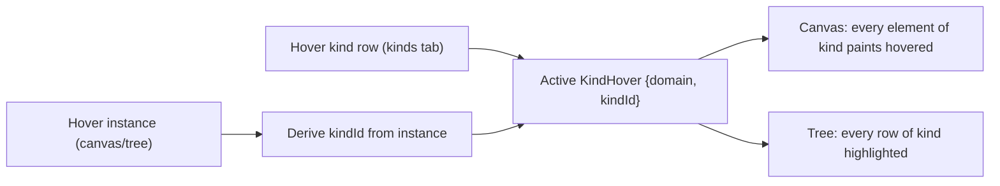

# Transitive Same-Kind Hover

## Goal

Hovering an instance, or a kind row in a tree, highlights every instance that shares the same kind ("is a" relation), in both the canvas and the hierarchy/kinds trees. Applies to puzzle 3D (object/vortex/attraction) and puzzle 2D (node/handle/edge/wire). CAD/presentation are out of scope (their pick targets are geometric types, not catalog-kind instances).

## Core concept (shared)

Generalize hover from "one exclusive element" to: a direct element hover PLUS a derived kind hover. An element is hovered when it is the direct target OR its `(domain, kindId)` matches the active kind hover.

- `HoverDomain` 3D: `"object" | "vortex" | "attraction"`; 2D: `"node" | "handle" | "edge" | "wire"`.
- `KindHover = { domain: HoverDomain; kindId: string } | null`.
- Setting hover from an instance also derives its `KindHover`. Setting hover from a kind row sets `KindHover` directly (no direct element).

## Puzzle 3D

Registry in [puzzle/3d/react/index.tsx](puzzle/3d/react/index.tsx):

- In `RegistryProvider` (~~7969) add `kindHover` state next to `hoverTarget`. In `setHover(target)` derive the kind via `objectKindsRef`/`vortexMetaRef`/attraction record (`attractionKind`) and set `kindHover`; `clearHover`/`clearHoverAll` clear it. Add `setKindHover(domain, kindId)` / `clearKindHover` for kind-row hover, and `isKindHovered(domain, kindId)`. Extend `RegistryValue` (~~4225) and `useRegistryHover`.
- Items compute transitive hover locally (they already receive their kind): `ObjectItem` (~~5013, prop `objectKind` at 2735), `Vortex`/`VortexItem` (~~5407, `vortexKind`), attraction render (~~5502, `attractionKind`). Set `hovered = directHover || reg.isKindHovered(domain, myKind)` feeding `resolveMeshStyle` (~~4112) / vortex/attraction style.
- Controlled hover bridge: add `hoveredId?` / `kindHover?` / `onHover?` props to `PlayCanvas` so the shell can drive and observe hover; sync into the registry.

Play shell in [framework/product/playground/renderer/react/index.tsx](framework/product/playground/renderer/react/index.tsx) and [puzzle/3d/play/index.ts](puzzle/3d/play/index.ts):

- Add 3D shell hover state (mirror the existing 2D `hoveredId` at ~3979) carrying `{ id, kind }`.
- Populate `onPointerEnter`/`onPointerLeave` on hierarchy rows in `buildPuzzle3dPlayHierarchySections` (~807) using the same helper pattern as 2D `puzzle2dPlayHierarchyHoverHandlers`.
- Add hover handlers to kinds-tab rows in `buildPuzzle3dPlayKindsTree` (~939) that set the kind hover directly.
- Compute hierarchy `highlightedIds` transitively (all rows whose instance shares the hovered kind) and pass to the tree; wire hover into `PlayCanvas` from `Puzzle3dPlayViewportHost` (~1945).

## Puzzle 2D

Rust engine in [puzzle/2d/rs/lib.rs](puzzle/2d/rs/lib.rs):

- Add `hovered_kind: Option<(HoverDomain, String)>` next to `hovered_id` (~~857). In `set_hovered_id`/`update_hover_from_world` (~~5314) also resolve and store the element's kind (`node_kind`/`handle_kind`/`edge_kind`/`wire_kind`, structs ~425/641/658/671). Add a `set_hovered_kind` setter for kind-row hover.
- Make `hovered_style_kind` (~1611) return `Hovered` when the id matches OR the element's `(domain, kind)` matches `hovered_kind`, so the canvas paints transitively in-engine.
- Emit the resolved kind in the hover event (`push_event("hover", ...)`) so JS/shell can mirror it.

React + shell:

- Expose kind in [puzzle/2d/react/index.tsx](puzzle/2d/react/index.tsx) (`Puzzle2dRenderer` hover emit ~6856, add `syncHoveredKindSilent` analogous to `syncHoveredIdSilent` ~12841; extend `hoveredId` prop with an optional `kindHover`).
- Wire `Puzzle2dPlayPaneCanvas` (~3177 in playground renderer) controlled hover (`hoveredId`/`onHover`) which is currently NOT connected; route through the existing shell hover (`setHoverForPane`/`setHierarchyHover` ~4229).
- In [puzzle/2d/play/index.ts](puzzle/2d/play/index.ts) extend `puzzle2dPlayHierarchyTreeHighlightedIds` (~~392) to expand to all same-kind rows, and add hover handlers to kinds-tab rows in `buildPuzzle2dPlayKindsTree` (~~519).

## Framework hover model

Upgrade the 2D play shell hover from single `hoveredId: string | null` (~3979) to a kind-aware `{ id: string | null; kind: KindHover }`, so tree highlighting and canvas both derive the transitive set from one source. Keep 3D shell hover the same shape for symmetry.

## Conventions

- Open a repo ticket (`ticket_open`) after reading `repo://goals`; keep temp logs/scripts in the ticket folder; close with summary on completion.
- Add new code into existing files using `//#region` blocks; concise code; docstrings start with an emoji.
- Verify at runtime in both playgrounds with `[DEBUG]`-prefixed logs (hover one instance and one kind row; confirm all same-kind instances paint hovered in canvas and highlight in tree) before declaring done.

## Out of scope

CAD (`cad/js/renderer`) and presentation surfaces: pick targets are geometric types, not instance-to-catalog-kind relations, so no transitive same-kind hover unless a real instance→kind relation is later introduced.