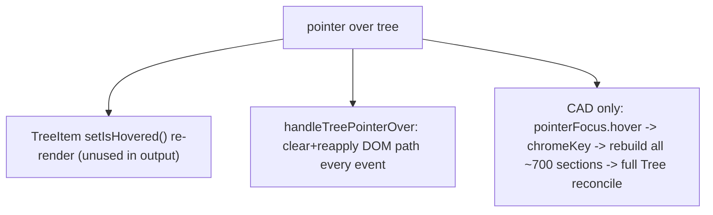

## Diagnosis

Hover cost has two app-independent causes (in `@semio-tech/ui-react`) plus one cad-play-specific cause.

- `ui/react/index.tsx`: `TreeItem` (~~8202), `SortableTreeItem` (~~7857), `TreeSection` (~~7690), `FileTreeItem` (~~9404) each keep an `isHovered` `useState` that is set on every enter/leave but **never read** in the rendered classes (CSS `hover:bg-hover-panel` already does the visual). Pure wasted re-render per hover, every app.
- `handleTreePointerOver` (~9241) runs `clearTreeHoverPath` + `applyTreeHoverPath` (DOM walk + attribute mutation) on **every** `pointerover`, including moves within the same row.
- CAD play ([cad/js/renderer/play/index.tsx](cad/js/renderer/play/index.tsx)): `chromeKey` (~~2131) includes `hoveredKey`, so each hover re-runs `buildCadPlayDocumentSections(...)` (~~2141) rebuilding every item with fresh `isHighlighted`, forcing a full `<Tree>` reconcile.
- Puzzle 2d/3d document trees have **no** hover wiring, so their slowness is only the two `@semio-tech/ui-react` causes above.

## Fix 1 - ui/react: kill wasted hover re-renders

In [ui/react/index.tsx](ui/react/index.tsx), remove the `isHovered`/`setIsHovered` `useState` in `TreeItem`, `SortableTreeItem`, `TreeSection`, `FileTreeItem`. Change `handlePointerEnter`/`handlePointerLeave` to invoke the optional `onPointerEnter?.()`/`onPointerLeave?.()` callbacks directly (no `setState`). Visual hover stays via existing `hover:bg-hover-panel`.

## Fix 2 - ui/react: coalesce pointer-over path highlight

In `handleTreePointerOver` (~9241), keep a `lastHoverRowRef`; if `resolveHoverRow(...)` returns the same row, skip. Apply `applyTreeHoverPath` inside a `requestAnimationFrame` (cancel any pending frame on new event / `pointerleave`) so rapid moves do at most one DOM mutation per frame. Reset the ref + cancel frame in `handleTreePointerLeave`.

## Fix 3 - ui/react: per-row TreeHighlightStore (mirror selection store)

Add a `TreeHighlightStore`/`TreeHighlightContext`/`useTreeItemRowHighlighted(itemId, override)` next to the existing `createTreeSelectionStore`/`useTreeItemRowSelected` (~~7527-7586). Add `highlightedIds?: readonly string[]` to `TreeRootProps`; create + sync the store in `Tree` (like `selectionStore` at ~8938) and provide it via context (~~9258). In `TreeDataItemView` (~8807) replace `isHighlighted={item.isHighlighted}` with `isHighlighted={useTreeItemRowHighlighted(item.id, item.isHighlighted)}`. Result: changing `highlightedIds` re-renders only the affected rows, never the whole tree.

## Fix 4 - framework: thread highlightedIds through the panel pipeline

- `ui/react`: add `highlightedIds?: readonly string[]` to `TreePanelConfig` and pass it in `SidePanelTreePane` (~10499) as `highlightedIds={config.highlightedIds}`.
- `framework` ([framework/product/playground/renderer/react/index.tsx](framework/product/playground/renderer/react/index.tsx)): `StaticTreePanelDefinition`/`CallbackTreePanelDefinition` already pass the config through; ensure `highlightedIds` survives `resolveTree()`.
- Puzzle 2d (`Puzzle2dPlayDocumentPanel` ~1959): pass `highlightedIds` derived from the shell `hoveredId` (already exists at ~3176 but unused for the tree), and add `onPointerEnter`/`onPointerLeave` in `buildPuzzle2dPlayDocumentSections` to set `hoveredId`. This adds cross-surface hover at near-zero cost via the store.

## Fix 5 - play (cad): decouple hover from section/tree rebuild

In [cad/js/renderer/play/index.tsx](cad/js/renderer/play/index.tsx):

- Remove `hoveredKey` from `chromeKey` (~2131) so hover no longer recomputes `workbenchTabs`.
- Make `buildCadPlayDocumentSections` build **neutral** items (drop the `hoveredKey`/`hoverTarget` highlight baking; keep `onClick` + hover handlers). Memoize the sections so they stay referentially stable when only hover changes (keyed by models digest + selection, not hover), and also produce a `highlightKey -> treeItemIds` map.
- Feed hover as `highlightedIds` on the document `TreePanelConfig`: subscribe to `pointerFocus.hover`, map it through the `highlightKey -> treeItemIds` map, and pass the resulting ids. The document tab rebuild on hover then only creates new (cheap) tab objects while `sections` stays referentially stable, so row memos skip and only the hovered row(s) re-render via the highlight store.
- Keep existing `onPointerEnter`/`onPointerLeave` (`cadPlayDocumentHoverHandlers`) and `AppPointerFocusStore` cross-surface sync intact.

## Validation

Per repo rules, open a repo MCP ticket (reuse goal `🎯️compose`) and track all touched files. Extend existing vitest files only (no new test files):

- `ui/react` Tree test: hover changes do not re-render unaffected rows; `highlightedIds` flips only matching rows (add `[DEBUG]` render counters).
- cad play test: hover no longer changes `chromeKey` / rebuilds sections; `highlightedIds` resolves the hovered target.
- puzzle 2d test: canvas hover highlights the matching document row.
  Run affected package tests (`ui/react`, cad play, puzzle 2d) and runtime-verify with `[DEBUG]` logs that hovering a large document (e.g. cad play loaded model) is smooth. Close the ticket with a summary + file list.
