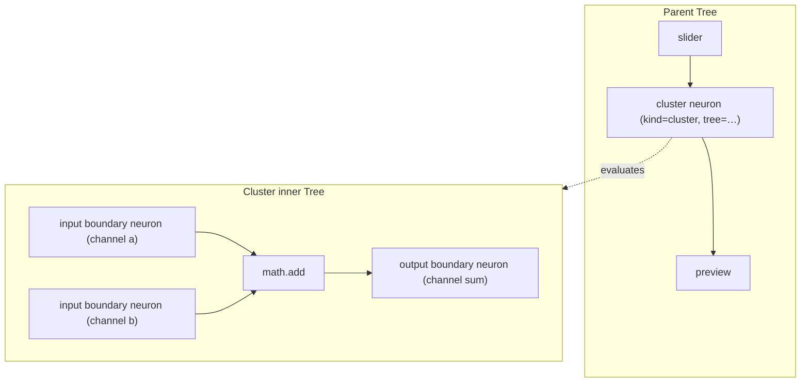

## Tree Operator Clusters

Make a neural `Tree` usable as an operator (a "cluster"): a neuron can carry a nested sub-tree whose external interface is defined by special contract-channel boundary neurons. Flow renders such a neuron as a cluster node (cluster symbol + explode button), supports collapsing a selection into a cluster and exploding a cluster back into its neurons. The neural tree stays authoritative and shakable.

### Core model

- Contract channels = reserved boundary neuron kinds in neural: `INPUT_KIND` and `OUTPUT_KIND`. An input boundary neuron's `params.channel` (default = its id) + `params.schema` define one input channel; an output boundary neuron defines one output channel.
- A cluster is a neuron carrying a nested `Tree`. Its `OperatorInfo` (ports) is derived from the inner contract neurons, so it renders accurate named ports on both sides.

## Part A: neural/engine — trees as operators ([neural/engine/lib.rs](neural/engine/lib.rs))

- `#region Tree`: add an optional nested tree to `Neuron`:
  - `pub tree: Option<Box<Tree>>` with `#[serde(default, skip_serializing_if = "Option::is_none")]`. `tree.is_some()` marks the neuron a cluster (authoritative, serializes inside `tree`, so it is shakable).
- `#region Operator` (or new `#region Contract`): add reserved kinds + helpers:
  - `pub const INPUT_KIND: &str = "input"; pub const OUTPUT_KIND: &str = "output";` (engine-reserved, like `in`/`out` ports).
  - `fn contract_channel(neuron: &Neuron) -> (id, ValueType)` reading `params.channel`/`params.schema` (fallback to neuron id / `Any`).
  - `Tree::contract() -> (inputs: Vec<ChannelSpec>, outputs: Vec<ChannelSpec>)` scanning the tree for boundary neurons, preserving authoring order (sorted by inner layout-independent neuron order).
  - `pub fn cluster_operator_info(id, name, tree) -> OperatorInfo` building inputs/outputs from `Tree::contract()`.
- `#region Evaluator`: make `evaluate_channels_with` recurse:
  - When the current neuron has `neuron.tree = Some(sub)`, instead of `dispatch(kind, …)`:
    1. seed sub-tree: for each `INPUT_KIND` neuron, seed its output with `collected_input.get(channel)` (or the channel default).
    2. recursively call `evaluate_channels_with(sub, &sub_seeds, operator_infos, dispatch)` (reuse the same `dispatch` for leaf ops).
    3. assemble output dict: for each `OUTPUT_KIND` neuron, read its resolved input from `EvalChannels.inputs` and insert under its channel id.
  - Treat `INPUT_KIND`/`OUTPUT_KIND` as engine-internal identity when dispatched directly (output = seeded/identity input) so they never hit the bridge.
- `#region Tests`: add `cluster_runs_inner_tree` (point/number add inside a cluster), `cluster_contract_derives_channels`, and a `cluster_shakability` round-trip (serialize tree, strip nothing GUI-related, re-evaluate identical outputs).

## Part B: flow/core — cluster widget + contract channels + collapse/explode ([flow/core/lib.rs](flow/core/lib.rs))

- `#region Widget`: add `Widget::Cluster { id, name, tree: Tree, flow: FlowGui }` (inner GUI kept for explode/round-trip). Update every `match widget` site (`widget_id_for`, `widget_label`, `widget_display_meta`, `widget_chrome`, `widget_io_ports`, `widget_node_size`, `widget_to_dag_node`, `tree_from_fixture`, `apply_preview_outputs`, `sync_dag_display_from_widgets`).
- `tree_from_fixture`: a `Widget::Cluster` becomes a `Neuron { id, kind: "cluster", params: {name}, tree: Some(inner) }`. Add contract-channel catalogue items (`flow.input`, `flow.output`) to `static_catalogue_sections` ([flow/core/lib.rs](flow/core/lib.rs):800) under a new "Contract" section, mapping to boundary neuron widgets.
- Ports/size: `widget_io_ports`/`widget_node_size` for `Cluster` derive ports from `neural::cluster_operator_info(...).inputs/outputs` and route via the new `DagNodeKind::Cluster`.
- New host commands (mirroring `toggle_preview`):
  - `collapse(selected_ids: &[String]) -> Result<String, String>`: partition synapses into internal / crossing-in / crossing-out; synthesize `INPUT_KIND`/`OUTPUT_KIND` boundary neurons (one per distinct crossing port), build inner `Tree` + inner `FlowGui`, replace selected widgets with one `Widget::Cluster` at the selection centroid, and rewire external synapses to the cluster's contract ports.
  - `explode(cluster_id: &str) -> Result<(), String>`: re-add inner neurons as widgets (namespacing ids `{cluster}/{inner}`, offset by cluster layout), reconnect external synapses through each boundary neuron's inner downstream/upstream, drop boundary neurons + the cluster widget.
  - Both push history (`begin_history`/`commit_history` like existing edits) and call `rebuild_dag` + `evaluate_internal`.
- `evaluate_internal` ([flow/core/lib.rs](flow/core/lib.rs):1524) needs no change beyond the recursive Evaluator (it already passes `kind_infos` + bridge `dispatch`); leaf ops inside clusters dispatch through the same bridge.
- `#region WasmSession`: add `#[wasm_bindgen(js_name = collapseSelection)]` and `explodeCluster(cluster_id)` exports next to `togglePreview` ([flow/core/lib.rs](flow/core/lib.rs):2166).
- `#region Tests`: extend with `collapse_then_explode_round_trips`, `cluster_evaluates_inner_tree`, `cluster_ports_from_contract`.

## Part C: dag — cluster node kind ([mathematical/graph/port/directed/dag/lib.rs](mathematical/graph/port/directed/dag/lib.rs))

- Add `DagNodeKind::Cluster { inputs: Vec<IoPortSpec>, outputs: Vec<IoPortSpec> }` (line ~491), a `DagNodeSpec::cluster(...)` constructor, sizing reuse of `computation_node_*`, and painting in the vello/scene region: draw the box with a distinct cluster symbol (e.g. layered-squares glyph) in the header and a small explode affordance hit-rect (parallel to the preview expand rect). Expose a `cluster_explode_hit(node, x, y)` style helper used by hit-testing.
- `#region Tests`: round-trip serde for the new kind + hit-rect test.

## Part D: flow/react — cluster rendering + UI ([flow/react/index.tsx](flow/react/index.tsx))

- `#region Fixture`: add `Cluster` to `FlowWidget` ([flow/react/index.tsx](flow/react/index.tsx):425) mirroring the Rust shape; extend `DagNodeKind` mirror types.
- `#region Catalogue`: surface the new `flow.input`/`flow.output` contract items (they arrive from the host catalogue JSON automatically; just ensure rendering/icons).
- `#region FlowCanvas`: in the `canvasCommand` switch ([flow/react/index.tsx](flow/react/index.tsx):2945) add `collapse` (calls `session.collapseSelection(JSON.stringify(ids))`) and `explode` (`session.explodeCluster(id)`), each followed by `emitInteractionState/evaluate/persistFixture/renderFrame`. Wire the cluster node's explode hit-rect (double-click or button) to dispatch `explode`, and add a context-menu/spotlight action "Collapse to cluster" for multi-selection (near the `togglePreview` menu entry at [flow/react/index.tsx](flow/react/index.tsx):1160).
- `#region Tests`: add cluster serde/round-trip and a collapse→explode command test.

## Part E: procedural — keep working ([procedural/react/index.tsx](procedural/react/index.tsx), [procedural/play/script.ts](procedural/play/script.ts))

- It re-exports `@semio-tech/flow-react` types and the same `FlowCanvas`; verify the brep play app builds/evaluates with clusters. Add cluster + contract channels to its catalogue passthrough if it filters kinds. No mixing of brep logic into flow.

## Part F: validation

- Run via launch.json/nx: `neural/engine` tests, all `flow/module/*` tests, `flow/core` tests (incl. cluster + shakability), `dag` tests, `flow/react` + `procedural` vitest.
- Manually confirm in the flow play app: select neurons → "Collapse to cluster" yields a cluster node showing contract ports + cluster symbol; the cluster evaluates (e.g. add inside a cluster equals the inlined result); explode restores the original graph and outputs; stripping `flow` from the saved document still evaluates the cluster.

## Ticket workflow (first execution step)

Read `repo://goals`; open a new ticket "Tree Operator Clusters" under the most fitting goal (likely `🎯procedural🎯floweditor`), or reopen if one matches. Keep all temp logs/scripts inside the ticket folder; close with a summary + touched files when done. No new crate is introduced, so no new `launch.json` build targets are required.