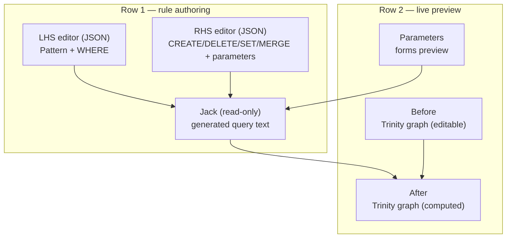

# Trinity Rewrite: 6-Window Playground

## Current state (confirmed by reading the code)

`trinity/rewrite/play/index.ts` today has exactly **one** window (`trinity-rewrite-main`, a `TrinityCanvas`) plus a floating `WindowEngagement` textbox holding the *entire* rule as one JSON blob. `apply_rule` in `trinity/rewrite/engine/lib.rs` mutates the graph in place — there is no LHS/RHS split, no parameters, and no before/after comparison. The side panels (hierarchy/catalogue/inspector) are also wired to `trinityJackControllerRef` instead of the rewrite controller — a pre-existing bug.

Reference pattern: `trinity/jack/play/index.ts` already shows the established 3-window convention (`buildTrinityWindowBody` / `buildWriterWindowBody` / `buildTableWindowBody` + `registerWindowBody` + nested `WindowLayout` row/column/stack). `forms/play/index.ts` shows the `buildFormsWindowBody(..., "preview")` + `FormRenderer` pattern for a live, fillable form — exactly what "previewed form for parameters" means.

## Target: 6 windows, 2 rows x 3 columns

LHS constructs `MATCH`, RHS derives `CREATE`/`DELETE`/`SET`/`MERGE` (per `trinity/rewrite/AGENTS.md`). Parameters is a live `FormRenderer` preview of values declared by RHS. Jack shows the literal generated query (placeholders resolved). Before is the editable source graph (today's single canvas). After is a non-mutating computed preview of Before with the rule applied — recomputed automatically whenever LHS/RHS/Parameters/Before change (no manual "Apply" step needed).

## Engine: real parameters (root fix, not a TS hack)

[trinity/rewrite/engine/lib.rs](trinity/rewrite/engine/lib.rs) `#region 🔖Rewrite`:

- Add `ParameterKind { String, Number, Boolean }` and `ParameterSpec { name, kind, default: PropertyValue }`.
- Add `parameters: Vec<ParameterSpec>` (serde default) to `Rhs` — parameters are declared where they're consumed (mutations), matching AGENTS.md wording exactly.
- Any `AssignmentJson.value` that is `PropertyValue::String(s)` starting with `$` is a parameter reference (e.g. `"$label"`), resolved through a `bindings: &HashMap<String, PropertyValue>` map, falling back to the parameter's `default`.
- Extract pure `build_rule_query(rule: &Rule, bindings: &HashMap<String, PropertyValue>) -> String` (the query-string assembly, unchanged logic) out of `apply_rule`, so it can be called *without* a graph — needed to show live query text in the Jack window.
- `apply_rule(graph, rule, bindings)` and `apply_rule_json(graph, rule_json, bindings_json)` gain the `bindings` parameter.
- New pure `rule_query_json(rule_json, bindings_json) -> Result<String, String>` (`{ query: String }`), no graph required.
- `TrinityHost::apply_rewrite_json(&mut self, rule_json, bindings_json)` updated signature.
- New free wasm export `ruleQueryJson(ruleJson, bindingsJson)` (module-level `#[wasm_bindgen]` fn, not a `TrinitySession` method — avoids needing a loaded graph just to preview text).
- Update `rewrite_rule_labels_core` test to pass `&HashMap::new()`; add a new test proving parameter substitution: RHS `set: [{var:"a",prop:"label",value:"$label"}]`, `parameters: [{name:"label",kind:"string",default:"nakagin-core"}]`, bindings override `{"label":"override-core"}` → node gets `"override-core"`; default (no bindings) → `"nakagin-core"`.
- Rebuild wasm after these changes: `bun nx run @semio-tech/trinity-core:wasm` (existing launch config `📦build🔺trinity⚙️core`) — `trinity/react/index.tsx` imports the compiled `pkg/trinity_rewrite.js` directly.

## trinity-react: thin bridge updates

[trinity/react/index.tsx](trinity/react/index.tsx):

- `applyRewriteOnFixture(fixtureJson, ruleJson, bindingsJson = "{}")` — pass through to updated wasm signature.
- New `ruleQueryOnFixture(ruleJson, bindingsJson = "{}"): string` calling the new free wasm export.
- New TS types mirroring Rust: `RuleParameterKindV1`, `RuleParameterV1`, extend `TrinityFixtureV1`-adjacent rule types if any exist (currently rule shape is untyped JSON on the TS side — keep it that way, just add the parameter fields to the demo constant).

## trinity/rewrite/play/index.ts: controller + 6 windows

Rework `TrinityRewritePlayController`:

- State: `lhsJson`, `rhsJson` (each holds just its half: `Lhs` / `Rhs` including `Rhs.parameters`), `parameterValues: FormValues` (bindings, seeded from `rhs.parameters[].default`), plus the existing `docStore` fixture (renamed conceptually to "before").
- Derived (recomputed on every `bump()`, memoized): `getJackQueryText()` via `ruleQueryOnFixture`; `getAfterFixtureJson()` via `applyRewriteOnFixture(beforeJson, ruleJson, bindingsJson)` — non-mutating, `docStore` (Before) is untouched by editing LHS/RHS/Parameters.
- `getParameterFormSpec(): FormSpec` built locally from `rhs.parameters` (map kind→forms question kind: string→text, number→number, boolean→boolean; id = param name).
- Commands: `setLhsJson`, `setRhsJson`, `setParameterValues`, `setFixtureJson` (Before edits, e.g. node drag), `setSelection`, `reorganize`. Drop the old single-blob `setRuleJson`/`applyRule` engagement command and the floating `WindowEngagement` UI entirely — each concern now has its own window.
- Add `subscribeSnapshot`/`getInteractionRevision()` (mirroring `TrinityJackPlayController`) so renderer hosts can react to edits — currently missing on rewrite's controller, which is part of why it feels "ad hoc."
- Default demo data: LHS unchanged (`{pattern:{leftVar:"a",leftKind:"Piece"},whereClause:"a.name = 'b'"}`); RHS becomes `{create:[],delete:[],set:[{var:"a",prop:"label",value:"$label"}],merge:[],parameters:[{name:"label",kind:"string",default:"nakagin-core"}]}` — same net effect as today's demo (labels the "b" node `nakagin-core`) but now flowing through the parameter form.
- 6 `WindowKindRuntime`s + body keys + surface ids (writer for lhs/rhs/jack, forms for parameters, trinity for before/after) + `registerWindowBody` for each.
- New nested `WindowLayout`: root `column` of two `row`s, each with 3 `stack` children (LHS/RHS/Jack, then Parameters/Before/After) — same nesting style as `buildTrinityJackPlayLayout`.
- Update inline vitest block: assert 6 window kinds in order, editing RHS parameter value changes `getJackQueryText()` and `getAfterFixtureJson()` without changing `getBeforeFixtureJson()`, default demo produces `nakagin-core` label in After.

## Renderer wiring: framework/product/playground/renderer/react/index.tsx

In the `TrinityPlayHost` region:

- Replace the single `TrinityRewritePlaySurfaceHost` with `TrinityRewriteBeforeSurfaceHost` (editable `TrinityCanvas`, wired to `getFixtureJson`/`setFixtureJson`/`setSelection`, LOD like Jack's) and `TrinityRewriteAfterSurfaceHost` (`TrinityCanvas` bound to `getAfterFixtureJson()`, no `onFixtureChange` — display-only computed preview).
- Add `TrinityRewriteLhsEditorSurfaceHost` / `TrinityRewriteRhsEditorSurfaceHost`: `WriterCanvas` with `languageId: "json"`, `onChange` → `setLhsJson`/`setRhsJson`.
- Add `TrinityRewriteJackSurfaceHost`: `WriterCanvas` bound to `getJackQueryText()`, `languageId: "jack"` for syntax highlighting, no `onChange` wired (read-only preview).
- Add `TrinityRewriteParametersSurfaceHost`: `FormRenderer` (same component `FormsTrySurfaceHost` uses) bound to `getParameterFormSpec()` / `getParameterValues()`, `onChange` → `setParameterValues`.
- Add `useTrinityRewriteInteractionRevision` hook (mirrors `useTrinityJackInteractionRevision`) and use it in all 6 hosts so edits propagate.
- Fix the pre-existing bug: rewrite's hierarchy/catalogue/inspector panels currently read `trinityJackControllerRef` — repoint them at `trinityRewriteControllerRef` and `getBeforeFixtureJson()`.
- Register all 6 surfaces in `registerTrinityRewritePlaySurfaceHosts()` (`registerUiTrinitySurfaceHost` x2, `registerUiWriterSurfaceHost` x3, `registerUiFormsSurfaceHost` x1).

## Verification

- `bun nx run @semio-tech/trinity-core:wasm` then `cargo test -p trinity_rewrite` (existing + new parameter test).
- `bun nx run @semio-tech/trinity-rewrite-play:test` (vitest) and the renderer package's vitest.
- Boot `dev:trinity:rewrite` (launch config `🛠️dev🔺trinity♻️rewrite`, port 6056) and confirm all 6 panes render, editing the RHS parameter's default in the Parameters form updates Jack text and the After graph live while Before stays static.
- Work happens under a new ticket (`ticket_open`) per repo workflow; no `launch.json` changes needed since the dev entry already exists.

