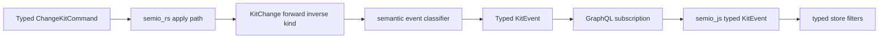

# Typed Semantic Kit Events

## Current Findings

- [semio/rs/lib.rs](semio/rs/lib.rs) already has `KitChange { forward, inverse, kind }` and computes inverses through `ChangeKitCommand::apply_many`, but `KitEvent` is still mostly field/invalidation oriented and `SemioKitCommand.command_kind` is a string.
- [semio/js/index.ts](semio/js/index.ts) currently exports `KitEvent` as `{ Changed } | { ValidationInvalidated } | lifecycle | SemioKitWireStructDto`, then filters events through subtree/id probing.
- [semio/graphql/schema.graphql](semio/graphql/schema.graphql) exposes `KitEvent` and `ChangeKitCommand` as scalars. For this task, the clean target is to keep Rust authoritative but make the event payload and JS surface typed, with GraphQL regenerated/updated to reflect the new contract where possible.

## Implementation Plan

1. Start or reopen the repo ticket for this request, associating it with the existing typed semio-js/store boundary work if it is still the closest active goal.
2. In [semio/rs/lib.rs](semio/rs/lib.rs), introduce a semantic event layer centered on a typed `KitChangeEvent` payload:
   - event kind examples: `RenamedDesign`, `ChangedPieceFlatCenter`, `DraggedFlatCenterPiece`, `ChangedKitMetadata`, `AddedDesign`, etc.
   - every semantic event carries `change: KitChange` or equivalent fields `forward` and `inverse` using the existing `ChangeKitCommand` atoms.
   - keep invalidation/lifecycle events as typed non-change events only where they are not kit mutations.
3. Route all mutation paths through a single semantic event emitter:
   - `TransactionCommand::ChangeKitCommands`
   - `GraphWork::ChangeKitCommands`
   - `GraphWork::ChangeKitWithInverse`
   - design batch commands such as drag/move/fix/flatten/expand/delete/change piece kind
   - undo/redo/finalize flows where they create or replay kit changes
4. Add a Rust classifier that derives semantic event variants from typed command atoms instead of from DTO diffs. For nested commands, unwrap the command path so a design name command becomes `RenamedDesignEvent`, and a piece center/flat-center movement becomes a drag/flat-center semantic event when it originates from drag/move commands.
5. Update [semio/graphql/schema.graphql](semio/graphql/schema.graphql) to document and expose the typed event contract. If async-graphql union/object generation is too large for this pass, keep the scalar only as a transport detail but ensure the transported JSON is generated from typed Rust structs, not ad hoc values.
6. In [semio/js/index.ts](semio/js/index.ts), replace the loose `KitEvent` union with explicit exported TypeScript event variants and typed `KitChangeWire`/`SemanticKitEventWire` definitions. Remove event typing paths that depend on `SemioKitWireStructDto`, generic `Record`, or JSON subtree probing for semantic events.
7. Update event filters (`kitEventTouchesDesign`, `kitEventTouchesType`, `kitEventTouchesPiece`, etc.) to inspect typed event targets and `change.forward`/`change.inverse` commands directly.
8. Extend existing tests only:
   - Rust tests in [semio/rs/lib.rs](semio/rs/lib.rs) for event classification and forward/inverse event emission.
   - JS embedded tests in [semio/js/index.ts](semio/js/index.ts) for typed subscription normalization, design rename events, dragged piece events, and filters.
9. Run focused verification:
   - `cargo test` in [semio/rs](semio/rs)
   - `npm --workspace @semio/js run build`
   - `npm --workspace @semio/js run test`
   - add `npm run depcruise:layers` if JS imports or public boundaries change.
10. Close the ticket with the implementation summary and changed files.

## Target Flow

## Main Risk

The largest risk is the GraphQL boundary: `KitEvent` is currently scalar. I will keep the Rust event structs strongly typed first, then make GraphQL as structural as the existing generator allows without inventing a second event contract in JS.
