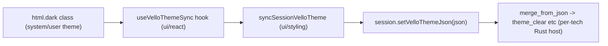

# UI Theme and Settings Consistency Refactor

## Root causes (confirmed by reading the actual code, not guesses)

### 1. Raster ignores system theme

Every other Vello/WASM canvas technology (sequence, flow, dag, trinity, writer) independently re-implements the *same* theme-sync snippet in its React file:

```110:119:sequence/react/index.tsx
const syncVelloTheme = useCallback(() => {
  const session = sessionRef.current;
  if (!session) return;
  try {
    clearColorResolveCache();
    session.setVelloThemeJson(serializeGraphVelloThemePaletteJson());
  } catch { /* theme not ready */ }
}, []);
```

`flow/react/index.tsx` and `mathematical/graph/port/directed/dag/react/index.tsx` additionally duplicate a `MutationObserver` on `document.documentElement` to react to OS/theme changes. `raster/react/index.tsx` has **none of this** — its `RasterRenderer` class never calls `setVelloThemeJson`, and `RasterSession` (`raster/rs/lib.rs`) has no such WASM method at all. Rust-side, `RasterHost.theme_clear` is hardcoded:

```393:421:raster/rs/lib.rs
theme_clear: Color,
...
theme_clear: Color::from_rgba8(32, 32, 36, 255),
```

This value matches neither the light nor dark token. Notably, `ui/styling/rs/src/generated.rs` already generates a `CanvasTheme` (`raster_clear`, `icon_fg`, `icon_bg`) and `infinite/cavas/rs/theme.rs` already exposes `canvas_clear_for(ThemeName)` for exactly this purpose — raster is the one canvas host that never wired into it, and `raster/rs/Cargo.toml` already depends on both `ui_styling` and `infinite_cavas`.

Because the sync mechanism is copy-pasted per technology instead of shared, it was possible (and happened) for a new technology to simply omit it. The fix is to delete the duplication and make it structurally the only way to sync theme.

### 2. Settings tab has no labels / broken height

`framework/product/platform/renderer/react/index.tsx` builds Settings/Display tab labels with a systemic misuse of the i18n API, e.g.:

```1768:1787:framework/product/platform/renderer/react/index.tsx
name: resolveTranslationLabel("ui.settings.tab.mode"),
...
name: resolveTranslationLabel("ui.settings.tab.app"),
...
name: resolveTranslationLabel("ui.settings.tab.general"),
```

`resolveTranslationLabel(value)` only *formats an already-resolved* translation value — if given a plain string it returns it unchanged (`ui/react/index.tsx:3346-3351`). The correct, already-established pattern used elsewhere in the same file (`ui.search.title`, `ui.panelToggle.`*) and in `ui/react/index.tsx` itself (`ui.display.emptyShell`, `ui.toolbar.parent.*`) is `resolveTranslationLabel(uiI18n.t("..."))`. Because these settings-builder functions are plain functions (not components), they can't use the `useUiTranslation()` hook, so whoever wrote them skipped the lookup entirely and shipped the raw dot-path key as the label — this is why tabs render literal strings like `ui.settings.tab.mode` instead of "Mode". The overly long, un-word-wrapped literal key strings then overflow the fixed-height tab strip (`sidePanelTabBarClass` = `h-medium`), which is the "messed up height" symptom — one root cause explains both complaints.

This same broken pattern occurs at **19 call sites** in the file (display tab strings, settings theme/expertise labels, all three settings tab builders). Two of those keys don't even exist in the schema yet: `ui.settings.tab.app`, `ui.settings.tab.theme`, and `ui.settings.theme.light/dark/system` are referenced but were never added to `UiTranslationSchema` or the EN/DE bundles.

## Part A — Single enforced Vello/WASM theme-sync mechanism




1. **[ui/styling/js/resolve.ts](ui/styling/js/resolve.ts)** — add `syncSessionVelloTheme(session: { setVelloThemeJson(json: string): void })`, wrapping the existing `clearColorResolveCache()` + `serializeGraphVelloThemePaletteJson()` + try/catch that's currently copy-pasted 5 times.
2. **[ui/react/index.tsx](ui/react/index.tsx)** — add a `useVelloThemeSync(sync: () => void)` hook: runs `sync()` once, and attaches a `MutationObserver` on `document.documentElement` (`attributeFilter: ["class", "style", "data-theme"]`) that calls `sync()` on change, cleaning up on unmount. This becomes the one accepted mechanism.
3. Refactor `sequence/react/index.tsx`, `flow/react/index.tsx`, `mathematical/graph/port/directed/dag/react/index.tsx`, `trinity/react/index.tsx`, `writer/react/index.tsx`, `puzzle/2d/react/index.tsx` to call `syncSessionVelloTheme(session)` + `useVelloThemeSync(...)` instead of their private inline copies. Removes ~6 duplicated blocks.
4. `**raster/rs/lib.rs**`:
  - Replace the hardcoded `theme_clear: Color::from_rgba8(32, 32, 36, 255)` default with `infinite_cavas::theme::canvas_clear_for(ui_styling::theme::ThemeName::Light)`.
  - Add `RasterHost::set_vello_theme_from_json(&mut self, json: &str) -> Result<(), String>` that merges `rasterClear` into `theme_clear`, using a shared `merge_color_field` helper moved into `infinite/cavas/rs/theme.rs` (currently duplicated verbatim in `writer/rs/lib.rs` and `mathematical/graph/port/directed/lib.rs` — centralize it there and have both delegate to it).
  - Expose `#[wasm_bindgen(js_name = setVelloThemeJson)] pub fn set_vello_theme_json(&mut self, json: &str)` on `RasterSession`, matching `sequence`/`writer`/`dag`.
  - Optionally derive `checkerboard_rgba` shades from the theme (light/dark) instead of fixed `220/180` grays (`raster/rs/lib.rs:306-321`) so transparency checkering also respects theme.
5. `**raster/react/index.tsx**`: in `RasterRenderer`/`RasterCanvas`, call `useVelloThemeSync(() => { syncSessionVelloTheme(renderer.session); renderer.invalidate(); })`.

## Part B — Fix and enforce settings/display i18n

1. **[ui/react/index.tsx](ui/react/index.tsx)** — add missing schema entries to `UiTranslationSchema` (`~2386-2392`) and both bundles (DE `~2666-2672`, EN `~3008-3013`):
  - `ui.settings.tab.app` → "App"
  - `ui.settings.tab.theme` → "Theme" / DE "Design"
  - `ui.settings.theme.light` / `.dark` / `.system` → "Light"/"Dark"/"System" (DE: "Hell"/"Dunkel"/"System")
2. **[framework/product/platform/renderer/react/index.tsx](framework/product/platform/renderer/react/index.tsx)** — import `uiI18n` alongside the existing `resolveTranslationLabel` import (`~210`), and fix all 19 call sites that currently pass a raw key, e.g.:

```ts
// before
name: resolveTranslationLabel("ui.settings.tab.mode"),
// after
name: resolveTranslationLabel(uiI18n.t("ui.settings.tab.mode")),
```

Applies to: `settingsThemeLabel`, `settingsExpertiseLabel`, `buildFrameworkSettingsGeneralTree`, `buildFrameworkSettingsModeTree`, `buildFrameworkSettingsAppTree`, `createFrameworkSettingsPanelTabs` (lines ~~1525-1788), and the Display tab/save-layout strings (~~847, 1386-1425).
3. Extend the existing in-file test block for this renderer (no new test file) with an assertion that every settings/display tab `name` is a resolved word (doesn't contain `.` / doesn't start with `ui.`), so this class of regression fails a test instead of shipping.

## Verification

- Run existing vitest projects for `ui/react`, `ui/styling`, `framework/product/platform/renderer/react`, `raster`, `sequence`, `flow`, `dag`, `trinity`, `writer`, `puzzle/2d` via existing nx targets.
- Runtime-check via `launch.json`: open raster play, toggle OS/system theme and the in-app theme switch, confirm canvas clear color follows theme; open Settings panel on any playground app (e.g. sequence/vcs play) and confirm all three tabs show real labels ("Mode"/"App"/"General") with a normal-height tab strip.

## Repo process

- Read `repo://goals`, open/reopen the appropriate ticket, keep temp artifacts in the ticket folder, close with a summary of touched files per repo rules.

