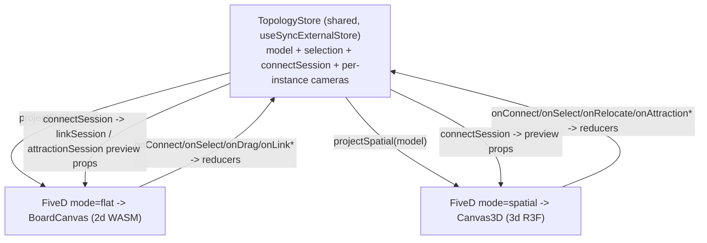

## Title: Unified 5D Topology Component

### Goal

Replace today's dual-surface monolith (`TopologyBoardPane` + `TopologyScenePane` + `buildTopologyDualSurfaceBindings`) in [puzzle/5d/react/index.tsx](puzzle/5d/react/index.tsx) with:

- One neutral source-of-truth model: `Part` (node/object), `Anchor` (handle/vortex), `Bond` (edge/attraction), `Sketch` (in-progress wire/rubber-band). Mode values are neutral: `mode: "flat" | "spatial"`.
- One component `<FiveD mode store instanceId />` (parent controls all props/state; no internal toggle).
- One shared `TopologyStore` so multiple instances (e.g. one flat + one spatial) sync edits, selection, and live gestures.
- Full live cross-surface connect: an indirect connect started in flat previews in spatial and can be committed/terminated there.

### Terminology mapping (neutral, single model)

- node/object -> `Part` (`partKind`); a Part carries both `flat` (x,y,shape,size,text,icon) and `spatial` (origin,orientation,scale,meshUrl) aspects.
- handle/vortex -> `Anchor` (`anchorKind`); carries `flat` (angle,radius,color,icon) and `spatial` (position,direction,radius,mesh).
- edge/attraction -> `Bond` (`bondKind`); `source`/`target` are anchor full ids `partId:anchorId`.
- wire / rubber-band / indirect ring -> `Sketch` (the live connect preview derived from the store's connect session).
- `kind` suffix preserved everywhere (per repo rule: `kind` not `type`).

### Architecture

### Phase 0 - Ticket + contract (do first; blocks the parallel work)

- Read `repo://goals`, open a ticket (`ticket_open`) under the most fitting goal; keep all temp/log/scratch inside the ticket folder.
- Define the neutral types and the projection/reducer contract in [puzzle/5d/react/index.tsx](puzzle/5d/react/index.tsx) `#region` blocks: `TopologyV1` (`schema: "puzzle.5d.topology/v1"`, `domain`, `kinds`, `kindCompatibility`, `parts`, `bonds`, `flatCamera`, `spatialCamera`), `Part`, `Anchor`, `Bond`, `ConnectSession`, `TopologyStore` interface. This contract is what the other phases build against.

### Phase 1 - Unified model, projections, store (puzzle/5d)

- `parseTopologyV1(raw)` replacing the manifest-only `parseTopologyFixtureV1`.
- `projectFlat(model): BoardFixtureV1` and `projectSpatial(model): FixtureV1` (reuse existing `topologyBoardCenterFromTopLeft`, `topologyKitBoardHandleAngle`, kind-catalog/compat helpers already in the file).
- Reverse reducers updating the model: `applyFlatNodeMove`, `applySpatialRelocate`, `applyBond(sourceAnchor,targetAnchor,kind)`, `applySelect`, `applyCameraFlat/Spatial`.
- `createTopologyStore(model)` external store (mirror existing `SnapshotStore`/`SceneObjectStore` patterns; no zustand/jotai - keep behind the existing `reactHostPort` interface). Holds model, selection, `connectSession`, and a per-`instanceId` camera map. `TopologyStoreProvider` + `useTopologyStore()` so sibling `<FiveD>` instances share one store.
- `<FiveD>` component: `mode: "flat" | "spatial"`, `instanceId`, optional presentation overrides; renders `BoardCanvas` (+ neutral markers built from `projectFlat`) or `Canvas3D`/`SceneObjects`/`SceneAttractions` (from `projectSpatial`); wires every callback into store reducers and reads `connectSession` to drive preview props (Phase 2/3).

### Phase 2 - puzzle/2d cross-surface gesture controllability (WASM + React)

- React drain: add `case "linkCompatibleNodes"` and `case "linkTargetRing"` in `applyWasmDrainToScene` ([puzzle/2d/react/index.tsx](puzzle/2d/react/index.tsx):3521-3650), emit them on `BoardEventMap`, and add props `onLinkCompatibleNodes`/`onLinkTargetRing` to `BoardCanvasProps` (~6227-6319). These are emitted by WASM already at [puzzle/2d/rs/lib.rs](puzzle/2d/rs/lib.rs):4756,4770 but currently dropped.
- WASM preview-in: add `Interaction::ExternalLinkPreview { source, compatible_node_ids, ring_handle_ids, end }` (near the `LinkTargetNode` variant at lib.rs:2857) plus a `set_link_preview(...)` host entry; render the same compatible-node highlights + target ring + rubber band used by a local link drag, without owning pointer input.
- React control prop: add `linkSession?` to `BoardCanvasProps` that pushes/clears `ExternalLinkPreview` via a renderer setter; allow committing the previewed session by clicking a ring handle on this surface (reuse `try_commit_link_edge(..., Some("indirectConnect"))` at lib.rs:6338) so a gesture started elsewhere can terminate here.
- Extend inline vitest in `index.tsx` and Rust `#[test]`s in `lib.rs` for the new drain cases + external-preview commit.

### Phase 3 - puzzle/3d cross-surface gesture controllability (React)

- `onAttractionCompatibleObjects`/`onAttractionTargetRing` already exist ([puzzle/3d/react/index.tsx](puzzle/3d/react/index.tsx):440-441); add a controllable `attractionSession?` prop on `CanvasProps`/`Canvas3D` that the `RegistryProvider` renders as a preview for an externally-started session (compatible-object highlight + target ring + rubber band) and that can be committed via pointer-down on a candidate vortex (reuse `commitIndirectPickPointerDown` path firing `onConnect`+`onIndirectConnect`, ~4149-4151).
- Keep neutral naming at the 5d boundary (5d maps `Bond`/`Anchor` <-> attraction/vortex). Extend inline vitest in `index.tsx`.

### Phase 4 - Consumers, fixtures, plays, tests

- Replace `TopologyBoardSurfaceHost`/`TopologySceneSurfaceHost` in [framework/playground/renderer/react/index.tsx](framework/playground/renderer/react/index.tsx):1246-1316 with `<FiveD>` + a shared `TopologyStore`; the 5d play ([puzzle/5d/play/index.ts](puzzle/5d/play/index.ts)) keeps two windows (one `mode="flat"`, one `mode="spatial"`) over the same store to validate cross-instance gestures.
- Sketchpad: rewrite `useDesignTopologyAdapter` + `DesignTopologyBoardWindow`/`DesignTopologySceneWindow` ([compose/client/lib/sketchpad/js/index.ts](compose/client/lib/sketchpad/js/index.ts):~34564-35034) to build the unified model from design data once into a shared store; both windows render `<FiveD>`. Kit diagram uses `<FiveD mode="flat">`.
- Fixtures: make a single canonical `puzzle/5d/play/fixture/nakagin-capsule-tower.topology.json` in the new `puzzle.5d.topology/v1` schema (parts/anchors/bonds with flat+spatial aspects). Refactor `parseBoardFixtureV1`/`parseFixtureV1` usage in the 2d/3d plays to project from the unified fixture so it is the single source of truth.
- Update e2e specs ([puzzle/5d/play/e2e/topology.spec.ts](puzzle/5d/play/e2e/topology.spec.ts), 2d/3d specs) to cover: edit-in-flat updates spatial and vice versa; indirect connect started in flat previews in spatial and is terminated in spatial.
- Remove the old dual-surface exports (`TopologyBoardPane`, `TopologyScenePane`, `buildTopologyDualSurfaceBindings`, mirror helpers) - no backwards-compat/legacy per repo rules.
- Run the full suites: `bun nx run @semio-tech/puzzle-2d-react:test`, `@semio-tech/puzzle-3d-react:test`, `@semio-tech/puzzle-5d-react:test`, the Rust tests, and the play e2e; confirm runtime via `[DEBUG]` logs before declaring done. Close the ticket (`ticket_close`) with summary + touched files.

### Delegation

Large (multi-hour) effort; after Phase 0 contract is fixed, run Phases 1/2/3 by separate generalists in parallel, then integrate Phase 4. All edits stay in existing files using `#region`/subregions; tests extend existing inline-vitest/Rust test blocks (no new test files).

### Notes / decisions

- Mode values `"flat" | "spatial"` chosen as neutral (not "2d"/"3d", not compose-forbidden terms). Component named `FiveD`.
- Per-surface camera and layout (flat x,y vs spatial transform) are independent presentation aspects of the same Part and both persist in the model; only topology/kinds/selection/gestures sync conceptually.

